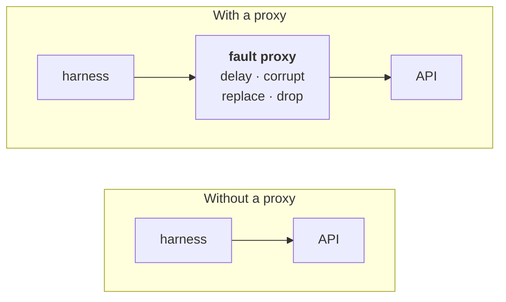

# Learning Notes — API Contract + Flake Harness (Project 2)

Running log of concepts, interview flashcards, and design decisions to defend.
Appended every work session. Same format as the modem project's
`LEARNING_NOTES.md`.

**How to use this file:** read the "Background primer" section before you write
the code for that day. The flashcards at the end of each day are meant to be
answered *out loud*, from memory, with the answer covered.

---

## Day 0 — The vocabulary, in plain English

You're about to build a tool that tests a web API. Before any code, here is
every term you'll hear, explained from scratch. Nothing here assumes you've done
web development.

### 1. What is a REST API?

Your modem project spoke **AT commands over a TCP socket**. You typed `AT+CSQ`
and the modem typed back `+CSQ: 20,99`. A **request**, a **response**, over a
wire.

A **REST API** is the same idea wearing different clothes. Instead of AT commands
over a raw socket, it's **HTTP requests over TCP**. HTTP is just a text protocol
layered on top of the same sockets you already understand.

```
Modem project:   AT+CSQ<CR><LF>            →  +CSQ: 20,99  OK
API project:     GET /devices/42 HTTP/1.1  →  200 OK  {"id": 42, "name": "..."}
```

The pieces of an HTTP request:

| Piece | Example | What it is |
|---|---|---|
| **Method** | `GET`, `POST`, `PUT`, `DELETE` | The verb — what you want done |
| **Path** | `/devices/42` | The noun — which thing you want |
| **Headers** | `Content-Type: application/json` | Metadata about the message |
| **Body** | `{"name": "modem-01"}` | The payload (usually only on POST/PUT) |

And of the response:

| Piece | Example | What it is |
|---|---|---|
| **Status code** | `200`, `404`, `500` | A 3-digit result code |
| **Headers** | `Content-Type: application/json` | Metadata |
| **Body** | `{"id": 42, ...}` | The data you asked for |

**Status codes** are the part you must know cold. They're grouped by first digit:

- **2xx = it worked.** `200 OK`, `201 Created` (after a POST), `204 No Content`
  (worked, nothing to return).
- **4xx = *you* messed up.** `400 Bad Request` (malformed input),
  `401 Unauthorized` (no credentials), `403 Forbidden` (credentials, wrong
  permissions), `404 Not Found`, `422 Unprocessable Entity` (well-formed but
  semantically invalid — FastAPI's default for validation errors).
- **5xx = *the server* messed up.** `500 Internal Server Error`,
  `503 Service Unavailable`.

That 4xx-vs-5xx split is going to matter enormously for your **classifier**: a
4xx usually means the *test* sent something wrong; a 5xx usually means the
*service* is broken. That's the first classification signal, and it falls out of
the protocol for free.

An **endpoint** is one method + path combination, e.g. `GET /devices/{id}`. An
API is a set of endpoints.

### 2. What is an OpenAPI spec?

Here's the key idea, and it maps directly onto your last project.

In the modem project, **3GPP TS 27.007** was the specification. It said: when you
send `AT+CREG?`, you must get back `+CREG: <n>,<stat>` where `stat` is an integer
0–5. You wrote conformance tests that checked a real modem against that written
spec. If the modem answered `+CREG: banana`, the *modem* was wrong, because the
spec is the authority.

**OpenAPI is TS 27.007 for web APIs.** It's a machine-readable document — a big
YAML or JSON file — that describes every endpoint of an API: the paths, the
methods, what parameters they take, what status codes they can return, and
exactly what shape the response body has.

A tiny slice looks like this:

```yaml
paths:
  /devices/{id}:
    get:
      parameters:
        - name: id
          in: path
          required: true
          schema: { type: integer }
      responses:
        '200':
          description: The device
          content:
            application/json:
              schema:
                $ref: '#/components/schemas/Device'
        '404':
          description: No such device

components:
  schemas:
    Device:
      type: object
      required: [id, name, status]
      properties:
        id:     { type: integer }
        name:   { type: string }
        status: { type: string, enum: [online, offline, degraded] }
```

Read that in English: *"`GET /devices/{id}` takes an integer `id` in the path. It
returns either a 200 whose JSON body is a `Device`, or a 404. A `Device` is an
object that **must** have `id`, `name`, and `status`; `id` is an integer, `name`
is a string, and `status` must be exactly one of three words."*

That document is a **contract**. It is a promise the API makes to everyone who
calls it. The critical thing: because it's machine-readable, a program can read
it and check whether the API is keeping its promise. That program is what you're
building.

Two more things to know:

- **`$ref`** is a pointer. `$ref: '#/components/schemas/Device'` means "go look
  up `Device` under `components/schemas` in this same file." Specs use refs so a
  shared shape is defined once and referenced everywhere. Your validator will
  have to **resolve** these refs — follow the pointer — which is a real chunk of
  Day 8's work.
- **FastAPI generates the spec for you.** You write Python classes describing
  your data; FastAPI emits the OpenAPI document automatically at
  `/openapi.json`. That's a big reason we picked it. (It also introduces a
  subtle trap we'll deal with on Day 5 — see below.)

### 3. What is contract testing?

**Contract testing = checking that a real, running API actually behaves the way
its spec says it does.**

That is *exactly* what you did at SGS, just in software. Conformance testing a
modem = "does this device match TS 27.007?" Contract testing an API = "does this
service match its OpenAPI spec?" Same job, same mindset, different protocol. This
is the single sentence that connects your two projects in an interview.

It is deliberately **not** the same as normal functional testing:

| Normal API test | Contract test |
|---|---|
| "Creating a device then fetching it returns the same name" | "Every response from every endpoint matches the declared schema" |
| Tests *business logic* | Tests *the promise* |
| You write one per behavior | Generated/driven from the spec |
| Breaks when behavior changes | Breaks when the **interface** changes |

Why anyone cares: a service can be perfectly correct in its logic and still break
every client that calls it, by quietly renaming a field or changing a `200` to a
`204`. Contract tests catch exactly that class of breakage — the kind that
integration tests miss because each team's tests pass in isolation.

### 4. "Hand-rolled" vs "schemathesis" — what you actually chose

**"Hand-rolled"** is just informal engineering slang for **"written by hand,
yourself, instead of using an off-the-shelf library."** There's nothing technical
about the term. A hand-rolled contract validator = you write the Python function
that takes an HTTP response and the spec, and returns "conforms" or "here's
exactly how it violated the contract."

Concretely, over Days 8–9 you'll write something whose core is roughly:

```python
def check_response(response, spec, path, method):
    """Compare one real HTTP response against what the spec promised."""
    promised = spec["paths"][path][method]["responses"]

    # 1. Was this status code even declared?
    if str(response.status_code) not in promised:
        return Violation("undeclared_status", ...)

    # 2. Is the Content-Type what was declared?
    ...

    # 3. Does the JSON body match the declared schema?
    schema = resolve_refs(promised[str(response.status_code)]...)
    return validate_against_json_schema(response.json(), schema)
```

**JSON Schema**, referenced above, is the small standard used *inside* OpenAPI to
describe the shape of a blob of JSON — the `type: object`, `required: [...]`,
`enum: [...]` vocabulary in the example. Validating a body against a schema is a
solved problem; you'll use the `jsonschema` library for that innermost step and
write everything around it yourself. That's the right line to draw: don't
reimplement a standard, do own the logic that makes it a *test harness*.

**schemathesis** is a third-party Python library that does something different
and complementary. You point it at your OpenAPI spec and it **reads the spec and
invents test cases automatically.** For an endpoint that takes an integer `id`,
it will try `0`, `-1`, `999999999999`, and so on — hunting for inputs that make
your API fall over or answer with something not in the spec.

That technique is called **property-based testing** (sometimes "fuzzing," though
fuzzing is broader). The contrast:

| Example-based testing (what you know) | Property-based testing |
|---|---|
| "`GET /devices/1` returns 200 with these fields" | "For **any** valid input, the response conforms to the spec" |
| You pick the inputs | The tool generates hundreds |
| Finds bugs you thought of | Finds bugs you didn't |
| Deterministic | Random (but seedable, so it's reproducible) |

When a property-based tool finds a failure, good ones **shrink** it: they
automatically simplify the failing input to the smallest version that still
fails, so you get "`id=-1` breaks it" instead of "`id=-849372910` breaks it."

**Why we're doing both, in this order.** Hand-rolled first, on Days 8–9, so you
understand response validation at the level of individual lines and can defend
every decision in it. Then schemathesis on Day 10, layered on top, so the project
also demonstrates you know and use the industry-standard tool. The interview
answer this buys you is strong: *"I wrote the contract validator myself first so
I'd understand response validation end to end — ref resolution, status
declaration, schema checking. Then I added schemathesis for property-based
fuzzing, because generating adversarial inputs is a different problem and a
solved one. My validator found the bugs I seeded; schemathesis found two I
hadn't thought of."* That last clause is the one that lands — and it's a real
outcome we'll go looking for on Day 10.

### 5. What is a proxy?

A **proxy** is a program that sits in the middle of a network conversation. The
client thinks it's talking to the server; really it's talking to the proxy, and
the proxy forwards everything to the real server and passes responses back.



Because everything flows through it, a proxy can *misbehave on purpose*. This is
the direct descendant of your modem simulator's fault-injection mode — but now
the faults live in the **network path** instead of inside the device, which is
actually more realistic: in the real world, most flakiness comes from the network
between services, not from the services themselves.

Your proxy (Day 11) will support four fault modes, deliberately mirroring the
modem project's four:

| Modem project fault | API project equivalent | What it simulates |
|---|---|---|
| delay | **latency injection** | slow network / overloaded service |
| malformed response | **corrupt body** (truncated or invalid JSON) | partial write, bad gateway |
| dropout | **dropped connection** (close mid-response) | crash, network partition |
| wrong-state response | **error-code injection** (500/503/429) | service failure, rate limiting |

### 6. What is a flaky test?

A **flaky test** is a test that passes sometimes and fails other times **without
anything changing** — same code, same commit, same environment. Run it ten times,
get seven passes and three failures.

This is the most expensive problem in real test infrastructure, and it's worth
understanding *why*, because that's the interview answer:

- A red CI build is only useful if it means "something is broken." Once builds go
  red at random, engineers stop believing them.
- Once they stop believing them, they re-run until green — which is how a *real*
  bug ships. The flaky test has trained everyone to ignore the alarm.
- Teams then delete or skip the flaky test, losing the coverage entirely.

Common causes (memorize these — you will be asked):

1. **Timing / race conditions** — test asserts before an async operation finishes.
2. **Test-order dependence** — test B only passes if test A ran first and left
   state behind. (Shows up as "passes alone, fails in the suite.")
3. **Shared mutable state** — two tests fighting over the same database row.
4. **Network / external dependency** — the thing you called was briefly slow.
5. **Time and randomness** — tests that break at midnight, on leap days, or on
   unseeded random values.
6. **Resource exhaustion** — a port, file handle, or connection pool ran out
   under parallel execution.

**The detector you're building.** A single test run cannot tell you a test is
flaky — one failure looks identical whether it's a real bug or a coin flip. The
only way to find flakes is **repetition plus statistics**: run the suite N times
against unchanged code, and look at each test's pass/fail *history*.

- A test that's 10/10 pass → stable green.
- A test that's 0/10 pass → a real, deterministic failure. Go fix the bug.
- A test that's 6/10 pass → **flaky**. This is the signal.

From that history you compute a **flakiness score**. The naive version is just
the failure rate, but you'll do better: a **flip rate** (how often the result
*changes* between consecutive runs, which catches intermittency the raw rate
misses) plus a **Wilson score confidence interval** to express how sure you are
given only N samples. The Wilson interval matters because 1 failure in 3 runs and
33 failures in 100 runs are the same raw rate but wildly different levels of
evidence — and a detector that can't tell those apart will cry wolf. We'll derive
it on Day 13; your math background makes this the easiest part of the project for
you and the most differentiating part for an interviewer.

**Why few candidates build this:** it requires accepting that a test result is a
*random variable*, not a boolean. That framing is the whole insight.

### 7. How the four failure categories differ

Your modem harness classified failures as device / timeout / harness. This one
has four categories, and the whole project exists to tell them apart:

| Category | Means | Typical signal |
|---|---|---|
| **Service bug** | The API violated its own contract | 5xx, or a 2xx whose body fails schema validation, **reproducible across runs** |
| **Test bug** | Our test asked for the wrong thing | 4xx (esp. 400/422), or the expectation contradicts the spec, **reproducible** |
| **Flake** | Non-deterministic | Same test, **same code, inconsistent result across N runs** |
| **Environment** | Infrastructure, not code | Connection refused, DNS failure, timeout at the transport layer, proxy unreachable |

Notice that **flake can only be determined with history** — it is the one
category that a single run structurally cannot produce. That's why the repeat-run
engine (Day 12) has to exist before the classifier (Day 14) can be complete, and
it's the sequencing decision to defend in an interview.

---

### Day 0 flashcards

Cover the answers. Say them out loud.

1. **What's the difference between a 4xx and a 5xx, and why does your classifier
   care?** — 4xx: the client's request was wrong. 5xx: the server failed handling
   a valid request. It's the first-pass signal separating "test bug" from
   "service bug."
2. **What is an OpenAPI spec, in one sentence?** — A machine-readable contract
   describing every endpoint of an API and the exact shape of its responses; the
   web equivalent of 3GPP TS 27.007 for a modem.
3. **What is contract testing and how is it different from integration
   testing?** — Contract testing verifies a service matches its published
   interface; integration testing verifies two components work together. Contract
   tests catch interface drift that passes both sides' own tests.
4. **Why write your own validator when schemathesis exists?** — To own and
   understand the core logic, and because the two do different jobs: mine checks
   conformance of real responses precisely; schemathesis generates adversarial
   inputs. I use both.
5. **What is property-based testing?** — Instead of asserting on hand-picked
   examples, you state a property that must hold for all valid inputs and let the
   tool generate many inputs to try to falsify it.
6. **Why can't a single test run identify a flaky test?** — One failure is
   indistinguishable from a deterministic failure. Flakiness is a property of the
   *distribution* of outcomes, so it requires repeated runs.
7. **Why is a flaky test worse than a failing test?** — A failing test tells you
   something is broken. A flaky test destroys trust in the whole suite, which
   causes real failures to be ignored and coverage to be deleted.
8. **Name four causes of flakiness.** — Timing/races, test-order dependence,
   shared mutable state, external/network dependencies (also: time/randomness,
   resource exhaustion).
9. **What does a proxy let you do that you couldn't do otherwise?** — Inject
   faults into the network path itself — latency, corrupt bodies, dropped
   connections, injected error codes — without modifying either the client or the
   server.
10. **Why a Wilson interval instead of a raw failure rate?** — The raw rate
    ignores sample size; 1-in-3 and 33-in-100 look identical. Wilson gives a
    confidence interval that's honest about small samples, so the detector
    doesn't flag a test on one unlucky run.

### Day 0 design decisions to defend

- **Chose to write the contract validator by hand before adopting schemathesis.**
  Cost: ~2 extra days. Benefit: I can explain response validation at the line
  level, and the two layers catch different bug classes.
- **Chose a service I control as the system under test**, rather than a public
  API. Without seeded, *labeled* bugs there is no ground truth, and without
  ground truth "classification accuracy" is an unmeasurable claim. Same reason
  the modem project needed a simulator.
- **Chose a real network proxy over client-side fault hooks.** A dropped TCP
  connection can't be honestly simulated from inside the client; it has to happen
  on the wire.

---

---

## Day 1 — Version control, environments, tests, and CI

Full primer lives in `docs/DAY_01_CHECKLIST.md`. This section is the distilled
version — what to retain and what you'll be asked.

### Concepts introduced

**git vs GitHub.** git is a version-control program on your machine that records
snapshots (commits) of a folder. GitHub is a website that hosts copies of git
repositories and adds collaboration and automation on top. They're separate
things; git works fine with no GitHub.

**The commit as a unit of work.** A commit records what changed, when, by whom,
and why. Commit history is readable by anyone browsing your repo, which makes it
part of the portfolio — many small, well-messaged commits read very differently
from one giant "did project" commit.

**Virtual environments and hermeticity.** A `.venv` is a per-project, isolated
set of Python packages. `requirements.txt` pins exact versions so the environment
can be recreated anywhere. Together they move you toward a **hermetic** run — one
that depends only on things declared in the project, not on the machine it lands
on. Non-hermetic setups are a first-class cause of flaky tests, so this is not
housekeeping; it's the project's central theme showing up on day one.

**What a test is.** A function that exercises code and asserts what must be true.
`assert` raises on falsehood; no assertion failure = pass. pytest finds
`test_*.py` files and `test_*` functions by convention and rewrites assertions so
failures print actual-vs-expected.

**The oracle.** The thing that decides pass vs fail. Today's oracle is a
hard-coded `== 2`. Worth flagging early because the central idea of this whole
project is replacing hard-coded oracles with **the OpenAPI spec as the oracle** —
the test doesn't say "expect this exact body," it says "expect a body conforming
to what the service promised." That's the leap from example-based assertions to
contract testing, and it's the thing that makes the suite generalize.

**Continuous Integration.** A cloud machine that runs the suite automatically on
every push, from a clean slate. Solves two problems: tests that stop being run,
and "works on my machine." GitHub Actions vocabulary: workflow (a file in
`.github/workflows/`), trigger (`on:`), job, runner (`ubuntu-latest`), step
(`run:` a command or `uses:` a prepackaged action), artifact (a downloadable file
produced by a run).

**Exit codes as the CI contract.** Every command returns 0 for success, non-zero
for failure. `pytest` exits 1 if any test fails; GitHub reads that number and
turns the checkmark red. That's the whole mechanism — which is why any
command-line tool can act as a CI gate.

**YAML.** Indentation-based config format, 2 spaces per level, tabs forbidden,
`- ` for list items. Appears three times in this project: the CI workflow,
`docker-compose.yml` (Day 2), and the declarative test plans (Day 9).

**Validating the oracle (the day's real lesson).** A green checkmark you have
never seen turn red proves nothing — you cannot distinguish "tests ran and
passed" from "tests never ran." So we deliberately broke a test, pushed, confirmed
red, then fixed it. The general principle: *an unvalidated detector is worthless;
if you don't know it can fire, its silence carries no information.* This idea
recurs directly on Day 13, when the flake detector has to be scored against
deliberately seeded flaky tests for exactly the same reason.

### Day 1 flashcards

1. **Difference between git and GitHub?** — git is the local version-control
   program; GitHub is a hosting website for git repos plus collaboration and CI.
2. **Why use a virtual environment?** — Per-project package isolation; prevents
   version conflicts and "works on my machine," and makes the environment
   reproducible via `requirements.txt`.
3. **What does `pip freeze > requirements.txt` do and why does CI need it?** —
   Writes exact installed package versions to a file. The CI runner starts empty
   and installs only from that file, so anything missing there fails in CI while
   working locally.
4. **What makes a test pass in pytest?** — It runs to completion without an
   assertion failing. pytest discovers `test_*.py` files and `test_*` functions
   by naming convention.
5. **What is CI and what problem does it solve?** — Automated test execution on
   every push from a clean machine. Solves tests not being run, and
   environment-specific bugs.
6. **How does GitHub Actions know whether a step passed?** — The command's exit
   code: 0 is success, non-zero is failure.
7. **Why did you deliberately break a test on day one?** — To validate the
   oracle. An untested detector proves nothing when silent; I needed evidence CI
   can actually fail before trusting that it passes.
8. **What is a test oracle, and what's the oracle in this project?** — Whatever
   decides pass vs fail. Here it becomes the pinned OpenAPI spec rather than
   hard-coded expected values.
9. **What does "hermetic" mean and why does it matter for flakiness?** — A run
   depending only on declared, in-project inputs. Undeclared dependence on
   machine state produces results that vary run to run — i.e. flakes.

### Day 1 design decisions to defend

- **Created the GitHub repo empty and ran `git init` locally**, rather than
  creating it initialized and cloning. The folder already had planning docs;
  initializing both sides would have produced two unrelated histories to
  reconcile on day one.
- **Pinned CI's Python version to match local exactly.** A version gap between
  laptop and CI produces bugs that reproduce in only one place — expensive, and
  entirely avoidable.
- **Deliberately failed the build and kept those commits in history.** The
  green→red→green sequence is the evidence that the pipeline detects failure. It
  also demonstrates the testing instinct the rest of the project is built on, so
  hiding it would be throwing away signal.
- **Built infrastructure before product code (Days 1–2).** Same reason you verify
  a test setup against a known reference before testing an unknown device: when
  something fails later, the plumbing is already ruled out.

---

---

## Day 2 — Containers, images, Compose, and container networking

Full primer in `docs/DAY_02_CHECKLIST.md`. Distilled version below.

### Concepts introduced

**What a container is.** A process running on a Linux kernel that's been lied to
about what it can see — its own filesystem, network interfaces, and process list.
From inside it looks like a machine; from outside it's one process. The
consequence that matters: the Python version, packages, OS libraries, and your
code all travel together as one unit.

**Container vs VM.** A VM virtualizes *hardware* and carries a full guest OS with
its own kernel — gigabytes, boots in tens of seconds. A container isolates a
*process* and shares the host kernel — tens of megabytes, starts in milliseconds.
(On macOS, Docker Desktop runs a hidden Linux VM to supply the kernel, so a Mac
uses both.)

**Image vs container.** An image is a read-only filesystem template sitting on
disk; a container is a running instance of one. Image is to container as class is
to object. `Dockerfile --build--> image --run--> container`.

**Layer caching and instruction order.** Each Dockerfile instruction produces a
cached filesystem layer, and changing one invalidates it *and every layer after
it*. Hence copying `requirements.txt` and running `pip install` **before**
`COPY . .`: editing source code then leaves the dependency layer intact and pip
is skipped. Slow-changing things early, fast-changing things late. Getting this
backwards turns a 2-second rebuild into a 2-minute one.

**Build context and `.dockerignore`.** `docker build .` sends the whole directory
to the daemon. `.dockerignore` excludes paths from it. Excluding `.venv` isn't
just about size — a macOS venv inside a Linux container contains binaries that
can't execute there. The container installs its own dependencies; the host venv
is actively wrong, not merely redundant.

**Compose and service-name DNS.** `docker-compose.yml` declares several services
and starts them on one private network. Compose runs a DNS server so each service
is reachable by its **name** — `http://api:8000` — with no IP addresses anywhere.

**Networking gotcha 1: `localhost` is per-container.** Each container has its own
network namespace, so `127.0.0.1` means *this container*. Reaching a sibling
requires its service name. The mirror image: a server inside a container must
bind `0.0.0.0`, not `127.0.0.1`, or siblings can't reach it. **This is the same
bug as project 1, Day 3** (modem simulator bind address) — evidence it's a
networking fundamental rather than a Docker quirk.

**Networking gotcha 2: started ≠ ready.** `depends_on` orders container
*startup*; it says nothing about whether the process inside has finished booting
and is accepting connections. Relying on it alone yields intermittent
"connection refused" — same code, same config, different outcome by timing.
**That is a flaky test, appearing in our own infrastructure on day two, before
any product code exists.** Correct fix is a readiness poll with a deadline, not a
fixed `sleep`. The same retry-with-deadline pattern returns on Day 9 in the
harness runner.

**socat as a stand-in proxy.** `socat TCP-LISTEN:8080,fork,reuseaddr TCP:api:8000`
listens on 8080 and shuttles bytes to `api:8000`, forking per connection. A proxy
in one line of config, which proves the topology now and gets replaced by the
hand-written async proxy on Day 11.

**Why prove the three-hop path today.** If `harness → proxy → api` fails on Day
11, it should be a bug in the new proxy code — not a Docker networking problem
being discovered for the first time while also debugging async I/O. Rule out the
plumbing while every piece is still trivial. Same principle as Day 1, and as
verifying a lab setup before testing an unknown device.

### Day 2 flashcards

1. **Difference between a container and a VM?** — A VM virtualizes hardware and
   runs its own kernel; a container isolates a process and shares the host
   kernel. Containers are far smaller and start far faster; VMs isolate more
   strongly.
2. **Difference between an image and a container?** — Image is a read-only
   template on disk; container is a running instance of it. Class vs object.
3. **Why copy `requirements.txt` and install before copying the rest of the
   code?** — Layer caching. Editing source invalidates only the layers after the
   copy, so `pip install` is skipped on rebuild. Reversing the order reinstalls
   everything on every build.
4. **What does `.dockerignore` do, and why exclude `.venv`?** — Excludes paths
   from the build context. A host venv is huge and, on macOS, contains binaries
   that can't run in a Linux container. The image builds its own dependencies.
5. **How does one container reach another in Compose?** — By service name, via
   Compose's DNS. Never by IP, never by `localhost`.
6. **Why must a containerized server bind `0.0.0.0` rather than `127.0.0.1`?** —
   `127.0.0.1` accepts only connections originating inside that same container,
   making it unreachable from siblings.
7. **What does `depends_on` actually guarantee?** — Start ordering only. Not that
   the process inside is ready to accept connections.
8. **Why is `depends_on` a flakiness source, and what's the right fix?** — It
   creates a race: sometimes the dependent service wins, sometimes it gets
   connection refused. Fix is polling for readiness with a deadline, not a fixed
   sleep, which only hides the race behind a guess.
9. **What is a build context?** — The directory contents sent to the Docker
   daemon for a build, filtered by `.dockerignore`. Its size is printed on the
   first line of build output.

### Day 2 design decisions to defend

- **Used `socat` as the Day 2 proxy rather than writing one.** The goal was to
  validate network topology, not to build a proxy. Writing real proxy code here
  would have conflated "does the path work" with "is my code correct" — the two
  things this phase exists to separate.
- **Replaced project 1's `sleep 2` with a readiness poll.** `sleep` is a guess: too
  short and it's flaky, too long and every run pays for it. Polling with a
  deadline is correct on both axes and fails with a diagnosable message rather
  than a bare connection error.
- **Matched the base image (`python:3.13-slim`) to local Python 3.13.1 and to CI.**
  Three environments, one version. A mismatch produces bugs that reproduce in
  only one place.
- **Did not wire Compose into CI yet.** Nothing worth orchestrating exists until
  Day 16. Adding it now would slow every push for no signal.

---

---

## Day 3 — ASGI, FastAPI, Pydantic, and the generated contract

Full primer in `docs/DAY_03_CHECKLIST.md`. Distilled below.

### Concepts introduced

**Server vs framework.** Two separate jobs. The **web server** (`uvicorn`) owns
the socket: accepts TCP connections, parses raw bytes into HTTP requests, writes
responses back. The **framework** (`FastAPI`) decides what to *do* with a parsed
request. In project 1 you hand-wrote both halves for AT-over-TCP; here they're
split, which is why `pip install fastapi` alone gives you nothing runnable.

**ASGI.** *Asynchronous Server Gateway Interface* — the convention both sides
follow, so any ASGI server can run any ASGI framework. Predecessor **WSGI** is
the synchronous version (one request at a time per worker); ASGI added async so
one process can hold many open connections. Knowing the pair and which is async
is enough.

**`api.main:app`.** A coordinate: module path, colon, variable name. "In
`api/main.py`, find `app`."

**Routing via decorators.** `@app.get("/health")` registers the function below it
in the routing table. You never call it; FastAPI does when a matching request
arrives. Path parameters `{device_id}` become function arguments by name.

**Type hints as enforcement, not documentation.** `device_id: int` makes FastAPI
coerce `"42"` → `42` and reject `/devices/banana` with 422 *before the handler
runs*. Behaviour obtained by declaring a type.

**Pydantic models** do four jobs from one class declaration: validate incoming
data, coerce where unambiguous, serialize outgoing responses, and describe
themselves in the OpenAPI spec.

**Modelling for testability.** `status` is an `Enum`, not a `str`, specifically
so the constraint `enum: [online, offline, degraded]` lands in the spec where a
validator can check it. A free-form string is **unfalsifiable** — no response
could ever violate it. Constraints you don't declare are constraints the harness
can never verify. This is a design decision driven by testability rather than by
correctness, and it's a good one to be able to articulate.

**Type hints become the contract.** FastAPI generates a full OpenAPI document at
`/openapi.json` from the signatures and models. `/docs` is just that spec
rendered. The written promise that project 1 got from 3GPP TS 27.007 is here
produced by the code itself.

**The tautology trap (the sharpest idea so far).** Because the spec is *generated
from* the code, the code cannot violate it — change a field and the spec
regenerates to match. A promise that rewrites itself to match your behaviour is
not a promise, and a suite testing against it is circular. Day 5 fixes this by
exporting the spec to a committed `spec/openapi.json` and testing against that
frozen copy, with a CI drift check. Expect to be asked about this.

**Errors as exceptions.** `raise HTTPException(status_code=404, detail=...)`
rather than returning an error value: FastAPI converts it to a proper response,
and the error path can't be silently ignored. The default body shape
(`{"detail": ...}`) is FastAPI's; Day 4 replaces it with a declared error model
so error responses are contract-checkable too.

**Why a dict instead of a database.** The service exists to be tested, not to
persist. A database adds migrations, pooling, teardown, and a category of failure
unrelated to contract testing. A dict makes every test start from a known state
via one `reset()`.

**Test independence.** Resetting the store before each test (via an
`autouse=True` fixture) removes **test-order dependence** — the "passes alone,
fails in the suite" bug, and cause #2 on the Day 0 flakiness list. Eliminated by
construction rather than by careful ordering.

**Determinism as an anti-flakiness measure.** `list_devices()` sorts explicitly.
A dict preserves insertion order so results would *probably* be consistent — and
"probably consistent" is exactly what produces a test that fails once a month.

**TestClient vs real HTTP.** `TestClient` drives the app in-process: no server,
no port, no sockets. Fast and deterministic, and it answers *"is my application
logic correct?"* It cannot catch anything involving real wire serialization,
connection handling, or deployment. The harness (Day 7+) uses real HTTP through a
real proxy to answer a different question: *"does the deployed service honour its
contract?"* Both are worth having; the same split existed in project 1 as
in-process unit tests plus socket-level integration tests.

### Day 3 flashcards

1. **What's the difference between uvicorn and FastAPI?** — uvicorn is the ASGI
   web server that owns the socket and speaks HTTP; FastAPI is the framework that
   routes parsed requests to your code. Separate packages, separate jobs.
2. **What is ASGI, and how does it differ from WSGI?** — The interface between
   server and framework. WSGI is synchronous, one request at a time per worker;
   ASGI is the async successor and supports many concurrent connections.
3. **What does `api.main:app` mean?** — Module path, colon, variable name: the
   `app` object inside `api/main.py`.
4. **What work do the type hints actually do?** — Coercion and validation.
   `device_id: int` converts the URL string to an int and returns 422 for
   non-numeric input before the handler runs. It also feeds spec generation.
5. **Why is `status` an enum rather than a string?** — So the allowed values
   appear as a constraint in the spec and become checkable. A free-form string
   is unfalsifiable.
6. **Where does the OpenAPI spec come from?** — Generated by FastAPI from the
   function signatures and Pydantic models, served at `/openapi.json`.
7. **Why is testing against a live-generated spec circular, and what's the
   fix?** — The spec regenerates from the code, so the code can't violate it. Fix
   is pinning the spec as a committed artifact and adding a CI drift check
   (Day 5).
8. **Why raise `HTTPException` instead of returning an error?** — FastAPI turns
   it into a proper HTTP response, and an exception can't be silently ignored the
   way a returned error value can.
9. **Why reset the store before every test?** — Test independence. Without it,
   one test's writes change another's result — test-order dependence, a classic
   flakiness cause.
10. **Why sort the device list explicitly?** — Determinism. Relying on incidental
    dict ordering produces a test that passes reliably until it suddenly doesn't.
11. **TestClient vs the harness — why have both?** — TestClient is fast,
    in-process, and checks application logic. The harness uses real HTTP against
    a deployed service to check contract conformance and catch network-level and
    timing problems TestClient structurally cannot see.

### Day 3 design decisions to defend

- **Enum-constrained `status` field.** Chosen so the contract has a constraint
  worth verifying. Modelling driven by testability.
- **In-memory dict rather than a database.** Keeps the system under test focused
  on the contract; avoids a whole class of infrastructure failure irrelevant to
  the thing being demonstrated.
- **Explicit sort in `list_devices()`.** Deterministic responses by construction,
  rather than relying on an implementation detail that happens to be stable.
- **`autouse` reset fixture.** Test independence enforced structurally, not by
  convention or discipline.
- **Split `models.py` / `store.py` / `main.py` rather than one file.** On Day 6
  the seeded bug modes arrive; keeping honest code separate from injected faults
  is what keeps that legible.
- **Deleted `hello.py` on schedule.** The placeholder existed to prove the
  pipeline before anything real depended on it. Removing it is the plan working.

---

---

## Day 4 — CRUD semantics, idempotency, and the error contract

Full primer in `docs/DAY_04_CHECKLIST.md`. Distilled below.

### Concepts introduced

**CRUD → HTTP.** Create/Read/Update/Delete map onto POST/GET/PUT+PATCH/DELETE.
`/devices` is the **collection**, `/devices/{id}` is a **member**. You POST to
the collection (server assigns the id) and PUT/DELETE against a member.

**PUT vs PATCH.** PUT *replaces* the entire resource — every field required,
omitting one blanks it. PATCH modifies part of it.

**Safe vs idempotent.** *Safe* = changes nothing on the server. *Idempotent* =
doing it N times equals doing it once. GET is both; PUT and DELETE are
idempotent but not safe; POST is neither; PATCH depends on the operation.

**Why idempotency is load-bearing here.** Idempotency is what makes **retry**
safe. When a request times out you don't know whether it landed — you can safely
retry GET/PUT/DELETE, but retrying POST may create two devices. The harness gets
retry logic on Day 9, so this is a constraint on our own design, not trivia. A
test tool that corrupts the system under test is a real failure mode. (Project 1
had the same split: `AT+CSQ?` safe, `AT+CFUN=0` not.)

**201 + `Location`.** A successful create returns 201 and a `Location` header
naming the new resource, which is how the client learns the server-assigned id.

**204 must have no body.** Emitting one is a protocol violation — hence returning
a bare `Response(status_code=204)` rather than a value FastAPI would serialize
into `null`.

**409 vs 422.** 409 Conflict = well-formed but impossible given current state
(duplicate name). 422 = the request itself was malformed. Syntactically fine but
semantically impossible is a different failure from syntactically broken.

**Path vs query vs body.** FastAPI infers from the signature: name in the route
path → path parameter; simple type not in the path → query parameter; annotated
with a Pydantic model → request body.

**Separate input and output models.** `DeviceCreate` has no `id` because the
server assigns it. The deeper reason isn't security, it's contract precision:
"we ignore `id` if you send it" is a rule that exists only in the implementation,
whereas a separate request schema puts the rule *in the specification*.
**Anything true only in your head cannot be tested.**

**The error-shape problem (today's main idea).** FastAPI's default error body is
`{"detail": ...}` where `detail` is a *string* for HTTPException and a *list of
objects* for validation errors. No single useful schema covers both — and a
schema permitting almost anything is not a constraint, so it cannot be violated,
so it is worthless to a test. Consequence: **every 4xx was invisible to contract
testing**, and error behaviour is a large share of an API's real behaviour.

**The fix.** One declared envelope, `{"error": {"code", "message"}}`, plus
exception handlers that normalize everything into it. `code` is the stable,
machine-readable part; `message` is for humans and must not be parsed.

**Catch the framework's errors too.** The handler is registered against
**Starlette's** `HTTPException` (the parent of FastAPI's), so it also catches the
404 the router raises for an unknown path and the 405 for a wrong method — errors
our code never raises. Without that, those two responses would disagree with
every other error in the API. That inconsistency is precisely what the Day 8
validator is built to find.

**Declaring statuses in the spec.** FastAPI documents the success response but
cannot know a handler might raise 404 — that's runtime behaviour. Hence
`responses={404: {"model": ErrorResponse}}` per route. This is load-bearing: the
validator's *first* check is "was this status declared at all?", so an
undeclared-but-correct 404 would be reported as a violation and the suite would
drown in false positives.

**Route ordering.** FastAPI matches in registration order, so specific paths must
be registered before parametrized ones. With `/devices/{device_id}` first, a
request for `/devices/search` matches it, fails to parse `"search"` as `int`, and
422s — the endpoint is unreachable. Guarded by an explicit regression test.

**The 422 spec-drift trap (best material of the day).** FastAPI auto-declares 422
with its own `HTTPValidationError` schema. Replacing the error body with
`ErrorResponse` means **the spec now describes a shape the service no longer
produces** — the app works, the tests pass, and the document lies. This is exactly
the class of bug the whole project exists to detect, encountered by hand on Day 4
before the tool that finds it automatically exists. Fixed by declaring
`422: {"model": ErrorResponse}` explicitly.

**Monotonic ids.** Ids are never reused after a delete. Reuse would let a client
holding a stale id silently address a different device; monotonic ids turn that
into an honest 404.

### Day 4 flashcards

1. **Difference between safe and idempotent?** — Safe changes nothing on the
   server. Idempotent means repeating the request has the same effect as doing it
   once. GET is both, PUT and DELETE are idempotent but not safe, POST is
   neither.
2. **Why does idempotency matter to a test harness?** — It determines what can be
   retried after a timeout. Retrying a POST can create duplicates, so a harness
   that retries blindly corrupts the system under test.
3. **PUT vs PATCH?** — PUT replaces the whole resource (all fields required);
   PATCH modifies part of it.
4. **Why 201 and a `Location` header instead of 200?** — A new resource was
   created; `Location` tells the client its URL, including the server-assigned
   id.
5. **Why must a 204 have no body?** — 204 means "success, and deliberately no
   content." A body is a protocol violation — most commonly a serialized `null`.
6. **409 vs 422?** — 409: well-formed but conflicts with current state. 422: the
   request itself is invalid.
7. **Why a separate `DeviceCreate` model instead of reusing `Device`?** — The
   server assigns ids. A separate request schema puts that rule in the spec
   rather than only in the implementation, so it becomes testable.
8. **What was wrong with the default error body?** — `detail` was sometimes a
   string, sometimes a list of objects. No single schema describes it, so no
   error response could be contract-tested.
9. **Why register the handler against Starlette's HTTPException?** — FastAPI's is
   a subclass. Registering against the parent also catches router-generated
   errors (unknown path 404, wrong method 405), so every error in the API shares
   one shape.
10. **Why declare 404 in `responses=` when FastAPI already works without it?** —
    The validator's first check is whether a status code was declared. An
    undeclared 404 would be flagged as a violation despite being correct.
11. **What is route shadowing and how do you avoid it?** — A parametrized route
    registered first swallows requests meant for a more specific one. Register
    specific paths before parametrized ones.
12. **Describe a bug you found in your own project.** — Replacing the error body
    left the spec still declaring FastAPI's `HTTPValidationError` for 422. The
    service and its published contract disagreed while every test passed —
    textbook spec drift, and the exact thing the harness is designed to catch.

### Day 4 design decisions to defend

- **One declared error envelope rather than FastAPI's default.** Without it,
  error responses have no schema and the majority of the API's behaviour is
  outside the contract entirely.
- **`code` as the machine-readable field, `message` for humans.** Clients branch
  on `code`; messages can be reworded without breaking anyone.
- **Handlers registered on Starlette's `HTTPException`.** Consistency across
  errors the framework raises as well as ours.
- **Every possible status declared per route.** Completeness of the contract is a
  prerequisite for the validator producing signal instead of noise.
- **Explicit regression test for route ordering.** The bug is invisible in code
  review and obvious in a test.
- **Monotonic, non-reused ids.** Stale references fail honestly instead of
  silently addressing the wrong resource.
- **Store returns `bool`/`None`; only the route layer speaks HTTP.** Keeping that
  boundary clean is what makes Day 6's seeded bug modes a single-file change.

---

---

## Day 5 — State machines, pagination, and pinning the contract

Full primer in `docs/DAY_05_CHECKLIST.md`. Distilled below. **The spec-pinning
section is the single most important idea in the project** — be fluent in it.

### Concepts introduced

**A status state machine, echoing project 1.** Legal transitions live in a table:
`offline → online`, `online ⇄ degraded`, both → `offline`. `offline → degraded`
is illegal — a device that was never up cannot be degraded. Illegal transition →
**409** (well-formed, impossible now), not 422 (malformed).

**Why a state machine rather than a plain setter.** A free-form setter has no
wrong answers, and behaviour with no wrong answers cannot be tested. The
transition table is a *constraint*, and constraints are what give a test
something to catch. Same reasoning as enum-over-string on Day 3.

**No-op transitions are legal, deliberately.** Setting a device to the state it's
already in returns 200, not 409. If no-ops were rejected, the same PATCH sent
twice would give 200 then 409 — **PATCH would not be idempotent**, and the
harness could not safely retry it after a timeout (Day 9). A request that fails
on retry *because it already succeeded* is miserable to diagnose. This is a
design decision made for the benefit of the testing story, which is exactly the
kind of decision worth citing in an interview.

**Pagination needs an envelope.** A bare array cannot carry `total`, so a client
can't tell whether more pages exist. Response becomes
`{"items", "total", "limit", "offset"}`. Echoing `limit`/`offset` back is not
redundant — the server may clamp the request, and the response should state what
actually happened.

**Breaking vs additive changes.** Additive: adding an optional response field, or
an optional query parameter — old clients keep working. Breaking: turning an
array into an object, removing or renaming a field, changing a type. Our
pagination change is breaking (hence v0.3.0), and is a live demonstration of
exactly the change class contract testing exists to catch.

**Declared bounds are testable bounds.** `limit` `ge=1, le=100` and `offset`
`ge=0` land in the spec as `minimum`/`maximum`, so the contract can be checked
against them and the Day 10 fuzzer has real boundaries to probe.

**THE BIG ONE — why the spec must be pinned.** FastAPI generates
`/openapi.json` *from the code*, so the live spec always agrees with the code by
construction. A harness fetching that live spec and checking responses against it
could never fail: **the service would be graded against a description of itself.**
That's a tautology, not a test.

Fix, in two parts: (1) export the generated document to a committed
`spec/openapi.json`, which becomes *the contract* — a fixed artifact with a
history, and the file the harness reads from Day 8; (2) a **drift check** test
comparing the pinned file against what the app currently generates.

**The nuance that makes it a good answer:** *pinning doesn't make the contract
unchangeable, it makes changing it **visible**.* You can re-pin any time — but
then the change shows up as a diff in a committed file, in a pull request, where
a human is asked about it. The goal isn't to prevent change, it's to prevent
*accidental* change. A contract you can amend silently and unilaterally isn't a
contract.

**Deterministic serialization.** The export uses `sort_keys=True`, fixed indent,
trailing newline. Without that, dict ordering could differ between runs and the
drift check would fail for no reason — **a flaky test inside the tool built to
detect flaky tests.**

**The drift check is a pytest test, not a bespoke CI step.** It therefore runs
locally and in CI with no workflow changes, catching drift at the moment of
introduction rather than at review time.

**What the drift check can and cannot do.** It cannot tell you a contract change
is *wrong* — only that one happened and wasn't deliberately re-pinned. That's the
correct level of strictness: judging acceptability is a human's job, and the
test's role is to guarantee a human is asked.

**Validating the detector, again.** Deliberately changed the app version, watched
the drift check fail, inspected `git diff spec/openapi.json`, re-pinned. Same
discipline as breaking CI on Day 1: an unvalidated detector is indistinguishable
from one silently comparing nothing.

### Day 5 flashcards

1. **Why model status as a state machine instead of a settable field?** — A
   free-form setter has no wrong answers, so nothing about it can be tested. The
   transition table creates constraints a test can catch.
2. **Why 409 and not 422 for an illegal transition?** — The request is
   well-formed; it's impossible given current state. 422 means the request itself
   was invalid.
3. **Are no-op transitions legal, and why?** — Yes. Rejecting them would make
   PATCH non-idempotent, so the harness could not safely retry it after a
   timeout.
4. **Why does a paginated response need an envelope?** — A bare array can't carry
   `total`, so the client can't know whether more pages exist.
5. **Why echo `limit` and `offset` back?** — The server may clamp the request;
   the response should report what actually happened rather than leaving the
   client to assume.
6. **Give an example of a breaking vs an additive API change.** — Breaking:
   turning an array response into an object. Additive: adding an optional field
   old clients can ignore.
7. **Why can't you test a service against its own generated spec?** — The spec is
   derived from the code, so it always agrees with it. The service would be
   graded against a description of itself — a tautology.
8. **What does pinning the spec actually achieve?** — It makes contract changes
   visible as a reviewable diff, rather than silent. It prevents accidental
   change, not change.
9. **Why `sort_keys=True` in the export?** — Deterministic output. Otherwise key
   ordering could vary between runs and the drift check would fail spuriously —
   a flaky test inside a flaky-test detector.
10. **What can the drift check NOT tell you?** — Whether a change is acceptable.
    Only that one happened without being re-pinned. Judging it is a human's job.
11. **Why is the drift check a test rather than a CI step?** — It then runs
    everywhere pytest runs, locally and in CI, with no workflow-specific
    configuration.

### Day 5 design decisions to defend

- **Transition table over scattered `if`s.** One readable place stating what is
  permitted; trivially auditable and easy to seed bugs against on Day 6.
- **No-op transitions legal, to preserve idempotency.** Chosen for retry safety
  in the harness rather than by REST convention.
- **404 and 409 kept distinct on PATCH.** Collapsing them would be cheaper to
  write and strictly worse to test against — a client could no longer tell "no
  such device" from "that move isn't allowed".
- **Out-of-range offset returns an empty page, not an error.** Least-surprising
  behaviour, and one fewer error path to declare in the contract.
- **Spec pinned to a committed file; harness reads the file, never the live
  endpoint.** Without this the entire contract-testing premise collapses.
- **Drift check implemented as a test.** Runs everywhere, needs no CI plumbing,
  and fails at the moment of introduction.
- **Deterministic JSON serialization in the export.** Prevents the check itself
  from becoming a source of flakiness.

---

---

## Day 6 — Seeded bugs, ground truth, and the freeze

Full primer in `docs/DAY_06_CHECKLIST.md`. Distilled below.

### Concepts introduced

**Ground truth.** You can only measure a classifier if you already know the right
answer for every case. That known-answer set is *ground truth*. A service that is
always correct provides none — hence six deliberate, pre-labelled defects. This
is exactly what made project 1's "100% fault-classification accuracy" a
measurement rather than a claim.

**All defects in one injection layer, never in the handlers.** Scattering
`if BUG_MODE == ...` through route code tangles honest behaviour with fake
behaviour until nobody can read the service and tell what it's *supposed* to do.
One middleware file instead gives: readable honest code; an enumerable list of
defects that *is* the ground-truth table; bugs enabled by configuration rather
than code change; and a realistic model, since response corruption really does
happen in middleware and serialization layers. Same separation as project 1's
`simulator/faults.py`.

**Middleware.** A layer wrapping the whole application — every request passes
through on the way in, every response on the way out. How logging, auth, CORS,
compression and timing are normally implemented: anything that applies to *every*
request rather than one endpoint.

**Rewriting a body invalidates the headers describing it.** Change the body and
`Content-Length` becomes a lie. Too large, the client hangs waiting for bytes
that never arrive; too small, the body is truncated. Drop the header and let the
framework recompute it.

**THE KEY IDEA — not every contract violation is a schema violation.** Four
seeded bugs break the schema (missing required field, wrong type, illegal enum
value) and two break the declared status codes. But `off_by_one_page` — returning
`limit + 1` items — breaks **neither**. The schema says `items` is a list of
`Device`; it says nothing about how many. The response is valid JSON, fully
schema-valid, and plainly wrong.

That single mode is why the harness needs **two** mechanisms: automatic schema
validation (Days 8–9) for structural breakage across every endpoint, and
hand-written **declarative assertions** (Day 9) about meaning, like
`len(items) <= limit`. Someone who built only schema validation would miss this
whole class of bug and — worse — wouldn't know they were missing it.

**Bugs change behaviour, never the contract.** Enabling a bug must leave
`spec/openapi.json` byte-identical. If the promise moved along with the
behaviour, there would be nothing to detect. This is why the mode is set by an
environment variable rather than an HTTP control endpoint: a `POST
/admin/bug-mode` route would appear in the generated spec, force a re-pin, and
put a control panel for the bugs into the published interface. Verified by a test
parametrized over every mode.

**Fail loudly on an unknown mode.** A typo'd `BUG_MODE` raises at startup rather
than silently running healthy. A silently-ignored typo would run a clean service
while you believed a bug was active — making the accuracy figure wrong in the
most dangerous direction: **too good**.

**One violation per mode, one endpoint per mode.** Non-overlapping blast radii
mean every failure has exactly one correct explanation. Overlapping defects would
make the accuracy figure ambiguous.

**Test-order dependence, again.** The bug-mode fixture resets on both sides of
its `yield`, so a test that fails partway through still can't poison its
neighbours. A leaked mode would be a flakiness bug inside the tool built to
detect flakiness.

**The freeze.** The service under test is scaffolding, not the product. From Day
7 it changes only to fix a bug mode. Project 1 froze its simulator on the same
day for the same reason: every hour spent improving the thing being tested is an
hour stolen from the thing doing the testing, which is what actually demonstrates
the skill.

### Day 6 flashcards

1. **Why does a correct service need the ability to misbehave?** — Because
   classifier accuracy can only be measured against known right answers. No
   ground truth, no number.
2. **What is ground truth?** — The set of cases where the correct label is known
   in advance, used to score a classifier's predictions.
3. **Why put the seeded bugs in a middleware instead of the handlers?** — Keeps
   the honest code readable, makes every defect enumerable in one place, turns
   enabling a bug into configuration, and matches where corruption really occurs.
4. **What is middleware?** — A layer wrapping the whole app that sees every
   request in and every response out; used for cross-cutting concerns.
5. **Why remove `Content-Length` after rewriting a response body?** — It
   described the original body. A stale value makes clients hang or truncate.
6. **Give an example of a contract violation a schema validator cannot catch.** —
   Returning more items than `limit`. The schema constrains the shape of `items`,
   not its length, so the response is schema-valid and still wrong.
7. **What follows from that?** — Schema validation alone is insufficient; the
   harness also needs declarative assertions about semantics.
8. **Why must enabling a bug leave the contract unchanged?** — If the spec moved
   with the behaviour, the violation would be undetectable. The promise has to
   stay fixed while behaviour deviates from it.
9. **Why not a `/admin/bug-mode` endpoint?** — It would appear in the generated
   spec, force a re-pin, and put a control panel for the service's own bugs into
   its published interface.
10. **Why fail loudly on an unknown `BUG_MODE`?** — A silent default to healthy
    would produce clean results while a bug was believed active, inflating the
    accuracy figure — wrong in the most dangerous direction.
11. **Why does each mode target exactly one endpoint?** — So every failure has
    exactly one correct explanation. Overlapping defects make accuracy ambiguous.

### Day 6 design decisions to defend

- **Single injection layer rather than scattered conditionals.** Readability of
  the honest code, and an enumerable defect list that doubles as ground truth.
- **`off_by_one_page` included deliberately**, even though no schema check can
  catch it — it forces the declarative-assertion mechanism to exist and proves
  the limits of schema validation.
- **Environment variable, no HTTP control surface.** Keeps the contract clean and
  the bug switch out of the published interface.
- **Unknown mode raises at startup.** Prefers a loud failure to a quietly
  inflated metric.
- **Non-overlapping targets, one violation per mode.** Preserves an unambiguous
  right answer per failure.
- **Fixture resets bug mode on both sides of `yield`.** A failing test cannot
  leak state into its neighbours.
- **Froze the service under test on schedule.** The harness is the product;
  further API features would be scope creep dressed up as progress.

---

---

## Day 7 — The Transport interface, and the boundary that makes it mean something

Full primer in `docs/DAY_07_CHECKLIST.md`. Distilled below. Phase 2 starts here.

### Concepts introduced

**Dependency inversion, restated for HTTP.** High-level code (the harness)
depends on an *abstraction* (`Transport`), not a concrete detail (httpx, a
socket, a serial port). Concrete implementations depend on the abstraction too.
Project 1: `TcpTransport` → simulator, `SerialTransport` → real modem. Here:
`DirectTransport` → the API, `ProxyTransport` → through the fault proxy. The
practical test of whether it's right: *can you swap the implementation without
touching a line above it?* On Day 11 the network path gains fault injection and
the validator, runner and test plans change by zero lines.

**Return your own type, not the library's.** If `request()` handed back httpx
responses, every layer above would depend on httpx and the abstraction would be
decorative. A small `HttpResponse` keeps the boundary real — and carries
`elapsed_ms`, so timing is measured once in one place rather than ad hoc by every
caller that needs it.

**THE BOUNDARY — the harness must never import the app.** `TestClient` runs the
app in-process and answers *"is my application logic correct?"* The harness uses
real HTTP to a separately running process and answers *"does the deployed service
honour its contract?"* The second question is unanswerable in-process: wire
serialization (the Day 6 `Content-Length` bug is invisible to `TestClient`),
connection handling, timeouts, anything a proxy does, and whether the service
starts at all.

**Enforced, not merely intended.** A test reads every file in `harness/` and
fails if `import api` appears. Reading the *source* rather than inspecting
`sys.modules` catches a violation even when the import sits inside a function
that never runs. A rule nobody checks is a rule that erodes.

**The `conftest.py` nuance.** The fixture *does* import the app, to start a
server for local convenience. That's not cheating, because the distinction is
between the product and its scaffolding: `harness/` must work against a service
it did not start; `conftest.py` just makes `pytest` a one-command experience. The
proof the boundary is real is that `HARNESS_BASE_URL=...` points the same suite
at a container or a deployment with no code change — demonstrated by running it
against a manually started server on another port.

**Fixture scope.** `function` (per test, default), `module` (per file), `session`
(per run). The server is session-scoped because starting one costs ~100ms and
doing it 40 times would add seconds for nothing. Accepting shared state is
exactly what causes test-order dependence, so it's a tradeoff taken knowingly:
safe while the harness only reads, and Day 9's mutating cases will have to manage
their own state deliberately.

**`yield` fixtures** run teardown after the `yield`, guaranteed even when a test
fails.

**Handing a live socket to the server, not a port number.** Looking up a free
port, closing it, then rebinding leaves a window where another process can take
it — an intermittent failure, i.e. a flaky test, inside the project built to
detect flaky tests. Binding once and passing the open socket removes the race.

**Started ≠ ready, again.** The fixture polls `server.started` against a deadline
rather than sleeping a guessed interval — the same lesson as Day 2's
`depends_on`, now inside our own test infrastructure.

**The transport must not raise on 4xx/5xx.** An error status is *data* the
harness needs to examine; half the contract is about error responses. Pinned by a
test so nobody adds a `raise_for_status()` while tidying. Transport-level
failures (connection refused, DNS, timeout) *may* raise — those are genuinely
different, there is no HTTP response at all, and on Day 14 they classify as
`environment`. The distinction between "answered badly" and "did not answer" is
drawn at the lowest level because higher layers cannot recover it later.

**`trust_env=False` — a real bug, found by running the code.** httpx reads
`HTTP_PROXY` / `HTTPS_PROXY` / `ALL_PROXY` from the environment by default and
silently routes through whatever it finds. That makes results depend on a
developer's shell (non-hermetic, same failure as an inaccurate
`requirements.txt`) and would be miserable on Day 11, when we run our *own* proxy
and need to know traffic goes where we sent it. It surfaced during development on
a machine with `ALL_PROXY` set, as a confusing SOCKS import error.

**The contract is read from disk, never from `GET /openapi.json`.** Reading it
live would restore the Day 5 tautology. Bonus: the contract loads with the
service down, so contract assertions need no server.

**Configuration in one immutable object.** Every knob lives in `HarnessConfig`
rather than being read from `os.environ` at point of use — because the Day 9 run
summary prints the config, so any run is reproducible from its own report.
Configuration scattered through the code cannot be reported, and a result you
cannot reproduce is an anecdote.

### Day 7 flashcards

1. **What is dependency inversion, in this project?** — The harness depends on
   the `Transport` abstraction rather than on httpx or a socket, so the
   implementation can be swapped without changing anything above it.
2. **How would you know the abstraction is right?** — Adding the fault proxy on
   Day 11 requires no change to the validator, runner, or test plans.
3. **Why return a custom `HttpResponse` instead of httpx's?** — Otherwise every
   layer above depends on httpx and the abstraction is decorative.
4. **Why must the harness never import the application?** — It has to answer
   whether a *deployed* service honours its contract. In-process testing cannot
   see wire serialization, connection handling, proxies, or startup.
5. **Isn't importing the app in `conftest.py` the same violation?** — No.
   `harness/` is the product and must work against a service it didn't start;
   `conftest.py` is scaffolding for local convenience. `HARNESS_BASE_URL` proves
   the boundary by pointing the same suite elsewhere.
6. **How is the boundary enforced?** — A test scans `harness/*.py` for `import
   api` and fails, naming file and line. Source scanning catches imports inside
   functions that never execute.
7. **Why session scope for the server, and what does it cost?** — Starting a
   server is expensive relative to a test. The cost is shared state, which is the
   root of test-order dependence, so it's only safe while tests don't mutate.
8. **Why hand uvicorn an open socket rather than a port number?** — Closing a
   probe socket and rebinding leaves a race window; losing it produces an
   intermittent failure.
9. **Why must the transport not raise on 4xx?** — Error responses are part of the
   contract and must be inspectable, not escaped from.
10. **When may the transport raise?** — Transport-level failure: connection
    refused, DNS failure, timeout. No HTTP response exists, and that classifies
    as `environment` later.
11. **What does `trust_env=False` do and why does it matter?** — Stops httpx
    reading proxy settings from the environment. Keeps runs hermetic, and keeps
    traffic out of a proxy we didn't choose while building our own.
12. **Why load the contract from a file rather than the live service?** — Reading
    it live means grading the service against a description of itself.

### Day 7 design decisions to defend

- **`Transport` as an ABC with three methods.** The whole harness is written
  against these; `build_transport` is the only place naming a concrete class. If
  a second such place appears, the abstraction has started leaking.
- **Custom `HttpResponse` carrying `elapsed_ms`.** Keeps httpx out of the upper
  layers and makes latency available everywhere without each caller timing.
- **`NotJsonError` as a distinct type.** On Day 11 the proxy truncates bodies on
  purpose; "the JSON did not parse" becomes an expected, classifiable outcome
  rather than a crash, and a type is more reliable to match on than a message.
- **`ProxyTransport` named now, thin today.** A forward proxy is transparent, so
  today it genuinely is a different base URL. It exists as a class because Day 11
  needs somewhere to put fault-control logic that isn't every call site.
- **`trust_env=False` and `follow_redirects=False`.** The harness controls its own
  routing; a redirect is a contract-relevant fact for the validator to see, not
  something to silently resolve.
- **Boundary enforced by a test that was watched failing.** Same discipline as
  the Day 1 CI break and the Day 5 drift check.

---

---

## Day 8 — The validator, part 1: the contract becomes an oracle

Full primer in `docs/DAY_08_CHECKLIST.md`. Distilled below.

### Concepts introduced

**The oracle moves from code to document.** On Day 1 the oracle was a hard-coded
`== 2`, written by hand, one per behaviour. Now it's the pinned contract, and one
validator checks every endpoint — which is why it keeps working as the API grows
and catches breakage nobody thought to write a test for. That shift is the whole
difference between example-based assertions and conformance testing.

**Structured violations, not booleans.** `check_response` returns a *list* of
`Violation` objects carrying `kind`, `location`, `expected`, `actual`, `message`.
Four consumers need different parts: the classifier branches on `kind`, the HTML
report shows `expected` beside `actual`, humans read `message`, and the flake
detector needs a stable identity to tell "same failure again" from "a different
one". A bool throws all of that away and forces every later stage to re-derive
what the validator already knew. A list because one response can break the
contract several ways at once.

**Check 1 — undeclared status.** If the contract says `GET /devices/{id}` answers
200/404/422, a 500 isn't "an error", it's a response the document never said was
possible; a client written against the document has no branch for it. Catches two
seeded bugs: `wrong_status` and `undeclared_500`.

**Check 2 — content type, and the 204 case.** A declared response with no
`content` key is a promise that *there is no body*. A 204 arriving with a
serialized `null` violates it — the protocol bug flagged on Day 4, now enforced
rather than trusted. Content-type checking is also what turns "the JSON didn't
parse" from a crash into a diagnosis when a proxy returns an HTML error page.

**`$ref` resolution must be recursive.** In our own spec, `Device.properties.status`
is only a *pointer*; the allowed values live in a separate schema object. And it
nests: `DevicePage → items → element → $ref → Device → status → $ref →
DeviceStatus`. Following one pointer is not enough — the whole schema tree has to
be walked.

**Two details separating a real resolver from a naive one:**
- **Siblings beside `$ref` must survive.** OpenAPI 3.1 permits keys alongside a
  ref, and our spec has a `description` there. Replacing the object wholesale
  deletes them silently. Resolve the target, then lay local keys on top so local
  wins.
- **Cycles must terminate.** A self-referencing schema makes naive recursion loop
  forever, and the harness hangs with no message — the worst failure mode for a
  test tool, because a hang looks like slowness rather than a bug. Track refs on
  the current path and stop on repeat.

**Path-template matching, and the same ambiguity as Day 4.** `/devices/search`
matches both the literal template and `/devices/{device_id}`. Pick wrong and
every search response is validated against the single-device schema, producing
confident nonsense. Rule: **specific beats parametrized** — score by literal
segments. Day 4 was route registration order on the *server*; this is template
selection on the *client*. Same ambiguity, opposite side of the wire, which
suggests it's a real property of URL design rather than a framework quirk.

**`[^/]+`, not `.+`.** A path parameter is exactly one segment. With `.+`,
`/devices/{device_id}` would swallow `/devices/1/status` and PATCH responses
would be checked against the GET schema.

**Local refs only.** Remote `$ref`s (pointing at other files or URLs) are refused
deliberately: a contract that must fetch part of itself over the network cannot be
pinned, and pinning is the basis of the project.

**Short-circuit on undeclared status.** Once the status isn't declared there is no
declared response object left to check content type against, so continuing would
measure against nothing. One precise violation beats a cascade of derived noise —
for the classifier and for the human.

**Unit tests with fabricated responses.** Fast, deterministic, and they let us
construct the impossible: the content-type test needs a response claiming
`text/html`, which our service will never send. Isolation too — a failure means
the validator is wrong, not the network or the service.

**Knowing what your tool cannot yet catch is worth more than assuming it catches
everything.** After today the validator detects 2 of 6 seeded bugs.
`missing_field`, `wrong_type` and `bad_enum` need body validation (Day 9), and
`off_by_one_page` needs declarative assertions (also Day 9) because it is
schema-valid by construction.

### Day 8 flashcards

1. **What is the oracle in this project, and why does that matter?** — The pinned
   contract. It means one validator checks every endpoint, instead of one
   hand-written expectation per behaviour.
2. **Why return structured violations rather than a bool?** — The classifier
   branches on kind, the report needs expected/actual, humans need a message, and
   the flake detector needs a stable failure identity.
3. **Why a list of violations?** — One response can break the contract in several
   ways; reporting only the first hides the rest.
4. **What does an undeclared status code mean?** — The service returned something
   the document never said was possible, so no client written against the
   document handles it.
5. **What does a declared response with no `content` promise?** — That there is no
   body. A 204 carrying `null` violates it.
6. **Why must `$ref` resolution be recursive?** — Refs nest through properties and
   array element schemas; following one pointer leaves the rest unresolved.
7. **What breaks if you replace a `$ref` object wholesale?** — Sibling keys
   permitted by OpenAPI 3.1, such as a local `description`, are silently lost.
8. **Why guard against cycles?** — A self-referencing schema loops forever, and
   the harness hangs with no error — indistinguishable from a slow test.
9. **Why does `/devices/search` need special handling?** — It matches both a
   literal template and a parametrized one. Specific must win, or search
   responses get validated against the wrong schema.
10. **Why `[^/]+` rather than `.+` in the path regex?** — A path parameter is one
    segment; `.+` would let `/devices/{id}` match `/devices/1/status`.
11. **Why refuse remote `$ref`s?** — A contract that fetches part of itself can't
    be pinned.
12. **Why stop after an undeclared status?** — No declared response object remains
    to check anything else against, so further checks measure nothing.

### Day 8 design decisions to defend

- **Hand-wrote the validator rather than reaching for a library.** Owning
  response validation at this level is the point; schemathesis (Day 10) does a
  different job — generating adversarial inputs — and does not replace this.
- **`Violation` frozen and structured.** A report should describe what happened;
  a mutable record invites editing it after the fact.
- **Coarse `ViolationKind` enum.** These are the distinctions the classifier
  needs; finer detail belongs in the message, or Day 14 becomes an unreadable
  lookup table.
- **Specificity scoring for path templates.** The alternative — first match wins
  — silently depends on dict ordering.
- **Cycle guard included despite no cycles in our spec.** A validator that hangs
  on a legal document is broken; better found here than while pointed at someone
  else's API.
- **Short-circuit after `UNDECLARED_STATUS`.** Precision over volume.

---

*Next: Day 9 primer — JSON Schema validation of bodies, declarative YAML test
plans, and the run summary. The remaining four seeded bugs become catchable.*
