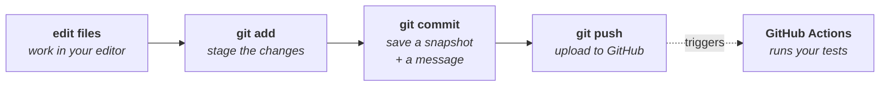

# Day 1 Checklist — Build an empty project that tests itself

**Goal for today:** by the end of the session, every time you save your work to
GitHub, a computer in the cloud will automatically run a test and show you a
green checkmark. Nothing "real" gets built today. You are proving the *machinery*
works before there is anything at stake.

**Time:** ~2–3 hours, most of it reading the primer below.
**You already have:** GitHub account, Python, a terminal, SSH keys configured
(from project 1).
**You do NOT need Docker today** — but start the download in the background (last
section), because Day 2 needs it.

> **Formatting note:** every code block in this file starts at the left margin so
> you can copy-paste it directly with no leading whitespace. All day checklists
> follow this convention.

---

## Progress log (updated as we go)

**Status: ✅ DAY 1 COMPLETE.** Repo live, CI green, failure detection proven.

**Done-when gate met.** Three commits on `main`, CI green → red → green:

```
a392567  CI catches breaks, looks good
9ecb427  Making sure CI actually catches failsures (deliberate break)
7d5a4a5  repo setup, CI skeleton, pipeline smoke test
```

Repo: `git@github.com:rabulsara02/api-conformance-harness.git` (public, MIT).
11 tracked files; `.venv`, `__pycache__`, `.pytest_cache`, `.DS_Store` all
correctly ignored (verified individually with `git check-ignore`, not by
eyeballing `.gitignore`).

Environment verified at close of Part E:

```
platform darwin -- Python 3.13.1, pytest-9.1.1, pluggy-1.6.0
-- /Users/rahulbulsara/Projects/software-testing/.venv/bin/python
collected 2 items
2 passed
```

All three checks green: `which pytest` resolves inside `.venv/bin/`, the
interpreter line points at `.venv/bin/python`, and no stray plugins load.

**Deviations from plan:** none in outcome. Two environment bugs hit and fixed en
route (below) — both worth keeping, both now interview material.

**Carry-forward to Day 2:** confirm Docker Desktop is installed and
`docker run hello-world` succeeds. It is the only Day 2 prerequisite.

- **Confirmed versions.** Python **3.13.1** locally, so CI is pinned to `"3.13"`.
  pytest resolved to **9.1.1**. Both match project 1's machine.

- **BUG — venv created but never activated.** `python3 -m venv .venv` ran, but
  `source .venv/bin/activate` did not. `pip install pytest` therefore installed
  into the **system-wide** Python, and `pip freeze > requirements.txt` captured
  that whole global environment — 17 packages including `fastapi`, `pydantic`,
  `starlette`, `setuptools`, `wheel`, none of which this project had installed.

  *How it was spotted:* the shell prompt had no `(.venv)` prefix, and
  `requirements.txt` contained packages that a fresh venv cannot contain (a new
  venv ships with pip and nothing else).

  *Why it mattered:* `requirements.txt` had become a description of the laptop
  rather than of the project. CI installs only from that file, so the build would
  have pulled unrelated pinned versions, and any package that happened to be
  globally installed but *unlisted* would have worked locally and failed in CI.
  Textbook non-hermetic build.

  *Fix applied and VERIFIED:* deleted and recreated the venv, activated it,
  confirmed both `which python` and `which pip` resolve inside
  `software-testing/.venv/bin/`, upgraded pip 24.3.1 → 26.2, reinstalled pytest
  via `python -m pip`, re-froze. `requirements.txt` is now exactly 5 lines:
  `iniconfig==2.3.0`, `packaging==26.2`, `pluggy==1.6.0`, `Pygments==2.20.0`,
  `pytest==9.1.1`.

  *Secondary observation worth keeping:* during the fix, the environment was
  provably active (`which` pointed into `.venv`) while the shell prompt still
  showed **no** `(.venv)` prefix — the prefix only appeared on the following
  command. Direct evidence that the prompt marker lags and is not a trustworthy
  signal. `which` is the check; the prompt is decoration.

  *Checklist hardened as a result:* creating and activating the venv are now two
  separate steps (11 and 12), with `which python` / `which pip` as a mandatory
  verification gate, and all pip commands switched to the `python -m pip` form.

- **BUG #2 — bare `pytest` ran the GLOBAL pytest, not the venv's.** With the venv
  correctly active, `pytest` still resolved to the system-wide installation. Two
  tells, both in the `pytest -v` header and neither visible in plain `pytest`
  output:

  1. The interpreter line read
     `-- /Library/Frameworks/Python.framework/Versions/3.13/bin/python3`
     instead of a path inside `.venv/bin/`.
  2. `plugins: anyio-4.10.0` — but `anyio` is not in the 5-line
     `requirements.txt`. It was a leftover from the global environment, so pytest
     was demonstrably loading global site-packages.

  *Why it mattered:* both tests passed, so nothing looked wrong. But the suite
  wasn't running in the isolated environment at all — the venv was decorative.
  Any package present globally but absent from `requirements.txt` would have
  worked locally and failed in CI, which is the same non-hermetic failure as BUG
  #1 wearing a different hat.

  *Root cause:* the `pytest` **console script** on `PATH` belonged to the global
  install. Installing pytest globally earlier (BUG #1) put a `pytest` executable
  in the system bin directory, and the shell's command-hash table kept resolving
  to it.

  *Fix — root cause removed, not worked around.* Two options existed:

  - **Work around it:** use `python -m pytest` everywhere (runs the pytest
    belonging to the current interpreter, cannot resolve elsewhere).
  - **Remove the cause:** uninstall the stray global pytest so the only `pytest`
    on PATH is the venv's.

  Chose the second. The global pytest was created *by* BUG #1 minutes earlier and
  had no reason to exist; uninstalling it restores the machine to its prior state
  and lets bare `pytest` behave exactly as it did throughout project 1. Working
  around a self-inflicted artifact would have left a permanent papercut in every
  command for 17 days.

  `python -m pytest` is retained as the **diagnostic** form — if invocation is
  ever in doubt, it's the unambiguous way to run.

  *Environment parity confirmed against project 1:* Python 3.13.1 from
  `/Library/Frameworks/Python.framework/Versions/3.13`, `.venv` with
  `include-system-site-packages = false`, pytest 9.1.1, CI pinned to `"3.13"`,
  Docker base `python:3.13-slim` (Day 2). Identical on every axis — the two
  projects share one toolchain.

- **Pattern across both bugs (worth stating out loud in an interview).** Three
  times in one session, a *cosmetic* signal was wrong and a *content* signal was
  right: the `(.venv)` prompt prefix lagged reality; a green `2 passed` hid a
  wrong interpreter; only reading the actual contents — of `requirements.txt`, of
  the `-v` header — exposed the truth. Same lesson as the deliberate
  green→red→green CI break in Part G. **Verify the thing itself, not a proxy for
  it.**

---

## Read this first — Background primer

If you only skim one section today, skim the checklist. If you only *read* one
section, read this. The checklist is 20 minutes of typing; this is the part that
makes you able to explain it.

### Why today looks like we're doing nothing

You already know this instinct from the lab. Before you test a device, you verify
the *test setup* itself — cables, calibration, the instrument reads a known-good
reference correctly. You do that first, because if you skip it and the device
fails, you have no idea whether the device is broken or your setup is.

Same principle. Today we build the test setup and prove it works, using a fake
"device" so trivial it can't possibly be the problem. Then, for the next 16 days,
when something goes red we'll know it's the real code, not the plumbing.

There's a second reason, specific to this project. The thing you'll spend Days
11–15 building — the flake detector — exists to protect the trustworthiness of
exactly the green checkmark you're setting up today. It's worth understanding
what that checkmark *is* before you build the tool that defends it.

---

### 1. Version control, git, and GitHub

**The problem it solves.** Without version control, saving work looks like
`project_final.py`, `project_final_v2.py`, `project_final_ACTUALLY_FINAL.py`. You
can't see what changed between them, you can't undo a change from three days ago
without losing today's, and if two people edit at once, one of them loses.

**git** is a program that runs on your laptop. It watches a folder and records
snapshots of it over time. Each snapshot is a **commit**. A commit stores what
changed, when, by whom, and a message explaining why. The full history of commits
means you can go back to any past state, and see exactly what changed between any
two points.

**GitHub** is a website that stores copies of git projects. That's the whole
distinction, and it trips up a lot of people:

> **git** = the version-control program on your machine.
> **GitHub** = a website that hosts copies of git projects so they can be shared,
> backed up, and collaborated on.

They are not the same thing, and you can use git with no GitHub at all. GitHub
just adds hosting plus a lot of extras — including the automation robot you'll
meet in section 4.

**The vocabulary you need today:**

| Term | What it means |
|---|---|
| **repository** ("repo") | A folder that git is tracking. Your project. |
| **commit** | One saved snapshot, with a message. The unit of history. |
| **staging** (`git add`) | Choosing which changed files go into the *next* commit. Lets you commit related changes together instead of dumping everything. |
| **push** | Upload your local commits to GitHub. |
| **pull** | Download commits from GitHub that you don't have locally. |
| **clone** | Make a local copy of a repo that already exists on GitHub. |
| **remote** | A nickname for a copy of the repo living elsewhere. Yours will be called `origin`, pointing at GitHub. |
| **branch** | An independent line of history. You'll work on `main` this whole project. |

The normal daily rhythm, which you'll repeat ~50 times over this project:



**Why an employer cares:** your commit history is visible. A repo with 60 small,
clearly-messaged commits reads as someone who works incrementally. One commit
saying "did project" reads as someone who pasted a tutorial. Your commit messages
are part of the portfolio. Write them like someone will read them, because they
will.

---

### 2. Virtual environments — and why `.venv` exists

When you run `pip install pytest`, by default Python installs that package
*system-wide* — available to every Python project on your machine. That sounds
convenient and is actually a trap:

- Project A needs version 1.0 of a library. Project B needs version 2.0. They
  can't both have it.
- Six months later you have 80 packages installed and no idea which project needs
  which.
- Worst of all: **your project works on your machine because of something you
  installed and forgot about.** Someone else clones it, it explodes, and you
  can't reproduce the problem. This is the origin of "works on my machine" — the
  single most-mocked sentence in software.

A **virtual environment** is a private, self-contained folder of Python packages
belonging to one project. When it's "activated," `pip install` puts packages
*there* instead of system-wide, and `python` looks *there* first.

```bash
python3 -m venv .venv       # create it (a folder literally named .venv)
source .venv/bin/activate   # activate it — your prompt gains a (.venv) prefix
```

That `(.venv)` in your prompt is the whole user interface. It's on = you're
isolated. You'll need to re-activate every time you open a new terminal window;
forgetting is the #1 cause of "but I installed it!" confusion.

**`requirements.txt`** is the companion piece: a plain-text list of exactly which
packages and versions this project needs.

```bash
pip freeze > requirements.txt     # write the list
pip install -r requirements.txt   # someone else recreates your environment
```

This matters more than it looks. The cloud robot in section 4 starts from a
completely empty machine every single time. `requirements.txt` is the *only* way
it knows what to install. If a package isn't listed there, CI fails — even though
everything works fine on your laptop. You will hit this at least once. When you
do, this paragraph is the answer.

> **Concept worth naming: a hermetic build.** A build/test run is "hermetic" if it
> depends only on things declared inside the project, not on the machine it
> happens to run on. `requirements.txt` is your first step toward hermeticity;
> Docker on Day 2 is the next. Non-hermetic setups are a major source of flaky
> tests — which means this is not a side quest, it's the first appearance of the
> project's central theme.

---

### 3. What a test actually *is*

This is worth slowing down on, because you're about to spend 17 days on testing
and the base unit should be crisp.

**A test is just a function that runs some of your code and states what should be
true.** That's it. There's no magic.

```python
def add(a, b):          # the code being tested
    return a + b

def test_add():         # the test
    assert add(1, 1) == 2
```

**`assert`** is a Python keyword meaning "this must be true; if it isn't, stop and
raise an error." `assert add(1, 1) == 2` says: *call `add(1, 1)`; if the result
isn't 2, fail.* A test that finishes without any assert failing is a **pass**. One
where an assert fails is a **fail**.

Vocabulary that follows from that:

| Term | Meaning |
|---|---|
| **test case** | One individual check (one `test_` function). |
| **test suite** | A collection of test cases run together. |
| **assertion** | The statement of what must be true. |
| **green / red** | Passing / failing. You'll hear these constantly. |
| **test runner** | The program that finds your tests, runs them, and reports. |
| **fixture** | Reusable setup shared by tests (Day 7). |
| **oracle** | The thing that decides pass vs fail. In `test_add`, the oracle is `== 2`. Later in this project, the oracle is *the OpenAPI spec* — that's the interesting move. |

**pytest** is the test runner you'll use. Its rules are convention-based, which
is why the example above needs no imports or configuration:

- It looks for files named `test_*.py` or `*_test.py`.
- Inside those, it runs functions named `test_*`.
- Plain `assert` is all you need — pytest rewrites assertions so failures print
  useful detail (`assert 3 == 2` shows you both numbers, not just "failed").

Run it by typing `pytest`. It prints one dot per passing test and a lot of red
detail per failure.

**Why automate this at all**, when you could just run the code and eyeball it?
Because manual checking doesn't scale, isn't repeatable, and stops happening
under deadline pressure. An automated test is a check that *keeps* happening,
forever, without anyone remembering to do it. And — the part that matters for
your career framing — automated tests are a prerequisite for the thing in the
next section.

---

### 4. Continuous Integration (CI) — the actual point of today

**CI is: a computer in the cloud that automatically runs your tests every time
you push code.**

The problem it solves: without it, tests only run when someone remembers to run
them, on their own machine, with their own setup. So the test suite quietly rots
— someone breaks something, doesn't notice, and it's discovered three weeks later
by a customer.

With CI, every push triggers a fresh, clean machine that checks out your code,
installs your dependencies, runs your tests, and reports pass or fail. Nobody has
to remember. And because that machine is clean, it also catches the "works on my
machine" class of bug automatically.

**GitHub Actions** is the CI system built into GitHub. Its model:

| Term | Meaning |
|---|---|
| **workflow** | A file describing automation. Lives in `.github/workflows/`. |
| **trigger** (`on:`) | What causes it to run — a push, a pull request, a schedule. |
| **job** | A unit of work that runs on one machine. |
| **runner** | The machine itself. `ubuntu-latest` = a fresh Linux box GitHub provides free. |
| **step** | One instruction inside a job. Either a shell command (`run:`) or a prepackaged action (`uses:`). |
| **action** | A reusable step someone else wrote, e.g. `actions/checkout@v4` copies your code onto the runner. |
| **artifact** | A file produced by a run that you can download afterward. You'll use these on Day 16 for HTML reports. |

Here's the connection to make, and it's the reason this project exists:

> The green checkmark is only worth something if it *means* something. Its whole
> value comes from being trustworthy: green = safe, red = broken. The moment
> builds start going red at random, people stop reading them. They re-run until
> green and merge anyway — which is how a genuine bug ships past a test that
> caught it.
>
> That degradation has a cause, and the cause is **flaky tests**. So: today you
> build the checkmark. On Days 12–13 you build the tool that keeps it honest.
> That's the arc of the whole project, and it starts here.

You'll also meet the concept of a **required check** — a rule saying a branch
can't be merged unless CI is green. That's what turns CI from a notification into
a gate. You don't need it for a solo project, but know the term.

---

### 5. YAML (because you're about to write some)

**YAML** is a text format for configuration. It exists because config files
written in JSON are miserable to read and edit by hand.

You will meet YAML three separate times in this project, so learn it once now:

1. Today — the GitHub Actions workflow file.
2. Day 2 — `docker-compose.yml`.
3. Day 9 — your **test plans**, which is the interesting one. Writing test cases
   as data rather than as code is a real design pattern ("tests as data"), and
   it's one of the things that made project 1 credible. Same trick here.

The rules, all of them:

```yaml
name: CI                    # key: value
on: [push, pull_request]    # a list, inline form

jobs:                       # nesting is done with INDENTATION
  test:                     # 2 spaces deeper = "inside" jobs
    runs-on: ubuntu-latest
    steps:                  # a list, block form
      - uses: actions/checkout@v4      # each "- " starts a new list item
      - run: pytest
```

- **Indentation is meaningful.** It's how nesting is expressed — there are no
  braces. Two spaces per level.
- **Never use tabs.** YAML rejects them outright. This is the #1 YAML error and
  it produces a confusing message.
- `- ` (dash space) marks a list item.
- `#` starts a comment.

If a workflow fails with a parse error, it's almost always indentation. Check
that before anything else.

---

## Part A — Create the repository on GitHub

We're creating it **empty** and connecting your existing folder to it, rather
than creating it with files and cloning. Reason: your folder already contains
`docs/` and `LEARNING_NOTES.md`. If GitHub also created files, you'd have two
unrelated histories to merge on day one, which produces a genuinely confusing
error for a first-timer. Empty remote + existing local folder avoids it entirely.

**1. Create the repo.** github.com → **+** (top right) → **New repository**.

- [x] **Name:** `api-conformance-harness`
- [x] **Description:** `Contract conformance + flaky-test detection harness for REST APIs`
- [x] **Visibility:** **Public** (employers have to be able to see it)
- [x] **Do NOT check "Add a README file."**
- [x] **Do NOT** add a `.gitignore`. **Do NOT** add a license.
- [x] Click **Create repository**

✅ *Worked when:* you land on a mostly-empty page showing setup instructions like
`git remote add origin ...`. That's the right screen.

**2. Copy the SSH address.**

- [x] On that page, click the **SSH** tab (not HTTPS) and copy the address. It
      looks like `git@github.com:<your-username>/api-conformance-harness.git`.

*Why SSH:* you set up SSH keys during project 1, so pushes just work with no
password prompt. HTTPS would ask for a personal access token every time.

---

## Part B — Connect your local folder to it

Your project folder already exists at `~/Projects/software-testing` with the
planning docs in it.

> **Note on the folder name.** The local folder stays `software-testing` even
> though the repo is `api-conformance-harness`. A local folder name doesn't have
> to match its remote — git doesn't care. Renaming it would break my access to it
> mid-project, so leave it.

**3. Go to the folder and start tracking it with git.**

- [x] Run:

```bash
cd ~/Projects/software-testing
git init
```

✅ *Worked when:* it prints something like `Initialized empty Git repository in
.../software-testing/.git/`.

*What just happened:* git created a hidden `.git` folder. That folder **is** the
repository — all history lives there. Delete it and you're back to a plain folder.

**4. Make sure the branch is called `main`.**

- [x] Run:

```bash
git branch -M main
```

*Why:* older git versions default to `master`; GitHub expects `main`. Harmless if
it's already right.

**5. Point your folder at GitHub.**

- [x] Paste the address from step 2 into the first line, then run both:

```bash
git remote add origin git@github.com:<your-username>/api-conformance-harness.git
git remote -v
```

✅ *Worked when:* `git remote -v` prints two lines (fetch and push) with your
address.

*What "origin" means:* just a nickname for that remote copy. Convention, not a
keyword — you could call it anything, but everyone calls it `origin`.

---

## Part C — Add the standard project files

**6. Create `.gitignore`.** This lists files git should *not* track — things that
are generated, machine-specific, or huge.

- [x] Create the file with this content:

```
# Python
__pycache__/
*.py[cod]
*.egg-info/
.Python

# Virtual environment
.venv/
venv/

# Test + tooling caches
.pytest_cache/
.coverage
htmlcov/

# Generated results (regenerated every run — never commit)
results/
reports/

# OS noise
.DS_Store
```

*Why this matters:* committing `.venv/` would add thousands of files and make the
repo useless to browse. It's also machine-specific, so it wouldn't work for
anyone else anyway. A clean `.gitignore` is a small but real signal of
professionalism to anyone reading your repo.

**7. Add an MIT license.**

- [x] Create a file named `LICENSE` and paste the MIT license text (copy it from
      your `modem-conformance-harness/LICENSE`, and update the year/name line if
      needed).

*Why:* without a license, the default is "all rights reserved," which technically
means nobody may use your code. MIT means "do what you want, just keep the
copyright notice." It's the standard for portfolio work.

**8. Create a `README.md` stub.** One paragraph is enough for now — Day 17
rewrites it properly as a test plan.

- [x] Create `README.md` with this content:

```markdown
# api-conformance-harness

A contract-conformance and flaky-test-detection harness for REST APIs.

Checks a live service against its pinned OpenAPI specification, injects network
faults through a proxy, detects statistically flaky tests across repeated runs,
and classifies every failure as a service bug, a test bug, a flake, or an
environment problem.

Software-domain companion to
[modem-conformance-harness](https://github.com/<your-username>/modem-conformance-harness).

**Status:** in development — see `docs/PROJECT_PLAN.md`.
```

✅ *Worked when:* `ls -a` shows `.gitignore`, `LICENSE`, `README.md`, `docs/`,
`LEARNING_NOTES.md`, and `.git/`.

---

## Part D — Set up Python

**9. Check your Python version.**

- [x] Run:

```bash
python3 --version
```

Note the number. It should be 3.13.x (same machine as project 1). **Write it down
— you need it in Part F**, because CI must run the same version as your laptop.
If they differ, you get bugs that appear in only one place, which is a miserable
way to spend an afternoon.

**10. Create the virtual environment.**

- [x] Run:

```bash
python3 -m venv .venv
```

This creates the folder but does **nothing else**. Creating a venv and using a
venv are two separate acts, and conflating them is the single most common
beginner mistake in Python. (It happened on this project — see the progress log
at the top of this file.)

**11. Activate it — then PROVE it's active.**

- [x] Run:

```bash
source .venv/bin/activate
```

- [x] Now verify, and do not skip this:

```bash
which python
which pip
```

✅ *Worked when:* **both** paths point inside your project's `.venv` folder, e.g.
`/Users/rahulbulsara/Projects/software-testing/.venv/bin/python`.

❌ *If either path shows something else* — `/usr/bin/python3`,
`/opt/homebrew/bin/pip`, `/Library/Frameworks/...` — the venv is **not** active.
Stop and re-run the `source` command. Do not continue.

Your prompt gaining a `(.venv)` prefix is the usual visual cue, but it's only a
cue: some shell configurations suppress it. `which` is the actual proof, which is
why it's a gate here and not a suggestion.

*Remember:* every new terminal window needs `source .venv/bin/activate` again.

**12. Install pytest and record it.**

- [x] Run:

```bash
python -m pip install --upgrade pip
python -m pip install pytest
python -m pip freeze > requirements.txt
cat requirements.txt
```

✅ *Worked when:* `requirements.txt` contains **about five lines and nothing
else** — `pytest`, plus its four dependencies (`iniconfig`, `packaging`,
`pluggy`, `pygments`). Something like:

```
iniconfig==2.3.0
packaging==26.2
pluggy==1.6.0
Pygments==2.20.0
pytest==9.1.1
```

❌ *If you see `fastapi`, `pydantic`, `starlette`, `numpy`, or anything else you
didn't just install*, you froze the wrong environment. Go back to step 11.

*Why `python -m pip` instead of plain `pip`:* `pip` is its own program on your
PATH and can belong to a **different** Python installation than the `python`
you're running. `python -m pip` means "use the pip belonging to *this*
interpreter," so they can never disagree. It's two extra words that eliminate an
entire category of confusing bug. Use this form from now on.

*What `pip freeze` did:* printed every package installed in the active
environment, with exact versions, and `>` wrote that list to the file. Exact
versions — not "latest" — so CI installs precisely what you tested with. Note
that this means **`pip freeze` is only as correct as your active environment**:
freeze the wrong one and you've written a description of your laptop instead of a
description of your project.

**12b. Trim it to direct dependencies only (project 1's convention).**

`pip freeze` lists *everything* installed, including packages you never asked for
— `iniconfig`, `pluggy`, `Pygments` and `packaging` are pytest's own
dependencies, pulled in automatically. Project 1's `requirements.txt` keeps only
the packages the project *directly* uses and comments the rest out. Match that.

- [x] Edit `requirements.txt` down to:

```
# Direct dependencies only. Transitive deps (iniconfig, packaging, pluggy,
# Pygments) are resolved automatically by pip and deliberately not pinned here.
pytest==9.1.1
```

*The tradeoff, because there is a real one:*

| Style | Pro | Con |
|---|---|---|
| Full `pip freeze` (everything pinned) | Byte-identical environment anywhere | Noisy; can't tell what you actually use from what got dragged in |
| Direct dependencies only | Readable; your real dependencies are obvious | Transitive versions can drift over time |

Project 1 chose readable, and this project matches it for consistency. Real
production teams often use a lockfile (`pip-tools`, `poetry`, `uv`) to get both.
Worth knowing the term **lockfile** — it's a reasonable interview follow-up, and
"I used direct pins for legibility; a lockfile is what you'd reach for if
reproducibility mattered more" is a good answer.

*Going forward:* the file grows one line at a time as the project needs packages
— `PyYAML` on Day 9, `fastapi` and `uvicorn` on Day 3, `httpx` on Day 7. Each
addition deliberate. A requirements file listing packages the project doesn't
import is a smell: it means someone froze a polluted environment.

---

## Part E — Write a throwaway module and test

Deliberately trivial. You are testing the **pipeline**, not any real logic. Real
code starts Day 3.

**13. Create `hello.py`.**

- [x] Create the file with this content:

```python
"""
Throwaway module used to prove the CI pipeline works end to end.

Deleted on Day 3 when the real service-under-test arrives. Its only job is to
give the pipeline something real to run before anything is at stake.
"""


def add(a: int, b: int) -> int:
    """Return the sum of two integers."""
    return a + b
```

*On the type hints (`a: int`, `-> int`):* these annotate what goes in and what
comes out. Python does **not** enforce them at runtime — they're documentation
that tools can read. Worth getting into the habit now, because on Day 3 FastAPI
reads these exact annotations and uses them to generate your OpenAPI spec
automatically. That's not a coincidence; it's why we picked FastAPI.

**14. Create `test_hello.py`.**

- [x] Create the file with this content:

```python
"""
Pipeline smoke test.

Verifies the test runner and CI are wired correctly. Not a test of anything that
matters yet — that's the point.
"""

from hello import add


def test_add_positive_numbers():
    """Two positives sum correctly."""
    assert add(1, 1) == 2


def test_add_negative_numbers():
    """Negatives sum correctly (a second case, so a partial failure is visible)."""
    assert add(-1, -1) == -2
```

*Why two tests rather than one:* so that in Part G, when you deliberately break
one, you'll see `1 failed, 1 passed` rather than everything going red at once.
Seeing pytest isolate a single failure is the point of that exercise.

**15. Run them.**

- [x] Run:

```bash
pytest
```

✅ *Worked when:* you see green output ending in `2 passed in 0.0Xs`.

*Read the output properly.* `collected 2 items` means pytest found your tests by
name convention. The two dots are the two passes. Get used to this output —
you'll be reading it hundreds of times.

**16. Try the verbose form once,** so you know it exists.

- [x] Run:

```bash
pytest -v
```

Now each test is listed by name with PASSED next to it. `-v` is what you'll want
when a suite gets big.

---

## Part F — Write the CI workflow

**17. Create the folder structure and the workflow file.**

- [x] Run:

```bash
mkdir -p .github/workflows
```

- [x] Create `.github/workflows/ci.yml` with the content below. **Replace
      `"3.13"` with the version you noted in step 9** if it differs:

```yaml
# Runs the test suite on every push and pull request.
# Day 1: proves the pipeline works. Grows into the full contract suite
# (Day 16), plus a separate nightly flake-detection sweep.
name: CI

# WHEN this runs.
on: [push, pull_request]

jobs:
  test:
    # WHERE it runs: a fresh Ubuntu machine GitHub provides, wiped each time.
    runs-on: ubuntu-latest

    steps:
      # Copy the repo onto the runner. Nothing exists there until this runs.
      - uses: actions/checkout@v4

      # Install Python. Must match local (step 9) so bugs can't hide in the gap.
      - uses: actions/setup-python@v5
        with:
          python-version: "3.13"

      # Install dependencies. This is why requirements.txt has to be accurate:
      # the runner starts empty and knows nothing about your laptop.
      - run: pip install -r requirements.txt

      # Run the suite. Non-zero exit = the job fails = red X.
      - run: pytest
```

✅ *Worked when:* the file is at `.github/workflows/ci.yml`, indented with 2
spaces, no tabs.

*How the robot knows this file exists:* it doesn't need telling. GitHub scans
`.github/workflows/` automatically. The folder path is the configuration.

*How a step passes or fails:* every command returns an **exit code** — 0 for
success, anything else for failure. `pytest` exits 0 when all tests pass and 1
when any fail. GitHub reads that number. That's the entire mechanism, and it's
worth knowing because it's why any command-line tool can be a CI gate.

---

## Part G — Push, and then prove the checkmark is real

Most tutorials stop at "green checkmark, you're done." Don't. A green checkmark
you've never seen turn red is not evidence of anything — it might be green
because the tests ran and passed, or because they never ran at all. You can't
distinguish those from the outside.

This is a real testing principle and it has a name: **an unvalidated oracle is
worthless.** If you don't know your detector *can* fire, its silence tells you
nothing. So we'll make it go red on purpose, then fix it.

**18. Commit and push.**

- [x] Run:

```bash
git add .
git commit -m "Day 1: repo setup, CI skeleton, pipeline smoke test"
git push -u origin main
```

*`git add .`* stages everything not excluded by `.gitignore`.
*`-u origin main`* sets `origin/main` as this branch's default upstream, so from
now on plain `git push` is enough.

✅ *Worked when:* the push completes and your files appear on GitHub.

**19. Watch it run.**

- [x] On your repo page, click the **Actions** tab. You'll see your commit with a
      spinning yellow dot, then a green checkmark after ~30–60s.
- [x] Click into the run and expand each step. Read the log. You'll see the
      runner check out your code, install Python, install pytest, and run the
      suite — the same commands you ran locally, on a machine that started with
      nothing.

✅ *Worked when:* green checkmark, and the `pytest -v` step shows `2 passed`.

**20. Now break it on purpose.**

- [x] Edit `test_hello.py` and change the first test's assertion to:

```python
    assert add(1, 1) == 3    # deliberately wrong
```

- [x] Run:

```bash
pytest
```

✅ *Worked when:* pytest fails and shows you `assert 2 == 3` with the actual and
expected values. **Read that failure output carefully** — this is the assertion
rewriting mentioned in the primer, and being fluent at reading pytest failures
will save you hours over the next 16 days.

**21. Push the broken test and watch CI go red.**

- [x] Run:

```bash
git add .
git commit -m "Verify CI actually catches failures (deliberate break)"
git push
```

✅ *Worked when:* the Actions tab shows a **red X**. Click in and find the failing
assertion in the log.

*This is the important moment of the day.* You now have positive evidence that
the pipeline detects failure. Green means something because you've seen red.

**22. Fix it and confirm green returns.**

- [x] Restore the assertion:

```python
    assert add(1, 1) == 2    # restored
```

- [x] Run:

```bash
pytest
git add .
git commit -m "Restore passing test - CI failure detection confirmed"
git push
```

✅ **TODAY IS DONE when:** the Actions tab shows green → red → green across three
commits. You've built a pipeline *and* demonstrated it works, and the history
proves it.

> **Keep those three commits.** Don't squash or hide them. "Deliberately broke the
> build to verify the failure path" is a genuinely good thing for an interviewer
> to stumble across in your history — it's a testing instinct, visible in
> evidence, and it's exactly the mindset the rest of this project is built on.

---

## Part H — Wrap up the session

**23. Confirm the planning docs are committed.**

- [x] They were included by `git add .` in step 18 — verify with:

```bash
git log --stat
```

**24. Update this checklist.**

- [x] Tick the boxes above as you complete them.
- [x] Add a *Progress log* section at the top noting anything that differed from
      the plan. You'll want it — project 1's Day 1 log recorded the SSH and
      Python 3.13 deviations, and both mattered later.

**25. Review what you learned.**

- [x] Skim the Day 1 section of `LEARNING_NOTES.md` and try the flashcards out
      loud. If any answer doesn't come, re-read that part of the primer now
      rather than later — Day 2 assumes all of it.

---

## Background task — start the Docker download now (for Day 2)

Docker Desktop is a multi-gigabyte download. Start it while you work through the
primer so Day 2 has no waiting.

- [ ] Download and install **Docker Desktop for Mac** (Apple Silicon build).
- [ ] Confirm it works:

```bash
docker --version
docker run hello-world
```

✅ *Worked when:* a version number prints and you see "Hello from Docker!"

*If it's already installed from project 1,* just confirm the daemon starts (open
Docker Desktop) and tick this off.

---

## If something breaks

| Symptom | Cause and fix |
|---|---|
| `pytest: command not found` | Virtual environment isn't active. `source .venv/bin/activate`, then verify with `which python`. |
| `pytest -v` header shows an interpreter outside `.venv/bin/` | You're running the global pytest. Use `python -m pytest` instead of bare `pytest`. If you want the bare command fixed too, run `hash -r` (zsh: `rehash`) to clear the shell's cached command paths. |
| `pytest -v` lists a plugin that isn't in `requirements.txt` | Same cause — global site-packages are being loaded. Use `python -m pytest`. |
| `ModuleNotFoundError: No module named 'hello'` | You're running pytest from the wrong directory. `cd` to the repo root and run `pytest` there. |
| `git push` rejected, asks for a password | You used the HTTPS address instead of SSH. Fix with `git remote set-url origin git@github.com:<user>/api-conformance-harness.git`. |
| `error: remote origin already exists` | You ran step 5 twice. Use `git remote set-url origin <address>` instead. |
| Actions tab is empty after pushing | The workflow file is in the wrong place. It must be exactly `.github/workflows/ci.yml` — note the leading dot and that `workflows` is plural. |
| Red X, log shows a YAML/parse error | Indentation. 2 spaces per level, no tabs. Check that your editor isn't inserting tabs. |
| Red X, log shows `Could not open requirements file` | `requirements.txt` wasn't committed. `git add requirements.txt`, commit, push. |
| Red X, log shows a package missing that works locally | You installed it without re-running `pip freeze > requirements.txt`. Re-freeze, commit, push. This will happen at least once — it's the hermeticity lesson from the primer, live. |
| `.venv` showed up in `git status` | `.gitignore` is missing or misspelled. Fix it, then `git rm -r --cached .venv` to untrack what was already added. |

---

*When you have green → red → green in the Actions tab, Day 1 is done. Day 2 is
Docker: putting this project in a standardized box, and getting three boxes to
talk to each other over a network — which is what makes the fault proxy possible
later.*
