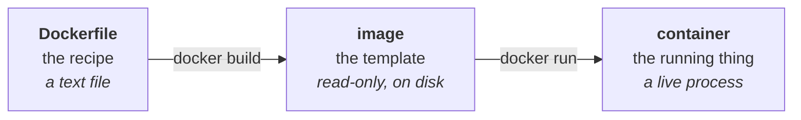
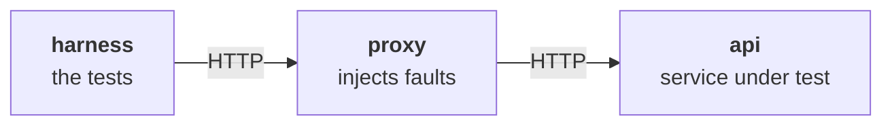

# Day 2 Checklist — Put the project in a box, then get three boxes talking

**Goal for today:** package this project so it runs identically on any machine,
then stand up the three services this project needs — `api`, `proxy`, `harness`
— and prove the harness can reach the api **through** the proxy.

Still no product code. Day 2 finishes the infrastructure de-risking, and then
Day 3 starts building for real.

**Time:** ~2–3 hours.
**Prerequisite:** Docker Desktop (installed during project 1 — Part A re-verifies it).

> **Formatting note:** every code block starts at the left margin so it
> copy-pastes cleanly.

---

## Progress log (updated as we go)

**Status: not started.**

---

## Read this first — Background primer

### Where Day 1 left off, and why today follows

Day 1 ended with a real lesson: `requirements.txt` is the *only* thing CI knows
about your project, and if it's wrong, the build breaks in ways that don't
reproduce locally. You lived that one twice.

`requirements.txt` fixes **Python packages**. It does nothing about everything
else the code depends on: which Python version, which operating system, which
system libraries, which files exist on disk, which services are reachable. Those
are still "whatever happens to be true on this machine."

Docker closes that remaining gap. It's Day 1's hermeticity lesson taken to its
conclusion — and it's why the two days are grouped as one phase.

---

### 1. What a container actually is

Ignore the shipping-container metaphors; here's the mechanical version.

A **container** is a process running on a Linux kernel, with a *lie* told to it
about what it can see. It gets its own filesystem, its own network interfaces,
its own process list. From inside, it looks like a whole machine. From outside,
it's an ordinary process on your Mac.

The important consequence: a container carries its own filesystem. That means the
Python version, the installed packages, the OS libraries, and your code all
travel *together* as one unit. There's no "install these prerequisites first"
step, because the prerequisites are inside the box.

**Container vs virtual machine**, because you'll be asked:

| | Virtual machine | Container |
|---|---|---|
| Contains | A whole guest OS with its own kernel | Just your app + its dependencies |
| Boots in | Tens of seconds | Milliseconds |
| Size | Gigabytes | Tens/hundreds of megabytes |
| Isolation | Very strong (hardware-level) | Strong (kernel-level), but shares the host kernel |

A VM virtualizes *hardware*. A container isolates a *process*. That's the whole
distinction.

*(Mac-specific footnote worth knowing: containers need a Linux kernel, and macOS
doesn't have one. Docker Desktop quietly runs a small Linux VM and puts your
containers inside it. So on a Mac you're technically using both.)*

---

### 2. Image vs container — the distinction that trips everyone up

- An **image** is a read-only template. A snapshot of a filesystem plus a default
  command. It sits on disk doing nothing.
- A **container** is a running instance of an image.

If you know classes and objects: **image = class, container = object.** You can
start twenty containers from one image, and they don't share state.



Three nouns, two verbs. Most Docker confusion is mixing up which noun you're
talking about.

---

### 3. The Dockerfile, and why line order matters enormously

A **Dockerfile** is the recipe for building an image. Each instruction produces a
**layer** — a saved filesystem diff stacked on the one before.

Here's the one you'll write today:

```dockerfile
FROM python:3.13-slim
WORKDIR /app
COPY requirements.txt .
RUN pip install -r requirements.txt
COPY . .
CMD ["pytest"]
```

Line by line:

| Line | What it does |
|---|---|
| `FROM python:3.13-slim` | Start from an official image that already has Python 3.13. `slim` = a trimmed Debian base; smaller and less to go wrong. Matches your local 3.13.1 and project 1's base image. |
| `WORKDIR /app` | Set the working directory inside the container. Creates it if needed. Every later command runs from here. |
| `COPY requirements.txt .` | Copy **just** that one file in. |
| `RUN pip install -r requirements.txt` | Install dependencies during the *build*, so they're baked into the image. |
| `COPY . .` | Now copy the rest of the project in. |
| `CMD ["pytest"]` | The default command when a container starts. Overridable at run time. |

**Now the question worth understanding, because it's a common interview
question:** why copy `requirements.txt` separately and install, *then* copy
everything else? Why not one `COPY . .` at the top?

Because of **layer caching.** Docker caches each layer and reuses it if that
layer's inputs haven't changed. Layers are ordered, so a change invalidates that
layer *and everything after it*.

- With the split: you edit `hello.py` → the `COPY requirements.txt` and
  `RUN pip install` layers are untouched → **pip install is skipped**, rebuild
  takes a second.
- Without the split: you edit `hello.py` → the single `COPY . .` layer changes →
  everything after it reruns → **pip reinstalls every dependency, every time.**

Put slow-changing things early and fast-changing things late. That's the whole
rule, and it's the difference between a 2-second rebuild and a 2-minute one on
Day 11 when you're iterating on the proxy.

**`.dockerignore`** is the companion file, and it matters more than it looks. It
lists paths *not* to send to Docker during a build.

```
.venv
__pycache__/
*.pyc
.git
.pytest_cache/
results/
```

Without it, `COPY . .` copies your `.venv` — thousands of files, hundreds of
megabytes — into the image. Worse, it would be a **macOS** venv inside a **Linux**
container, so the binaries in it wouldn't even run. The container installs its
own dependencies via `RUN pip install`; the host venv is not just unnecessary but
actively wrong.

---

### 4. Docker Compose — running several containers together

A single container is one service. This project needs three running at once, able
to talk to each other. Starting and wiring them by hand every time would be
miserable.

**Docker Compose** reads a `docker-compose.yml` describing your services and
starts them all with one command. It also creates a **private network** for them.

The single most useful thing it does: **each service is reachable by its name.**
A service called `api` is reachable at the hostname `api` from any other
container in the file. Compose runs a small DNS server that resolves those names.
You never hard-code an IP address.

```yaml
services:
  api:
    image: python:3.13-slim
    command: python -m http.server 8000

  harness:
    build: .
    command: python check_path.py
    depends_on:
      - api
```

- `image:` — use a prebuilt image from Docker Hub.
- `build: .` — build from the Dockerfile in this directory instead.
- `command:` — override the image's default `CMD`.
- `depends_on:` — start ordering. **Read the next section carefully about this
  one.**

---

### 5. Networking: the two gotchas that will bite you

**Gotcha 1 — `localhost` inside a container means the container itself.**

Every container has its own network namespace, so `127.0.0.1` refers to *that
container*, not your Mac and not any sibling container. If the harness container
tries `http://localhost:8000`, it's talking to itself and gets connection
refused. It must use `http://api:8000` — the service name.

The mirror image of this: a server inside a container must bind to `0.0.0.0`
(all interfaces), not `127.0.0.1`. Binding to `127.0.0.1` means "only accept
connections originating inside this container," which makes it unreachable from
its siblings. **This is the exact same bug you met in project 1 on Day 3** —
`0.0.0.0` vs `127.0.0.1` is in your `LEARNING_NOTES.md` from the modem simulator.
Same lesson, new context. That recurrence is worth noticing: it's a networking
fundamental, not a Docker quirk.

**Gotcha 2 — `depends_on` waits for *started*, not for *ready*.**

`depends_on: [api]` guarantees the api container is *started* before the harness
container starts. It does **not** guarantee the api process inside it has
finished booting and is accepting connections. A server can take a second or two
to bind its port.

So `depends_on` alone produces an intermittent failure: sometimes the harness
wins the race and gets "connection refused," sometimes it doesn't. That is
**exactly a flaky test** — same result, same code, different outcome, caused by
timing. On day two, before you've written a line of product code, the project's
central subject shows up as a live problem in your own infrastructure.

Project 1 handled it with `sleep 2` and a comment saying so. Today you'll do
better: a **retry loop** that polls until the service answers or a deadline
passes. That's the correct fix, and it's the same pattern the harness uses for
timeouts and retries on Day 9. "Started is not ready" is a genuinely good thing
to be able to say in an interview.

---

### 6. Why three services, and why prove the path today

The finished system looks like this:



Today all three are placeholders:

| Service | Today | Becomes |
|---|---|---|
| `api` | `python -m http.server`, a built-in file server | Your FastAPI device registry (Days 3–6) |
| `proxy` | `socat`, an off-the-shelf TCP forwarder | Your async fault proxy (Day 11) |
| `harness` | A script that fetches one URL | The contract + flake harness (Days 7–15) |

The point is to prove the **three-hop path works** while all three pieces are
trivial. If the harness can't reach the api through the proxy on Day 11, you want
that to be a bug in your proxy code — not a Docker networking problem you're
discovering for the first time while also debugging async I/O. Rule out the
plumbing first. Same principle as Day 1, and as verifying a lab setup before
testing a device.

**socat** ("socket cat") is a standard Unix tool that pipes one network
connection to another. `socat TCP-LISTEN:8080,fork TCP:api:8000` means: listen on
8080, and for each connection that arrives, open a connection to `api:8000` and
shuttle bytes both ways. That is a proxy in one line — no code — which lets you
prove the topology today and swap in your own implementation on Day 11.

---

## Part A — Re-verify Docker

Installed during project 1, but confirm it still works before building anything
on top of it.

**1. Start Docker Desktop.**

- [ ] Open the Docker Desktop app and wait for the whale icon in your menu bar to
      stop animating.

*Why:* the `docker` command is just a client. It talks to a background service
(the daemon) that Docker Desktop runs. If the app isn't running, every command
fails with "Cannot connect to the Docker daemon."

**2. Check the client and daemon.**

- [ ] Run:

```bash
docker --version
docker compose version
docker run --rm hello-world
```

✅ *Worked when:* you get version numbers for both, and `hello-world` prints
"Hello from Docker!"

*What `--rm` does:* deletes the container when it exits. Without it, every run
leaves a stopped container behind. Good habit for throwaway runs.

*Note `docker compose` (space), not `docker-compose` (hyphen).* The hyphenated
version is the old standalone tool. Current Docker ships Compose as a
subcommand. If you see the hyphenated form in an old tutorial, that's why.

---

## Part B — Write the Dockerfile and .dockerignore

**3. Create `.dockerignore` first.**

Doing this before the Dockerfile is deliberate — if you build first, you'll copy
your entire `.venv` into the image and wonder why it takes two minutes.

- [ ] Create `.dockerignore` in the repo root:

```
# Keep the build context small: these are never copied into the image.
.venv
__pycache__/
*.pyc
.git
.pytest_cache/
results/
reports/
.DS_Store
```

**4. Create the `Dockerfile`.**

- [ ] Create `Dockerfile` (no extension) in the repo root:

```dockerfile
# Dockerfile — packages this project into a self-contained image.
#
# Base image matches local Python (3.13) so behavior can't diverge between the
# laptop, the container, and CI.
FROM python:3.13-slim

# All later commands run from /app inside the container.
WORKDIR /app

# Copy ONLY the dependency list first, then install. Because Docker caches each
# layer, editing project code later does not invalidate this layer — so pip does
# not re-run on every rebuild. Slow-changing things early, fast-changing late.
COPY requirements.txt .
RUN pip install --no-cache-dir -r requirements.txt

# Now bring in the rest of the project (minus everything in .dockerignore).
COPY . .

# Default command if none is given at run time. Compose overrides this per service.
CMD ["pytest"]
```

*On `--no-cache-dir`:* pip normally keeps a download cache. Inside an image
that's dead weight you'd ship forever, so turn it off. Smaller image, no
downside.

---

## Part C — Build the image and run the tests inside it

**5. Build.**

- [ ] Run:

```bash
docker build -t api-conformance-harness .
```

✅ *Worked when:* the build finishes and the last lines say something like
`naming to docker.io/library/api-conformance-harness`.

*Reading that command:* `-t` **t**ags (names) the image. The trailing `.` is the
**build context** — the directory sent to Docker, filtered by `.dockerignore`.
Watch the first line of output: it reports the context size. It should be small
(tens of KB). If it's hundreds of megabytes, `.dockerignore` isn't working.

**6. Run your test suite inside the container.**

- [ ] Run:

```bash
docker run --rm api-conformance-harness
```

✅ *Worked when:* you see `2 passed` — the same result as on your laptop, from
inside a Linux container with its own Python.

*This is the moment Docker justifies itself.* Your tests just ran on a different
operating system, with a separately installed Python and a separately installed
pytest, and produced the same answer. That's the "works on my machine" problem
solved at the root, not patched over.

**7. Prove the layer cache works (worth seeing once).**

- [ ] Edit `hello.py` — add a blank line, save.
- [ ] Rebuild:

```bash
docker build -t api-conformance-harness .
```

✅ *Worked when:* the build finishes in about a second, and the `pip install`
step reports **CACHED**. Only the `COPY . .` layer and after were rebuilt.

*If `pip install` re-ran instead*, your Dockerfile has `COPY . .` above it —
check the order.

---

## Part D — The three-service skeleton

**8. Write the reachability check the harness will run.**

- [ ] Create `check_path.py` in the repo root:

```python
"""
Day 2 connectivity check — throwaway, replaced by the real harness on Day 7.

Proves the three-hop path works inside Docker:

    harness (this script)  ->  proxy  ->  api

It talks to the hostname `proxy`, never to an IP address and never to
`localhost`: inside a container, `localhost` means *this container*. Compose runs
a DNS server that resolves each service name to that service's container.
"""

import sys
import time
import urllib.error
import urllib.request

TARGET = "http://proxy:8080/"
DEADLINE_SECONDS = 20


def wait_for(url: str, deadline_seconds: int) -> str:
    """
    Poll `url` until it answers, or give up after `deadline_seconds`.

    Why a retry loop instead of just one request: docker-compose's `depends_on`
    waits for a container to START, not for the server inside it to be READY to
    accept connections. A single immediate request would sometimes succeed and
    sometimes get "connection refused" — the same code producing different
    results depending on timing. That is precisely a flaky test, and polling
    until ready (or until a deadline) is the correct fix rather than sleeping a
    fixed number of seconds and hoping.
    """
    started = time.monotonic()
    attempt = 0

    while True:
        attempt += 1
        try:
            with urllib.request.urlopen(url, timeout=2) as response:
                body = response.read().decode("utf-8", errors="replace")
                print(f"Connected on attempt {attempt}: HTTP {response.status}")
                return body
        except (urllib.error.URLError, OSError) as exc:
            elapsed = time.monotonic() - started
            if elapsed > deadline_seconds:
                # Give up loudly, with the reason and how long we waited.
                print(
                    f"FAILED after {attempt} attempts / {elapsed:.1f}s: {exc}",
                    file=sys.stderr,
                )
                raise SystemExit(1)
            print(f"  attempt {attempt} not ready yet ({exc}) - retrying")
            time.sleep(0.5)


if __name__ == "__main__":
    print(f"Harness container starting. Fetching {TARGET} ...")
    body = wait_for(TARGET, DEADLINE_SECONDS)

    # http.server returns an HTML directory listing. We don't care about the
    # content -- only that bytes travelled harness -> proxy -> api and back.
    print(f"Received {len(body)} bytes through the proxy.")
    print("SUCCESS: harness -> proxy -> api path is working.")
```

*Read the docstrings, not just the code.* The retry loop is the interesting part
and the reason it exists is written down there.

**9. Write `docker-compose.yml`.**

- [ ] Create `docker-compose.yml` in the repo root:

```yaml
# docker-compose.yml — the three services this project needs.
#
# Day 2: all three are placeholders. The point is to prove the network topology
#        harness -> proxy -> api works before any real code depends on it.
#
# Later: `api` becomes the FastAPI device registry (Days 3-6), `proxy` becomes
#        the async fault-injection proxy (Day 11), and `harness` becomes the
#        contract + flake harness (Days 7-15).
#
# Compose puts all services on one private network and runs a DNS server, so
# each service is reachable from the others by its NAME (api, proxy, harness).
# No IP addresses anywhere.

services:
  # The service under test. Today: Python's built-in file server, which is
  # enough to answer an HTTP request. Note it binds 0.0.0.0 (all interfaces),
  # NOT 127.0.0.1 -- binding to loopback would make it unreachable from sibling
  # containers, which is the same trap as the modem simulator in project 1.
  api:
    image: python:3.13-slim
    command: python -m http.server 8000 --bind 0.0.0.0
    ports:
      - "8000:8000"          # also expose to the host, for manual poking

  # The fault-injection point. Today: socat, an off-the-shelf TCP forwarder,
  # standing in for code we haven't written. It listens on 8080 and forwards
  # every connection to api:8000.
  #   TCP-LISTEN:8080  = accept connections on port 8080
  #   fork             = handle each connection in its own child process
  #   reuseaddr        = allow immediate rebinding after restart
  proxy:
    image: alpine/socat
    command: TCP-LISTEN:8080,fork,reuseaddr TCP:api:8000
    depends_on:
      - api
    ports:
      - "8080:8080"

  # The tests. Built from our own Dockerfile, so it has our Python + pytest.
  # `depends_on` only guarantees the others have STARTED, not that they are
  # READY -- check_path.py retries until ready or a deadline passes.
  harness:
    build: .
    command: python check_path.py
    depends_on:
      - proxy
```

---

## Part E — Prove the three-hop path

**10. Bring the stack up.**

- [ ] Run:

```bash
docker compose up --build
```

✅ **THE GATE FOR TODAY:** in the interleaved output you see lines from the
harness ending in:

```
Connected on attempt 1: HTTP 200
Received NNN bytes through the proxy.
SUCCESS: harness -> proxy -> api path is working.
```

Those bytes travelled from the harness container, through the proxy container, to
the api container, and back. Three separate containers, resolved by name, on a
private network.

*If the harness prints "not ready yet" a few times first, that is the retry loop
doing its job* — the api hadn't finished binding. Working as designed; it's the
`depends_on` gotcha made visible.

**11. Stop it.**

- [ ] Press `Ctrl+C`, then clean up:

```bash
docker compose down
```

*Why `down`:* `Ctrl+C` stops the containers but leaves them and the network
lying around. `down` removes them. Get in the habit now, or you'll accumulate
stopped containers all project.

**12. Prove name resolution is doing real work (optional, 2 minutes, recommended).**

Understanding *why* something works beats watching it work.

- [ ] In `check_path.py`, temporarily change `TARGET` to
      `"http://localhost:8080/"` and run `docker compose up --build` again.

✅ *Worked when:* the harness retries for 20 seconds and then fails with
connection refused.

That failure is the lesson: inside the harness container, `localhost` is the
*harness itself*, which has nothing listening on 8080. The proxy is a different
container and is only reachable by its name.

- [ ] Change it back to `"http://proxy:8080/"` and confirm success returns.

---

## Part F — Commit

**13. Confirm nothing unwanted is staged.**

- [ ] Run:

```bash
git status --short
```

✅ *Worked when:* you see only `.dockerignore`, `Dockerfile`,
`docker-compose.yml`, `check_path.py`, and the docs. No `.venv`, no
`__pycache__`.

**14. Commit and push.**

- [ ] Run:

```bash
git add .
git commit -m "Day 2: Dockerfile, compose skeleton, three-service path verified"
git push
```

- [ ] Check the Actions tab — CI should still be green. Nothing today changed the
      test suite, and that's worth confirming rather than assuming.

*Note:* CI does **not** run Docker yet. The workflow still just installs
dependencies and runs pytest on the runner directly. Compose gets wired into CI
on Day 16, once there's a real suite worth orchestrating.

---

## Part G — Wrap up

**15. Update this checklist.**

- [ ] Tick the boxes and fill in the progress log at the top with anything that
      differed from the plan.

**16. Review.**

- [ ] Read the Day 2 section of `LEARNING_NOTES.md` and try the flashcards out
      loud.

**17. Look ahead.**

- [ ] Skim `docs/PROJECT_PLAN.md` §5, Day 3. Tomorrow the real code starts:
      FastAPI, and the first endpoints of the device registry.

---

## If something breaks

| Symptom | Cause and fix |
|---|---|
| `Cannot connect to the Docker daemon` | Docker Desktop isn't running. Open the app, wait for the whale to settle. |
| Build context is hundreds of MB / build is slow | `.dockerignore` missing, misnamed, or not in the repo root. It must be exactly `.dockerignore`. |
| `pip install` re-runs on every build | `COPY . .` appears before `RUN pip install`. Reorder per Part B. |
| Harness: `Connection refused` to `proxy` | Using `localhost` instead of the service name, or the `proxy` service failed to start. Check `docker compose logs proxy`. |
| Harness retries the full 20s then fails | The api never became ready. `docker compose logs api` — most often the bind address is wrong (must be `0.0.0.0`, not `127.0.0.1`). |
| `docker-compose: command not found` | Use `docker compose` (space). The hyphenated standalone tool is obsolete. |
| `port is already allocated` | Something on your Mac already uses 8000 or 8080. Change the host side of the mapping, e.g. `"8001:8000"` — the left number is the host, the right is the container. |
| Changes to a file don't appear in the container | The image is built from a *copy*. Rebuild with `docker compose up --build`. (Live-reload via volume mounts comes later, if needed.) |
| Containers pile up | `docker compose down` after each run. `docker ps -a` lists strays; `docker container prune` clears stopped ones. |

---

*When `SUCCESS: harness -> proxy -> api path is working` prints, Day 2 is done —
and Phase 0 with it. All the infrastructure that could have surprised you later
is now proven. Day 3 starts the actual product: FastAPI, and the service your
harness will spend the next two weeks interrogating.*
