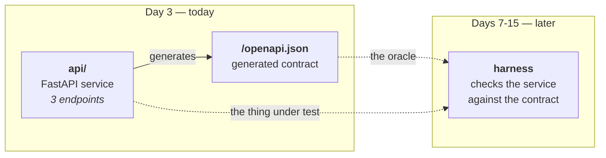
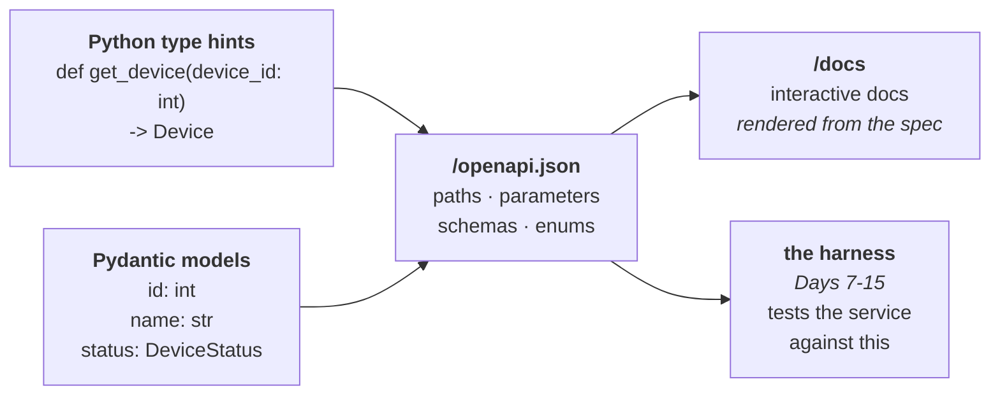

# Day 3 Checklist — Build the service your harness will interrogate

**Goal for today:** a real, running REST API with three working endpoints — and,
almost as a side effect, the **OpenAPI specification** that the rest of this
project exists to test against.

This is the first day of product code. Phase 0 is behind you.

**Time:** ~3–4 hours.
**Prerequisite:** Day 2 complete (Compose stack up, three-hop path proven).

> **Formatting note:** every code block starts at the left margin so it
> copy-pastes cleanly.

---

## Progress log (updated as we go)

**Status: ✅ DAY 3 COMPLETE.** Parts A–H done and pushed.

**Done-when gate met:** 8 tests passing; `/openapi.json` serves a `Device` schema
with `required: [id, name, status]` and an enum-constrained `status`; the Compose
stack reaches the real FastAPI service through the proxy.

Commit: `7538a15  FastAPI device registry, first endpoints, generated OpenAPI spec`

**The Day 2 retry loop earned its keep immediately.** First Compose run against
the real service:

```
proxy-1    | socat[7] E TCP:api:8000: Connection refused
harness-1  |   attempt 1 not ready yet (Remote end closed connection without response) - retrying
harness-1  | Connected on attempt 2: HTTP 200
```

uvicorn took longer to bind than `python -m http.server` did, so the started-vs-
ready race actually fired. A fixed `sleep` would have been either too short (flaky)
or too long (wasteful on every run); polling with a deadline handled it and said
so in the log. This is the concrete example to cite when asked about flakiness.

**Versions installed:** `fastapi==0.141.1`, `uvicorn==0.52.1`, `httpx==0.28.1`.
Transitive: pydantic 2.13.4, starlette 1.3.1, anyio 4.14.2. Generated spec is
**OpenAPI 3.1.0**.

- **Snag — `api/models.py` was created empty (0 bytes).** The paste didn't land.
  Everything else was correct, so the import chain got all the way to
  `store.py:14` before failing with
  `ImportError: cannot import name 'Device' from 'api.models'`.

  *Reading the traceback:* Python **found** the module (a path was printed) but
  the name wasn't in it. "Module found, name missing" means an empty or partial
  file, not a broken import path or a missing package. A genuine path problem
  would have been `ModuleNotFoundError` instead. Distinguishing those two errors
  is a habit worth keeping.

  *Fix:* pasted the file, confirmed with `wc -l api/models.py` before restarting.

- **Observation — `$ref` appeared in our own spec.** The generated `Device`
  schema does not inline the enum:

  ```json
  "status": {
    "$ref": "#/components/schemas/DeviceStatus",
    "description": "Current operational state of the device."
  }
  ```

  The allowed values live in a *separate* schema object, reachable only by
  following the pointer. This is precisely why the Day 8 validator has to
  **resolve `$ref`s recursively** rather than reading the property schema
  directly — a requirement now demonstrated by our own output rather than
  asserted in the abstract.

- **Note — spec is OpenAPI 3.1.0**, which aligns with **JSON Schema draft
  2020-12**. Relevant on Day 9: the `jsonschema` library must be pointed at that
  draft's validator, not an older one, or constraints will be silently ignored.

- **Known warning (accepted, revisit Day 7):**
  `StarletteDeprecationWarning: Using httpx with starlette.testclient is
  deprecated; install httpx2 instead.` Tests pass; versions are pinned so this
  cannot break underneath us. Deferred to Day 7, when `httpx` becomes a
  first-class harness dependency and the client choice gets made deliberately
  rather than as a side effect of TestClient.

---

## Read this first — Background primer

Today introduces more new concepts than any other day in the project. Read the
whole primer before typing. It's long because the payoff is large: by the end you
should understand not just *what* FastAPI does but *why it makes this whole
project possible*.

---

### 1. Where this fits

Remember the arc: your harness needs something to test. Today you build that
something.



Two outputs today, and the second one matters more than the first. The API is
just a service. The **spec** is the thing that turns "testing an API" into
"contract testing," because it's the written promise your harness will hold the
service to. In project 1, that document was 3GPP TS 27.007 and you didn't write
it. Here, you generate it.

---

### 2. Server vs framework: uvicorn and FastAPI are different things

This confuses almost everyone at first, so let's separate them cleanly.

In project 1 you wrote a TCP server by hand: you opened a socket, accepted
connections, read bytes, parsed AT commands, wrote bytes back. You *were* the
server.

An HTTP service splits that job in two:

| Piece | Job | Yours today |
|---|---|---|
| **Web server** | Own the socket. Accept TCP connections, parse raw bytes into HTTP requests, write HTTP responses back out. | `uvicorn` |
| **Framework** | Decide what to *do* with a parsed request. Route it, run your logic, produce a result. | `FastAPI` |

The server does the plumbing you already hand-rolled once; the framework does the
thinking. They're separate packages, installed separately, and that separation is
why `pip install fastapi` alone doesn't give you a runnable service.

**ASGI** is the agreed interface between them. It stands for *Asynchronous Server
Gateway Interface*, and it's simply a convention: "a web app is a callable that
receives a request description and sends response events." Because both sides
follow it, any ASGI server can run any ASGI framework. You could swap uvicorn for
Hypercorn tomorrow without touching your code.

*(Its predecessor, **WSGI**, is the synchronous version — one request at a time
per worker. ASGI added async, so one process can hold thousands of open
connections. Knowing the pair WSGI/ASGI and that ASGI is the async successor is
enough for an interview.)*

You'll start the server like this:

```bash
uvicorn api.main:app --reload
```

Read `api.main:app` as a coordinate: **module path**, colon, **variable name**.
"In the module `api/main.py`, find the variable called `app`." That's the ASGI
callable uvicorn will hand requests to.

---

### 3. Routing: how a URL finds your function

FastAPI uses **decorators** to connect a path to a function.

```python
@app.get("/health")
def health():
    return {"status": "ok"}
```

A decorator is the `@something` line above a `def`. It's a function that takes
your function and does something with it. Here, `@app.get("/health")` registers
`health` in the app's routing table under `GET /health`. You never call `health`
yourself — FastAPI calls it when a matching request arrives.

The dict you return gets converted to JSON automatically, and the response gets
`Content-Type: application/json`. In project 1 you formatted response strings by
hand; here it's handled.

**Path parameters** are written in braces and become function arguments:

```python
@app.get("/devices/{device_id}")
def get_device(device_id: int):
    ...
```

The name in the path must match the parameter name. Note the `: int` — that isn't
decoration. FastAPI uses it to convert `"42"` from the URL into the integer `42`,
and to **reject** `/devices/banana` with a `422` before your function ever runs.
That's free validation from a type hint, and you'll write a test for it today.

---

### 4. Pydantic models: shapes with teeth

**Pydantic** is the library FastAPI uses to describe and enforce data shapes. You
declare a class; Pydantic enforces it.

```python
class Device(BaseModel):
    id: int
    name: str
    status: DeviceStatus
```

That class does four jobs at once:

1. **Validation** — reject data that doesn't fit.
2. **Coercion** — convert where it's safe and unambiguous (`"42"` → `42`).
3. **Serialization** — turn the object into JSON for the response.
4. **Documentation** — describe itself in the OpenAPI spec.

Job 4 is the one that matters for this project, and it's the subject of the next
section.

**Why an `Enum` for `status` rather than a plain string.** You'll declare:

```python
class DeviceStatus(str, Enum):
    ONLINE = "online"
    OFFLINE = "offline"
    DEGRADED = "degraded"
```

A plain `str` field would accept `"online"`, `"banana"`, or `""` equally. As an
enum, only three values are legal — and, crucially, that constraint appears **in
the generated spec** as `enum: [online, offline, degraded]`. Your Day 8 validator
can then check it. A free-form string is unfalsifiable: nothing the server
returns could ever violate it. Constraints in the contract are what give the
harness something to catch, so this is a design decision made *for testability*,
which is exactly the instinct the project is meant to demonstrate.

*(Inheriting from `str` as well as `Enum` makes members behave like plain strings
— comparing equal to `"online"` and serializing to JSON as `"online"` rather than
something enum-shaped.)*

---

### 5. The key idea: your type hints *become* the contract

Here is the thing to actually understand today.

FastAPI reads your function signatures and Pydantic models and **generates an
OpenAPI specification automatically**, served at `/openapi.json`. You write
Python; you get a machine-readable contract for free.



Recall from Day 0 that contract testing means "does this service match its
published spec?" — the software equivalent of asking whether a modem matches TS
27.007. FastAPI hands you the spec.

**And here is the catch, which is the sharpest idea in the whole project.**

If the spec is generated from the code, then the code *cannot violate it*. Change
a field, and the spec regenerates to match. The service is trivially, uselessly
conformant — a promise that rewrites itself to match whatever you did is not a
promise.

So on **Day 5** you'll export the spec to a committed file, `spec/openapi.json`,
and the harness will test against *that frozen copy* — not against whatever the
running app currently claims. A CI check will fail if the two drift apart without
someone deliberately re-pinning.

Today you generate it. Day 5 you freeze it. Understanding *why* that second step
exists is worth more than any other single thing in this project, and it is the
question a sharp interviewer will ask.

---

### 6. Status codes and errors

From Day 0: 2xx worked, 4xx the caller was wrong, 5xx the server broke.

FastAPI returns `200` by default. To signal a problem you raise an exception:

```python
raise HTTPException(status_code=404, detail="No device with id 7")
```

`raise` rather than `return` — FastAPI catches it and converts it into a proper
HTTP response. That's cleaner than threading error returns up through your code,
and it means the error path can't be silently ignored.

The `detail` string ends up in a JSON body: `{"detail": "No device with id 7"}`.
That default shape is FastAPI's, not yours — **Day 4 replaces it with a
structured error model you declare yourself**, so error responses have a schema
the contract validator can check too. Most projects never bother, which is
exactly why it's worth doing.

---

### 7. Why the data lives in a dict, not a database

The store is a plain Python dictionary. That's deliberate, and defensible:

- The service exists to be *tested*, not to persist anything.
- A database means containers, migrations, connection pools, teardown, and a
  whole category of failure unrelated to contract testing.
- A dict makes every test start from a known state via one `reset()` call.

There's a real testing concept here: **test independence**. If test A creates a
device and test B counts devices, then B's result depends on whether A ran first.
That's **test-order dependence** — cause #2 on the flakiness list from Day 0, and
the classic "passes alone, fails in the suite" bug. Resetting the store before
every test eliminates it by construction.

You'll also make `list_devices()` return devices **sorted by id**. A dict
preserves insertion order, so it would probably come out consistent — but
"probably consistent" is precisely the property that produces a test failing once
a month. Deterministic ordering is a deliberate anti-flakiness choice, not
fussiness.

---

### 8. Packages and `__init__.py`

Today your code stops being loose files and becomes a **package**.

```
api/
├── __init__.py     <- makes `api` an importable package
├── models.py       <- the data shapes
├── store.py        <- the in-memory data
└── main.py         <- the app and its routes
```

A directory containing `__init__.py` is a package, and `from api.models import
Device` works. The file can be empty; its presence is the signal. (Modern Python
can import without it, but including one is explicit and avoids edge cases.)

Splitting three files instead of one big `main.py` isn't ceremony — on Day 6 you
add seeded bugs, and having the honest code separated from the injected faults is
what keeps that clean.

---

### 9. TestClient: testing without a network

FastAPI ships a `TestClient` that drives your app **in-process** — no server, no
port, no sockets:

```python
client = TestClient(app)
response = client.get("/devices/1")
```

Fast, deterministic, no port conflicts, no readiness races.

**But notice what you're giving up, because this is the interesting part.**
TestClient never touches the network. It can't catch anything involving real
serialization over the wire, real connection handling, or a real deployment.

That's why the harness — Days 7 onward — deliberately does the opposite: real
HTTP, to a real running service, over a real socket, through a real proxy. The
two approaches answer different questions:

| | TestClient (today) | The harness (Day 7+) |
|---|---|---|
| Question | "Is my application logic right?" | "Does the deployed service honor its contract?" |
| Speed | Milliseconds | Slower — real I/O |
| Catches | Logic bugs | Contract violations, network faults, flakiness |
| Layer | Unit / component | Integration / conformance |

Being able to explain *why you'd use both* is a much better interview answer than
knowing either one. Same split existed in project 1: fast in-process unit tests,
plus integration tests over a real socket.

---

## Part A — Install the new dependencies

**1. Activate the environment and verify (habit from Day 1).**

- [x] Run:

```bash
cd ~/Projects/software-testing
source .venv/bin/activate
which python
```

✅ *Worked when:* the path is inside `.venv/bin/`.

**2. Install FastAPI, uvicorn, and httpx.**

- [x] Run:

```bash
python -m pip install fastapi uvicorn httpx
python -m pip list | grep -Ei "fastapi|uvicorn|httpx|pydantic|starlette"
```

*What each one is for:*

| Package | Why |
|---|---|
| `fastapi` | The framework — routing, validation, spec generation |
| `uvicorn` | The ASGI server that actually owns the socket |
| `httpx` | HTTP client. `TestClient` is built on it, and the harness will use it directly from Day 7 |

*You'll also see `pydantic` and `starlette` appear.* Those are FastAPI's own
dependencies — pydantic does the models, starlette is the underlying ASGI
toolkit. You don't pin them (Day 1's direct-dependencies-only convention).

**3. Record the three direct dependencies.**

- [x] Edit `requirements.txt` by hand, substituting the versions that step 2
      printed:

```
# Direct dependencies only. Transitive deps (pydantic, starlette, iniconfig,
# packaging, pluggy, Pygments, ...) are resolved automatically by pip and
# deliberately not pinned here.

# Testing
pytest==9.1.1

# Service under test
fastapi==<version from step 2>
uvicorn==<version from step 2>

# HTTP client (used by fastapi.testclient today, by the harness from Day 7)
httpx==<version from step 2>
```

✅ *Worked when:* four pinned lines, versions matching what's installed.

---

## Part B — Build the package

**4. Create the package directory and its marker file.**

- [x] Run:

```bash
mkdir -p api
```

- [x] Create `api/__init__.py` with this content:

```python
"""
The service under test: a small REST device-registry API.

Deliberately minimal. This package exists to give the harness something with a
real OpenAPI contract to verify, and (from Day 6) something whose bugs can be
turned on and off on demand.
"""
```

**5. Create `api/models.py` — the data shapes.**

- [x] Create the file:

```python
"""
Pydantic models — the shapes of data this API accepts and returns.

These classes are the single source of truth for the API's contract. FastAPI
reads them to validate incoming requests, to serialize outgoing responses, and
to generate the OpenAPI specification that the harness will later test against.

Every constraint declared here (a required field, a type, an enum, a length
limit) becomes a checkable clause in that contract. Constraints we *don't*
declare are constraints the harness can never verify -- so the modelling here is
driven by testability, not just by correctness.
"""

from enum import Enum

from pydantic import BaseModel, Field


class DeviceStatus(str, Enum):
    """
    The only values a device's `status` field may take.

    Inheriting from `str` as well as `Enum` makes members behave like plain
    strings: they compare equal to "online" and serialize to JSON as "online"
    rather than as something enum-shaped.

    Why an enum instead of a plain string field: FastAPI turns this into an
    `enum` constraint in the OpenAPI spec, so the Day 8 contract validator can
    assert that a returned status is one of exactly these three. A free-form
    string would be unfalsifiable -- no response could ever violate it.
    """

    ONLINE = "online"
    OFFLINE = "offline"
    DEGRADED = "degraded"


class Device(BaseModel):
    """
    One device in the registry.

    `Field(...)` -- the literal Ellipsis as the first argument -- marks a field
    as REQUIRED with no default. That requirement shows up in the spec's
    `required` list, which is exactly the kind of promise the harness checks
    (and which the `missing_field` bug mode will deliberately break on Day 6).
    """

    id: int = Field(
        ...,
        description="Unique identifier for the device, assigned by the server.",
        examples=[1],
    )
    name: str = Field(
        ...,
        min_length=1,
        max_length=64,
        description="Human-readable label for the device.",
        examples=["edge-router-01"],
    )
    status: DeviceStatus = Field(
        ...,
        description="Current operational state of the device.",
    )
```

**6. Create `api/store.py` — the in-memory data.**

- [x] Create the file:

```python
"""
In-memory data store.

Deliberately NOT a database. This service exists to be tested, not to persist
anything. A dict keeps the whole system inspectable, makes every test start from
an identical known state, and avoids dragging in migrations, connection pools
and teardown -- an entire category of failure that has nothing to do with
contract testing.

State lives at module level, so it survives across requests within one running
process and resets whenever that process restarts.
"""

from api.models import Device, DeviceStatus

# Device id -> Device. Module-level, so all requests share it.
_DEVICES: dict[int, Device] = {}


def reset() -> None:
    """
    Restore the store to its seeded starting state.

    Tests call this before each case so every test begins from identical data.
    Without it, a test that creates or deletes a device would silently change
    the outcome of tests running after it -- test-order dependence, one of the
    classic causes of flaky tests (see LEARNING_NOTES.md, Day 0). Resetting
    eliminates that whole class of problem by construction rather than by
    careful ordering.
    """
    _DEVICES.clear()
    seed = (
        Device(id=1, name="edge-router-01", status=DeviceStatus.ONLINE),
        Device(id=2, name="edge-router-02", status=DeviceStatus.OFFLINE),
        Device(id=3, name="sensor-gateway-01", status=DeviceStatus.DEGRADED),
    )
    for device in seed:
        _DEVICES[device.id] = device


def list_devices() -> list[Device]:
    """
    Return every device, ordered by id.

    The explicit sort is a deliberate anti-flakiness measure. A dict preserves
    insertion order, so results would *probably* be consistent -- and "probably
    consistent" is precisely the property that produces a test which fails once
    a month for no visible reason. Deterministic ordering makes the response
    reproducible by construction.
    """
    return [_DEVICES[device_id] for device_id in sorted(_DEVICES)]


def get_device(device_id: int) -> Device | None:
    """Return the device with this id, or None if there isn't one."""
    return _DEVICES.get(device_id)


# Populate on import, so the app has data as soon as it starts.
reset()
```

**7. Create `api/main.py` — the app and its routes.**

- [x] Create the file:

```python
"""
FastAPI application -- the service under test.

This is what the harness will interrogate for the rest of the project. It is
deliberately small: the goal is not an impressive API, it is one whose contract
can be checked precisely and whose bugs can be seeded on demand (Day 6).

Run locally with:

    uvicorn api.main:app --reload

`api.main:app` is a coordinate: module path, colon, variable name.
"""

from fastapi import FastAPI, HTTPException, status

from api import store
from api.models import Device

# Creating the app object registers nothing by itself; the decorators below
# attach routes to it. The metadata here appears in the generated OpenAPI spec
# and on the interactive docs page.
app = FastAPI(
    title="Device Registry",
    version="0.1.0",
    description=(
        "A small REST API used as the system under test for a contract-"
        "conformance and flaky-test-detection harness. The domain is "
        "arbitrary -- the domain does not matter, the contract does."
    ),
)


@app.get("/health", tags=["meta"])
def health() -> dict[str, str]:
    """
    Liveness probe: is the process up and serving?

    Kept trivial on purpose. Compose and CI use it to answer "is this thing
    ready yet" (the started-vs-ready distinction from Day 2), so it must not
    depend on anything that could itself be broken.
    """
    return {"status": "ok"}


@app.get("/devices", response_model=list[Device], tags=["devices"])
def list_devices() -> list[Device]:
    """
    Return every device in the registry.

    `response_model=list[Device]` tells FastAPI two things: serialize the return
    value as a list of Devices, and declare that shape in the OpenAPI spec. The
    declaration is the half that matters here -- it is what the harness checks
    responses against.
    """
    return store.list_devices()


@app.get("/devices/{device_id}", response_model=Device, tags=["devices"])
def get_device(device_id: int) -> Device:
    """
    Return one device by id.

    `device_id: int` is doing real work, not documentation: FastAPI converts the
    URL text "1" into the integer 1, and rejects /devices/banana with a 422
    before this function is ever called. Free validation, straight from the type
    hint.

    Raising HTTPException rather than returning an error value means the error
    path cannot be silently ignored, and FastAPI turns it into a proper HTTP
    response.
    """
    device = store.get_device(device_id)
    if device is None:
        raise HTTPException(
            status_code=status.HTTP_404_NOT_FOUND,
            detail=f"No device with id {device_id}",
        )
    return device
```

---

## Part C — Run it and poke at it by hand

**8. Start the server.**

- [x] Run:

```bash
uvicorn api.main:app --reload
```

✅ *Worked when:* you see `Uvicorn running on http://127.0.0.1:8000`.

*`--reload` watches your files and restarts on save.* Excellent for development,
never for production — it's slower and holds extra file handles.

*Leave this running.* Open a **second terminal tab** for the next steps.

**9. Poke the endpoints.**

- [x] In the second tab:

```bash
curl http://127.0.0.1:8000/health
curl http://127.0.0.1:8000/devices
curl http://127.0.0.1:8000/devices/1
curl -i http://127.0.0.1:8000/devices/999
curl -i http://127.0.0.1:8000/devices/banana
```

✅ *Worked when:*

| Request | Expected |
|---|---|
| `/health` | `{"status":"ok"}` |
| `/devices` | A JSON array of 3 devices |
| `/devices/1` | `{"id":1,"name":"edge-router-01","status":"online"}` |
| `/devices/999` | `HTTP/1.1 404` + `{"detail":"No device with id 999"}` |
| `/devices/banana` | `HTTP/1.1 422` + a validation error body |

*`-i` includes response headers* so you can see the status line. Get comfortable
with it — you'll be reading status codes constantly from here on.

**Note what happened with `banana`:** you never wrote code to handle it. The
`: int` hint produced a 422 with a descriptive body, before your function ran.
That's the type hint doing enforcement, not documentation.

**10. Open the interactive docs.**

- [x] Visit <http://127.0.0.1:8000/docs> in a browser.

You get a page listing every endpoint, with a "Try it out" button that issues
real requests. Nobody wrote it — it's rendered from the spec, which was generated
from your type hints.

- [x] Expand `GET /devices/{device_id}`, click **Try it out**, enter `2`, and
      execute.

---

## Part D — Meet the contract

This is the important step of the day. Slow down here.

**11. Look at the generated specification.**

- [x] Run:

```bash
curl -s http://127.0.0.1:8000/openapi.json | python -m json.tool | head -60
```

*(`python -m json.tool` pretty-prints JSON — a handy one to remember.)*

- [x] Now look specifically at the `Device` schema:

```bash
curl -s http://127.0.0.1:8000/openapi.json | python -c "import json,sys; print(json.dumps(json.load(sys.stdin)['components']['schemas']['Device'], indent=2))"
```

✅ *Worked when:* you see something with `"required": ["id", "name", "status"]`
and typed properties.

- [x] And the enum:

```bash
curl -s http://127.0.0.1:8000/openapi.json | python -c "import json,sys; print(json.dumps(json.load(sys.stdin)['components']['schemas']['DeviceStatus'], indent=2))"
```

✅ *Worked when:* you see `"enum": ["online", "offline", "degraded"]`.

**Sit with this for a second.** That document is a machine-readable promise: *any
`Device` I return will have exactly these fields, of these types, and `status`
will be one of exactly three strings.* You didn't write it. Your type hints did.

That is the oracle for everything from Day 8 onward — and, per primer §5, on
Day 5 you'll freeze a copy of it so the service can no longer quietly rewrite its
own promise.

---

## Part E — Tests

**12. Retire the Day 1 placeholder.**

- [x] Run:

```bash
git rm hello.py test_hello.py
```

*They did their job:* they proved the pipeline worked before anything real
depended on it. Deleting them is the plan working, not wasted effort. Using
`git rm` removes them and stages the deletion in one step.

**13. Write `test_api.py`.**

- [x] Create the file in the repo root:

```python
"""
Tests for the device-registry API.

Uses FastAPI's TestClient, which drives the application IN-PROCESS: no server
starts, no port is bound, no sockets are opened. That makes these tests fast and
deterministic, and they answer the question "is my application logic correct?"

The harness (Day 7 onward) deliberately does the opposite -- real HTTP, to a
real running service, through a real proxy -- because it answers a different
question: "does the deployed service honor its published contract?" Both are
worth having, and knowing why is more useful than knowing either one.
"""

import pytest
from fastapi.testclient import TestClient

from api import store
from api.main import app

client = TestClient(app)


@pytest.fixture(autouse=True)
def fresh_store():
    """
    Reset the in-memory store before every test in this file.

    `autouse=True` means every test gets this automatically without asking for
    it by name. This guarantees test independence: no test can be affected by
    data another test left behind, which removes test-order dependence -- a
    classic source of flaky tests, and the exact category this project's
    detector will later hunt for.
    """
    store.reset()


def test_health_returns_ok():
    """The liveness probe answers 200 with a known body."""
    response = client.get("/health")
    assert response.status_code == 200
    assert response.json() == {"status": "ok"}


def test_list_devices_returns_all_seeded_devices():
    """All three seeded devices come back."""
    response = client.get("/devices")
    assert response.status_code == 200
    body = response.json()
    assert len(body) == 3


def test_list_devices_is_ordered_by_id():
    """
    Ordering is part of the behaviour, so it gets its own test.

    Not pedantry: an unstable order is exactly the kind of thing that makes a
    test pass a hundred times and fail on the hundred-and-first.
    """
    body = client.get("/devices").json()
    assert [device["id"] for device in body] == [1, 2, 3]


def test_get_device_returns_the_right_device():
    """Fetching by id returns that device, with every declared field."""
    response = client.get("/devices/1")
    assert response.status_code == 200
    assert response.json() == {
        "id": 1,
        "name": "edge-router-01",
        "status": "online",
    }


def test_get_unknown_device_returns_404():
    """A device that doesn't exist is a client error, not a server error."""
    response = client.get("/devices/999")
    assert response.status_code == 404


def test_get_device_with_non_integer_id_returns_422():
    """
    FastAPI validates the path parameter's type before our handler runs.

    We wrote no code for this case -- the `device_id: int` hint produced it.
    Worth an explicit test precisely because it's behaviour we get for free and
    could lose without noticing.
    """
    response = client.get("/devices/banana")
    assert response.status_code == 422


def test_openapi_spec_declares_the_device_schema():
    """
    Canary test on the generated contract.

    The spec is derived from the models, so this fails the moment someone
    changes Device's shape. From Day 5 the spec is pinned as a committed file
    and a CI check enforces that the app and the pinned copy agree; this test is
    the lightweight precursor to that.
    """
    spec = client.get("/openapi.json").json()
    device_schema = spec["components"]["schemas"]["Device"]

    assert set(device_schema["required"]) == {"id", "name", "status"}
    assert device_schema["properties"]["id"]["type"] == "integer"
    assert device_schema["properties"]["name"]["type"] == "string"


def test_openapi_spec_constrains_status_to_three_values():
    """
    The enum constraint must survive into the spec.

    This is the constraint that gives the Day 8 validator something real to
    check, and that the `bad_enum` bug mode will violate on Day 6. If it ever
    stopped appearing in the spec, a whole test would quietly become vacuous --
    so it gets asserted here.
    """
    spec = client.get("/openapi.json").json()
    status_schema = spec["components"]["schemas"]["DeviceStatus"]
    assert set(status_schema["enum"]) == {"online", "offline", "degraded"}
```

**14. Run the suite.**

- [x] Run:

```bash
pytest -v
```

✅ *Worked when:* 8 tests pass, and no `test_hello` entries remain.

---

## Part F — Wire the real API into Compose

The `api` service is currently `python -m http.server`. Replace it with the real
thing.

**15. Update `docker-compose.yml`.**

- [x] Change the `api` service to build from your Dockerfile and run uvicorn:

```yaml
  # The service under test -- now the real FastAPI device registry.
  # --host 0.0.0.0 is REQUIRED: binding to 127.0.0.1 would accept only
  # connections originating inside this container, making it unreachable from
  # the proxy and harness containers (Day 2, networking gotcha 1).
  api:
    build: .
    command: uvicorn api.main:app --host 0.0.0.0 --port 8000
    ports:
      - "8000:8000"
```

**16. Point the connectivity check at a real endpoint.**

`check_path.py` currently fetches `/`, which the file server answered but FastAPI
will 404.

- [x] In `check_path.py`, change the target:

```python
TARGET = "http://proxy:8080/health"
```

**17. Run the whole stack.**

- [x] Run:

```bash
docker compose up --build
```

✅ *Worked when:* the harness prints `SUCCESS: harness -> proxy -> api path is
working` — now against your real API, through the proxy.

- [x] Clean up:

```bash
docker compose down
```

*What you just proved:* your service runs in a container, on Linux, and is
reachable through the proxy by another container. That's the full topology the
harness will use from Day 7, working with real product code in it.

---

## Part G — Commit

**18. Check what's staged.**

- [x] Run:

```bash
git status --short
```

✅ *Worked when:* you see the new `api/` files, `test_api.py`, modified
`requirements.txt`, `docker-compose.yml`, `check_path.py`, and the deletions of
`hello.py` / `test_hello.py`. No `__pycache__`, no `.venv`.

**19. Commit and push.**

- [x] Run:

```bash
git add .
git commit -m "Day 3: FastAPI device registry, first endpoints, generated OpenAPI spec"
git push
```

- [x] Confirm the Actions tab goes green.

*Watch this run in particular:* it's the first time CI installs `fastapi`,
`uvicorn`, and `httpx` from `requirements.txt`. If you mistyped a version, this
is where it surfaces — the Day 1 hermeticity lesson, live again.

---

## Part H — Wrap up

**20. Update this checklist.**

- [x] Tick the boxes and record anything that differed in the progress log.

**21. Review.**

- [x] Read the Day 3 section of `LEARNING_NOTES.md` and try the flashcards aloud.

**22. Look ahead.**

- [x] Skim `PROJECT_PLAN.md` Day 4: the remaining CRUD endpoints, proper status
      codes, and replacing FastAPI's default error shape with a structured error
      model you declare — so that error responses are contract-checkable too.

---

## If something breaks

| Symptom | Cause and fix |
|---|---|
| `ModuleNotFoundError: No module named 'api'` | Run `uvicorn` and `pytest` from the repo root, not from inside `api/`. Python resolves `api.main` relative to the current directory. |
| `ModuleNotFoundError: No module named 'fastapi'` | The venv isn't active, or the install went elsewhere. `source .venv/bin/activate`, then `which python`. |
| `RuntimeError: The starlette.testclient module requires httpx` | `httpx` isn't installed. `python -m pip install httpx`, and add it to `requirements.txt`. |
| `Address already in use` on port 8000 | A previous uvicorn is still running, or Compose has the port. `docker compose down`, and Ctrl+C any stray server. |
| `/docs` is blank | Usually a browser cache or an extension. Try a private window, and confirm `/openapi.json` returns JSON. |
| `curl /devices/1` returns 404 | The store didn't seed. Confirm `reset()` is called at the bottom of `store.py`. |
| CI red: `Could not find a version that satisfies the requirement fastapi==...` | A typo'd version in `requirements.txt`. Check against `python -m pip list`. |
| Compose: harness can't reach the api | `--host 0.0.0.0` missing from the uvicorn command in `docker-compose.yml`. |
| `StarletteDeprecationWarning: Using httpx with starlette.testclient is deprecated` | A warning, not an error — tests still pass. Depending on the versions pip resolves, Starlette may prefer `httpx2`. Ignore it today; if it becomes noisy, install `httpx2` and pin that instead of `httpx` in `requirements.txt`. Note the version in the progress log either way. |

---

*When 8 tests pass, `/openapi.json` shows the `Device` schema with its enum
constraint, and the Compose stack reaches the real API through the proxy, Day 3
is done. Day 4 finishes the endpoints and gives errors a shape of their own.*
