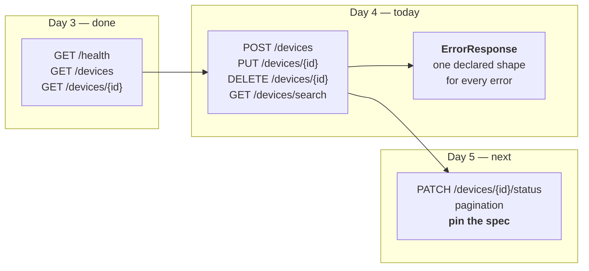

# Day 4 Checklist — Finish CRUD, and give errors a shape

**Goal for today:** the rest of the endpoints (create, replace, delete, search)
with correct HTTP semantics — and a **declared error model**, so that error
responses are contract-checkable instead of being a shapeless blob.

**Time:** ~3–4 hours.
**Prerequisite:** Day 3 complete (3 endpoints, 8 tests, spec served).

> **Formatting note:** every code block starts at the left margin so it
> copy-pastes cleanly.

---

## Progress log (updated as we go)

**Status: ✅ DAY 4 COMPLETE.** Parts A–I done, pushed, CI green.

**Done-when gate met:** 34 tests passing; every error in the API shares the one
declared `ErrorResponse` shape; the spec's status-code table matches what the
endpoints actually do; `422` resolves to `ErrorResponse`, not FastAPI's
`HTTPValidationError`.

Status-code table as built:

```
GET     /devices                 -> 200
POST    /devices                 -> 201, 409, 422
GET     /devices/search          -> 200, 422
DELETE  /devices/{device_id}     -> 204, 404, 422
GET     /devices/{device_id}     -> 200, 404, 422
PUT     /devices/{device_id}     -> 200, 404, 422
GET     /health                  -> 200
```

**Observation worth keeping — two different "not found"s.** While poking by hand:

| Request | Status | Where it came from |
|---|---|---|
| `/devices/no-such-path` | 422 `validation_error` | **Matched** `/devices/{device_id}`, then failed int parsing |
| `/no-such-path` | 404 `not_found` | Matched **no route**; raised by Starlette's router |

The second is the one that proves the handler registration is right: our code
never raises it, and it still comes back in the declared envelope. Registering
against FastAPI's `HTTPException` instead of Starlette's parent class would have
left that single response in the old `{"detail": ...}` shape — one endpoint
silently disagreeing with every other.

**Observation — in-memory state persists across manual curls.** After renaming
device 1, deleting device 2, and creating 4 and 5 by hand, later searches
reflected all of it, because uvicorn holds the store for the life of the process.
Harmless when poking manually, and precisely why the suite resets the store
before every test: without that, search assertions would depend on what had been
curl'd earlier in the day. Concrete instance of test-order dependence.

---

## Read this first — Background primer

### 1. Where this fits

Day 3 gave you three read-only endpoints. Today you add the ones that *change*
things, and you fix a problem you don't know you have yet: your API's error
responses currently have no schema, which means **most of your API is invisible
to contract testing**.



That error-model piece is the part most projects skip, and it's the one worth
being able to explain.

---

### 2. CRUD and what the HTTP methods actually mean

**CRUD** is Create, Read, Update, Delete — the four things you can do to a
resource. REST maps them onto HTTP methods:

| Operation | Method | Path | Success |
|---|---|---|---|
| Create | `POST` | `/devices` | `201 Created` |
| Read (many) | `GET` | `/devices` | `200 OK` |
| Read (one) | `GET` | `/devices/{id}` | `200 OK` |
| Update (whole) | `PUT` | `/devices/{id}` | `200 OK` |
| Update (part) | `PATCH` | `/devices/{id}` | `200 OK` |
| Delete | `DELETE` | `/devices/{id}` | `204 No Content` |

Note the pattern: **`/devices` is the collection, `/devices/{id}` is one member.**
You `POST` to the collection (the server picks the id); you `PUT` and `DELETE`
against a member (you already know which one).

**`PUT` vs `PATCH`** — a distinction people get wrong constantly. `PUT` replaces
the *entire* resource: send every field, and anything you omit is gone. `PATCH`
modifies *part* of it. Today you build `PUT`; `PATCH` arrives on Day 5 for the
status transition.

---

### 3. Safety and idempotency (a very common interview question)

Two properties, often confused:

- **Safe** — the request doesn't change anything on the server. Read-only.
- **Idempotent** — doing it *N* times has the same effect as doing it once.

| Method | Safe? | Idempotent? | Why |
|---|---|---|---|
| `GET` | ✅ | ✅ | Reads nothing changes |
| `PUT` | ❌ | ✅ | "Set this resource to exactly X" — doing it twice lands in the same state |
| `DELETE` | ❌ | ✅ | Once it's gone it's gone; deleting again finds nothing to do |
| `POST` | ❌ | ❌ | "Create a new one" — twice creates two |
| `PATCH` | ❌ | ⚠️ Depends | "Set status to online" is idempotent; "increment counter" is not |

**Why this matters practically, and why it matters to *you* specifically:**
idempotency is what makes it safe to **retry**. If a request times out and you
don't know whether it landed, you can safely retry a `GET`, `PUT`, or `DELETE`.
Retry a `POST` and you may create two devices.

Your harness gets timeout-and-retry logic on Day 9. Retrying a non-idempotent
request is a genuine way to build a test tool that corrupts the thing it's
testing — so this isn't trivia, it's a constraint on your own design. Project 1's
harness had retry logic too, and AT commands had the same split (`AT+CSQ?` is
safe; `AT+CFUN=0` is not).

---

### 4. Status codes for writes

**`201 Created`** — for successful `POST`. Convention is to also return a
**`Location` header** giving the URL of the thing you just made:

```
HTTP/1.1 201 Created
Location: /devices/4
```

That's how a client learns the server-assigned id without guessing.

**`204 No Content`** — for successful `DELETE`. It means "worked, and there is
deliberately no body." A 204 **must not** have a response body; sending one is a
protocol violation. (Watch for this in the code — it's why the delete handler
returns a bare `Response` rather than a value FastAPI would serialize.)

**`409 Conflict`** — the request is well-formed but conflicts with current state.
You'll use it when creating a device whose name already exists. Distinct from
`422` (the request was malformed) — the difference being *syntactically fine but
semantically impossible*.

---

### 5. Where data comes from: path, query, and body

Three ways a request carries data, and FastAPI decides which is which by looking
at your function signature:

| Kind | Looks like | FastAPI's rule |
|---|---|---|
| **Path parameter** | `/devices/7` | Name appears in the route path |
| **Query parameter** | `/devices/search?status=online` | Simple type, name *not* in the path |
| **Request body** | JSON sent with POST/PUT | Parameter annotated with a Pydantic model |

So this:

```python
@app.get("/devices/search")
def search(name_contains: str | None = None, status: DeviceStatus | None = None):
```

gives you `/devices/search?name_contains=router&status=online`, with both
optional because they default to `None`. No parsing code, and the parameters are
documented in the spec automatically.

---

### 6. Separate input and output models

`Device` has `id`, `name`, `status`. But when a client *creates* a device it must
not supply the id — the server assigns that. So you need a second model:

```python
class DeviceCreate(BaseModel):
    name: str
    status: DeviceStatus = DeviceStatus.OFFLINE
```

**Why not just reuse `Device` and ignore the id?** Two reasons, and the second is
the real one:

1. **Security/correctness** — accepting a client-supplied id lets a client
   overwrite an existing device by claiming its number.
2. **Contract precision** — "ignore it if present" is a rule that exists only in
   your head. A separate model puts it *in the spec*: the request schema has no
   `id` field, so sending one is a declared violation, not an undocumented
   quirk.

That second reason is the whole philosophy of this project. **Anything true only
in your head cannot be tested.** Constraints have to live in the contract.

---

### 7. The error-shape problem (the important part of today)

Look at what your API currently returns for errors:

```json
GET /devices/999   ->  {"detail": "No device with id 999"}
GET /devices/xyz   ->  {"detail": [{"type": "int_parsing", "loc": [...], ...}]}
```

`detail` is a **string** in one case and a **list of objects** in the other.

Now try to write a schema for that. You can't write a useful one — it'd have to
be "a string, or a list of objects, or possibly something else," which permits
nearly anything. A schema that permits nearly anything is not a constraint, and a
constraint that can't be violated is worthless to a test.

The consequence is bigger than it sounds: **every 4xx response your API produces
is currently invisible to contract testing.** For most real APIs, error behaviour
is a large share of the interesting behaviour.

**The fix** is to declare one error shape and normalize everything into it:

```json
{"error": {"code": "not_found", "message": "No device with id 999"}}
```

Two pieces make it work:

- **`ErrorResponse` / `ErrorDetail` Pydantic models**, so the shape exists in the
  spec.
- **Exception handlers** that intercept every error FastAPI would otherwise emit
  and re-render it in that shape.

The handlers must catch framework-generated errors too, not just yours. If you
only handle your own exceptions, then requesting an unknown *path* still returns
FastAPI's default `{"detail": "Not Found"}` — one endpoint disagreeing with the
rest. That inconsistency is exactly the kind of thing your Day 8 validator will
catch, and it's much less embarrassing to catch it now.

---

### 8. Declaring which statuses an endpoint can return

FastAPI documents the success response automatically. It does **not** know your
handler might raise a 404 — that's runtime behaviour it can't see.

So you tell it:

```python
@app.get(
    "/devices/{device_id}",
    response_model=Device,
    responses={404: {"model": ErrorResponse, "description": "No such device"}},
)
```

Now the spec says this endpoint may answer `200` (with a `Device`) or `404` (with
an `ErrorResponse`).

**Why this is load-bearing rather than decorative:** your Day 8 validator's
*first* check is "is this status code declared in the spec at all?" If the spec
only mentions 200, then every legitimate 404 gets flagged as an undeclared-status
violation, and your suite drowns in false positives. Declaring the full set of
possible responses is what makes the contract complete enough to test against.

---

### 9. Two traps you'll hit today

**Trap 1 — route ordering.** These two routes conflict:

```python
@app.get("/devices/{device_id}")   # matches /devices/ANYTHING
@app.get("/devices/search")        # never reached if registered second
```

FastAPI matches in **registration order**. Register `/devices/{device_id}` first
and a request for `/devices/search` matches it, tries to parse `"search"` as an
`int`, and returns `422`. **Specific routes must be registered before parametrized
ones.** Today you'll write `/devices/search` above `/devices/{device_id}` for
exactly this reason.

**Trap 2 — the 422 your spec lies about.** This one is genuinely subtle and it's
the best thing in today's material.

FastAPI automatically declares a `422` response for any endpoint that validates
input, using its own built-in `HTTPValidationError` schema. But you're about to
*replace* the body of 422 responses with your `ErrorResponse` shape.

The moment you do, **the spec describes a shape the service no longer produces.**
The service is now in violation of its own contract, in a way nothing points out.
Your app works; your tests pass; the document is wrong.

That is *precisely* the class of bug this entire project exists to detect — spec
drift, discovered on Day 4 by hand, before the tool that finds it automatically
even exists. The fix is to explicitly declare `422: {"model": ErrorResponse}` on
the affected routes so the document matches reality.

Remember this one. "Tell me about a bug you found in your own project" is a
standard interview question, and this is a better answer than a crash.

---

## Part A — Extend the models

**1. Add the new models to `api/models.py`.**

- [x] Append this to the end of the file (keep `DeviceStatus` and `Device` as
      they are):

```python
class DeviceCreate(BaseModel):
    """
    The body a client sends to CREATE a device.

    Deliberately has no `id`: identifiers are assigned by the server. Modelling
    this as a separate class rather than reusing `Device` and ignoring the id is
    a contract decision, not a style one. "We ignore id if you send it" is a rule
    that exists only in the implementation; a separate request schema puts the
    rule *in the specification*, where a client can read it and a contract test
    can enforce it.

    `status` has a default, so it is optional in the request. That default also
    appears in the spec, so clients know what they get if they omit it.
    """

    name: str = Field(
        ...,
        min_length=1,
        max_length=64,
        description="Human-readable label for the device. Must be unique.",
        examples=["edge-router-03"],
    )
    status: DeviceStatus = Field(
        default=DeviceStatus.OFFLINE,
        description="Initial state. Defaults to 'offline' if omitted.",
    )


class DeviceUpdate(BaseModel):
    """
    The body a client sends to REPLACE a device (PUT).

    Every field is required, because PUT means "make the resource look exactly
    like this" -- omitting a field is a request to blank it, not to leave it
    alone. Partial updates are what PATCH is for (Day 5).
    """

    name: str = Field(
        ...,
        min_length=1,
        max_length=64,
        description="Human-readable label for the device.",
    )
    status: DeviceStatus = Field(
        ...,
        description="Operational state to set.",
    )


class ErrorDetail(BaseModel):
    """The inner object of an error response."""

    code: str = Field(
        ...,
        description="Stable, machine-readable error identifier.",
        examples=["not_found"],
    )
    message: str = Field(
        ...,
        description="Human-readable explanation. May change; do not parse it.",
        examples=["No device with id 999"],
    )


class ErrorResponse(BaseModel):
    """
    The ONE shape every error response from this API takes.

    FastAPI's default error body puts a `detail` key at the top level whose value
    is sometimes a string and sometimes a list of objects. No single useful
    schema describes that, which means error responses cannot be contract-tested
    -- and for most APIs, error behaviour is a large share of the behaviour that
    matters.

    Wrapping the payload in a named `error` object (rather than putting `code`
    and `message` at the top level) leaves room to add fields later -- a
    `request_id`, a list of field-level problems -- without colliding with any
    successful response shape.
    """

    error: ErrorDetail
```

---

## Part B — Extend the store

**2. Add the write operations to `api/store.py`.**

- [x] Replace the whole file with this version (the Day 3 functions are
      unchanged; the id counter and four new functions are added):

```python
"""
In-memory data store.

Deliberately NOT a database. This service exists to be tested, not to persist
anything. A dict keeps the whole system inspectable, makes every test start from
an identical known state, and avoids dragging in migrations, connection pools
and teardown -- an entire category of failure that has nothing to do with
contract testing.

State lives at module level, so it survives across requests within one running
process and resets whenever that process restarts.
"""

from api.models import Device, DeviceStatus

# Device id -> Device. Module-level, so all requests share it.
_DEVICES: dict[int, Device] = {}

# The id the next created device will receive.
_next_id: int = 1


def reset() -> None:
    """
    Restore the store to its seeded starting state.

    Tests call this before each case so every test begins from identical data.
    Without it, a test that creates or deletes a device would silently change
    the outcome of tests running after it -- test-order dependence, one of the
    classic causes of flaky tests (see LEARNING_NOTES.md, Day 0). Resetting
    eliminates that whole class of problem by construction rather than by
    careful ordering.

    The id counter is reset too. Forgetting that would make ids depend on how
    many tests ran earlier, which is the same order-dependence bug wearing a
    different hat.
    """
    global _next_id

    _DEVICES.clear()
    seed = (
        Device(id=1, name="edge-router-01", status=DeviceStatus.ONLINE),
        Device(id=2, name="edge-router-02", status=DeviceStatus.OFFLINE),
        Device(id=3, name="sensor-gateway-01", status=DeviceStatus.DEGRADED),
    )
    for device in seed:
        _DEVICES[device.id] = device
    _next_id = max(_DEVICES) + 1


def list_devices() -> list[Device]:
    """
    Return every device, ordered by id.

    The explicit sort is a deliberate anti-flakiness measure. A dict preserves
    insertion order, so results would *probably* be consistent -- and "probably
    consistent" is precisely the property that produces a test which fails once
    a month for no visible reason. Deterministic ordering makes the response
    reproducible by construction.
    """
    return [_DEVICES[device_id] for device_id in sorted(_DEVICES)]


def get_device(device_id: int) -> Device | None:
    """Return the device with this id, or None if there isn't one."""
    return _DEVICES.get(device_id)


def find_by_name(name: str) -> Device | None:
    """
    Return the device with this exact name, or None.

    Used to enforce name uniqueness, which is what makes a duplicate create a
    409 Conflict rather than a silent second device.
    """
    for device in _DEVICES.values():
        if device.name == name:
            return device
    return None


def create_device(name: str, status: DeviceStatus) -> Device:
    """
    Add a new device and return it, with a server-assigned id.

    Ids are handed out by a counter that only ever increases -- they are NOT
    reused after a delete. Reuse would mean a client holding id 4 could later
    find a completely different device there, with no way to tell. Monotonic ids
    make a stale reference produce an honest 404 instead of silently wrong data.
    """
    global _next_id

    device = Device(id=_next_id, name=name, status=status)
    _DEVICES[device.id] = device
    _next_id += 1
    return device


def replace_device(device_id: int, name: str, status: DeviceStatus) -> Device | None:
    """
    Overwrite an existing device wholesale (PUT semantics). None if absent.

    Builds a brand-new Device rather than mutating the stored one, so the value
    goes through Pydantic validation again. Mutating in place would let invalid
    data in through the side door.
    """
    if device_id not in _DEVICES:
        return None

    device = Device(id=device_id, name=name, status=status)
    _DEVICES[device_id] = device
    return device


def delete_device(device_id: int) -> bool:
    """
    Remove a device. Returns True if it existed, False otherwise.

    Returning a bool rather than raising lets the route layer decide what the
    absence of a device means in HTTP terms. The store deals in data; only the
    route deals in status codes. Keeping that boundary clean is what will make
    the seeded bug modes on Day 6 easy to add in one place.
    """
    return _DEVICES.pop(device_id, None) is not None


def search_devices(
    name_contains: str | None = None,
    status: DeviceStatus | None = None,
) -> list[Device]:
    """
    Return devices matching the given filters, ordered by id.

    Both filters are optional and combine with AND. Passing neither returns
    everything -- the same result as list_devices(), which is the least
    surprising behaviour for an empty search.

    Name matching is case-insensitive substring, chosen because it gives the
    Day 10 property-based fuzzer something interesting to attack (empty strings,
    unicode, very long inputs) without needing a real search engine.
    """
    results = list_devices()

    if name_contains is not None:
        needle = name_contains.lower()
        results = [d for d in results if needle in d.name.lower()]

    if status is not None:
        results = [d for d in results if d.status == status]

    return results


# Populate on import, so the app has data as soon as it starts.
reset()
```

---

## Part C — The error handlers

**3. Create `api/errors.py`.**

- [x] Create the file:

```python
"""
Structured error responses.

FastAPI's default error body is {"detail": ...}, where `detail` is a string for
HTTPException and a LIST OF OBJECTS for validation failures. No single useful
schema describes both, so error responses cannot be meaningfully contract-tested
-- and for most APIs, error behaviour is a large share of the behaviour worth
testing.

This module normalises every error the application can produce into one declared
shape:

    {"error": {"code": "not_found", "message": "No device with id 999"}}

Note that the handlers below intercept FRAMEWORK-generated errors too, not just
ones we raise. Without that, a request to an unknown path would still return
FastAPI's default {"detail": "Not Found"} -- a single endpoint disagreeing with
every other one, which is exactly the kind of inconsistency the harness is being
built to detect.
"""

from fastapi import FastAPI, Request
from fastapi.exceptions import RequestValidationError
from fastapi.responses import JSONResponse
from starlette.exceptions import HTTPException as StarletteHTTPException

from api.models import ErrorDetail, ErrorResponse

# Status code -> stable machine-readable code. Clients are expected to branch on
# `code`, never on `message`: the message is for humans and may be reworded, the
# code is part of the contract.
_CODE_BY_STATUS: dict[int, str] = {
    400: "bad_request",
    404: "not_found",
    405: "method_not_allowed",
    409: "conflict",
    422: "validation_error",
    500: "internal_error",
}


def _payload(status_code: int, message: str) -> dict:
    """Build the error body for a status code, as a plain JSON-ready dict."""
    body = ErrorResponse(
        error=ErrorDetail(
            code=_CODE_BY_STATUS.get(status_code, "error"),
            message=message,
        )
    )
    # model_dump() converts the Pydantic object into a dict JSONResponse can
    # serialize. Building it through the model (rather than writing the dict by
    # hand) guarantees the response can never drift from the declared schema.
    return body.model_dump()


def register_error_handlers(app: FastAPI) -> None:
    """
    Attach the handlers to an app.

    A function rather than module-level decorators so the app object is passed
    in explicitly -- it keeps main.py readable and avoids a circular import.
    """

    @app.exception_handler(StarletteHTTPException)
    async def handle_http_exception(
        request: Request, exc: StarletteHTTPException
    ) -> JSONResponse:
        """
        Catch every HTTPException, ours and the framework's.

        Registered against STARLETTE's HTTPException rather than FastAPI's on
        purpose: FastAPI's class is a subclass of it, so this catches both --
        including the 404 the router raises for an unknown path and the 405 it
        raises for a wrong method, neither of which our code ever raises.
        """
        return JSONResponse(
            status_code=exc.status_code,
            content=_payload(exc.status_code, str(exc.detail)),
        )

    @app.exception_handler(RequestValidationError)
    async def handle_validation_error(
        request: Request, exc: RequestValidationError
    ) -> JSONResponse:
        """
        Reshape FastAPI's validation errors into the standard envelope.

        FastAPI reports a list of problems; we surface the first one as a
        readable message like "path.device_id: Input should be a valid integer".
        Detail is lost, which is a deliberate trade: one predictable shape is
        worth more to a machine consumer than a rich but unschematisable one.
        """
        problems = exc.errors()
        if problems:
            first = problems[0]
            location = ".".join(str(part) for part in first.get("loc", ()))
            reason = first.get("msg", "invalid request")
            message = f"{location}: {reason}" if location else reason
        else:
            message = "Request validation failed"

        return JSONResponse(status_code=422, content=_payload(422, message))
```

---

## Part D — The routes

**4. Replace `api/main.py`.**

- [x] Replace the whole file:

```python
"""
FastAPI application -- the service under test.

This is what the harness will interrogate for the rest of the project. It is
deliberately small: the goal is not an impressive API, it is one whose contract
can be checked precisely and whose bugs can be seeded on demand (Day 6).

Run locally with:

    uvicorn api.main:app --reload

`api.main:app` is a coordinate: module path, colon, variable name.

ROUTE ORDER MATTERS in this file -- see the note above /devices/search.
"""

from fastapi import FastAPI, HTTPException, Response, status

from api import store
from api.errors import register_error_handlers
from api.models import (
    Device,
    DeviceCreate,
    DeviceStatus,
    DeviceUpdate,
    ErrorResponse,
)

app = FastAPI(
    title="Device Registry",
    version="0.2.0",
    description=(
        "A small REST API used as the system under test for a contract-"
        "conformance and flaky-test-detection harness. The domain is "
        "arbitrary -- the domain does not matter, the contract does."
    ),
)

# Normalise every error response to the declared ErrorResponse shape.
register_error_handlers(app)


# Reused response declarations. Every status an endpoint can return must appear
# in the spec, because the harness's first check (Day 8) is "was this status code
# declared at all?" -- an undeclared 404 would be reported as a violation even
# though it is correct behaviour.
_NOT_FOUND = {
    404: {"model": ErrorResponse, "description": "No device with that id."}
}
_CONFLICT = {
    409: {"model": ErrorResponse, "description": "A device with that name exists."}
}
# FastAPI auto-declares 422 using its OWN HTTPValidationError schema. Since
# errors.py replaces the body with ErrorResponse, that automatic declaration
# would describe a shape this service no longer produces -- the spec would lie.
# Declaring 422 explicitly overrides it and keeps the document honest.
_VALIDATION = {
    422: {"model": ErrorResponse, "description": "Request failed validation."}
}


@app.get("/health", tags=["meta"])
def health() -> dict[str, str]:
    """
    Liveness probe: is the process up and serving?

    Kept trivial on purpose. Compose and CI use it to answer "is this thing
    ready yet" (the started-vs-ready distinction from Day 2), so it must not
    depend on anything that could itself be broken.
    """
    return {"status": "ok"}


@app.get("/devices", response_model=list[Device], tags=["devices"])
def list_devices() -> list[Device]:
    """
    Return every device in the registry.

    `response_model=list[Device]` tells FastAPI two things: serialize the return
    value as a list of Devices, and declare that shape in the OpenAPI spec. The
    declaration is the half that matters here -- it is what the harness checks
    responses against.
    """
    return store.list_devices()


@app.post(
    "/devices",
    response_model=Device,
    status_code=status.HTTP_201_CREATED,
    responses={**_CONFLICT, **_VALIDATION},
    tags=["devices"],
)
def create_device(payload: DeviceCreate, response: Response) -> Device:
    """
    Create a device. The server assigns the id.

    Returns 201 (not 200) because a new resource came into existence, plus a
    `Location` header pointing at it -- that is how the client learns the
    assigned id without guessing.

    POST is neither safe nor idempotent: calling it twice creates two devices.
    That is why the harness must never blindly retry it (Day 9).
    """
    if store.find_by_name(payload.name) is not None:
        raise HTTPException(
            status_code=status.HTTP_409_CONFLICT,
            detail=f"A device named '{payload.name}' already exists",
        )

    device = store.create_device(payload.name, payload.status)

    # Declaring `response: Response` as a parameter lets us set headers on the
    # response FastAPI is building, while still returning a model normally.
    response.headers["Location"] = f"/devices/{device.id}"
    return device


# ---------------------------------------------------------------------------
# ROUTE ORDER: /devices/search MUST be registered before /devices/{device_id}.
#
# FastAPI matches routes in registration order. If the parametrized route came
# first, a request for /devices/search would match it, try to parse "search" as
# an int, and fail with 422 -- the search endpoint would be unreachable.
# Specific paths before parametrized ones, always.
# ---------------------------------------------------------------------------
@app.get(
    "/devices/search",
    response_model=list[Device],
    responses={**_VALIDATION},
    tags=["devices"],
)
def search_devices(
    name_contains: str | None = None,
    status: DeviceStatus | None = None,
) -> list[Device]:
    """
    Search devices by name substring and/or status.

    Both parameters are QUERY parameters, not path parameters: FastAPI infers
    that because their names do not appear in the route path and their types are
    simple. Both default to None, making them optional; passing neither returns
    every device.

    Example: /devices/search?name_contains=router&status=online
    """
    return store.search_devices(name_contains=name_contains, status=status)


@app.get(
    "/devices/{device_id}",
    response_model=Device,
    responses={**_NOT_FOUND, **_VALIDATION},
    tags=["devices"],
)
def get_device(device_id: int) -> Device:
    """
    Return one device by id.

    `device_id: int` is doing real work, not documentation: FastAPI converts the
    URL text "1" into the integer 1, and rejects /devices/banana with a 422
    before this function is ever called. Free validation, straight from the type
    hint.

    Raising HTTPException rather than returning an error value means the error
    path cannot be silently ignored, and FastAPI turns it into a proper HTTP
    response.
    """
    device = store.get_device(device_id)
    if device is None:
        raise HTTPException(
            status_code=status.HTTP_404_NOT_FOUND,
            detail=f"No device with id {device_id}",
        )
    return device


@app.put(
    "/devices/{device_id}",
    response_model=Device,
    responses={**_NOT_FOUND, **_VALIDATION},
    tags=["devices"],
)
def replace_device(device_id: int, payload: DeviceUpdate) -> Device:
    """
    Replace a device wholesale.

    PUT means "make this resource look exactly like the body I sent" -- every
    field is required, and omitting one is a request to blank it, not to leave
    it alone. Partial modification is PATCH's job (Day 5).

    PUT is idempotent: sending the same body twice leaves the same final state,
    which is what makes it safe for the harness to retry after a timeout.
    """
    device = store.replace_device(device_id, payload.name, payload.status)
    if device is None:
        raise HTTPException(
            status_code=status.HTTP_404_NOT_FOUND,
            detail=f"No device with id {device_id}",
        )
    return device


@app.delete(
    "/devices/{device_id}",
    status_code=status.HTTP_204_NO_CONTENT,
    responses={**_NOT_FOUND, **_VALIDATION},
    tags=["devices"],
)
def delete_device(device_id: int) -> Response:
    """
    Delete a device.

    Returns 204 No Content on success. A 204 response MUST NOT carry a body --
    that is why this returns a bare Response object rather than a value FastAPI
    would serialize into JSON. Returning None here would risk emitting the four
    bytes "null", which is a protocol violation and precisely the sort of thing
    a contract test should catch.

    DELETE is idempotent in effect: once the device is gone, deleting again
    changes nothing. We still answer 404 the second time, because the client
    asked us to delete something that does not exist and deserves to know.
    """
    if not store.delete_device(device_id):
        raise HTTPException(
            status_code=status.HTTP_404_NOT_FOUND,
            detail=f"No device with id {device_id}",
        )
    return Response(status_code=status.HTTP_204_NO_CONTENT)
```

---

## Part E — Try it by hand

**5. Start the server.**

- [x] In one terminal:

```bash
uvicorn api.main:app --reload
```

**6. Exercise the write endpoints.**

- [x] In a second terminal:

```bash
curl -i -X POST http://127.0.0.1:8000/devices \
  -H "Content-Type: application/json" \
  -d '{"name": "edge-router-03", "status": "online"}'
```

✅ *Worked when:* `HTTP/1.1 201 Created`, a `location: /devices/4` header, and
the created device in the body.

- [x] Create the same name again:

```bash
curl -i -X POST http://127.0.0.1:8000/devices \
  -H "Content-Type: application/json" \
  -d '{"name": "edge-router-03", "status": "online"}'
```

✅ *Worked when:* `409 Conflict` and
`{"error":{"code":"conflict","message":"A device named 'edge-router-03' already exists"}}`

**Look at that body.** It's the new declared shape — and this is the first
response in the project whose *error* has a schema.

- [x] Omit the optional status to see the default apply:

```bash
curl -s -X POST http://127.0.0.1:8000/devices \
  -H "Content-Type: application/json" \
  -d '{"name": "sensor-gateway-02"}'
```

✅ *Worked when:* the returned device has `"status":"offline"`.

- [x] Replace, then delete:

```bash
curl -i -X PUT http://127.0.0.1:8000/devices/1 \
  -H "Content-Type: application/json" \
  -d '{"name": "edge-router-01-renamed", "status": "degraded"}'

curl -i -X DELETE http://127.0.0.1:8000/devices/2
curl -i -X DELETE http://127.0.0.1:8000/devices/2
```

✅ *Worked when:* the PUT returns 200 with the new values; the first DELETE
returns **204 with no body**; the second returns 404 in the error shape.

**7. Confirm the error shape is now universal.**

- [x] Run:

```bash
curl -s http://127.0.0.1:8000/devices/999
curl -s http://127.0.0.1:8000/devices/banana
curl -s http://127.0.0.1:8000/no-such-path
curl -s -X POST http://127.0.0.1:8000/health
```

✅ *Worked when:* **all four** come back as `{"error":{"code":...,"message":...}}`
— including the last two, which our code never raises. Those come from the
router (unknown path → 404, wrong method → 405) and are caught because the
handler is registered against Starlette's `HTTPException`, the parent class.

*Compare that to Day 3*, where `/devices/999` and `/devices/banana` returned two
structurally different bodies. One shape now, everywhere.

**8. Try the search endpoint.**

- [x] Run:

```bash
curl -s "http://127.0.0.1:8000/devices/search?name_contains=router"
curl -s "http://127.0.0.1:8000/devices/search?status=degraded"
curl -s "http://127.0.0.1:8000/devices/search?name_contains=edge&status=online"
curl -s "http://127.0.0.1:8000/devices/search"
```

✅ *Worked when:* filters apply and combine, and the bare search returns
everything.

*This is the route-ordering trap from primer §9, not triggering.* If you had
registered `/devices/{device_id}` first, all four of these would return 422.
Worth deliberately reordering the two routes once to watch it break, then putting
them back — same instinct as breaking CI on Day 1.

---

## Part F — Check the contract

**9. Confirm the error model reached the spec.**

- [x] Run:

```bash
curl -s http://127.0.0.1:8000/openapi.json | python -c "import json,sys; s=json.load(sys.stdin); print(json.dumps(s['components']['schemas']['ErrorResponse'], indent=2)); print(json.dumps(s['components']['schemas']['ErrorDetail'], indent=2))"
```

✅ *Worked when:* both schemas appear, with `ErrorResponse` requiring `error` and
`ErrorDetail` requiring `code` and `message`.

**10. Confirm every status code is declared.**

- [x] Run:

```bash
curl -s http://127.0.0.1:8000/openapi.json | python -c "
import json, sys
spec = json.load(sys.stdin)
for path, methods in sorted(spec['paths'].items()):
    for method, op in sorted(methods.items()):
        codes = ', '.join(sorted(op['responses']))
        print(f'{method.upper():7} {path:24} -> {codes}')
"
```

✅ *Worked when:* you see something like:

```
GET     /devices                 -> 200
POST    /devices                 -> 201, 409, 422
GET     /devices/search          -> 200, 422
DELETE  /devices/{device_id}     -> 204, 404, 422
GET     /devices/{device_id}     -> 200, 404, 422
PUT     /devices/{device_id}     -> 200, 404, 422
GET     /health                  -> 200
```

**Read that table as a promise.** It says: *"a GET on /devices/{id} will answer
200, 404, or 422 — nothing else."* Anything else the service returns is a
contract violation, and from Day 8 your validator will say so. That table is the
contract becoming genuinely testable.

**11. Verify the 422 trap is actually fixed.**

- [x] Run:

```bash
curl -s http://127.0.0.1:8000/openapi.json | python -c "
import json, sys
spec = json.load(sys.stdin)
ref = spec['paths']['/devices/{device_id}']['get']['responses']['422']['content']['application/json']['schema']
print('422 schema ref:', ref)
"
```

✅ *Worked when:* it prints a ref to `ErrorResponse`, **not** to
`HTTPValidationError`.

If it says `HTTPValidationError`, the `_VALIDATION` declaration is missing from
that route — and your spec is currently lying about what the service returns.
That is the exact bug from primer §9. Fix it and re-check.

---

## Part G — Tests

**12. Add the new tests to `test_api.py`.**

- [x] Append this to the end of the file (keep the Day 3 tests):

```python
# ---------------------------------------------------------------------------
# Day 4 -- writes, search, and the error contract
# ---------------------------------------------------------------------------


def test_create_device_returns_201_and_location_header():
    """A successful create reports 201 and where the new resource lives."""
    response = client.post(
        "/devices", json={"name": "edge-router-03", "status": "online"}
    )
    assert response.status_code == 201
    assert response.headers["location"] == "/devices/4"

    body = response.json()
    assert body["id"] == 4
    assert body["name"] == "edge-router-03"
    assert body["status"] == "online"


def test_create_device_defaults_status_to_offline():
    """`status` is optional on create; the declared default applies."""
    response = client.post("/devices", json={"name": "sensor-gateway-02"})
    assert response.status_code == 201
    assert response.json()["status"] == "offline"


def test_create_device_with_duplicate_name_returns_409():
    """Well-formed but impossible: a conflict, not a validation error."""
    response = client.post("/devices", json={"name": "edge-router-01"})
    assert response.status_code == 409
    assert response.json()["error"]["code"] == "conflict"


def test_create_device_rejects_client_supplied_id():
    """
    `id` is not part of DeviceCreate, so sending one is not silently honoured.

    The value is ignored rather than rejected (Pydantic's default), but the
    important part is that the server still assigns the id -- a client cannot
    overwrite device 1 by claiming to be it.
    """
    response = client.post("/devices", json={"id": 1, "name": "impostor"})
    assert response.status_code == 201
    assert response.json()["id"] != 1


def test_create_device_with_empty_name_returns_422():
    """`min_length=1` is enforced, and the failure uses our error shape."""
    response = client.post("/devices", json={"name": ""})
    assert response.status_code == 422
    assert response.json()["error"]["code"] == "validation_error"


def test_replace_device_updates_every_field():
    """PUT overwrites the whole resource."""
    response = client.put(
        "/devices/1", json={"name": "renamed", "status": "degraded"}
    )
    assert response.status_code == 200
    assert response.json() == {"id": 1, "name": "renamed", "status": "degraded"}


def test_replace_device_is_idempotent():
    """
    Sending the same PUT twice lands in the same state.

    This is the property that makes it safe for the harness to retry a PUT after
    a timeout (Day 9). Asserting it here rather than assuming it is the point.
    """
    body = {"name": "renamed", "status": "degraded"}
    first = client.put("/devices/1", json=body)
    second = client.put("/devices/1", json=body)
    assert first.json() == second.json()


def test_replace_missing_device_returns_404():
    response = client.put(
        "/devices/999", json={"name": "ghost", "status": "offline"}
    )
    assert response.status_code == 404


def test_replace_device_requires_every_field():
    """PUT means "exactly this", so a partial body is invalid."""
    response = client.put("/devices/1", json={"name": "only-a-name"})
    assert response.status_code == 422


def test_delete_device_returns_204_with_no_body():
    """
    204 must carry no body.

    `response.content` is the raw bytes -- asserting it is empty catches the
    common bug of serializing None into the four bytes "null", which would be a
    protocol violation.
    """
    response = client.delete("/devices/1")
    assert response.status_code == 204
    assert response.content == b""


def test_deleted_device_is_really_gone():
    client.delete("/devices/1")
    assert client.get("/devices/1").status_code == 404


def test_delete_missing_device_returns_404():
    assert client.delete("/devices/999").status_code == 404


def test_created_ids_are_not_reused_after_delete():
    """
    Ids increase monotonically; a deleted id is never handed out again.

    Reuse would let a client holding a stale id silently address a different
    device. Monotonic ids turn that into an honest 404 instead.
    """
    created = client.post("/devices", json={"name": "temp"}).json()
    client.delete(f"/devices/{created['id']}")
    recreated = client.post("/devices", json={"name": "temp-again"}).json()
    assert recreated["id"] > created["id"]


def test_search_by_name_substring():
    body = client.get("/devices/search?name_contains=router").json()
    assert {d["name"] for d in body} == {"edge-router-01", "edge-router-02"}


def test_search_by_status():
    body = client.get("/devices/search?status=degraded").json()
    assert [d["id"] for d in body] == [3]


def test_search_filters_combine_with_and():
    body = client.get("/devices/search?name_contains=edge&status=online").json()
    assert [d["id"] for d in body] == [1]


def test_search_with_no_filters_returns_everything():
    assert len(client.get("/devices/search").json()) == 3


def test_search_route_is_not_shadowed_by_the_id_route():
    """
    Regression guard for route ordering.

    If /devices/{device_id} were ever registered before /devices/search, this
    request would match it, fail to parse "search" as an int, and return 422.
    The bug is invisible in code review and obvious here.
    """
    assert client.get("/devices/search").status_code == 200


def test_search_with_invalid_status_returns_422():
    """The enum constraint applies to query parameters too."""
    response = client.get("/devices/search?status=banana")
    assert response.status_code == 422


# --- The error contract itself -------------------------------------------


@pytest.mark.parametrize(
    "method,path,expected_status",
    [
        ("get", "/devices/999", 404),
        ("get", "/devices/banana", 422),
        ("get", "/no-such-path", 404),
        ("delete", "/devices/999", 404),
    ],
)
def test_every_error_uses_the_declared_shape(method, path, expected_status):
    """
    One shape for every error, including ones the framework raises.

    /no-such-path is the interesting case: our code never raises it. It is
    caught because the handler is registered against Starlette's HTTPException,
    the parent of FastAPI's. Without that, this single response would disagree
    with every other error in the API -- exactly the inconsistency the contract
    validator is built to find.
    """
    response = getattr(client, method)(path)
    assert response.status_code == expected_status

    body = response.json()
    assert set(body) == {"error"}
    assert set(body["error"]) == {"code", "message"}
    assert isinstance(body["error"]["code"], str)
    assert isinstance(body["error"]["message"], str)


def test_spec_declares_the_error_model():
    spec = client.get("/openapi.json").json()
    assert "ErrorResponse" in spec["components"]["schemas"]
    assert spec["components"]["schemas"]["ErrorDetail"]["required"] == [
        "code",
        "message",
    ]


def test_spec_declares_every_status_each_endpoint_can_return():
    """
    The spec must list every status code, or the Day 8 validator's first check
    ("was this status declared?") produces false positives on correct behaviour.
    """
    spec = client.get("/openapi.json").json()

    expected = {
        ("/devices", "get"): {"200"},
        ("/devices", "post"): {"201", "409", "422"},
        ("/devices/search", "get"): {"200", "422"},
        ("/devices/{device_id}", "get"): {"200", "404", "422"},
        ("/devices/{device_id}", "put"): {"200", "404", "422"},
        ("/devices/{device_id}", "delete"): {"204", "404", "422"},
        ("/health", "get"): {"200"},
    }

    for (path, method), codes in expected.items():
        declared = set(spec["paths"][path][method]["responses"])
        assert declared == codes, f"{method.upper()} {path} declares {declared}"


def test_spec_422_uses_our_error_model_not_fastapis_default():
    """
    Guard against the spec-drift trap from the Day 4 primer.

    FastAPI auto-declares 422 with its own HTTPValidationError schema. Because
    errors.py replaces the body with ErrorResponse, that automatic declaration
    would describe a shape the service no longer produces -- the document would
    lie about the service while every test still passed.

    This is the class of bug the whole project exists to detect, so it gets an
    explicit test.
    """
    spec = client.get("/openapi.json").json()
    schema = spec["paths"]["/devices/{device_id}"]["get"]["responses"]["422"][
        "content"
    ]["application/json"]["schema"]
    assert schema["$ref"].endswith("/ErrorResponse")
```

**13. Run the suite.**

- [x] Run:

```bash
pytest -v
```

✅ *Worked when:* **34 tests pass** (8 from Day 3, 26 new — note the
parametrized error-shape test counts as 4).

---

## Part H — Compose check and commit

**14. Confirm the containerized stack still works.**

- [x] Run:

```bash
docker compose up --build
docker compose down
```

✅ *Worked when:* `SUCCESS: harness -> proxy -> api path is working`.

**15. Commit and push.**

- [x] Run:

```bash
git status --short
git add .
git commit -m "Day 4: CRUD endpoints, search, and a declared error model"
git push
```

- [x] Confirm CI goes green.

---

## Part I — Wrap up

**16. Update this checklist.**

- [x] Tick the boxes and record anything that differed in the progress log.

**17. Review.**

- [x] Read the Day 4 section of `LEARNING_NOTES.md` and try the flashcards aloud.
      Pay particular attention to safety/idempotency — it's the most likely of
      today's topics to come up in an interview.

**18. Look ahead.**

- [x] Skim `PROJECT_PLAN.md` Day 5. Tomorrow: the status state machine (the echo
      of project 1's registration FSM), pagination, and **pinning the spec** —
      the step that stops the contract from being a tautology.

---

## If something breaks

| Symptom | Cause and fix |
|---|---|
| `/devices/search` returns 422 | Route ordering. `/devices/search` must be registered **above** `/devices/{device_id}` in `main.py`. |
| `ImportError: cannot import name 'DeviceCreate'` | The append to `models.py` didn't land. Check with `grep -c class api/models.py` — expect 6. |
| Errors still look like `{"detail": ...}` | `register_error_handlers(app)` isn't being called in `main.py`, or it's called before `app` exists. |
| `/no-such-path` returns `{"detail":"Not Found"}` but other errors are fine | The handler is registered against FastAPI's `HTTPException` instead of Starlette's. Import it as `from starlette.exceptions import HTTPException as StarletteHTTPException`. |
| DELETE returns 204 but with a `null` body | The handler returns a value instead of a bare `Response(status_code=204)`. |
| Spec shows `HTTPValidationError` for 422 | `_VALIDATION` is missing from that route's `responses=`. This is the primer §9 trap. |
| `test_create_device_returns_201_and_location_header` fails on the id | A previous test leaked state. Confirm the `fresh_store` fixture still has `autouse=True`, and that `reset()` restores `_next_id`. |
| `KeyError: 'location'` | Header names are case-insensitive in HTTP; httpx lowercases them. Use `response.headers["location"]`. |

---

*When 34 tests pass, every error in the API shares one declared shape, and the
status-code table in Part F matches what your endpoints actually do, Day 4 is
done. Day 5 makes the contract real by freezing it.*
