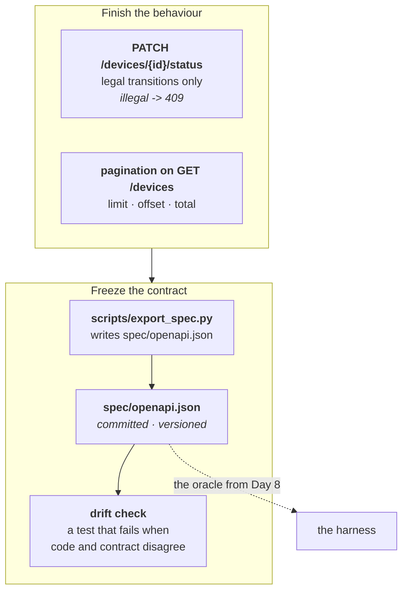
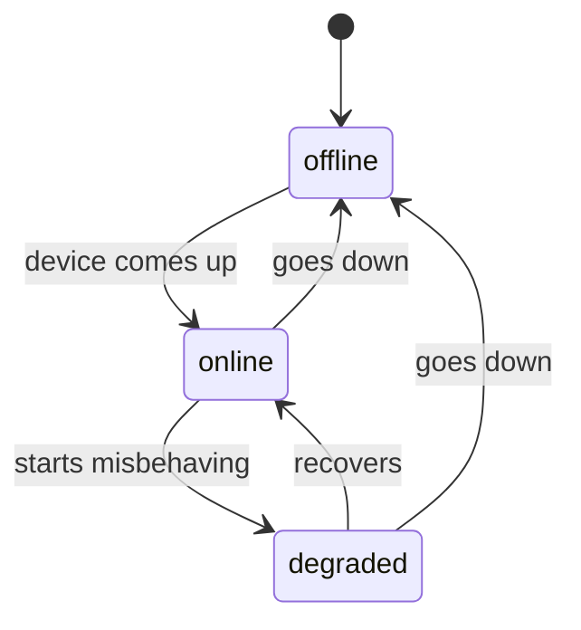
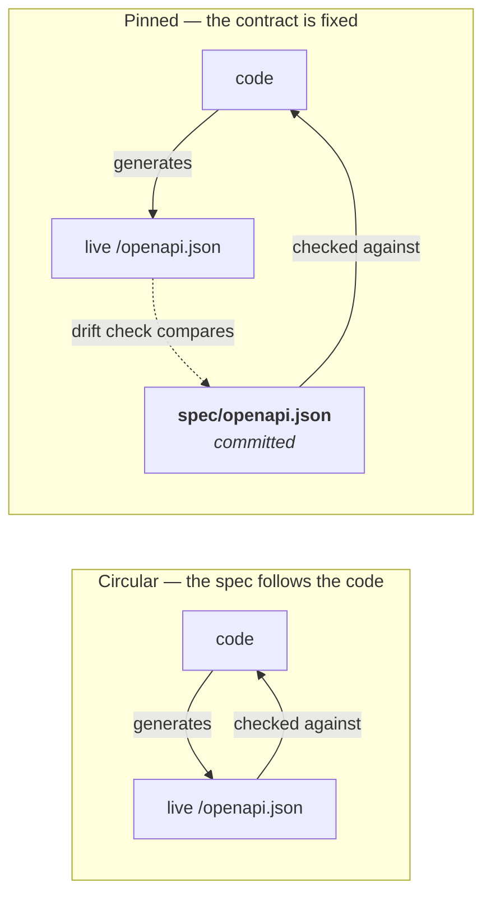

# Day 5 Checklist — A state machine, pagination, and freezing the contract

**Goal for today:** finish the API's behaviour with a **status state machine**
(the direct echo of project 1's registration FSM) and **pagination**, then do the
single most important thing in the whole project: **pin the contract**, so the
service can no longer quietly rewrite its own promise.

**Time:** ~3–4 hours.
**Prerequisite:** Day 4 complete (34 tests, declared error model).

> **Formatting note:** every code block starts at the left margin so it
> copy-pastes cleanly.

---

## Progress log (updated as we go)

**Status: not started.**

---

## Read this first — Background primer

### 1. Where this fits

Two of today's three pieces finish the API. The third changes what the project
*is*.



---

### 2. The status state machine (you have done this before)

Project 1's simulator held a **registration state machine**: `SIM_NOT_READY →
NOT_REGISTERED → SEARCHING → REGISTERED → ROAMING`, plus `DENIED`. Not every
transition was legal — `CFUN=0` deregistered, a not-ready SIM blocked attach.

Same idea here, smaller:



The interesting part is what's **missing**: `offline → degraded` is illegal. A
device that was never up cannot become "degraded" — it has to come up first.
Attempting it returns `409 Conflict`: well-formed request, impossible given
current state. Exactly the 409-vs-422 distinction from Day 4.

**Why a state machine at all, rather than just "set the field"?** Because a
free-form setter has no wrong answers, and behaviour with no wrong answers cannot
be tested. The transition table is a *constraint*, and constraints are what give
a test something to catch. Same reasoning as choosing an enum over a string on
Day 3 — and it's the reasoning that will make Day 6's seeded bugs possible.

**The design decision worth defending: are no-op transitions legal?**

What should `PATCH status=online` do on a device that is *already* online?

- **Reject it (409).** Defensible: "you asked for a transition that isn't in the
  table."
- **Accept it as a no-op (200).** Also defensible, and what we'll do.

We accept it, and the reason is Day 4's material. If a no-op were rejected, then
sending the same PATCH twice would give `200` and then `409` — **PATCH would not
be idempotent**, and the harness could not safely retry it after a timeout. On
Day 9 the harness gets retry logic; a request that fails on retry *because it
already succeeded* is a nightmare to diagnose.

So: allowing no-ops is a deliberate choice to keep the operation retry-safe. That
sentence is a good interview answer, because it shows a design decision made for
the benefit of the *testing* story rather than by convention.

---

### 3. Pagination

`GET /devices` currently returns every device as a bare JSON array. That works
with three devices and falls over with fifty thousand.

The standard fix is **limit/offset paging**: the client says how many it wants
(`limit`) and how far in to start (`offset`).

```
GET /devices?limit=2&offset=0    -> devices 1 and 2
GET /devices?limit=2&offset=2    -> device 3
```

**The response shape has to change**, and this is the interesting part. A bare
array can't tell you how many devices exist in total — so the client can't know
whether there's another page. You need an **envelope**:

```json
{
  "items": [ ... ],
  "total": 3,
  "limit": 2,
  "offset": 0
}
```

Echoing `limit` and `offset` back isn't redundant: the server may clamp what you
asked for, and the response should say what actually happened rather than making
the client assume.

**This is a breaking change**, which matters:

| Change | Kind | Effect on clients |
|---|---|---|
| Adding an optional field to a response | **Additive** | Old clients ignore it and keep working |
| Adding an optional query parameter | **Additive** | Old clients omit it and get the default |
| Changing an array response into an object | **Breaking** | Every existing client breaks |
| Removing a field, renaming one, changing a type | **Breaking** | Clients break |

Turning `[...]` into `{"items": [...]}` breaks every client that did
`for device in response`. In a real system that needs a version bump and a
migration plan. Here it's a useful demonstration: **this is precisely the class
of change contract testing exists to catch**, and you'll watch the drift check
catch it in Part G.

We also constrain the parameters — `limit` between 1 and 100, `offset` at least
0 — because those bounds land in the spec as checkable constraints, and they give
the Day 10 fuzzer something real to probe.

---

### 4. The main event: why the spec must be pinned

This is the idea flagged since Day 3. Here it is in full.

**The problem.** FastAPI generates `/openapi.json` *from your code*. So the spec
always agrees with the code — by construction. If you rename a field, the spec
renames it too. If you change a status code, the spec follows.

Now imagine a harness that fetches the spec from the running service and checks
responses against it. What could ever fail?

Essentially nothing. The service is being graded against a description of itself.
That's not a test, it's a tautology.



**The fix, in two parts.**

1. **Export the generated spec to a committed file**, `spec/openapi.json`. That
   file is now the contract: a fixed artifact, in version control, with a
   history. From Day 8, the harness reads *this file*, never the live endpoint.
2. **Add a drift check** — a test comparing the pinned file to what the app
   currently generates. If they disagree, it fails.

**The crucial nuance, and the thing to say out loud in an interview:**

> Pinning doesn't make the contract unchangeable. It makes changing it
> **visible**.

You can re-pin any time by re-running the export. But then the change appears as
a **diff in a committed file**, in a pull request, where a human sees it.
Compare that to a generated spec, where the same change happens silently and
nobody is asked. The point isn't to prevent change — it's to prevent *accidental*
change.

That's what a contract is in the real world too. A contract you can amend
unilaterally and silently isn't a contract.

**One detail that matters: deterministic output.** The export writes JSON with
`sort_keys=True` and fixed indentation. Without that, Python's dict ordering
could reshuffle keys between runs and the drift check would fail for no reason —
a **flaky test in the tool you built to detect flaky tests**. Determinism in the
serialization is what keeps the check meaningful.

---

### 5. What "breaking the build on purpose" buys you, again

On Day 1 you deliberately failed a test to prove CI could go red. Part G does the
same thing for the drift check: you'll change the app, watch the check fail, then
re-pin and watch it pass.

Same principle: **an unvalidated detector is worthless.** A drift check you've
never seen fail is indistinguishable from one that's silently comparing nothing.

---

## Part A — The transition table

**1. Add the new models to `api/models.py`.**

- [ ] Append to the end of the file:

```python
class StatusUpdate(BaseModel):
    """
    The body for PATCH /devices/{id}/status.

    A single field, because PATCH modifies part of a resource rather than
    replacing it. A dedicated model rather than reusing DeviceUpdate makes the
    spec say precisely what this endpoint accepts -- sending a `name` here is a
    declared violation, not an undocumented no-op.
    """

    status: DeviceStatus = Field(
        ...,
        description="The state to transition the device into.",
    )


class DevicePage(BaseModel):
    """
    One page of devices.

    A bare JSON array cannot carry `total`, so a client has no way to know
    whether more pages exist. Wrapping the list in an envelope solves that.

    `limit` and `offset` are echoed back deliberately: the server may clamp what
    was requested, and the response should state what actually happened rather
    than leaving the client to assume its request was honoured verbatim.
    """

    items: list[Device] = Field(..., description="The devices on this page.")
    total: int = Field(
        ...,
        description="Total devices matching the query, ignoring pagination.",
        examples=[3],
    )
    limit: int = Field(..., description="Maximum items per page, as applied.")
    offset: int = Field(..., description="Number of items skipped, as applied.")
```

**2. Add the transition table and paging to `api/store.py`.**

- [ ] Append to the end of the file (**above** the final `reset()` call — or
      simply add these functions before that last line):

```python
# ---------------------------------------------------------------------------
# Status state machine
#
# The direct analogue of the modem registration FSM in project 1. Not every
# transition is legal: a device that has never been up cannot become "degraded"
# without coming online first. Encoding that as a table rather than as scattered
# `if` statements keeps the rule in one readable place and makes it obvious what
# is and is not permitted.
#
# A free-form status setter would have no wrong answers, and behaviour with no
# wrong answers cannot be tested. The constraint is what gives a test something
# to catch.
# ---------------------------------------------------------------------------
_LEGAL_TRANSITIONS: dict[DeviceStatus, frozenset[DeviceStatus]] = {
    DeviceStatus.OFFLINE: frozenset({DeviceStatus.ONLINE}),
    DeviceStatus.ONLINE: frozenset({DeviceStatus.DEGRADED, DeviceStatus.OFFLINE}),
    DeviceStatus.DEGRADED: frozenset({DeviceStatus.ONLINE, DeviceStatus.OFFLINE}),
}


def is_legal_transition(current: DeviceStatus, target: DeviceStatus) -> bool:
    """
    Can a device move from `current` to `target`?

    A transition to the SAME state is always allowed, and that is a deliberate
    decision rather than an oversight. If setting status to its current value
    were rejected, then sending the same PATCH twice would return 200 and then
    409 -- PATCH would not be idempotent, and the harness could not safely retry
    it after a timeout (Day 9). A request that fails on retry *because it already
    succeeded* is miserable to diagnose.

    So: no-ops are legal, specifically to keep the operation retry-safe.
    """
    if current == target:
        return True
    return target in _LEGAL_TRANSITIONS[current]


def set_status(device_id: int, target: DeviceStatus) -> Device | None:
    """
    Move a device into `target`. Returns None if the device does not exist.

    Assumes the transition has already been checked with is_legal_transition().
    The store deals in data; deciding that an illegal transition means "409" is
    the route layer's job. Keeping that boundary is what will let Day 6 inject
    faults in one place without touching business logic.
    """
    device = _DEVICES.get(device_id)
    if device is None:
        return None

    updated = Device(id=device.id, name=device.name, status=target)
    _DEVICES[device_id] = updated
    return updated


def page_devices(limit: int, offset: int) -> tuple[list[Device], int]:
    """
    Return (one page of devices, total count before paging).

    The total is computed from the full set, not the page, because that is the
    number a client needs in order to know whether more pages exist.

    Slicing past the end of a list yields an empty list rather than raising, so
    an out-of-range offset produces an empty page and an honest total -- which is
    the least surprising behaviour and one less error path to declare.
    """
    all_devices = list_devices()
    return all_devices[offset : offset + limit], len(all_devices)
```

---

## Part B — The routes

**3. Update `api/main.py`.**

- [ ] Change the import line at the top to add `Query`:

```python
from fastapi import FastAPI, HTTPException, Query, Response, status
```

- [ ] Change the models import to add the two new models:

```python
from api.models import (
    Device,
    DeviceCreate,
    DevicePage,
    DeviceStatus,
    DeviceUpdate,
    ErrorResponse,
    StatusUpdate,
)
```

- [ ] Bump the version — pagination is a **breaking** change to `GET /devices`:

```python
    version="0.3.0",
```

- [ ] Replace the whole `list_devices` route with this paginated version:

```python
@app.get(
    "/devices",
    response_model=DevicePage,
    responses={**_VALIDATION},
    tags=["devices"],
)
def list_devices(
    limit: int = Query(
        default=50,
        ge=1,
        le=100,
        description="Maximum number of devices to return.",
    ),
    offset: int = Query(
        default=0,
        ge=0,
        description="Number of devices to skip before starting the page.",
    ),
) -> DevicePage:
    """
    Return one page of devices, plus the total number available.

    BREAKING CHANGE (v0.3.0): this used to return a bare JSON array. It now
    returns an envelope, because an array cannot carry `total` and a client
    therefore has no way to know whether more pages exist. Any client doing
    `for device in response` breaks. In a real system that needs a deprecation
    plan; here it is a deliberate demonstration of the exact class of change
    contract testing exists to catch -- watch the drift check flag it.

    `ge=1, le=100` and `ge=0` are not merely validation: they become declared
    constraints in the spec, which means the contract can be checked against them
    and the Day 10 fuzzer has real boundaries to probe.
    """
    items, total = store.page_devices(limit=limit, offset=offset)
    return DevicePage(items=items, total=total, limit=limit, offset=offset)
```

- [ ] Add the PATCH route at the **end** of the file:

```python
@app.patch(
    "/devices/{device_id}/status",
    response_model=Device,
    responses={**_NOT_FOUND, **_CONFLICT, **_VALIDATION},
    tags=["devices"],
)
def update_device_status(device_id: int, payload: StatusUpdate) -> Device:
    """
    Move a device into a new state, if the transition is legal.

    PATCH rather than PUT because this modifies one field rather than replacing
    the resource.

    Three distinct outcomes, and keeping them distinct is the point:
      * device missing            -> 404 (nothing to transition)
      * transition not permitted  -> 409 (well-formed, impossible right now)
      * status not a known value  -> 422 (handled by the enum, before we run)

    Collapsing 404 and 409 into one code would make the API cheaper to write and
    strictly worse to test against: a client -- or a harness -- could no longer
    tell "no such device" from "that move isn't allowed".
    """
    device = store.get_device(device_id)
    if device is None:
        raise HTTPException(
            status_code=status.HTTP_404_NOT_FOUND,
            detail=f"No device with id {device_id}",
        )

    if not store.is_legal_transition(device.status, payload.status):
        raise HTTPException(
            status_code=status.HTTP_409_CONFLICT,
            detail=(
                f"Illegal transition: {device.status.value} -> "
                f"{payload.status.value}"
            ),
        )

    updated = store.set_status(device_id, payload.status)
    assert updated is not None  # existence was checked above
    return updated
```

---

## Part C — Try it by hand

**4. Restart the server and walk the state machine.**

- [ ] In one terminal:

```bash
uvicorn api.main:app --reload
```

- [ ] In another, device 2 starts `offline`. Try the illegal move first:

```bash
curl -i -X PATCH http://127.0.0.1:8000/devices/2/status \
  -H "Content-Type: application/json" -d '{"status": "degraded"}'
```

✅ *Worked when:* `409 Conflict` with
`{"error":{"code":"conflict","message":"Illegal transition: offline -> degraded"}}`

- [ ] Now the legal path:

```bash
curl -s -X PATCH http://127.0.0.1:8000/devices/2/status \
  -H "Content-Type: application/json" -d '{"status": "online"}'

curl -s -X PATCH http://127.0.0.1:8000/devices/2/status \
  -H "Content-Type: application/json" -d '{"status": "degraded"}'
```

✅ *Worked when:* both return 200. `offline → degraded` was rejected, but
`offline → online → degraded` is fine.

- [ ] Prove idempotency:

```bash
curl -s -X PATCH http://127.0.0.1:8000/devices/2/status \
  -H "Content-Type: application/json" -d '{"status": "degraded"}'
```

✅ *Worked when:* `200`, not `409`. The no-op is legal — which is what makes this
endpoint safe for the harness to retry.

**5. Try pagination.**

- [ ] Run:

```bash
curl -s "http://127.0.0.1:8000/devices?limit=2&offset=0"
curl -s "http://127.0.0.1:8000/devices?limit=2&offset=2"
curl -s "http://127.0.0.1:8000/devices?limit=2&offset=99"
curl -s -i "http://127.0.0.1:8000/devices?limit=0"
curl -s -i "http://127.0.0.1:8000/devices?limit=101"
```

✅ *Worked when:*

| Request | Expected |
|---|---|
| `limit=2&offset=0` | 2 items, `"total":3` |
| `limit=2&offset=2` | 1 item, `"total":3` |
| `limit=2&offset=99` | `"items":[]`, `"total":3` — empty page, honest total |
| `limit=0` | `422`, in the declared error shape |
| `limit=101` | `422` |

Those last two are the `ge`/`le` constraints doing work — and they're now part of
the published contract, not just implementation detail.

---

## Part D — Update the tests that the breaking change broke

Three existing tests assumed `GET /devices` returns a bare array. They now fail.
**That is the system working**, not a problem: you changed the interface, and the
tests that depended on it noticed. Fix them deliberately.

**6. Update the two Day 3 list tests in `test_api.py`.**

- [ ] Replace `test_list_devices_returns_all_seeded_devices` and
      `test_list_devices_is_ordered_by_id` with:

```python
def test_list_devices_returns_all_seeded_devices():
    """All three seeded devices come back, now inside a page envelope."""
    response = client.get("/devices")
    assert response.status_code == 200

    body = response.json()
    assert body["total"] == 3
    assert len(body["items"]) == 3


def test_list_devices_is_ordered_by_id():
    """
    Ordering is part of the behaviour, so it gets its own test.

    Not pedantry: an unstable order is exactly the kind of thing that makes a
    test pass a hundred times and fail on the hundred-and-first.
    """
    body = client.get("/devices").json()
    assert [device["id"] for device in body["items"]] == [1, 2, 3]
```

**7. Update the status-code expectations test.**

- [ ] In `test_spec_declares_every_status_each_endpoint_can_return`, replace the
      `expected` dictionary with:

```python
    expected = {
        ("/devices", "get"): {"200", "422"},
        ("/devices", "post"): {"201", "409", "422"},
        ("/devices/search", "get"): {"200", "422"},
        ("/devices/{device_id}", "get"): {"200", "404", "422"},
        ("/devices/{device_id}", "put"): {"200", "404", "422"},
        ("/devices/{device_id}", "delete"): {"204", "404", "422"},
        ("/devices/{device_id}/status", "patch"): {"200", "404", "409", "422"},
        ("/health", "get"): {"200"},
    }
```

*`GET /devices` gained a 422* because `limit` and `offset` can now fail
validation. The new PATCH route declares all four of its outcomes.

---

## Part E — Pin the contract

**8. Create the `scripts` package.**

- [ ] Run:

```bash
mkdir -p scripts spec
```

- [ ] Create `scripts/__init__.py`:

```python
"""Developer tooling that is not part of the running service."""
```

**9. Create `scripts/export_spec.py`.**

- [ ] Create the file:

```python
"""
Export the generated OpenAPI document to a committed file.

WHY THIS EXISTS -- the most important idea in the project:

FastAPI generates /openapi.json from the code, so the live spec always agrees
with the code by construction. A harness that fetched that live spec and checked
responses against it could never fail: the service would be graded against a
description of itself. That is a tautology, not a test.

Pinning the document to a file in version control breaks the circle. The pinned
copy is the CONTRACT -- a fixed artifact with a history -- and from Day 8 the
harness reads it instead of the live endpoint.

Pinning does not make the contract unchangeable. It makes changing it VISIBLE.
Re-run this script whenever a change is intentional; the change then shows up as
a diff in a committed file, in a pull request, where a human is asked about it.
The goal is not to prevent change, it is to prevent *accidental* change.

Usage, from the repository root:

    python -m scripts.export_spec
"""

import json
import pathlib
import sys

from api.main import app

# Repository root is this file's parent's parent.
SPEC_PATH = pathlib.Path(__file__).resolve().parent.parent / "spec" / "openapi.json"


def render_spec() -> str:
    """
    Serialize the application's OpenAPI document deterministically.

    `sort_keys=True` and a fixed indent matter more than they look. Without
    them, dictionary ordering could differ between runs and the drift check
    would fail for no reason -- a FLAKY TEST inside the tool being built to
    detect flaky tests. Deterministic serialization is what keeps the check
    meaningful.

    The trailing newline keeps the file POSIX-clean and stops diffs from
    reporting "no newline at end of file" noise.
    """
    return json.dumps(app.openapi(), indent=2, sort_keys=True) + "\n"


def main() -> int:
    SPEC_PATH.parent.mkdir(parents=True, exist_ok=True)
    SPEC_PATH.write_text(render_spec(), encoding="utf-8")
    print(f"Wrote {SPEC_PATH}")
    return 0


if __name__ == "__main__":
    sys.exit(main())
```

**10. Export the spec for the first time.**

- [ ] From the repo root:

```bash
python -m scripts.export_spec
wc -l spec/openapi.json
```

✅ *Worked when:* it prints the path and the file is several hundred lines.

*Why `python -m scripts.export_spec` rather than `python scripts/export_spec.py`:*
`-m` runs it as a module with the **repo root** on `sys.path`, so `from api.main
import app` resolves. Running the file directly puts `scripts/` on the path
instead and the import fails. Same `-m` idea as `python -m pip` on Day 1.

---

## Part F — The drift check

**11. Create `test_spec_drift.py` in the repo root.**

- [ ] Create the file:

```python
"""
Contract drift check.

Compares the committed contract (spec/openapi.json) against what the application
currently generates. If they disagree, the service and its published promise have
diverged.

This is deliberately a TEST rather than a separate CI step: it runs on every
`pytest` invocation, locally and in CI, so drift is caught the moment it is
introduced rather than at review time.

Note what this test protects against. It cannot tell you a contract change is
*wrong* -- only that one happened and was not deliberately re-pinned. That is the
right level of strictness: judging whether a change is acceptable is a human's
job, and this test's role is to guarantee a human is asked.
"""

from scripts.export_spec import SPEC_PATH, render_spec


def test_pinned_contract_exists():
    """
    The contract file must be committed.

    Without it, the harness (Day 8 onward) has no oracle, and every other check
    in this file would silently pass by comparing nothing.
    """
    assert SPEC_PATH.exists(), (
        f"{SPEC_PATH} is missing. Generate it with:\n"
        "    python -m scripts.export_spec"
    )


def test_pinned_contract_matches_the_application():
    """
    The committed contract must describe the service as it currently behaves.

    A failure here is not necessarily a bug -- it usually means the API changed
    and the contract has not been re-pinned yet. The fix is to look at WHAT
    changed before re-pinning, because that diff is a change to the public
    interface.
    """
    pinned = SPEC_PATH.read_text(encoding="utf-8")
    current = render_spec()

    assert pinned == current, (
        "\n"
        "The pinned contract in spec/openapi.json no longer matches the running\n"
        "application. The service and its published promise have diverged.\n"
        "\n"
        "If the change was intentional, re-pin it deliberately:\n"
        "\n"
        "    python -m scripts.export_spec\n"
        "\n"
        "then review `git diff spec/openapi.json` before committing. That diff\n"
        "IS the change to your public contract -- read it as one.\n"
    )
```

**12. Run the suite.**

- [ ] Run:

```bash
pytest -v
```

✅ *Worked when:* **36 tests pass** — the 34 from Day 4 (two of them rewritten
in Part D, so the count is unchanged) plus the 2 new drift checks. Today's
behaviour tests come in Part H.

If the drift test fails right now, you edited `main.py` after exporting. Re-run
`python -m scripts.export_spec`.

---

## Part G — Prove the drift check actually fires

Same discipline as Day 1's deliberate CI break. A detector you've never seen
fire is indistinguishable from one that's comparing nothing.

**13. Change the contract without re-pinning.**

- [ ] In `api/main.py`, temporarily change the version:

```python
    version="0.3.1",
```

- [ ] Run:

```bash
pytest test_spec_drift.py -v
```

✅ *Worked when:* `test_pinned_contract_matches_the_application` **fails**, and
the failure message tells you exactly what to do about it.

**14. See the change as a diff — this is the whole point.**

- [ ] Run:

```bash
python -m scripts.export_spec
git diff spec/openapi.json
```

✅ *Worked when:* the diff shows exactly the version line changing.

**Look at what just happened.** A change to your public interface became a
reviewable line in a diff. With a generated-only spec, that same change would
have happened silently and nobody would ever have been asked about it. *That* is
the difference pinning buys.

**15. Put it back.**

- [ ] Restore `version="0.3.0"` in `api/main.py`, then:

```bash
python -m scripts.export_spec
git diff spec/openapi.json
pytest -q
```

✅ *Worked when:* `git diff` is empty and the suite is green.

---

## Part H — Tests for today's behaviour

**16. Append to `test_api.py`.**

- [ ] Add to the end of the file:

```python
# ---------------------------------------------------------------------------
# Day 5 -- status state machine and pagination
# ---------------------------------------------------------------------------


def test_legal_transition_offline_to_online():
    """Device 2 starts offline; coming up is permitted."""
    response = client.patch("/devices/2/status", json={"status": "online"})
    assert response.status_code == 200
    assert response.json()["status"] == "online"


def test_illegal_transition_offline_to_degraded_returns_409():
    """
    A device that was never up cannot be 'degraded'.

    409, not 422: the request is perfectly well-formed, it is just impossible
    given the current state. Keeping those two codes distinct is what lets a
    client tell a bad request from a bad moment.
    """
    response = client.patch("/devices/2/status", json={"status": "degraded"})
    assert response.status_code == 409
    assert response.json()["error"]["code"] == "conflict"


def test_transition_becomes_legal_via_an_intermediate_state():
    """offline -> degraded is illegal, but offline -> online -> degraded is fine."""
    assert client.patch("/devices/2/status", json={"status": "online"}).status_code == 200
    assert client.patch("/devices/2/status", json={"status": "degraded"}).status_code == 200


def test_status_patch_is_idempotent():
    """
    Setting a device to the state it is already in is a legal no-op.

    This is a deliberate design decision, not an accident. If no-ops were
    rejected, the same PATCH sent twice would return 200 then 409, and the
    harness could not safely retry it after a timeout (Day 9). Asserting it here
    keeps the property from being lost in a later refactor.
    """
    first = client.patch("/devices/1/status", json={"status": "online"})
    second = client.patch("/devices/1/status", json={"status": "online"})
    assert first.status_code == 200
    assert second.status_code == 200
    assert first.json() == second.json()


def test_status_patch_on_missing_device_returns_404():
    response = client.patch("/devices/999/status", json={"status": "online"})
    assert response.status_code == 404


def test_status_patch_rejects_unknown_status():
    """The enum constraint applies to request bodies too."""
    response = client.patch("/devices/1/status", json={"status": "banana"})
    assert response.status_code == 422


def test_status_patch_does_not_change_other_fields():
    """PATCH modifies one field; everything else survives untouched."""
    before = client.get("/devices/1").json()
    after = client.patch("/devices/1/status", json={"status": "degraded"}).json()
    assert after["id"] == before["id"]
    assert after["name"] == before["name"]
    assert after["status"] == "degraded"


def test_pagination_returns_a_page_and_a_total():
    body = client.get("/devices?limit=2&offset=0").json()
    assert [d["id"] for d in body["items"]] == [1, 2]
    assert body["total"] == 3
    assert body["limit"] == 2
    assert body["offset"] == 0


def test_pagination_second_page():
    body = client.get("/devices?limit=2&offset=2").json()
    assert [d["id"] for d in body["items"]] == [3]
    assert body["total"] == 3


def test_pagination_beyond_the_end_returns_an_empty_page():
    """
    An out-of-range offset is an empty page, not an error.

    `total` still reports the real count, so a client that overshot can work out
    where it should have been. Least-surprising behaviour, and one fewer error
    path to declare in the contract.
    """
    body = client.get("/devices?limit=2&offset=99").json()
    assert body["items"] == []
    assert body["total"] == 3


def test_pagination_defaults_apply_when_omitted():
    body = client.get("/devices").json()
    assert body["limit"] == 50
    assert body["offset"] == 0


def test_pagination_rejects_out_of_range_limits():
    """
    `ge=1, le=100` are declared constraints, not just guards.

    They appear in the spec, which means the contract can be checked against
    them and the Day 10 fuzzer has real boundaries to probe.
    """
    assert client.get("/devices?limit=0").status_code == 422
    assert client.get("/devices?limit=101").status_code == 422
    assert client.get("/devices?offset=-1").status_code == 422


def test_spec_declares_pagination_constraints():
    """The bounds must survive into the contract, or they are untestable."""
    spec = client.get("/openapi.json").json()
    params = {
        p["name"]: p["schema"]
        for p in spec["paths"]["/devices"]["get"]["parameters"]
    }
    assert params["limit"]["minimum"] == 1
    assert params["limit"]["maximum"] == 100
    assert params["offset"]["minimum"] == 0
```

**17. Run everything.**

- [ ] Run:

```bash
pytest -q
```

✅ *Worked when:* **49 tests pass** — 34 from Day 4 (two rewritten, so the count
is unchanged), 2 drift checks, and 13 new ones for today.

---

## Part I — Compose, commit, push

**18. Re-pin the contract one last time and confirm it's clean.**

- [ ] Run:

```bash
python -m scripts.export_spec
git status --short
```

✅ *Worked when:* `spec/openapi.json` shows as new/modified and the suite is
green.

**19. Check the container stack.**

- [ ] Run:

```bash
docker compose up --build
docker compose down
```

✅ *Worked when:* `SUCCESS: harness -> proxy -> api path is working`.

**20. Commit and push.**

- [ ] Run:

```bash
git add .
git commit -m "Day 5: status state machine, pagination, and a pinned OpenAPI contract"
git push
```

- [ ] Confirm CI goes green.

*No CI change was needed today.* The drift check is a pytest test, so the
existing workflow already runs it. That was the reason for making it a test
rather than a bespoke CI step.

---

## Part J — Wrap up

**21. Update this checklist.**

- [ ] Tick the boxes and record anything that differed in the progress log.

**22. Review.**

- [ ] Read the Day 5 section of `LEARNING_NOTES.md` and try the flashcards aloud.
      The spec-pinning rationale is the single most important thing to be able to
      explain in this whole project — practise it until it's fluent.

**23. Look ahead.**

- [ ] Skim `PROJECT_PLAN.md` Day 6: seeded bug modes, and the **freeze** of the
      service under test. After tomorrow the API stops changing and the harness
      becomes the whole job.

---

## If something breaks

| Symptom | Cause and fix |
|---|---|
| `ImportError: cannot import name 'DevicePage'` | The append to `models.py` didn't land. `grep -c "^class" api/models.py` should print 8. |
| `ModuleNotFoundError: No module named 'api'` when exporting | You ran `python scripts/export_spec.py` instead of `python -m scripts.export_spec`. |
| `ModuleNotFoundError: No module named 'scripts'` in the drift test | `scripts/__init__.py` is missing. |
| Drift test fails right after a fresh export | You edited `api/` after exporting. Re-run the export — this is the check doing its job. |
| Drift test fails with no visible difference | Non-deterministic serialization. Confirm `sort_keys=True` and the trailing newline in `render_spec()`. |
| `test_list_devices_*` fails with `KeyError: 0` or `TypeError` | Those tests still assume a bare array. Apply the Part D rewrite. |
| PATCH returns 422 instead of 409 | The body field name is wrong. `StatusUpdate` expects `{"status": ...}`. |
| PATCH returns 405 Method Not Allowed | The route is `@app.patch`, not `@app.post`, and the path ends in `/status`. |
| `AssertionError` on the `assert updated is not None` line | `set_status` returned None for a device that existed — check `_DEVICES` is being mutated, not a copy. |
| Compose fails to build after adding `spec/` | Nothing in `.dockerignore` should exclude `spec/`. The harness needs the contract file from Day 8. |

---

*When 49 tests pass, an illegal transition returns 409, `spec/openapi.json` is
committed, and you have watched the drift check fail and recover — Day 5 is done.
The contract is now a real artifact instead of a description of itself, and Phase
1 has one day left.*
