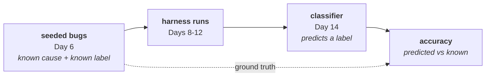
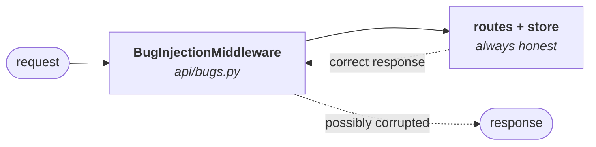

# Day 6 Checklist — Seeded bugs, and freezing the service

**Goal for today:** give the service the ability to **misbehave on demand**, in
six specific, labelled ways — then **freeze it**. After today the API stops
changing and the harness becomes the whole job.

**Time:** ~3 hours.
**Prerequisite:** Day 5 complete (49 tests, contract pinned).

> **Formatting note:** every code block starts at the left margin so it
> copy-pastes cleanly.

---

## Progress log (updated as we go)

**Status: not started.**

---

## Read this first — Background primer

### 1. Why a working API needs to be able to break

Everything you've built so far is *correct*. That's a problem.

On Day 14 you'll build a classifier that labels every failure as a service bug, a
test bug, a flake, or an environment problem — and you'll report its **accuracy**.
Accuracy against what? You can only measure a classifier if you already know the
right answer for each case. That known-right-answer set is called **ground
truth**.

A service that never misbehaves gives you nothing to classify. So today you build
a switch that makes it misbehave in ways *you chose and labelled in advance*.

This is exactly what project 1 did. The modem simulator had a fault-injection
mode — delay, malformed reply, dropout, wrong-state response — and that's what
let you report **100% fault-classification accuracy** rather than "it seems to
work." Same move, different protocol.



Without the dotted line, there is no number at the end — only a claim.

---

### 2. Where the bugs live, and why it matters

The obvious way to seed a bug is to edit a handler:

```python
def get_device(device_id: int) -> Device:
    device = store.get_device(device_id)
    if BUG_MODE == "missing_field":        # DON'T DO THIS
        return {"id": device.id, "status": device.status}
    ...
```

Do that six times and you have a codebase nobody can read, where the honest
behaviour and the fake behaviour are tangled together. Worse, you can no longer
answer "is this API correct?" by reading it.

Instead, all six bugs live in **one file** (`api/bugs.py`) as a **middleware**: a
layer that sits between the framework and the network and can rewrite responses
on the way out.



Four things this buys you, and they're all worth saying out loud:

1. **The honest code stays honest.** `main.py` and `store.py` are unchanged. You
   can read them and know what the service is *supposed* to do.
2. **Every defect is enumerable.** One file lists all six, each with its true
   label. That list *is* the ground truth the Day 14 selfcheck iterates over.
3. **Turning bugs on is configuration, not a code change.** No rebuild, no edit,
   no risk of leaving one switched on by accident.
4. **It mirrors the real world.** Response corruption genuinely does happen in
   middleware, proxies, and serialization layers — not usually in business logic.

This is the same separation project 1 used: `simulator/faults.py` held the fault
modes, and the AT command handlers stayed clean.

---

### 3. What a middleware is

A **middleware** wraps your whole application. Every request passes through it on
the way in, and every response on the way out. It can inspect, modify, or replace
either.

```python
async def dispatch(self, request, call_next):
    # ... anything you want to do BEFORE the app handles it
    response = await call_next(request)   # run the actual application
    # ... anything you want to do AFTER, including rewriting the response
    return response
```

Middleware is how logging, authentication, CORS, compression, and request-timing
are normally implemented — anything that applies to *every* request rather than
one endpoint.

**One mechanical detail you must get right.** If you change a response body, its
length changes — so the `Content-Length` header is now a lie. HTTP clients trust
that header: too large and the client hangs waiting for bytes that never come,
too small and the body gets truncated. You'll delete the header and let the
framework recompute it.

That's a genuine protocol bug in waiting, and worth remembering: **when you
rewrite a body, you invalidate the headers that describe it.**

---

### 4. The six bugs, and their labels

| Mode | What it does | Endpoint | Violation type | True label |
|---|---|---|---|---|
| `none` | nothing — healthy baseline | — | — | — |
| `missing_field` | drops `name` from the response | `GET /devices/{id}` | schema: required field absent | service bug |
| `wrong_type` | returns `"1"` instead of `1` | `GET /devices/{id}` | schema: wrong type | service bug |
| `bad_enum` | returns `status: "exploded"` | `GET /devices/{id}` | schema: value outside enum | service bug |
| `wrong_status` | returns 200 where 201 is declared | `POST /devices` | undeclared status code | service bug |
| `undeclared_500` | returns 500 on a valid request | `GET /devices/{id}` | undeclared status code | service bug |
| `off_by_one_page` | returns `limit + 1` items | `GET /devices` | **semantic**, not schema | service bug |

**Notice the last column of the "Violation type" — that's today's subtle idea.**

Four of these break the **schema**: a field is missing, a type is wrong, a value
is outside an enum. A validator that checks responses against JSON Schema will
catch all of them automatically.

Two break the **declared status codes**: the spec says `POST /devices` answers
201, 409, or 422 — a 200 is not on that list, and neither is a 500 anywhere.
Caught by the "was this status declared?" check.

But `off_by_one_page` breaks **neither**. The schema for `DevicePage` says
`items` is a list of `Device` — it says nothing about *how many*. Returning four
items when you asked for three is perfectly valid JSON, perfectly schema-valid,
and completely wrong.

> **Not every contract violation is a schema violation.**

That single sentence is why this project needs *two* checking mechanisms:

- **Schema validation** (Days 8–9) — automatic, general, catches structural
  breakage across every endpoint at once.
- **Declarative test cases** (Day 9) — hand-written assertions about *meaning*,
  like "the number of items must not exceed `limit`."

A candidate who only built schema validation would miss this entire class of bug
and, more importantly, wouldn't know they were missing it. `off_by_one_page`
exists in this list specifically to force the second mechanism to exist.

---

### 5. The bugs must NOT change the contract

Here's a trap it would be easy to walk into.

You might think to expose an endpoint like `POST /admin/bug-mode` to flip modes at
runtime. Convenient — and it would quietly wreck the project.

That endpoint would appear in the generated spec. The pinned contract would have
to change. Your harness would then be testing a service whose published interface
includes a control panel for its own bugs, and the Day 5 drift check would demand
you re-pin.

So the mode is set by an **environment variable**, read at startup, plus a plain
Python setter that tests can call. Nothing about it appears over HTTP.

The invariant to hold onto:

> **Turning a bug on changes the service's behaviour. It must never change the
> service's contract.**

That's what makes the violation *detectable* — the promise stays fixed while the
behaviour deviates from it. If the contract moved too, there'd be nothing to
detect. You'll verify this explicitly: the drift check must still pass with every
bug mode active.

---

### 6. Freezing the service under test

Today's last act is a **freeze**. From tomorrow, `api/` changes only if a bug mode
needs fixing.

Project 1 froze the simulator on its Day 6 for the same reason, and the plan's
guardrail 1 says it plainly: *the service under test is scaffolding, not the
product.* Every hour spent adding endpoints is an hour stolen from the harness —
which is the part that actually demonstrates the skill you're hiring yourself out
for.

If you find yourself wanting a `PATCH /devices/{id}` or a `?sort=` parameter next
week: write it in the plan's stretch list and move on.

---

## Part A — The bug-injection layer

**1. Create `api/bugs.py`.**

- [ ] Create the file:

```python
"""
Seeded bug modes -- deliberate, labelled defects in the service under test.

WHY THIS FILE EXISTS

The Day 14 classifier reports an ACCURACY figure. An accuracy figure requires
knowing the right answer in advance for every case -- ground truth. A service
that is always correct provides none, so this module makes the service
misbehave in six specific ways that we chose and labelled ahead of time.

This is the direct analogue of simulator/faults.py in the modem project, which
is what made "100% fault-classification accuracy" a measurement rather than a
claim.

WHY THE BUGS LIVE HERE AND NOT IN THE HANDLERS

Scattering `if BUG_MODE == ...` through main.py would tangle the honest
behaviour with the fake behaviour, so nobody could read the service and tell
what it is supposed to do. Keeping every defect in one middleware means:

  * main.py and store.py stay correct and readable;
  * the full list of defects is enumerable in one place -- and that list IS the
    ground truth the Day 14 selfcheck iterates over;
  * enabling a bug is configuration, not a code change;
  * it mirrors reality, where response corruption really does happen in
    middleware and serialization layers rather than in business logic.

WHAT MUST NOT HAPPEN

Turning a bug on changes the service's BEHAVIOUR. It must never change the
service's CONTRACT. That is what makes a violation detectable: the promise stays
fixed while the behaviour deviates from it. Hence no HTTP control endpoint --
that would appear in the generated spec, force a re-pin, and put a control panel
for the bugs into the published interface.
"""

import json
import os
import re
from enum import Enum

from starlette.middleware.base import BaseHTTPMiddleware
from starlette.responses import JSONResponse, Response

# Matches /devices/1 but deliberately NOT /devices/search -- \d+ only.
_DEVICE_DETAIL = re.compile(r"^/devices/\d+$")

ENV_VAR = "BUG_MODE"


class BugMode(str, Enum):
    """
    Every defect this service can be asked to exhibit.

    Inheriting from `str` means the values compare equal to plain strings, so an
    environment variable can be turned into a member directly.

    Each member's true category is `service_bug` -- the service violated its own
    published contract. The other three categories the Day 14 classifier must
    distinguish are seeded elsewhere on purpose: TEST bugs in the test plans
    (Day 9), FLAKES as probabilistic behaviour (Day 12), and ENVIRONMENT
    failures by the proxy (Day 11). Four categories, four different injection
    sites -- that separation is what makes the accuracy number mean something.
    """

    NONE = "none"
    MISSING_FIELD = "missing_field"
    WRONG_TYPE = "wrong_type"
    BAD_ENUM = "bad_enum"
    WRONG_STATUS = "wrong_status"
    UNDECLARED_500 = "undeclared_500"
    OFF_BY_ONE_PAGE = "off_by_one_page"


# The ground-truth table. The Day 14 selfcheck iterates over this, so a new bug
# mode becomes part of the measured set simply by being added here.
TRUE_LABEL: dict[BugMode, str] = {
    BugMode.MISSING_FIELD: "service_bug",
    BugMode.WRONG_TYPE: "service_bug",
    BugMode.BAD_ENUM: "service_bug",
    BugMode.WRONG_STATUS: "service_bug",
    BugMode.UNDECLARED_500: "service_bug",
    BugMode.OFF_BY_ONE_PAGE: "service_bug",
}


# Module-level state, initialised from the environment at import time.
_mode: BugMode = BugMode.NONE


def load_mode_from_env() -> BugMode:
    """
    Read BUG_MODE from the environment, defaulting to a healthy service.

    An unrecognised value fails loudly rather than silently running healthy. A
    typo'd mode name that quietly produced a clean run would make the Day 14
    accuracy figure wrong in the most dangerous direction: too good.
    """
    raw = os.environ.get(ENV_VAR, BugMode.NONE.value).strip().lower()
    try:
        return BugMode(raw)
    except ValueError as exc:
        valid = ", ".join(m.value for m in BugMode)
        raise ValueError(
            f"Unknown {ENV_VAR}={raw!r}. Valid modes: {valid}"
        ) from exc


def current_mode() -> BugMode:
    """The mode currently in force."""
    return _mode


def set_mode(mode: BugMode) -> None:
    """
    Change the active mode.

    Exists for tests, and deliberately NOT exposed over HTTP -- see the module
    docstring. Tests must reset this between cases or one test's bug leaks into
    the next, which is textbook test-order dependence.
    """
    global _mode
    _mode = mode


def _is_device_detail(path: str) -> bool:
    return bool(_DEVICE_DETAIL.match(path))


def _corrupt(
    mode: BugMode, method: str, path: str, payload: object, status_code: int
) -> tuple[object, int]:
    """
    Apply one seeded defect to an otherwise-correct response.

    Each branch targets ONE endpoint and produces ONE kind of violation, so that
    when the classifier sees a failure there is exactly one right answer for
    what went wrong. Overlapping defects would make the accuracy figure
    ambiguous.
    """
    if mode is BugMode.MISSING_FIELD:
        # Schema violation: `name` is in the spec's `required` list.
        if method == "GET" and _is_device_detail(path) and status_code == 200:
            payload.pop("name", None)

    elif mode is BugMode.WRONG_TYPE:
        # Schema violation: the spec declares `id` as an integer.
        if method == "GET" and _is_device_detail(path) and status_code == 200:
            payload["id"] = str(payload["id"])

    elif mode is BugMode.BAD_ENUM:
        # Schema violation: not one of online / offline / degraded.
        if method == "GET" and _is_device_detail(path) and status_code == 200:
            payload["status"] = "exploded"

    elif mode is BugMode.WRONG_STATUS:
        # Undeclared status: POST /devices declares 201, 409, 422 -- not 200.
        if method == "POST" and path == "/devices" and status_code == 201:
            status_code = 200

    elif mode is BugMode.OFF_BY_ONE_PAGE:
        # SEMANTIC violation, and the interesting one. The schema says `items`
        # is a list of Device; it says nothing about how many. Returning one
        # item too many is valid JSON, schema-valid, and wrong. No schema
        # validator can catch this -- it needs a hand-written assertion that
        # len(items) <= limit (Day 9). Not every contract violation is a schema
        # violation, and this mode exists to force that lesson.
        if method == "GET" and path == "/devices" and status_code == 200:
            items = payload.get("items", [])
            if items:
                payload["items"] = items + [items[-1]]

    return payload, status_code


class BugInjectionMiddleware(BaseHTTPMiddleware):
    """
    Rewrites outgoing responses according to the active bug mode.

    A middleware wraps the whole application: every request passes through on
    the way in and every response on the way out. That is why one file can
    corrupt any endpoint without any endpoint knowing about it.
    """

    async def dispatch(self, request, call_next) -> Response:
        mode = current_mode()

        # Fast path: a healthy service does no extra work at all.
        if mode is BugMode.NONE:
            return await call_next(request)

        # undeclared_500 short-circuits: the handler never runs, because we are
        # simulating the service falling over rather than answering wrongly.
        if (
            mode is BugMode.UNDECLARED_500
            and request.method == "GET"
            and _is_device_detail(request.url.path)
        ):
            return JSONResponse(
                status_code=500,
                content={
                    "error": {
                        "code": "internal_error",
                        "message": "seeded fault: undeclared_500",
                    }
                },
            )

        response = await call_next(request)

        # The response body arrives as a stream of chunks, so it has to be
        # collected before it can be inspected or changed.
        raw = b""
        async for chunk in response.body_iterator:
            raw += chunk

        content_type = response.headers.get("content-type", "")
        headers = dict(response.headers)

        # Leave anything that is not JSON strictly alone -- notably the 204 from
        # DELETE, which must stay empty.
        if "application/json" not in content_type or not raw:
            headers.pop("content-length", None)
            return Response(
                content=raw,
                status_code=response.status_code,
                headers=headers,
                media_type=response.media_type,
            )

        payload = json.loads(raw)
        payload, status_code = _corrupt(
            mode, request.method, request.url.path, payload, response.status_code
        )
        body = json.dumps(payload).encode("utf-8")

        # Content-Length described the ORIGINAL body and is now wrong. A stale
        # value is a real protocol bug: too large and the client hangs waiting
        # for bytes that never arrive, too small and the body is truncated.
        # Dropping it lets the framework recompute it.
        headers.pop("content-length", None)

        return Response(
            content=body,
            status_code=status_code,
            headers=headers,
            media_type="application/json",
        )
```

**2. Wire it into `api/main.py`.**

- [ ] Add the import next to the other `api` imports:

```python
from api.bugs import BugInjectionMiddleware, load_mode_from_env, set_mode
```

- [ ] Add these two lines immediately **after** the
      `register_error_handlers(app)` line:

```python
# Seeded bug modes (Day 6). Reading the env var here means an invalid value
# fails at startup rather than silently running a healthy service -- a typo that
# quietly produced clean results would make the Day 14 accuracy figure wrong in
# the most dangerous direction: too good.
set_mode(load_mode_from_env())
app.add_middleware(BugInjectionMiddleware)
```

**3. Confirm the contract did not move.**

- [ ] Run:

```bash
pytest test_spec_drift.py -q
```

✅ *Worked when:* both drift tests pass, with **no re-export needed**.

**This is the invariant from primer §5, verified.** Adding a middleware changed
the service's behaviour capability without touching its published interface. If
this had failed, the design would be wrong — you'd be moving the goalposts along
with the ball.

---

## Part B — Watch each bug break the contract

**4. Start the healthy service in one terminal.**

- [ ] Run:

```bash
uvicorn api.main:app --reload
curl -s http://127.0.0.1:8000/devices/1
```

✅ *Worked when:* `{"id":1,"name":"edge-router-01","status":"online"}` — clean.

- [ ] Stop it with `Ctrl+C`.

**5. Now run each bug mode and see the damage.**

Each command below starts the server with one mode active. Run it, curl, then
`Ctrl+C` before the next.

- [ ] `missing_field`:

```bash
BUG_MODE=missing_field uvicorn api.main:app
```

```bash
curl -s http://127.0.0.1:8000/devices/1
```

✅ Expect `{"id":1,"status":"online"}` — `name` is gone, and the spec lists it as
required.

- [ ] `wrong_type`:

```bash
BUG_MODE=wrong_type uvicorn api.main:app
```

```bash
curl -s http://127.0.0.1:8000/devices/1
```

✅ Expect `{"id":"1",...}` — note the quotes. The spec says integer.

- [ ] `bad_enum`:

```bash
BUG_MODE=bad_enum uvicorn api.main:app
```

```bash
curl -s http://127.0.0.1:8000/devices/1
```

✅ Expect `"status":"exploded"` — not one of the three declared values.

- [ ] `wrong_status`:

```bash
BUG_MODE=wrong_status uvicorn api.main:app
```

```bash
curl -i -s -X POST http://127.0.0.1:8000/devices \
  -H "Content-Type: application/json" -d '{"name":"new-device"}'
```

✅ Expect `HTTP/1.1 200 OK`. The spec declares 201, 409, 422 for this endpoint —
200 is not among them.

- [ ] `undeclared_500`:

```bash
BUG_MODE=undeclared_500 uvicorn api.main:app
```

```bash
curl -i -s http://127.0.0.1:8000/devices/1
```

✅ Expect `HTTP/1.1 500`. No endpoint declares a 500 anywhere.

- [ ] `off_by_one_page` — **look closely at this one**:

```bash
BUG_MODE=off_by_one_page uvicorn api.main:app
```

```bash
curl -s "http://127.0.0.1:8000/devices?limit=2&offset=0"
```

✅ Expect **three** items despite `"limit":2`.

Now read that JSON as a validator would. Every field is present. Every type is
right. Every enum value is legal. `items` is a list of `Device`, exactly as the
schema requires. **A schema validator sees nothing wrong.**

That's the point of this mode, and it's why Day 9 adds hand-written declarative
assertions on top of schema validation. *Not every contract violation is a schema
violation.*

- [ ] Confirm a bad mode name fails loudly:

```bash
BUG_MODE=typo uvicorn api.main:app
```

✅ Expect a startup crash naming the valid modes. Failing loudly matters: a
silently-ignored typo would run a healthy service while you believed a bug was
active, and your accuracy figure would come out *too good*.

---

## Part C — Tests

**6. Create `test_bugs.py` in the repo root.**

- [ ] Create the file:

```python
"""
Tests for the seeded bug modes.

Two jobs:

  1. Every mode produces the violation it claims to. If a seeded bug did not
     actually break anything, the Day 14 accuracy figure would be measured
     against fiction.
  2. Turning bugs on never changes the CONTRACT -- only the behaviour. That
     invariant is what makes the violations detectable at all.
"""

import pytest
from fastapi.testclient import TestClient

from api import store
from api.bugs import BugMode, current_mode, set_mode
from api.main import app

client = TestClient(app)


@pytest.fixture(autouse=True)
def clean_slate():
    """
    Reset store AND bug mode around every test.

    The mode reset is the important half: without it, one test's seeded bug
    leaks into every test that runs afterwards -- textbook test-order
    dependence, and a bug in the tool built to detect exactly that.

    Resetting AFTER as well as before (via yield) means a test that fails
    partway through still cannot poison its neighbours.
    """
    store.reset()
    set_mode(BugMode.NONE)
    yield
    store.reset()
    set_mode(BugMode.NONE)


def test_default_mode_is_healthy():
    assert current_mode() is BugMode.NONE


def test_healthy_mode_returns_a_complete_device():
    """The baseline every other test in this file is measured against."""
    body = client.get("/devices/1").json()
    assert body == {"id": 1, "name": "edge-router-01", "status": "online"}


def test_missing_field_drops_a_required_field():
    """`name` is in the spec's `required` list, so its absence is a violation."""
    set_mode(BugMode.MISSING_FIELD)
    body = client.get("/devices/1").json()
    assert "name" not in body
    assert body["id"] == 1


def test_wrong_type_returns_a_string_id():
    """The spec declares `id` as an integer."""
    set_mode(BugMode.WRONG_TYPE)
    body = client.get("/devices/1").json()
    assert body["id"] == "1"
    assert isinstance(body["id"], str)


def test_bad_enum_returns_an_undeclared_status_value():
    """Not one of online / offline / degraded."""
    set_mode(BugMode.BAD_ENUM)
    body = client.get("/devices/1").json()
    assert body["status"] == "exploded"


def test_wrong_status_returns_200_instead_of_201():
    """POST /devices declares 201, 409, 422. A 200 is undeclared."""
    set_mode(BugMode.WRONG_STATUS)
    response = client.post("/devices", json={"name": "new-device"})
    assert response.status_code == 200


def test_undeclared_500_returns_a_status_no_endpoint_declares():
    set_mode(BugMode.UNDECLARED_500)
    assert client.get("/devices/1").status_code == 500


def test_off_by_one_page_returns_one_item_too_many():
    """
    The semantic violation.

    Note what this test has to assert on: a COUNT, compared against the request.
    There is no field to check and no type to compare -- the schema is entirely
    satisfied. This is the concrete reason the harness needs declarative test
    cases (Day 9) in addition to schema validation (Day 8).
    """
    set_mode(BugMode.OFF_BY_ONE_PAGE)
    body = client.get("/devices?limit=2&offset=0").json()
    assert len(body["items"]) == 3
    assert body["limit"] == 2


def test_off_by_one_page_still_satisfies_the_declared_schema():
    """
    Proves the point above rather than merely asserting it.

    Every item still has every required field with the right type, so a pure
    schema check passes while the response is plainly wrong.
    """
    set_mode(BugMode.OFF_BY_ONE_PAGE)
    body = client.get("/devices?limit=2&offset=0").json()

    assert set(body) == {"items", "total", "limit", "offset"}
    for item in body["items"]:
        assert set(item) == {"id", "name", "status"}
        assert isinstance(item["id"], int)
        assert isinstance(item["name"], str)
        assert item["status"] in {"online", "offline", "degraded"}


def test_bugs_target_only_their_own_endpoint():
    """
    A mode aimed at /devices/{id} must leave /health alone.

    Overlapping blast radii would make the Day 14 accuracy figure ambiguous:
    a failure could have more than one correct explanation.
    """
    set_mode(BugMode.MISSING_FIELD)
    assert client.get("/health").json() == {"status": "ok"}
    assert len(client.get("/devices").json()["items"]) == 3


def test_delete_still_returns_an_empty_204_under_a_bug_mode():
    """
    The middleware must not put a body on a 204.

    It rebuilds every response, so a careless implementation would serialize
    something into the empty one and commit a protocol violation we never asked
    for -- an unlabelled defect, which is worse than a labelled one.
    """
    set_mode(BugMode.MISSING_FIELD)
    response = client.delete("/devices/1")
    assert response.status_code == 204
    assert response.content == b""


@pytest.mark.parametrize("mode", list(BugMode))
def test_no_bug_mode_changes_the_published_contract(mode):
    """
    THE INVARIANT: bugs change behaviour, never the contract.

    If enabling a bug also moved the spec, the violation would be undetectable —
    the promise would have moved along with the behaviour. Parametrized over
    every mode so a future one cannot break this silently.
    """
    set_mode(BugMode.NONE)
    clean = client.get("/openapi.json").json()

    set_mode(mode)
    assert client.get("/openapi.json").json() == clean


def test_unknown_mode_name_is_rejected():
    """
    A typo must fail loudly.

    Silently defaulting to healthy would mean running a clean service while
    believing a bug was active -- and the Day 14 accuracy figure would come out
    too good, which is the most dangerous direction for a number to be wrong in.
    """
    import os

    from api.bugs import ENV_VAR, load_mode_from_env

    original = os.environ.get(ENV_VAR)
    os.environ[ENV_VAR] = "definitely-not-a-mode"
    try:
        with pytest.raises(ValueError, match="Unknown BUG_MODE"):
            load_mode_from_env()
    finally:
        if original is None:
            os.environ.pop(ENV_VAR, None)
        else:
            os.environ[ENV_VAR] = original
```

**7. Run the suite.**

- [ ] Run:

```bash
pytest -q
```

✅ *Worked when:* **68 tests pass** — 49 from Day 5 plus 19 new (the contract
invariant is parametrized over all 7 modes, so it counts as 7).

*If the older tests fail*, a bug mode leaked between tests. Check that the
`clean_slate` fixture in `test_bugs.py` has `autouse=True` and resets on both
sides of the `yield`.

---

## Part D — Document and freeze

**8. Add the bug-mode matrix to `README.md`.**

- [ ] Append to `README.md`:

```markdown
## Seeded bug modes

The service can be asked to misbehave in six specific, labelled ways. This is
what makes the harness's fault-classification accuracy a *measurement* rather
than a claim — every injected defect has a known true cause.

Set with the `BUG_MODE` environment variable:

```bash
BUG_MODE=missing_field uvicorn api.main:app
```

| Mode | Endpoint | What breaks | Detected by | True label |
|---|---|---|---|---|
| `none` | — | nothing (healthy baseline) | — | — |
| `missing_field` | `GET /devices/{id}` | required field `name` absent | schema validation | service bug |
| `wrong_type` | `GET /devices/{id}` | `id` returned as a string | schema validation | service bug |
| `bad_enum` | `GET /devices/{id}` | `status` outside the declared enum | schema validation | service bug |
| `wrong_status` | `POST /devices` | 200 returned where 201 is declared | status-code check | service bug |
| `undeclared_500` | `GET /devices/{id}` | 500 on a valid request | status-code check | service bug |
| `off_by_one_page` | `GET /devices` | `limit + 1` items returned | **declarative assertion** | service bug |

`off_by_one_page` is deliberate: it satisfies the schema completely — right
fields, right types, legal enum values — while being plainly wrong. Not every
contract violation is a schema violation, which is why the harness pairs
automatic schema checking with hand-written assertions about meaning.

All defects live in a single middleware (`api/bugs.py`); the route handlers and
store remain honest. Enabling a bug changes the service's **behaviour** and never
its **contract** — `spec/openapi.json` is byte-identical under every mode, which
is what makes the violations detectable.
```

**9. Freeze the service under test.**

- [ ] Add this to the top of `api/__init__.py`, replacing the existing docstring:

```python
"""
The service under test: a small REST device-registry API.

FROZEN as of Day 6. From here the harness is the product; this package changes
only to fix a bug mode, never to add features. Every hour spent making this API
"better" is an hour stolen from the part of the project that demonstrates the
actual skill.

Contents:
    models.py  -- Pydantic models; the shapes that become the contract
    store.py   -- in-memory data + the status state machine
    errors.py  -- one declared error envelope for every failure
    bugs.py    -- six labelled, deliberately seeded defects
    main.py    -- the FastAPI app and its eight endpoints

Final surface: 8 endpoints, 6 seeded bug modes, contract pinned at
spec/openapi.json.
"""
```

**10. Update the plan's status.**

- [ ] In `docs/PROJECT_PLAN.md` §5, mark Phase 1 (Days 3–6) complete. Phase 2
      starts tomorrow.

---

## Part E — Compose, commit, push

**11. Confirm the containerized stack still works.**

- [ ] Run:

```bash
docker compose up --build
docker compose down
```

✅ *Worked when:* `SUCCESS: harness -> proxy -> api path is working`. No bug mode
is set in Compose, so the service runs healthy — which is the correct default.

**12. Commit and push.**

- [ ] Run:

```bash
git status --short
git add .
git commit -m "Day 6: six seeded bug modes in one middleware; service under test frozen"
git push
```

- [ ] Confirm CI goes green.

---

## Part F — Wrap up

**13. Update this checklist.**

- [ ] Tick the boxes and record anything that differed in the progress log.

**14. Review.**

- [ ] Read the Day 6 section of `LEARNING_NOTES.md` and try the flashcards aloud.
      The one to be fluent on is *why ground truth is required to report an
      accuracy figure* — it's the argument that makes the whole project's
      headline number credible.

**15. Look ahead.**

- [ ] Skim `PROJECT_PLAN.md` Phase 2. **Tomorrow the harness begins**: a
      `Transport` interface, a pytest fixture that drives real HTTP, and the
      first request checked against the pinned contract. Everything so far has
      been building the thing to be tested; from here you build the thing that
      does the testing.

---

## If something breaks

| Symptom | Cause and fix |
|---|---|
| `ImportError: cannot import name 'BugInjectionMiddleware'` | `api/bugs.py` is empty or partially pasted. `grep -c "^class" api/bugs.py` should print 2. |
| Drift check fails after adding the middleware | Something in the change touched the routes or models. Middleware alone cannot alter the spec — `git diff api/main.py` and look for an accidental edit. |
| Every test fails after adding `test_bugs.py` | A mode leaked. Confirm `clean_slate` has `autouse=True` and resets on both sides of `yield`. |
| A bug mode has no visible effect | The path guard didn't match. `missing_field`/`wrong_type`/`bad_enum` target `/devices/<number>` only — `/devices/search` and `/devices` are excluded by design. |
| Client hangs or truncates a response under a bug mode | `content-length` wasn't removed after rewriting the body. |
| `RuntimeError` about the response body already consumed | The `body_iterator` was read twice. Collect it into `raw` once and use that. |
| DELETE returns 204 with a body | The non-JSON early return is missing, so the middleware serialized an empty body into `null`. |
| `BUG_MODE=typo` starts normally instead of crashing | `set_mode(load_mode_from_env())` isn't being called in `main.py`. |

---

*When 68 tests pass, all six modes visibly break the contract, `spec/openapi.json`
is byte-identical under every one of them, and `api/` is frozen — Day 6 is done,
and Phase 1 with it. You now have a service worth testing and a documented set of
right answers to measure against. Tomorrow you start building the thing that
finds them.*
