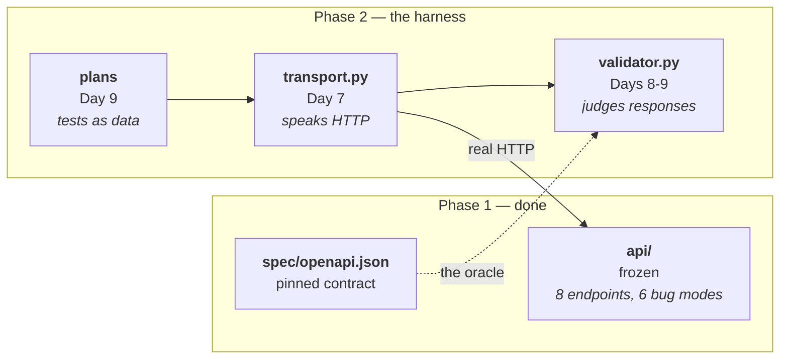

# Day 7 Checklist — The harness begins: a Transport interface

**Goal for today:** the first piece of the actual product. A `Transport`
abstraction that drives **real HTTP** against a **real running service**, a
config object, a loader for the pinned contract — and a test proving the boundary
between harness and service is real, not just intended.

Phase 2 starts here. From now on, the harness is the job.

**Time:** ~3–4 hours.
**Prerequisite:** Day 6 complete (68 tests, service frozen, contract pinned).

> **Formatting note:** every code block starts at the left margin so it
> copy-pastes cleanly.

---

## Progress log (updated as we go)

**Status: ✅ DAY 7 COMPLETE.** Pushed, CI green.

**Done-when gate met:** 85 tests passing; the harness drives real HTTP over a
real socket to a separately running process; the boundary test was watched
failing and recovering; the suite ran green against a server started by hand on
port 9001 via `HARNESS_BASE_URL`.

**The abstraction is now in place.** `build_transport()` is the only function in
the harness that names a concrete implementation. If a second one ever appears,
the abstraction has started leaking — that is the thing to watch for on Day 11.

**Real bug avoided by running the code:** httpx reads `HTTP_PROXY` /
`HTTPS_PROXY` / `ALL_PROXY` from the environment by default. On a machine with
`ALL_PROXY` set it failed with a confusing SOCKS import error rather than an
obvious one. Fixed with `trust_env=False` — the harness controls its own routing,
which matters twice over given that we run our own proxy from Day 11.

**Known limitation, named rather than discovered later:** `live_server` runs the
same `app` object in a background thread of the same Python process that
`test_api.py` drives via `TestClient`, so both share the module-level store. Safe
today (the in-process suite resets before each test; the harness tests read or
create without asserting on totals) but it is genuine shared state. Under
`docker compose` the service is a separate process and no sharing exists.

---

## Read this first — Background primer

### 1. Where this fits

Everything so far built the thing to be tested. Today you start building the
thing that does the testing.



Today is only the leftmost box of Phase 2. But it's the box that determines
whether the rest is easy or painful — the same way project 1's Day 8 `Transport`
decision was what later made a real serial modem a one-class addition instead of
a rewrite.

---

### 2. Dependency inversion, restated for HTTP

Project 1's single most important design decision was building the harness
against a `Transport` interface rather than a raw socket. `TcpTransport` talked
to the simulator; `SerialTransport` talked to a real modem over `/dev/ttyUSB0`.
The harness never knew which.

Same move here, and the payoff is the same shape:

| Project 1 | Project 2 |
|---|---|
| `TcpTransport` → simulator | `DirectTransport` → the API |
| `SerialTransport` → real modem | `ProxyTransport` → through the fault proxy (Day 11) |
| Harness code identical either way | Harness code identical either way |

The principle is **dependency inversion**: high-level code (the harness) depends
on an *abstraction* (`Transport`), not on a concrete detail (httpx, a socket, a
serial port). Concrete implementations depend on the abstraction too. Nothing
important depends on anything replaceable.

The practical test of whether you got it right: *can you swap the implementation
without touching a single line of the code above it?* On Day 11 you'll add fault
injection to the network path and the validator, the runner, and the test plans
will not change at all. If they do, the abstraction was wrong.

**One deliberate choice worth noticing.** The interface returns *our own*
`HttpResponse` type, not httpx's. If the interface handed back httpx objects,
every layer above would depend on httpx — and swapping the client library would
ripple through the whole harness. A small type of our own keeps the abstraction
honest. This is also why `HttpResponse` carries `elapsed_ms`: timing is data the
classifier and the flake detector need, so it belongs in the return value rather
than being measured ad hoc by callers.

---

### 3. Why the harness must not import the app

This is the rule that makes today's work meaningful, and it's easy to violate by
accident because importing would be *so much simpler*.

`test_api.py` uses `TestClient`, which drives the app in-process. Fast,
deterministic, and it answers *"is my application logic correct?"*

The harness must do the opposite: **real HTTP, over a real socket, to a
separately running process.** It answers a different question — *"does the
deployed service honour its contract?"* — and that question is unanswerable
in-process, because in-process testing cannot see:

- serialization over the wire (the `Content-Length` bug from Day 6 is invisible
  to `TestClient`)
- connection handling, timeouts, dropped connections
- anything a proxy does in between
- whether the service even starts

So `harness/` never imports `api`. Not once. You'll enforce that with a test that
reads the source and fails if the import appears — because a rule nobody checks
is a rule that erodes.

**The nuance that trips people up:** `conftest.py` *does* import the app, to boot
a server for local convenience. Isn't that cheating?

No, and the distinction is worth being precise about:

| | Imports `api` | Why |
|---|---|---|
| `harness/` — the product | **Never** | It must work against any deployment, including one it didn't start |
| `conftest.py` — test scaffolding | Yes | Convenience: `pytest` should work with one command, no manual setup |

The proof that the boundary is real: set `HARNESS_BASE_URL` and the harness runs
against a service in a container, on another machine, or in production — with no
code change. The fixture is a convenience for local runs, not a dependency.

---

### 4. pytest fixtures and scope

You've used one fixture already (`fresh_store`, `autouse=True`). Today
introduces **scope**, which decides how often a fixture runs.

| Scope | Created | Use for |
|---|---|---|
| `function` (default) | Once per test | Cheap setup; anything that must be pristine per test |
| `module` | Once per file | Moderately expensive shared setup |
| `session` | Once per `pytest` run | Expensive things: a server, a container, a DB |

Starting a web server takes ~100ms. Doing that 40 times would add four seconds
for no benefit, so the server is `session`-scoped: started once, shared by every
test, shut down at the end.

**The tradeoff you're accepting, stated honestly:** shared state between tests is
exactly what causes test-order dependence. Here it's safe because the server is
*stateless with respect to the tests* — the harness only reads. When Day 9 adds
cases that create and delete devices, they'll have to reset state themselves,
and that will be a deliberate decision rather than an accident.

**`yield` fixtures** run teardown after the `yield`:

```python
@pytest.fixture(scope="session")
def live_server():
    server = start_it()
    yield server          # tests run here
    server.stop()         # teardown, guaranteed even if tests fail
```

---

### 5. Two mechanical details that matter more than they look

**A. The transport must not raise on 4xx or 5xx.**

Some HTTP clients raise on error statuses. That would be catastrophic here: a 404
is *data* the harness needs to examine, not an exception to escape from. Half the
contract is about error responses — Day 4 existed to make them checkable. httpx
returns them as ordinary responses by default, which is the behaviour we want,
and there's a test pinning it so nobody later adds a `raise_for_status()` in a
tidying-up mood.

**B. `trust_env=False` — a real bug avoided.**

By default httpx reads `HTTP_PROXY`, `HTTPS_PROXY`, and `ALL_PROXY` from the
environment and silently routes through whatever it finds. On a machine with
those set, your harness would send traffic somewhere you didn't choose.

Two reasons that's unacceptable here:

1. **Hermeticity.** Results would depend on developer environment variables —
   the same non-hermetic failure as Day 1's `requirements.txt`, dressed
   differently.
2. **You are building your own proxy on Day 11.** Having httpx quietly route
   through a *different* proxy while you debug fault injection is a genuinely
   nasty afternoon.

So the client is constructed with `trust_env=False`: this harness controls its
own routing, always. *(This one wasn't theoretical — it surfaced while testing
this day's code on a machine that had `ALL_PROXY` set, and it failed with a
confusing SOCKS error rather than an obvious one.)*

---

### 6. The contract is read from disk

`harness/spec.py` loads `spec/openapi.json` from the **file**, never from
`GET /openapi.json` on the running service.

That's the Day 5 argument made concrete. Reading it live would restore the
tautology: the service would be graded against a description of itself. Reading
the committed file means the contract can only change when a human commits a
change to it.

It has a practical benefit too — the contract can be loaded with the service
down, so a test that says "the contract declares X" needs no server at all.

---

## Part A — The harness package

**1. Create the package.**

- [x] Run:

```bash
mkdir -p harness
```

- [x] Create `harness/__init__.py`:

```python
"""
The contract-conformance and flaky-test-detection harness.

This package NEVER imports `api`. It drives the service over real HTTP against a
base URL it is given, so it works identically against a local process, a
container, or a remote deployment. An architecture test enforces the rule, since
a boundary nobody checks is a boundary that erodes.
"""
```

**2. Create `harness/config.py`.**

- [x] Create the file:

```python
"""
Harness configuration.

One immutable object carrying everything the harness needs to know about the
run, built either explicitly (tests) or from the environment (containers, CI).

Every knob lives here rather than being read from os.environ at the point of use.
That matters for a specific reason: the run summary (Day 9) prints this object,
so any run can be reproduced exactly from its own report. Configuration scattered
through the code cannot be reported, and a result you cannot reproduce is an
anecdote.
"""

import os
from dataclasses import dataclass

DEFAULT_TIMEOUT_MS = 5_000
DEFAULT_SEED = 1_234


@dataclass(frozen=True)
class HarnessConfig:
    """
    Settings for one harness run.

    Frozen (immutable) on purpose: a run's configuration must not change halfway
    through, or the summary would describe something that never happened.

    base_url:
        Where the service under test lives. The harness has no opinion about
        what is behind it -- a local uvicorn, a container, a remote deployment.
        That indifference IS the Transport abstraction paying off.
    timeout_ms:
        Per-request ceiling. Milliseconds because that is the unit test plans
        will use (Day 9) and mixed units are a reliable source of bugs.
    use_proxy:
        Route through the fault proxy instead of straight at the service. Wired
        up properly on Day 11; the switch exists now so no calling code has to
        change then.
    seed:
        Seeds every random decision in the project -- fault probabilities,
        property-based input generation. Nothing uses it yet, and it is here
        anyway: guardrail 9 says everything random must be reproducible, and
        retrofitting a seed after randomness exists is how you end up with
        results nobody can reproduce.
    """

    base_url: str
    timeout_ms: int = DEFAULT_TIMEOUT_MS
    use_proxy: bool = False
    seed: int = DEFAULT_SEED

    @classmethod
    def from_env(cls, default_base_url: str | None = None) -> "HarnessConfig":
        """
        Build a config from environment variables.

        Used by the container and CI entrypoints. `default_base_url` lets the
        local pytest fixture supply the address of the server it just started,
        while still allowing HARNESS_BASE_URL to override it -- which is exactly
        how the same suite gets pointed at a deployed service with no code
        change.
        """
        base_url = os.environ.get("HARNESS_BASE_URL", default_base_url)
        if not base_url:
            raise ValueError(
                "No base URL. Set HARNESS_BASE_URL or pass default_base_url."
            )

        return cls(
            base_url=base_url.rstrip("/"),
            timeout_ms=int(os.environ.get("HARNESS_TIMEOUT_MS", DEFAULT_TIMEOUT_MS)),
            use_proxy=os.environ.get("HARNESS_USE_PROXY", "").lower()
            in {"1", "true", "yes"},
            seed=int(os.environ.get("HARNESS_SEED", DEFAULT_SEED)),
        )
```

**3. Create `harness/transport.py`.**

- [x] Create the file:

```python
"""
The Transport abstraction -- how the harness reaches the service.

WHY AN INTERFACE INSTEAD OF JUST CALLING httpx

This is the single most important design decision in the harness, and it is the
same one that carried project 1: build against an abstraction, not a concrete
detail. There, a `Transport` interface meant a real modem over /dev/ttyUSB0 was
a one-class addition rather than a rewrite. Here it means routing every request
through a fault-injecting proxy (Day 11) is a configuration change, and the
validator, runner and test plans above it do not change by a single line.

That is dependency inversion: high-level policy depends on an abstraction; the
low-level detail depends on it too. Nothing that matters depends on anything
replaceable.

WHY OUR OWN RESPONSE TYPE

If `request()` returned httpx's Response, every layer above would depend on
httpx, and the abstraction would be decorative. A small type of our own keeps the
boundary real -- and lets us carry `elapsed_ms`, which the classifier and flake
detector need and which callers would otherwise have to measure themselves.
"""

import json
from abc import ABC, abstractmethod
from dataclasses import dataclass, field
from typing import Any, Mapping

import httpx


class NotJsonError(ValueError):
    """Raised when a response body was expected to be JSON and was not."""


@dataclass(frozen=True)
class HttpResponse:
    """
    One response, in harness terms.

    Deliberately dumb: it records what happened and makes no judgement about
    whether it was correct. Judging is the validator's job (Day 8), and keeping
    the two apart is what will let the same response be checked against the
    contract, timed, retried and classified without any of those steps knowing
    about each other.
    """

    status_code: int
    headers: Mapping[str, str]
    text: str
    elapsed_ms: float
    request_method: str = ""
    request_path: str = ""

    @property
    def content_type(self) -> str:
        """The media type, without any `; charset=...` suffix."""
        return self.headers.get("content-type", "").split(";")[0].strip()

    def json(self) -> Any:
        """
        Parse the body as JSON.

        Raises NotJsonError -- not a bare ValueError -- so a caller can tell an
        unparseable BODY apart from any other ValueError in its own logic. That
        distinction matters on Day 11, when the proxy starts truncating bodies
        on purpose and "the JSON did not parse" becomes a specific, expected,
        classifiable outcome rather than a crash.
        """
        try:
            return json.loads(self.text)
        except json.JSONDecodeError as exc:
            preview = self.text[:120]
            raise NotJsonError(
                f"Body is not valid JSON ({exc}). First 120 chars: {preview!r}"
            ) from exc


class Transport(ABC):
    """
    How the harness sends a request and gets a response.

    Three methods only. Everything above this interface is written against these
    and nothing else.
    """

    @abstractmethod
    def open(self) -> None:
        """Acquire whatever resources are needed (a connection pool, a port)."""

    @abstractmethod
    def close(self) -> None:
        """Release them. Safe to call more than once."""

    @abstractmethod
    def request(
        self,
        method: str,
        path: str,
        *,
        params: Mapping[str, Any] | None = None,
        json_body: Any | None = None,
        timeout_ms: int | None = None,
    ) -> HttpResponse:
        """
        Send one request and return the response.

        MUST NOT raise on 4xx or 5xx. An error status is DATA the harness needs
        to examine -- half the contract is about error responses. Raising would
        make them unreachable.

        MAY raise on transport-level failure (connection refused, DNS failure,
        timeout). Those are genuinely different: no HTTP response exists at all,
        and on Day 14 they classify as `environment` rather than as a service or
        test bug. The distinction between "answered badly" and "did not answer"
        is drawn here, at the lowest level, because higher layers cannot recover
        it later.
        """

    def __enter__(self) -> "Transport":
        self.open()
        return self

    def __exit__(self, *exc_info: object) -> None:
        self.close()


class DirectTransport(Transport):
    """
    Straight at the service, no proxy in the path.

    The baseline. Any failure seen through this transport is the service's or the
    test's -- there is nothing else in the way to blame, which is what makes it
    the right thing to run the healthy suite against.
    """

    def __init__(self, base_url: str, timeout_ms: int = 5_000) -> None:
        self._base_url = base_url.rstrip("/")
        self._timeout_ms = timeout_ms
        self._client: httpx.Client | None = None

    def open(self) -> None:
        if self._client is not None:
            return

        self._client = httpx.Client(
            base_url=self._base_url,
            timeout=self._timeout_ms / 1000,  # httpx works in seconds
            # trust_env=False is NOT a detail. By default httpx reads HTTP_PROXY,
            # HTTPS_PROXY and ALL_PROXY from the environment and silently routes
            # through whatever it finds. That would make results depend on a
            # developer's shell -- the same non-hermetic failure as an inaccurate
            # requirements.txt -- and would be maddening on Day 11, when we run
            # our OWN proxy and need to know traffic goes where we sent it.
            trust_env=False,
            # Do not follow redirects. A 301/302 is a contract-relevant fact the
            # validator should see, not something to silently resolve.
            follow_redirects=False,
        )

    def close(self) -> None:
        if self._client is not None:
            self._client.close()
            self._client = None

    def request(
        self,
        method: str,
        path: str,
        *,
        params: Mapping[str, Any] | None = None,
        json_body: Any | None = None,
        timeout_ms: int | None = None,
    ) -> HttpResponse:
        if self._client is None:
            raise RuntimeError("Transport is not open. Call open() first.")

        timeout = (timeout_ms or self._timeout_ms) / 1000

        response = self._client.request(
            method.upper(),
            path,
            params=params,
            json=json_body,
            timeout=timeout,
        )

        return HttpResponse(
            status_code=response.status_code,
            # Copy into a plain dict: the harness should not hold a live
            # reference into httpx's object graph once the call is over.
            headers={k.lower(): v for k, v in response.headers.items()},
            text=response.text,
            # httpx measures this for us; recording it here means every caller
            # gets timing for free and none of them has to remember to time.
            elapsed_ms=response.elapsed.total_seconds() * 1000,
            request_method=method.upper(),
            request_path=path,
        )


class ProxyTransport(DirectTransport):
    """
    The same requests, routed through the fault-injection proxy.

    Today this is DirectTransport pointed at a different address -- and that is
    the abstraction working, not a shortcut. A forward proxy is transparent to
    the client, so "go through the proxy" genuinely is a change of base URL.

    It exists as its own class because on Day 11 it stops being only that: the
    proxy will need to be told which fault to inject and with what probability,
    and that instruction belongs here rather than leaking into every caller.
    Naming it now means Day 11 changes one class instead of every call site.
    """


def build_transport(config: "object") -> Transport:
    """
    Choose a transport from configuration.

    The only place in the harness that knows which implementations exist.
    Everything else takes a `Transport` and does not care -- which is the whole
    point, and the thing to check if the abstraction ever starts feeling
    decorative.
    """
    transport_cls = ProxyTransport if config.use_proxy else DirectTransport
    return transport_cls(base_url=config.base_url, timeout_ms=config.timeout_ms)
```

**4. Create `harness/spec.py`.**

- [x] Create the file:

```python
"""
Loading the pinned contract.

Reads spec/openapi.json FROM DISK. Never from GET /openapi.json on the running
service -- that would restore the tautology Day 5 removed, grading the service
against a description of itself.

Practical bonus: the contract loads with the service down, so a test asserting
"the contract declares X" needs no server at all.
"""

import json
import pathlib
from typing import Any

# harness/ -> repository root -> spec/openapi.json
DEFAULT_SPEC_PATH = (
    pathlib.Path(__file__).resolve().parent.parent / "spec" / "openapi.json"
)


class ContractError(RuntimeError):
    """The pinned contract is missing or unusable."""


def load_contract(path: pathlib.Path | None = None) -> dict[str, Any]:
    """
    Load and lightly sanity-check the pinned OpenAPI document.

    The checks below are deliberately shallow -- enough to fail with a useful
    message rather than with a KeyError three layers deep on Day 8. A contract
    that is missing or malformed is an operator error, and operator errors
    deserve a sentence, not a stack trace.
    """
    spec_path = path or DEFAULT_SPEC_PATH

    if not spec_path.exists():
        raise ContractError(
            f"No pinned contract at {spec_path}. Generate it with:\n"
            "    python -m scripts.export_spec"
        )

    try:
        contract = json.loads(spec_path.read_text(encoding="utf-8"))
    except json.JSONDecodeError as exc:
        raise ContractError(f"{spec_path} is not valid JSON: {exc}") from exc

    for required_key in ("openapi", "paths", "components"):
        if required_key not in contract:
            raise ContractError(
                f"{spec_path} has no {required_key!r} key -- not an OpenAPI document?"
            )

    return contract


def declared_paths(contract: dict[str, Any]) -> list[str]:
    """Every path template the contract declares, sorted for stable output."""
    return sorted(contract["paths"])


def declared_operations(contract: dict[str, Any]) -> list[tuple[str, str]]:
    """
    Every (path, method) pair the contract declares.

    Sorted so reports and any generated tests come out in a stable order --
    unstable ordering is the kind of thing that makes a diff unreadable and a
    test intermittently fail.
    """
    return sorted(
        (path, method.lower())
        for path, operations in contract["paths"].items()
        for method in operations
    )
```

---

## Part B — The live-server fixture

**5. Create `conftest.py` in the repo root.**

- [x] Create the file:

```python
"""
Shared pytest fixtures, auto-discovered by pytest for every test file.

NOTE ON THE BOUNDARY: this file imports `api` in order to start a server for
local convenience. The HARNESS never does, and a test enforces that. The
distinction is deliberate:

    harness/     -- the product. Works against any base URL, including a service
                    it did not start. Must never import the app.
    conftest.py  -- test scaffolding. Starts a server so `pytest` works with one
                    command and no manual setup.

The proof the boundary is real: set HARNESS_BASE_URL and the same suite runs
against a container or a remote deployment with no code change. The fixture is a
convenience, not a dependency.
"""

import socket
import threading
import time

import pytest
import uvicorn

from harness.config import HarnessConfig
from harness.spec import load_contract
from harness.transport import build_transport


def _reserve_free_port() -> socket.socket:
    """
    Bind a socket to an OS-chosen free port and return it, still open.

    Handing the LIVE socket to uvicorn (rather than looking up a free port,
    closing it, and hoping) removes a race: between closing and rebinding,
    another process could take the port and the suite would fail intermittently.
    That intermittent failure would be a flaky test -- in the project built to
    detect flaky tests. Same idea as project 1's conftest binding to port 0.
    """
    sock = socket.socket(socket.AF_INET, socket.SOCK_STREAM)
    sock.setsockopt(socket.SOL_SOCKET, socket.SO_REUSEADDR, 1)
    sock.bind(("127.0.0.1", 0))
    return sock


@pytest.fixture(scope="session")
def live_server() -> str:
    """
    Run the service in a background thread for the whole test session, and
    yield its base URL.

    Session-scoped because starting a server costs ~100ms and doing it per test
    would add seconds for no benefit. The usual danger of session scope is
    shared state causing test-order dependence; it is acceptable here because
    today's harness tests only READ. When Day 9 adds cases that create and
    delete devices, they must reset state themselves -- a deliberate decision
    rather than an accident.
    """
    # Imported inside the fixture, not at module level, to keep the import of
    # the application confined to the one place that genuinely needs it.
    from api.main import app

    sock = _reserve_free_port()
    port = sock.getsockname()[1]

    server = uvicorn.Server(uvicorn.Config(app, log_level="warning"))
    thread = threading.Thread(target=lambda: server.run(sockets=[sock]), daemon=True)
    thread.start()

    # STARTED IS NOT READY -- the same lesson as Day 2's docker-compose
    # depends_on. Poll for readiness with a deadline instead of sleeping a
    # guessed number of seconds: too short is flaky, too long is wasted on every
    # run, and neither reports anything useful when it goes wrong.
    deadline = time.monotonic() + 10
    while not server.started:
        if time.monotonic() > deadline:
            raise RuntimeError("Server did not become ready within 10s")
        time.sleep(0.02)

    yield f"http://127.0.0.1:{port}"

    server.should_exit = True
    thread.join(timeout=5)


@pytest.fixture(scope="session")
def harness_config(live_server: str) -> HarnessConfig:
    """
    Configuration for the harness under test.

    Built with from_env() so HARNESS_BASE_URL can override the local server --
    which is exactly how the same suite gets pointed at a container or a
    deployment without touching any code.
    """
    return HarnessConfig.from_env(default_base_url=live_server)


@pytest.fixture
def transport(harness_config: HarnessConfig):
    """
    An open Transport, closed afterwards even if the test fails.

    Function-scoped although the server is session-scoped: a connection pool is
    cheap, and a fresh one per test means a connection left in a strange state
    by one test cannot affect the next.
    """
    with build_transport(harness_config) as open_transport:
        yield open_transport


@pytest.fixture(scope="session")
def contract() -> dict:
    """
    The pinned contract, loaded once from disk.

    Note it takes no server fixture: the contract is a file, so this works with
    nothing running at all.
    """
    return load_contract()
```

---

## Part C — Tests

**6. Create `test_transport.py` in the repo root.**

- [x] Create the file:

```python
"""
Tests for the Transport abstraction and the contract loader.

These are the first tests in the project that use REAL HTTP over a REAL socket
to a SEPARATELY RUNNING process. Everything in test_api.py runs the app
in-process via TestClient and answers "is the application logic right?"; these
answer "can the harness talk to a deployed service?" -- and the second question
is the one the rest of the project is built on.
"""

import pathlib

import pytest

from harness.config import HarnessConfig
from harness.spec import ContractError, declared_operations, load_contract
from harness.transport import (
    DirectTransport,
    HttpResponse,
    NotJsonError,
    ProxyTransport,
    Transport,
    build_transport,
)

# --- the transport actually works -----------------------------------------


def test_transport_reaches_the_live_service(transport: Transport):
    """The first real HTTP request the harness has ever made."""
    response = transport.request("GET", "/health")
    assert response.status_code == 200
    assert response.json() == {"status": "ok"}


def test_transport_records_elapsed_time(transport: Transport):
    """
    Timing comes back with every response.

    Recording it at the transport means every caller gets it for free. The flake
    detector and the classifier both need latency, and a number measured in one
    consistent place is worth more than one each caller measures its own way.
    """
    response = transport.request("GET", "/health")
    assert response.elapsed_ms > 0
    assert response.elapsed_ms < 5_000


def test_transport_returns_error_statuses_instead_of_raising(transport: Transport):
    """
    A 404 is data, not an exception.

    Pinned deliberately. Half this API's contract is about error responses (Day
    4 existed to make them checkable), so a transport that raised on 4xx would
    make them unreachable. This test exists to stop a future tidy-up adding a
    raise_for_status().
    """
    response = transport.request("GET", "/devices/999")
    assert response.status_code == 404
    assert response.json()["error"]["code"] == "not_found"


def test_transport_sends_query_parameters(transport: Transport):
    response = transport.request("GET", "/devices", params={"limit": 2, "offset": 0})
    body = response.json()
    assert len(body["items"]) == 2
    assert body["limit"] == 2


def test_transport_sends_a_json_body(transport: Transport):
    """A write, proving the transport handles more than GETs."""
    response = transport.request(
        "POST", "/devices", json_body={"name": "harness-created", "status": "offline"}
    )
    assert response.status_code == 201
    assert response.json()["name"] == "harness-created"


def test_transport_exposes_headers_lowercased(transport: Transport):
    """
    Header names are case-insensitive in HTTP, so we normalise once here.

    Doing it at the boundary means no caller ever has to remember. Leaving it to
    callers is how you get a lookup that works on one client library and
    silently returns None on another.
    """
    response = transport.request("GET", "/health")
    assert response.content_type == "application/json"
    assert "content-type" in response.headers


def test_response_json_raises_a_specific_error_on_non_json():
    """
    A specific exception type, not a bare ValueError.

    On Day 11 the proxy truncates bodies on purpose, and "the JSON did not
    parse" becomes an expected, classifiable outcome. A distinct type lets the
    classifier recognise it rather than guessing from a message string.
    """
    response = HttpResponse(
        status_code=200, headers={}, text="<html>not json</html>", elapsed_ms=1.0
    )
    with pytest.raises(NotJsonError):
        response.json()


def test_transport_rejects_use_before_open():
    """Failing clearly beats failing with an AttributeError three frames down."""
    closed = DirectTransport(base_url="http://127.0.0.1:1")
    with pytest.raises(RuntimeError, match="not open"):
        closed.request("GET", "/health")


def test_transport_close_is_idempotent(harness_config: HarnessConfig):
    """Teardown paths run twice more often than anyone expects."""
    t = build_transport(harness_config)
    t.open()
    t.close()
    t.close()


# --- configuration ---------------------------------------------------------


def test_config_selects_the_transport_implementation():
    """
    The switch that Day 11 turns on.

    build_transport is the only place in the harness that names a concrete
    implementation. If a second place ever appears, the abstraction has started
    leaking.
    """
    direct = build_transport(HarnessConfig(base_url="http://example", use_proxy=False))
    proxied = build_transport(HarnessConfig(base_url="http://example", use_proxy=True))

    assert isinstance(direct, DirectTransport)
    assert isinstance(proxied, ProxyTransport)


def test_config_reads_the_environment(monkeypatch):
    """
    HARNESS_BASE_URL overriding the default is what lets the same suite run
    against a container or a deployment with no code change.
    """
    monkeypatch.setenv("HARNESS_BASE_URL", "http://elsewhere:9000/")
    monkeypatch.setenv("HARNESS_TIMEOUT_MS", "250")
    monkeypatch.setenv("HARNESS_SEED", "99")

    config = HarnessConfig.from_env(default_base_url="http://ignored")

    assert config.base_url == "http://elsewhere:9000"  # trailing slash stripped
    assert config.timeout_ms == 250
    assert config.seed == 99


def test_config_requires_a_base_url(monkeypatch):
    monkeypatch.delenv("HARNESS_BASE_URL", raising=False)
    with pytest.raises(ValueError, match="No base URL"):
        HarnessConfig.from_env()


# --- the pinned contract ---------------------------------------------------


def test_contract_loads_from_disk(contract: dict):
    assert contract["openapi"].startswith("3.")
    assert contract["info"]["title"] == "Device Registry"


def test_contract_declares_every_endpoint(contract: dict):
    """
    Guards the harness's view of the API surface.

    If an endpoint were added or removed without re-pinning, this fails --
    a second line of defence behind the drift check, from the harness's side.
    """
    operations = set(declared_operations(contract))
    assert operations == {
        ("/devices", "get"),
        ("/devices", "post"),
        ("/devices/search", "get"),
        ("/devices/{device_id}", "delete"),
        ("/devices/{device_id}", "get"),
        ("/devices/{device_id}", "put"),
        ("/devices/{device_id}/status", "patch"),
        ("/health", "get"),
    }


def test_contract_loader_reports_a_missing_file_clearly(tmp_path: pathlib.Path):
    """An operator error deserves a sentence, not a stack trace."""
    with pytest.raises(ContractError, match="python -m scripts.export_spec"):
        load_contract(tmp_path / "nope.json")


def test_contract_loader_rejects_non_openapi_json(tmp_path: pathlib.Path):
    bogus = tmp_path / "bogus.json"
    bogus.write_text('{"hello": "world"}', encoding="utf-8")
    with pytest.raises(ContractError, match="openapi"):
        load_contract(bogus)


# --- the architectural boundary --------------------------------------------


def test_harness_never_imports_the_application():
    """
    THE BOUNDARY TEST.

    The harness must work against any deployment, including one it did not
    start. Importing `api` would make it silently dependent on the service
    living in the same process -- and the import would be an easy, invisible
    convenience to reach for while debugging.

    A rule nobody checks is a rule that erodes, so this checks it. Reading the
    source rather than inspecting sys.modules catches the violation even when
    the import is inside a function and never executed during a test run.
    """
    harness_dir = pathlib.Path(__file__).resolve().parent / "harness"
    offenders = []

    for source_file in sorted(harness_dir.glob("*.py")):
        for number, line in enumerate(
            source_file.read_text(encoding="utf-8").splitlines(), 1
        ):
            stripped = line.strip()
            if stripped.startswith(("import api", "from api")):
                offenders.append(f"{source_file.name}:{number}: {stripped}")

    assert not offenders, (
        "The harness must never import the application under test.\n"
        "It has to work against a service running in another process, "
        "container, or machine.\n"
        "Offending lines:\n  " + "\n  ".join(offenders)
    )
```

**7. Run the suite.**

- [x] Run:

```bash
pytest -q
```

✅ *Worked when:* **85 tests pass** — 68 from Day 6 plus 17 new.

*The run is slightly slower now.* That's the uvicorn server starting once for the
session — the price of testing over real HTTP, and worth it.

**8. Prove the boundary test can actually fail.**

Same discipline as Day 1's CI break and Day 5's drift check. A guard you've never
seen fire is indistinguishable from one that checks nothing.

- [x] Temporarily add this line to the top of `harness/spec.py`:

```python
from api.main import app  # deliberate violation
```

- [x] Run:

```bash
pytest test_transport.py::test_harness_never_imports_the_application -q
```

✅ *Worked when:* it **fails**, naming the file and line number.

- [x] Remove the line and confirm the suite is green again.

---

## Part D — Prove the harness is deployment-agnostic

The claim is that the harness works against anything at a base URL. Verify it
rather than believing it.

**9. Start the service yourself, then point the harness at it.**

- [x] In one terminal:

```bash
uvicorn api.main:app --port 9001
```

- [x] In another:

```bash
HARNESS_BASE_URL=http://127.0.0.1:9001 pytest test_transport.py -q
```

✅ *Worked when:* the transport tests pass against **that** server — a process
`pytest` did not start and knows nothing about.

**That's the boundary paying off**, and it's the thing to demonstrate in an
interview: the same suite runs against a local process, a container, or a
deployment, decided entirely by an environment variable.

- [x] Stop the manual server.

---

## Part E — Commit

**10. Commit and push.**

- [x] Run:

```bash
git status --short
git add .
git commit -m "Day 7: Transport interface, harness config, contract loader, live-server fixture"
git push
```

- [x] Confirm CI goes green.

*Watch this CI run.* It's the first time CI starts a real server in a background
thread. If it's flaky there but fine locally, the readiness poll is the place to
look.

---

## Part F — Wrap up

**11. Update this checklist.**

- [x] Tick the boxes and record anything that differed in the progress log.

**12. Review.**

- [x] Read the Day 7 section of `LEARNING_NOTES.md` and try the flashcards aloud.
      The one to be fluent on is *why the harness must not import the app* —
      it's the difference between a unit test and a conformance harness, and
      it's the question that separates a real answer from a memorised one.

**13. Look ahead.**

- [x] Skim `PROJECT_PLAN.md` Day 8. Tomorrow the validator starts: status-code
      declaration checks, content-type checks, and `$ref` resolution — the
      mechanism that turns the pinned contract into an oracle.

---

## If something breaks

| Symptom | Cause and fix |
|---|---|
| `fixture 'transport' not found` | `conftest.py` isn't in the repo root, or is misspelled. pytest discovers it by exact name. |
| Tests hang for ~10s then `Server did not become ready` | uvicorn failed to start. Run `uvicorn api.main:app` by hand and read the error. |
| `ImportError: Using SOCKS proxy, but 'socksio' is not installed` | `trust_env=False` is missing from the httpx client — it picked up a proxy from your shell. This is the primer §5B bug, live. |
| `Address already in use` | Something is holding the port. The fixture uses an OS-chosen port, so this usually means a stray manual `uvicorn` — check with `lsof -i :9001`. |
| `RuntimeError: Transport is not open` | Built a transport directly instead of using the `transport` fixture, or forgot `open()` / the `with` block. |
| Boundary test fails unexpectedly | Something in `harness/` imports `api`. The failure message names the file and line. |
| `ContractError: No pinned contract` | `spec/openapi.json` is missing. `python -m scripts.export_spec`. |
| CI green locally, flaky in CI | Readiness polling. CI machines are slower; raise the 10s deadline before suspecting anything else. |
| Suite noticeably slower than yesterday | Expected — a real server now starts once per session. |
| A harness test seems affected by `test_api.py` | See the note below on shared state. |

### Worth knowing — the in-process suite and the live server share a store

`live_server` runs the **same `app` object** in a background thread of the **same
Python process** that `test_api.py` is using via `TestClient`. Because
`store._DEVICES` is module-level state, both see the same dict.

It is safe today: `test_api.py` resets the store before every test, and the
harness tests either read or create without asserting on totals. But it is a real
limitation and worth naming rather than discovering later — under `docker compose`
the service is a separate process and no such sharing exists. If a harness test
ever needs a guaranteed-clean service, it must arrange that itself rather than
assume isolation.

---

*When 85 tests pass, the boundary test has been seen failing and recovering, and
the suite runs green against a server you started by hand on a different port —
Day 7 is done. The harness can now talk to anything. Tomorrow it learns to judge
what it hears.*
