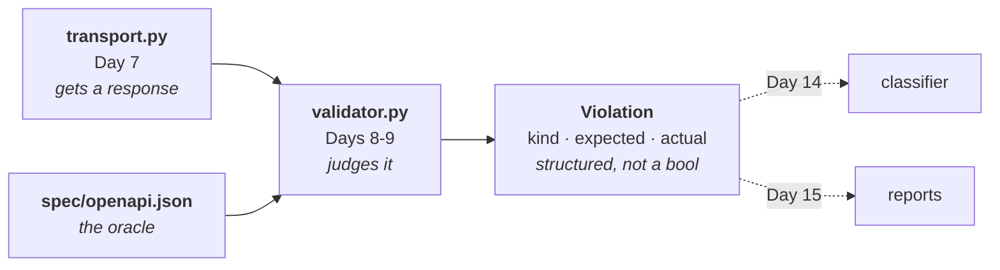

# Day 8 Checklist — The validator, part 1: turning the contract into an oracle

**Goal for today:** the piece that makes this a *conformance* harness. Given a
response and the pinned contract, decide whether the service kept its promise —
and when it didn't, say **exactly how**.

Today covers status-code declaration, content-type, path matching, and `$ref`
resolution. Body-against-schema validation is tomorrow.

**Time:** ~3–4 hours.
**Prerequisite:** Day 7 complete (85 tests, `Transport` working).

> **Formatting note:** every code block starts at the left margin so it
> copy-pastes cleanly.

---


## Progress log (updated as we go)

**Status: ✅ DAY 8 COMPLETE.** Pushed, CI green.

**Done-when gate met:** 109 tests passing; fabricated bad responses produce the
correct `Violation`, conformant ones produce none; the validator reported a real
`undeclared_status` against a live service running `BUG_MODE=undeclared_500`.

**Seeded-bug coverage so far — 2 of 6.** Worth tracking explicitly, because
knowing what the tool cannot yet catch is more useful than assuming it catches
everything:


| Bug mode          | Caught today? | Needs                                                        |
| ----------------- | ------------- | ------------------------------------------------------------ |
| `wrong_status`    | ✅             | status-declaration check                                     |
| `undeclared_500`  | ✅             | status-declaration check                                     |
| `missing_field`   | ❌             | body schema validation (Day 9)                               |
| `wrong_type`      | ❌             | body schema validation (Day 9)                               |
| `bad_enum`        | ❌             | body schema validation (Day 9)                               |
| `off_by_one_page` | ❌             | declarative assertion (Day 9) — schema-valid by construction |


Verified by hand: with `BUG_MODE=missing_field` the validator reports **no
violation**, which is correct for today rather than a bug in it.

**The oracle now exists.** `spec/openapi.json` is no longer just a pinned file —
it is the thing that decides pass or fail, for every endpoint, from one
implementation. That is the shift from example-based assertions to conformance
testing.

---


## Read this first — Background primer


### 1. Where this fits

Day 7 gave the harness a mouth. Today it gets judgement.




Recall Day 1's vocabulary: the **oracle** is whatever decides pass or fail. In
`test_add` the oracle was a hard-coded `== 2`. Today the oracle becomes **the
pinned contract** — and that's the leap from example-based assertions to
conformance testing. One validator checks every endpoint, because the rules come
from a document rather than from hand-written expectations.

---


### 2. Violations are structured, not booleans

The natural instinct is a function returning `True`/`False`, or maybe a string.
Both throw away information you will need later:


| Consumer                    | Needs                                                                  |
| --------------------------- | ---------------------------------------------------------------------- |
| **Classifier** (Day 14)     | To branch on *what kind* of violation it was                           |
| **HTML report** (Day 15)    | `expected` vs `actual`, side by side                                   |
| **The human reading it**    | A sentence explaining what went wrong                                  |
| **Flake detector** (Day 13) | A stable identity, to tell "same failure again" from "a different one" |


So `check_response` returns a **list of** `Violation` **objects**, each carrying a
`kind` (an enum the classifier can match on), a `location` (where in the
response), `expected`, `actual`, and a human `message`.

A **list**, not a single violation, because one response can break the contract
in several ways at once — and reporting only the first would hide the rest. An
empty list means conformant.

This is a small decision that pays off three times over the next week. A bare
bool would force every later stage to re-derive information the validator already
knew and threw away.

---


### 3. The two checks you build today

**Check 1 — was this status code declared at all?**

Day 4's status table is the promise:

```
GET /devices/{device_id}  ->  200, 404, 422
```

If the service answers `500`, that's not "an error" in the ordinary sense — it's
a response the contract never said was possible. Any client written against the
document has no branch for it.

This check alone catches two of your six seeded bugs: `wrong_status` (200 where
201 was declared) and `undeclared_500`.

**Check 2 — is the body's content type what was declared?**

The contract says each response is `application/json`. If a service returns HTML
— a proxy error page, a stack trace, a gateway timeout — that's a violation, and
it's one of the most common real-world ones. Content-type checking is what turns
"the JSON didn't parse" from a crash into a diagnosis.

There's a subtle case: **204 declares no** `content` **key at all.** Look at your own
spec:

```json
"204": { "description": "Successful Response" }
```

No `content`. So the promise is *"there is no body."* A 204 arriving with a body
is a violation — which is exactly the "serialized `null`" bug Day 4 warned about.
Your service does this correctly; the validator now enforces it rather than
trusting it.

---


### 4. `$ref` — and why resolution has to be recursive

From the Day 0 primer: `$ref` is a pointer. `"$ref": "#/components/schemas/Device"`
means "look up `Device` under `components/schemas` in this document."

You met this in your own spec on Day 3:

```json
"status": {
  "$ref": "#/components/schemas/DeviceStatus",
  "description": "Current operational state of the device."
}
```

Read that carefully — it's the whole reason today has real work in it. The
allowed values (`online`, `offline`, `degraded`) are **not here**. They live in a
separate schema object. A validator that reads this property directly learns
nothing about what values are legal.

And it nests. `DevicePage` → `items` (an array) → `items` (the element schema) →
`$ref` → `Device` → `properties.status` → `$ref` → `DeviceStatus`. Following one
pointer isn't enough; resolution has to **walk the entire schema tree** replacing
every `$ref` it finds, at any depth.

**Two details that separate a working resolver from a naive one:**

**A. Siblings alongside** `$ref` **must be preserved.** In OpenAPI 3.1, `$ref` can
have neighbours — see the `description` above. A resolver that replaces the whole
object with the target silently deletes them. Ours merges: resolve the target,
then lay the local keys on top, so local values win.

**B. Cycles must not hang the harness.** A schema can reference itself — a `Node`
with a list of child `Node`s is the classic case. Naive recursion follows that
pointer forever and the harness hangs with no error message, which is the worst
possible failure mode for a test tool. So the resolver tracks which refs are
already on the current path and stops when it sees one again.

Your spec has no cycles today. The guard exists anyway, because a validator that
hangs on a valid document is broken, and you'd rather not discover that while
pointing it at somebody else's API.

---


### 5. Path templates: matching `/devices/1` to `/devices/{device_id}`

The response knows it asked for `/devices/1`. The contract declares
`/devices/{device_id}`. Something has to connect them.

The mechanism is straightforward: turn each declared template into a regex by
replacing `{...}` with a "one path segment" pattern, then test the concrete path
against it.

**But there's an ambiguity, and you have met it before.** Consider
`/devices/search`:

- `/devices/search` matches the literal template `/devices/search` ✅
- `/devices/search` *also* matches `/devices/{device_id}` ✅

Two templates match. Pick the wrong one and every search response gets validated
against the wrong schema, producing confident, completely bogus violations.

The rule is the same one from Day 4: **specific beats parametrized.** There, it
was route registration order on the *server*. Here it's template selection on the
*client*. Same ambiguity, opposite side of the wire — which is a good sign it's a
real property of URL design rather than a framework quirk.

Implementation: score candidates by how many literal (non-parameter) segments
they have, and take the highest. `/devices/search` scores 2, `/devices/{device_id}`
scores 1.

---


### 6. Why unit tests with fabricated responses

Today's tests build `HttpResponse` objects by hand rather than making HTTP calls.
That's deliberate:

- **Fast and deterministic** — no server, no sockets, no timing.
- **You can fabricate the impossible.** To test the content-type check you need a
response claiming `text/html`. Your service will never send one. Constructing
it by hand takes a line.
- **It isolates the unit.** If a test fails, the validator is wrong — not the
network, not the service, not the fixture.

The integration tests (validator + live service + seeded bugs) arrive tomorrow,
once the validator is complete. Both layers, each answering what it's good at —
the same split as `TestClient` vs the harness.

---


## Part A — The violation type

**1. Create** `harness/violations.py`**.**

- [x] Create the file:

```python
"""
What the validator reports when the contract is broken.

WHY A STRUCTURED TYPE RATHER THAN A BOOL OR A STRING

Four different consumers need different things out of a failure:

  * the classifier (Day 14) branches on the KIND of violation;
  * the HTML report (Day 15) shows `expected` beside `actual`;
  * a human needs a sentence;
  * the flake detector (Day 13) needs a stable identity, to tell "the same
    failure again" from "a different one".

A bare bool throws all of that away and forces every later stage to re-derive
what the validator already knew. This is a cheap decision now that pays off
three times in the next week.
"""

from dataclasses import dataclass
from enum import Enum


class ViolationKind(str, Enum):
    """
    The categories of contract breach the validator can report.

    Kept coarse on purpose. These are the distinctions the CLASSIFIER needs to
    make a decision; finer detail belongs in the message. Too many kinds and the
    Day 14 logic becomes a lookup table nobody can reason about.

    Day 9 adds the SCHEMA_* kinds once body validation exists.
    """

    # The contract does not describe this endpoint at all.
    UNKNOWN_OPERATION = "unknown_operation"
    # The endpoint exists, but never promised this status code.
    UNDECLARED_STATUS = "undeclared_status"
    # Right status, wrong media type.
    WRONG_CONTENT_TYPE = "wrong_content_type"
    # The contract declared no body for this status, and one arrived anyway.
    UNEXPECTED_BODY = "unexpected_body"
    # A $ref in the contract points at something that isn't there.
    UNRESOLVABLE_REF = "unresolvable_ref"


@dataclass(frozen=True)
class Violation:
    """
    One specific way a response failed to honour the contract.

    Frozen so a violation cannot be edited after the fact -- a report should
    describe what happened, and a mutable record invites "fixing" it in place.

    location:
        Where the problem is, in dotted notation: "response.status",
        "response.headers.content-type", "response.body.items.0.status". Used by
        the HTML report to point at the exact spot, and it is what makes a
        failure message actionable rather than merely accurate.
    """

    kind: ViolationKind
    message: str
    expected: str = ""
    actual: str = ""
    location: str = ""

    def __str__(self) -> str:
        base = f"[{self.kind.value}] {self.message}"
        if self.expected or self.actual:
            base += f" (expected {self.expected!r}, got {self.actual!r})"
        if self.location:
            base += f" at {self.location}"
        return base
```

---


## Part B — The validator

**2. Create** `harness/validator.py`**.**

- [x] Create the file:

```python
"""
The contract validator -- the oracle.

Given a response and the pinned contract, decide whether the service kept its
promise, and if not, say exactly how.

This is the file that makes the project a CONFORMANCE harness rather than a
collection of assertions. In test_api.py the oracle is a hard-coded expected
value, written by hand, one per behaviour. Here the oracle is a document, and one
validator checks every endpoint -- which is why it keeps working as the API grows
and why it catches breakage nobody thought to write a test for.

Everything here is hand-written on purpose. Understanding response validation at
this level of detail is the point; schemathesis arrives on Day 10 to do a
different job (generating adversarial inputs), not to replace this.

Today: status declaration, content type, path matching, $ref resolution.
Day 9: validating the body against the resolved schema.
"""

import re
from typing import Any

from harness.transport import HttpResponse
from harness.violations import Violation, ViolationKind

# A path parameter stands for exactly one segment, so it must not match a "/".
_PARAM = re.compile(r"\{[^/{}]+\}")


class ContractLookupError(LookupError):
    """A $ref could not be resolved within the contract."""


# ---------------------------------------------------------------------------
# $ref resolution
# ---------------------------------------------------------------------------


def resolve_ref(contract: dict[str, Any], ref: str) -> dict[str, Any]:
    """
    Follow one local JSON pointer, e.g. "#/components/schemas/Device".

    Only local refs (starting with "#/") are supported. Remote refs -- pointers
    into other files or URLs -- are deliberately unsupported: a contract that
    reaches out to the network to be understood cannot be pinned, and pinning is
    the whole basis of this project.
    """
    if not ref.startswith("#/"):
        raise ContractLookupError(
            f"Only local refs are supported, got {ref!r}. A contract that must "
            "fetch part of itself from elsewhere cannot be pinned."
        )

    node: Any = contract
    for part in ref[2:].split("/"):
        # JSON Pointer escapes: "~1" means "/" and "~0" means "~".
        part = part.replace("~1", "/").replace("~0", "~")
        if not isinstance(node, dict) or part not in node:
            raise ContractLookupError(f"{ref!r} does not resolve: no {part!r}")
        node = node[part]

    if not isinstance(node, dict):
        raise ContractLookupError(f"{ref!r} resolves to {type(node).__name__}, not an object")

    return node


def resolve_schema(
    contract: dict[str, Any], schema: Any, _stack: tuple[str, ...] = ()
) -> Any:
    """
    Recursively replace every $ref in a schema with what it points at.

    WHY RECURSIVE: refs nest. DevicePage -> items (array) -> items (element) ->
    $ref -> Device -> properties.status -> $ref -> DeviceStatus. Following one
    pointer is not enough; the whole tree has to be walked.

    TWO DETAILS THAT SEPARATE THIS FROM A NAIVE RESOLVER:

    1. Siblings alongside $ref are preserved. OpenAPI 3.1 allows keys next to a
       $ref -- our own spec has a `description` beside the status ref. Replacing
       the object wholesale would silently delete them. We resolve the target
       first, then lay the local keys on top so local values win.

    2. Cycles terminate. A schema may reference itself (a Node containing child
       Nodes is the classic case). Naive recursion follows that forever and the
       harness hangs with no message -- the worst failure mode for a test tool,
       because a hang looks like a slow test rather than a bug. `_stack` records
       the refs on the current path and stops when one repeats.
    """
    if isinstance(schema, list):
        return [resolve_schema(contract, item, _stack) for item in schema]

    if not isinstance(schema, dict):
        return schema

    if "$ref" in schema:
        ref = schema["$ref"]

        if ref in _stack:
            # Cycle. Return the pointer unresolved and flag it, so downstream
            # code can see what happened instead of receiving silence.
            return {"$ref": ref, "x-circular": True}

        target = resolve_schema(contract, resolve_ref(contract, ref), _stack + (ref,))
        siblings = {key: value for key, value in schema.items() if key != "$ref"}
        # Local keys win: they are the more specific statement.
        return {**target, **siblings}

    return {key: resolve_schema(contract, value, _stack) for key, value in schema.items()}


# ---------------------------------------------------------------------------
# Path matching
# ---------------------------------------------------------------------------


def _template_to_regex(template: str) -> re.Pattern[str]:
    """
    Turn "/devices/{device_id}" into a regex matching "/devices/1".

    `[^/]+` -- one or more non-slash characters -- because a path parameter
    stands for exactly ONE segment. Using `.+` instead would let
    "/devices/{device_id}" match "/devices/1/status", which would validate the
    PATCH endpoint's responses against the GET endpoint's schema and report
    violations that are pure fiction.
    """
    escaped = re.escape(template)
    # re.escape() escapes the braces, so match the escaped form.
    pattern = re.sub(r"\\\{[^/]+?\\\}", r"[^/]+", escaped)
    return re.compile(f"^{pattern}$")


def _specificity(template: str) -> int:
    """
    How many literal (non-parameter) segments a template has.

    Used to break ties -- see match_path_template.
    """
    return sum(1 for segment in template.strip("/").split("/") if not _PARAM.fullmatch(segment))


def match_path_template(contract: dict[str, Any], concrete_path: str) -> str | None:
    """
    Find which declared template a real request path belongs to.

    THE AMBIGUITY, and it is one you have already met from the other side:

        /devices/search  matches  /devices/search        (literal)
        /devices/search  matches  /devices/{device_id}   (parametrized)

    Both are legitimate matches. Choosing wrong means validating a search
    response against the single-device schema and reporting confident nonsense.

    The rule is the same one as Day 4's route ordering: SPECIFIC BEATS
    PARAMETRIZED. There it was registration order on the server; here it is
    template selection on the client. Same ambiguity, opposite side of the wire
    -- which is a good sign it is a real property of URL design rather than a
    framework quirk.

    Implemented by scoring literal segments: /devices/search scores 2,
    /devices/{device_id} scores 1.
    """
    candidates = [
        template
        for template in contract.get("paths", {})
        if _template_to_regex(template).match(concrete_path)
    ]

    if not candidates:
        return None

    return max(candidates, key=_specificity)


# ---------------------------------------------------------------------------
# Reading the contract
# ---------------------------------------------------------------------------


def find_operation(
    contract: dict[str, Any], method: str, path_template: str
) -> dict[str, Any] | None:
    """The operation object for one (path, method), or None if undeclared."""
    return contract.get("paths", {}).get(path_template, {}).get(method.lower())


def declared_statuses(
    contract: dict[str, Any], method: str, path_template: str
) -> set[str]:
    """Every status code this operation promises. Strings, as OpenAPI stores them."""
    operation = find_operation(contract, method, path_template)
    if operation is None:
        return set()
    return set(operation.get("responses", {}))


def response_schema(
    contract: dict[str, Any],
    method: str,
    path_template: str,
    status_code: int,
    media_type: str = "application/json",
) -> dict[str, Any] | None:
    """
    The fully-resolved body schema for one (path, method, status), or None.

    None means the contract declares no body for this response -- a 204, for
    instance. That is a promise in itself ("there is no body"), not an absence of
    information, and check_response enforces it.

    Day 9 feeds the returned schema to jsonschema.
    """
    operation = find_operation(contract, method, path_template)
    if operation is None:
        return None

    declared = operation.get("responses", {}).get(str(status_code))
    if declared is None:
        return None

    content = declared.get("content")
    if not content or media_type not in content:
        return None

    schema = content[media_type].get("schema")
    if schema is None:
        return None

    return resolve_schema(contract, schema)


# ---------------------------------------------------------------------------
# The checks
# ---------------------------------------------------------------------------


def check_response(
    contract: dict[str, Any],
    response: HttpResponse,
    path_template: str | None = None,
) -> list[Violation]:
    """
    Check one response against the contract.

    Returns a LIST because a single response can break the contract several ways
    at once, and reporting only the first would hide the rest. An empty list
    means conformant.

    `path_template` can be passed explicitly; otherwise it is derived from the
    response's own request path. Deriving it is possible only because Day 7's
    HttpResponse carries `request_method` and `request_path` -- a small decision
    then that removes an argument from every call site now.

    Today: status declared, content type, unexpected body.
    Day 9 adds: body against the resolved schema.
    """
    violations: list[Violation] = []

    method = response.request_method or "GET"
    template = path_template or match_path_template(contract, response.request_path)

    # --- Is this endpoint in the contract at all? --------------------------
    if template is None or find_operation(contract, method, template) is None:
        return [
            Violation(
                kind=ViolationKind.UNKNOWN_OPERATION,
                message=(
                    f"The contract declares no operation for "
                    f"{method} {response.request_path}"
                ),
                expected="a declared path + method",
                actual=f"{method} {response.request_path}",
                location="request",
            )
        ]

    operation = find_operation(contract, method, template)
    status = str(response.status_code)
    declared = set(operation.get("responses", {}))

    # --- Check 1: was this status code ever promised? ----------------------
    if status not in declared:
        # Return early and deliberately. Once the status is undeclared there is
        # no declared response object to check the body or content type
        # against, so every further check would be measuring against nothing.
        # One precise violation beats a cascade of derived noise -- the
        # classifier and the human both benefit.
        return [
            Violation(
                kind=ViolationKind.UNDECLARED_STATUS,
                message=(
                    f"{method} {template} returned {status}, which the contract "
                    f"never declares"
                ),
                expected=", ".join(sorted(declared)) or "(none declared)",
                actual=status,
                location="response.status",
            )
        ]

    declared_response = operation["responses"][status]
    content = declared_response.get("content")
    body_is_empty = response.text.strip() == ""

    # --- Check 2: content type, or the absence of a body -------------------
    if not content:
        # No `content` key means the contract promises NO BODY -- a 204, for
        # instance. This is the check that catches a 204 carrying a serialized
        # "null", the protocol violation flagged back on Day 4.
        if not body_is_empty:
            violations.append(
                Violation(
                    kind=ViolationKind.UNEXPECTED_BODY,
                    message=(
                        f"{method} {template} returned {status} with a body, but "
                        f"the contract declares no content for that status"
                    ),
                    expected="empty body",
                    actual=f"{len(response.text)} bytes",
                    location="response.body",
                )
            )
    else:
        declared_types = set(content)
        actual_type = response.content_type

        if actual_type not in declared_types:
            violations.append(
                Violation(
                    kind=ViolationKind.WRONG_CONTENT_TYPE,
                    message=(
                        f"{method} {template} returned {status} as "
                        f"{actual_type or '(none)'}, which is not declared"
                    ),
                    expected=", ".join(sorted(declared_types)),
                    actual=actual_type or "(none)",
                    location="response.headers.content-type",
                )
            )

    return violations
```


---


## Part C — Tests

**3. Create** `test_validator.py` **in the repo root.**

- [x] Create the file:

```python
"""
Unit tests for the contract validator.

No network, no server: responses are FABRICATED. That is deliberate.

  * Fast and deterministic -- no sockets, no timing, no fixtures to boot.
  * We can construct the impossible. To test the content-type check we need a
    response claiming text/html; our service will never send one, and building
    it by hand takes a line.
  * It isolates the unit. A failure here means the validator is wrong -- not the
    network, the service, or the fixture.

The integration tests (validator + live service + seeded bugs) arrive on Day 9,
once body validation exists. Both layers, each answering what it is good at --
the same split as TestClient versus the harness.
"""

import pytest

from harness.transport import HttpResponse
from harness.validator import (
    ContractLookupError,
    check_response,
    declared_statuses,
    match_path_template,
    resolve_ref,
    resolve_schema,
    response_schema,
)
from harness.violations import ViolationKind


def make_response(
    status_code: int = 200,
    body: str = "{}",
    content_type: str = "application/json",
    method: str = "GET",
    path: str = "/health",
) -> HttpResponse:
    """Build a response by hand. The point of this file."""
    headers = {"content-type": content_type} if content_type else {}
    return HttpResponse(
        status_code=status_code,
        headers=headers,
        text=body,
        elapsed_ms=1.0,
        request_method=method,
        request_path=path,
    )


# --- $ref resolution -------------------------------------------------------


def test_resolve_ref_follows_a_local_pointer(contract: dict):
    device = resolve_ref(contract, "#/components/schemas/Device")
    assert device["type"] == "object"
    assert set(device["required"]) == {"id", "name", "status"}


def test_resolve_ref_rejects_remote_pointers(contract: dict):
    """
    Remote refs are refused on purpose.

    A contract that must fetch part of itself over the network cannot be pinned,
    and pinning is the basis of the whole project.
    """
    with pytest.raises(ContractLookupError, match="local refs"):
        resolve_ref(contract, "https://example.com/schema.json#/Device")


def test_resolve_ref_reports_a_dangling_pointer(contract: dict):
    with pytest.raises(ContractLookupError, match="does not resolve"):
        resolve_ref(contract, "#/components/schemas/NoSuchThing")


def test_resolve_schema_inlines_a_nested_enum(contract: dict):
    """
    THE REASON THIS DAY EXISTS.

    In the raw contract, Device.properties.status is only a POINTER -- the
    allowed values live in a separate schema object. A validator reading the
    property directly learns nothing about which values are legal. After
    resolution the enum is right there.
    """
    raw = contract["components"]["schemas"]["Device"]["properties"]["status"]
    assert "$ref" in raw
    assert "enum" not in raw

    resolved = resolve_schema(contract, contract["components"]["schemas"]["Device"])
    assert set(resolved["properties"]["status"]["enum"]) == {
        "online",
        "offline",
        "degraded",
    }


def test_resolve_schema_preserves_keys_beside_a_ref(contract: dict):
    """
    OpenAPI 3.1 allows siblings next to $ref, and our own spec has one.

    A resolver that replaced the object wholesale would silently delete the
    description. Local keys must survive and win.
    """
    resolved = resolve_schema(contract, contract["components"]["schemas"]["Device"])
    status = resolved["properties"]["status"]
    assert status["description"] == "Current operational state of the device."
    assert "enum" in status  # and the target's content is still there


def test_resolve_schema_recurses_through_arrays(contract: dict):
    """DevicePage -> items (array) -> element -> Device -> status -> enum."""
    resolved = resolve_schema(contract, contract["components"]["schemas"]["DevicePage"])
    element = resolved["properties"]["items"]["items"]
    assert set(element["required"]) == {"id", "name", "status"}
    assert "enum" in element["properties"]["status"]


def test_resolve_schema_terminates_on_a_cycle():
    """
    A self-referencing schema must not hang the harness.

    Our contract has no cycles. The guard exists anyway: a validator that hangs
    on a legal document is broken, and a hang is the worst failure mode for a
    test tool because it looks like slowness rather than a bug. Better to find
    that here than while pointing the harness at somebody else's API.
    """
    cyclic = {
        "components": {
            "schemas": {
                "Node": {
                    "type": "object",
                    "properties": {
                        "children": {
                            "type": "array",
                            "items": {"$ref": "#/components/schemas/Node"},
                        }
                    },
                }
            }
        }
    }
    # Start from the REF, not the dereferenced object: that puts Node on the
    # resolution stack immediately, so the self-reference one level down is the
    # one that trips the guard. Passing the object itself would resolve one
    # extra level first -- correct, but it makes the assertion harder to read.
    resolved = resolve_schema(cyclic, {"$ref": "#/components/schemas/Node"})
    inner = resolved["properties"]["children"]["items"]
    assert inner["x-circular"] is True
    assert inner["$ref"] == "#/components/schemas/Node"


# --- path matching ---------------------------------------------------------


def test_match_path_template_handles_a_parameter(contract: dict):
    assert match_path_template(contract, "/devices/1") == "/devices/{device_id}"
    assert match_path_template(contract, "/devices/99999") == "/devices/{device_id}"


def test_match_path_template_prefers_the_specific_template(contract: dict):
    """
    THE AMBIGUITY, and the same rule as Day 4's route ordering.

    /devices/search matches both the literal template and /devices/{device_id}.
    Choosing wrong would validate every search response against the
    single-device schema and report violations that are pure fiction.
    """
    assert match_path_template(contract, "/devices/search") == "/devices/search"


def test_match_path_template_does_not_span_segments(contract: dict):
    """
    A path parameter is ONE segment.

    If the regex used `.+` instead of `[^/]+`, /devices/{device_id} would
    swallow /devices/1/status and PATCH responses would be checked against the
    GET schema.
    """
    assert match_path_template(contract, "/devices/1/status") == "/devices/{device_id}/status"


def test_match_path_template_returns_none_for_an_unknown_path(contract: dict):
    assert match_path_template(contract, "/nope") is None


# --- reading the contract --------------------------------------------------


def test_declared_statuses_matches_the_contract(contract: dict):
    assert declared_statuses(contract, "GET", "/devices/{device_id}") == {
        "200",
        "404",
        "422",
    }
    assert declared_statuses(contract, "POST", "/devices") == {"201", "409", "422"}


def test_response_schema_returns_a_resolved_schema(contract: dict):
    schema = response_schema(contract, "GET", "/devices/{device_id}", 200)
    assert set(schema["required"]) == {"id", "name", "status"}
    assert "enum" in schema["properties"]["status"]  # resolved, not a pointer


def test_response_schema_is_none_when_no_body_is_declared(contract: dict):
    """204 declares no `content`. That is a promise, not missing information."""
    assert response_schema(contract, "DELETE", "/devices/{device_id}", 204) is None


# --- check_response --------------------------------------------------------


def test_a_conformant_response_produces_no_violations(contract: dict):
    response = make_response(
        status_code=200,
        body='{"id": 1, "name": "edge-router-01", "status": "online"}',
        method="GET",
        path="/devices/1",
    )
    assert check_response(contract, response) == []


def test_undeclared_status_is_reported(contract: dict):
    """Catches the `undeclared_500` seeded bug."""
    response = make_response(
        status_code=500, body='{"error": {}}', method="GET", path="/devices/1"
    )
    violations = check_response(contract, response)

    assert len(violations) == 1
    assert violations[0].kind is ViolationKind.UNDECLARED_STATUS
    assert violations[0].actual == "500"
    assert "200" in violations[0].expected


def test_wrong_status_on_create_is_reported(contract: dict):
    """Catches the `wrong_status` seeded bug: 200 where 201 was declared."""
    response = make_response(
        status_code=200, body="{}", method="POST", path="/devices"
    )
    violations = check_response(contract, response)

    assert len(violations) == 1
    assert violations[0].kind is ViolationKind.UNDECLARED_STATUS


def test_wrong_content_type_is_reported(contract: dict):
    """
    The impossible response, fabricated.

    Our service will never return HTML. A proxy error page or a gateway timeout
    absolutely will, and it is one of the most common real-world violations --
    which is why content-type checking turns "the JSON didn't parse" from a
    crash into a diagnosis.
    """
    response = make_response(
        status_code=200,
        body="<html>502 Bad Gateway</html>",
        content_type="text/html",
        method="GET",
        path="/devices/1",
    )
    violations = check_response(contract, response)

    assert len(violations) == 1
    assert violations[0].kind is ViolationKind.WRONG_CONTENT_TYPE
    assert violations[0].actual == "text/html"


def test_a_body_on_a_204_is_reported(contract: dict):
    """
    The protocol violation Day 4 warned about, now enforced rather than trusted.

    204 declares no `content`, so the promise is "there is no body". A
    serialized `null` breaks it.
    """
    response = make_response(
        status_code=204, body="null", method="DELETE", path="/devices/1"
    )
    violations = check_response(contract, response)

    assert len(violations) == 1
    assert violations[0].kind is ViolationKind.UNEXPECTED_BODY


def test_an_empty_204_is_conformant(contract: dict):
    response = make_response(
        status_code=204, body="", content_type="", method="DELETE", path="/devices/1"
    )
    assert check_response(contract, response) == []


def test_unknown_operation_is_reported(contract: dict):
    response = make_response(status_code=200, method="GET", path="/not-a-real-path")
    violations = check_response(contract, response)

    assert len(violations) == 1
    assert violations[0].kind is ViolationKind.UNKNOWN_OPERATION


def test_wrong_method_on_a_known_path_is_reported(contract: dict):
    """The path exists; this method on it does not."""
    response = make_response(status_code=200, method="DELETE", path="/health")
    violations = check_response(contract, response)

    assert violations[0].kind is ViolationKind.UNKNOWN_OPERATION


def test_undeclared_status_short_circuits_further_checks(contract: dict):
    """
    Once the status is undeclared, stop.

    There is no declared response object left to check content type against, so
    continuing would measure against nothing and emit derived noise. One precise
    violation is worth more to both the classifier and the human than a cascade.
    """
    response = make_response(
        status_code=500,
        body="<html>oh no</html>",
        content_type="text/html",
        method="GET",
        path="/devices/1",
    )
    violations = check_response(contract, response)

    assert len(violations) == 1
    assert violations[0].kind is ViolationKind.UNDECLARED_STATUS


def test_violation_renders_readably(contract: dict):
    """A violation has to be legible in a terminal, not only machine-readable."""
    response = make_response(
        status_code=500, body="{}", method="GET", path="/devices/1"
    )
    text = str(check_response(contract, response)[0])

    assert "undeclared_status" in text
    assert "response.status" in text
```


**4. Run the suite.**

- [x] Run:

```bash
pytest -q
```

✅ *Worked when:* **109 tests pass** — 85 from Day 7 plus 24 new.

---


## Part D — See it work against real seeded bugs

The unit tests use fabricated responses. Before trusting the validator, point it
at the actual service with a bug switched on.

**5. Start the service with a seeded bug.**

- [x] In one terminal:

```bash
BUG_MODE=undeclared_500 uvicorn api.main:app --port 9002
```

**6. Run the validator against it by hand.**

- [x] In another terminal:

```bash
python -c "
from harness.config import HarnessConfig
from harness.spec import load_contract
from harness.transport import build_transport
from harness.validator import check_response

contract = load_contract()
config = HarnessConfig(base_url='http://127.0.0.1:9002')

with build_transport(config) as t:
    for method, path in [('GET', '/health'), ('GET', '/devices/1')]:
        response = t.request(method, path)
        violations = check_response(contract, response)
        verdict = 'OK' if not violations else '; '.join(str(v) for v in violations)
        print(f'{method} {path:14} -> {response.status_code}  {verdict}')
"
```

✅ *Worked when:* `/health` reports `OK` and `/devices/1` reports an
`undeclared_status` violation naming 500 and listing the declared codes.

**That's the harness working end to end for the first time.** A real request, a
real response, judged against a document, with a specific explanation of what
broke. Everything from here makes it broader and sharper.

- [x] Try `BUG_MODE=missing_field` on the same port.

✅ *Worked when:* it reports **no violation** — and that is correct for today.
`missing_field` breaks the *body schema*, and body validation is tomorrow's work.
Knowing exactly which bugs your tool cannot yet catch is worth more than assuming
it catches everything.

- [x] Stop the server.

---


## Part E — Commit

**7. Commit and push.**

- [x] Run:

```bash
git status --short
git add .
git commit -m "Day 8: contract validator - status, content-type, path matching, ref resolution"
git push
```

- [x] Confirm CI goes green.

---


## Part F — Wrap up

**8. Update this checklist.**

- [x] Tick the boxes and record anything that differed in the progress log,
  ```
  including which seeded bugs the validator catches so far (2 of 6) and which
  it does not yet.
  ```

**9. Review.**

- [x] Read the Day 8 section of `LEARNING_NOTES.md` and try the flashcards aloud.
  ```
  The one to be fluent on is *why `$ref` resolution has to be recursive* —
  it's concrete, you can point at your own spec to explain it, and it shows
  you understand the document format rather than just using a library.
  ```

**10. Look ahead.**

- [x] Skim `PROJECT_PLAN.md` Day 9. Tomorrow: body validation against the
  ```
  resolved schema with `jsonschema`, YAML test plans, and the JSON run
  summary. That's when the remaining four seeded bugs become catchable.
  ```

---


## If something breaks


| Symptom                                                        | Cause and fix                                                                                                                                      |
| -------------------------------------------------------------- | -------------------------------------------------------------------------------------------------------------------------------------------------- |
| `fixture 'contract' not found`                                 | The `contract` fixture lives in `conftest.py` from Day 7. Check it's still there.                                                                  |
| `test_resolve_schema_inlines_a_nested_enum` fails              | The resolver isn't recursing into `properties`. The final `return` must rebuild the dict by resolving every value.                                 |
| `test_resolve_schema_preserves_keys_beside_a_ref` fails        | Siblings are being dropped. Merge `{**target, **siblings}` — local keys last so they win.                                                          |
| `test_match_path_template_prefers_the_specific_template` fails | `max(..., key=_specificity)` is missing, or `_specificity` is counting parameters as literals.                                                     |
| `test_match_path_template_does_not_span_segments` fails        | The regex uses `.+` instead of `[^/]+`.                                                                                                            |
| Path matching never matches anything                           | `re.escape` escapes `{` and `}`, so the substitution must target the **escaped** form `\{...\}`.                                                   |
| A test hangs                                                   | Cycle guard isn't working. `_stack` must be passed down on every recursive call.                                                                   |
| `UNKNOWN_OPERATION` on a valid path                            | The method case is wrong — OpenAPI stores methods lowercase; `find_operation` lowercases for you, so check the response's `request_method` is set. |


---

*When 109 tests pass and the validator reports a real* `undeclared_status`
*violation against a live service running* `BUG_MODE=undeclared_500`*, Day 8 is
done. The contract is now an oracle. Tomorrow it learns to read bodies.*