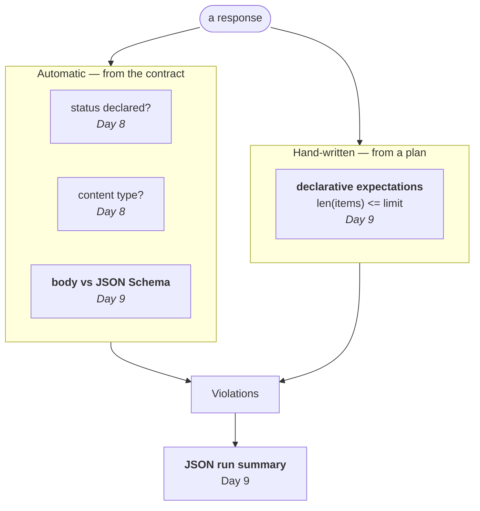

# Day 9 Checklist — Bodies, tests-as-data, and the run summary

**Goal for today:** finish the validator with **body-against-schema** checking,
write the test suite as **YAML data** rather than Python, and emit a **JSON run
summary**. By the end, all six seeded bugs are detectable.

**Time:** ~4–5 hours. The longest day in the plan — see the note below on where
to stop if you run short.

**Prerequisite:** Day 8 complete (109 tests, validator catching 2 of 6 bugs).

> **Formatting note:** every code block starts at the left margin so it
> copy-pastes cleanly.

> **If you run short on time:** stop after Part D (body validation + its tests).
> That alone takes seeded-bug coverage from 2/6 to 5/6 and is a coherent
> stopping point. Parts E–H (YAML plans, runner, summary) can move to Day 10 —
> `PROJECT_PLAN.md` guardrail 2 says to protect Days 11–15, not Day 10.

---


## Progress log (updated as we go)

**Status: not started.**

---


## Read this first — Background primer


### 1. Where this fits

Two mechanisms complete today, and you need **both** — that's the lesson.




Schema validation is general and automatic — one implementation checks every
endpoint. Declarative expectations are specific and hand-written. Day 6's
`off_by_one_page` proved you can't have only the first: returning `limit + 1`
items is fully schema-valid and plainly wrong.

---


### 2. JSON Schema validation, and one version detail that matters

The heavy lifting is a solved problem, so you'll use the `jsonschema` library for
the innermost step and write everything around it. That's the right line to draw
— don't reimplement a standard, do own the logic that makes it a harness.

**The version detail is not optional.** Your spec is **OpenAPI 3.1.0** (you
noted this on Day 3), which aligns with **JSON Schema draft 2020-12**. So the
validator must be `Draft202012Validator`, not the library default.

Point it at an older draft and constraints are **silently ignored** — no error,
no warning, just a validator that passes everything. That's the worst possible
bug in a test tool: it doesn't fail, it stops finding things. You'd get a green
suite and conclude the service was fine.

**Why Day 8's** `$ref` **resolution was the prerequisite.** `jsonschema` can follow
refs itself, but only with a registry telling it where to look. Because
`resolve_schema()` already inlined everything, the schema handed to it is
self-contained and no registry is needed. Yesterday's work is what makes today's
call a one-liner.

---


### 3. Translating library errors into your own violations

`jsonschema` reports rich `ValidationError` objects. You could pass them straight
through — and shouldn't.

Day 8's argument applies again: the classifier branches on `kind`, reports show
`expected` beside `actual`, humans read `message`. A library's error type is
shaped for the library's purposes, and leaking it means every downstream stage
depends on `jsonschema` — the same dependency-inversion mistake as returning
httpx responses from `Transport`.

The mapping is small. Each `ValidationError` carries `.validator` naming the
keyword that failed:


| `error.validator`      | Our `ViolationKind`       | Seeded bug it catches |
| ---------------------- | ------------------------- | --------------------- |
| `required`             | `SCHEMA_MISSING_FIELD`    | `missing_field`       |
| `type`                 | `SCHEMA_WRONG_TYPE`       | `wrong_type`          |
| `enum`                 | `SCHEMA_ENUM`             | `bad_enum`            |
| `additionalProperties` | `SCHEMA_UNEXPECTED_FIELD` | —                     |
| anything else          | `SCHEMA_INVALID`          | —                     |


`error.absolute_path` gives the position inside the body as a sequence, which
becomes a readable location: `response.body.items.0.status`. That's the
difference between "the response is invalid" and "item 0's status is wrong" —
and it's what makes a failure actionable rather than merely accurate.

---


### 4. Tests as data

This is the pattern that made project 1 credible, and it returns here.

Instead of writing one Python function per test case, you describe cases in
**YAML** and let one runner execute them all:

```yaml
- name: get_missing_device_returns_404
  method: GET
  path: /devices/99999
  expect_status: 404
  expect:
    - path: error.code
      equals: not_found
```

What it buys you:


|                          | Cases as Python    | Cases as data                             |
| ------------------------ | ------------------ | ----------------------------------------- |
| Adding a case            | Write a function   | Add six lines of YAML                     |
| Reviewing the suite      | Read code          | Read a list                               |
| Who can contribute       | Python programmers | Anyone who understands the API            |
| Generating cases         | Hard               | Trivial — it's just data                  |
| Running them differently | Rewrite            | Point a different runner at the same file |


That last row matters more than it looks. On Day 12 the same YAML files get run
twenty times over by the repeat-runner, and on Day 15 they feed the reports.
Because the cases are inert data, none of that requires touching them.

**One case per YAML entry, one pytest test per case.** `pytest.mark.parametrize`
generates a test per entry, so a failure names the case (`get_missing_device_returns_404`)
rather than reporting "the plan failed". Same trick as project 1.

---


### 5. The assertion mini-language, and why not just `eval`

The `expect` block supports five predicates: `equals`, `max_length`,
`min_length`, `one_of`, `type` — each against a dotted `path` into the body
(`error.code`, `items`, `items.0.status`, or `""` for the whole body).

The tempting alternative is embedding a Python expression:

```yaml
  expect: "len(body['items']) <= 2"     # DON'T
```

More expressive, and it destroys the property that makes plans valuable. **The
moment a plan can execute code, it stops being data.** It can no longer be safely
reviewed, generated, shared, or run by anyone who hasn't read every line — and a
malicious or careless plan file becomes a way to run arbitrary code inside your
test runner.

This is the same instinct as `yaml.safe_load` over `yaml.load` in project 1, and
you'll use `safe_load` here too. A restricted vocabulary is a feature: it keeps
data as data. If you genuinely need something the five predicates can't express,
that's a signal to add a sixth predicate deliberately — not to open the door to
arbitrary code.

**Unknown keys are rejected loudly.** A typo'd `expect_stauts` that silently did
nothing would leave a case that passes without checking anything — the same
"wrong in the dangerous direction" failure as a silently-ignored `BUG_MODE`.

---


### 6. Retries: where Days 4 and 5 pay off

Cases can declare `retries: 2`. Two rules govern when a retry actually happens,
and both come from earlier work:

**Rule 1 — retry only on transport-level failure.** Connection refused, DNS
failure, timeout. *Never* on a validation failure. A response that violates the
contract will violate it again; retrying just hides a real bug behind a green
result. Only "we never got an answer" is worth another attempt.

**Rule 2 — retry only idempotent methods.** From Day 4: `GET`, `PUT`, `DELETE`,
and `PATCH` are safe to repeat; `POST` is not. When a request times out you don't
know whether it landed — retry a `POST` and you may create two devices. **A test
tool that corrupts the system under test is worse than no test tool.**

Note that `PATCH` is on the idempotent list only because of a decision you made
on Day 5: allowing no-op status transitions. Had illegal no-ops returned 409, the
second attempt would fail *because the first succeeded* — and this retry logic
would be unsafe. That's two days of design paying off in one `frozenset`.

---


### 7. The run summary, and why the config is in it

Every run writes `results/run.json`: per-case status, latency, attempt count and
violations, plus totals and pass rate.

The summary **includes the configuration** — base URL, timeout, proxy flag, seed.
That's deliberate. A result you can't reproduce is an anecdote, and a report that
doesn't say what it was run against can't be reproduced. This is why Day 7 put
every knob in one `HarnessConfig` object rather than reading `os.environ` at the
point of use: scattered configuration cannot be reported.

Day 15 renders this same summary as JUnit XML and HTML. **One summary, many
reports** — the same pattern as project 1, and the reason the reporting day is
cheap.

---


### 8. The healthy baseline must be exactly 100%

With `BUG_MODE=none`, every case must pass. Not "almost all."

If the baseline has a couple of known failures, then every future failure has to
be checked against a list of expected ones, the flake detector's ground truth is
polluted, and eventually someone stops looking. **A suite with permanent known
failures is a suite nobody reads.**

*Found while building this:* an early plan case requested `/no-such-path`
expecting a 404. The service answers correctly, but the validator reports
`unknown_operation` — the contract declares no such path, so there is nothing to
validate against. The validator was right and the *case* was wrong: it asked for
something outside the contract.

That case was removed. But note what it is: a test that contradicts the spec is
precisely the signature of a **test bug**, the second of the four categories the
Day 14 classifier must distinguish. `unknown_operation` will be reintroduced
deliberately then, as seeded ground truth.

---


### 9. State: the part that will bite you (and did)

Until today every conformance case was read-only. Today's plans **create,
replace and delete devices** — and the server is session-scoped, shared by the
whole run.

That combination produces exactly the bug this project exists to detect, and it
showed up while building this day:

```
$ pytest test_plans.py::test_the_healthy_baseline_is_completely_green
1 passed

$ pytest
2 failed
```

**Passes alone, fails in the suite.** Cause #2 on the Day 0 flakiness list:
**test-order dependence**. The parametrized cases run first and create
`plan-created-01`; the baseline test then re-runs the whole plan, the create case
hits a duplicate name, and gets a 409 instead of a 201.

Day 7 predicted this in as many words: *"When Day 9 adds cases that create and
delete devices, they'll have to reset state themselves, and that will be a
deliberate decision rather than an accident."* Here is the deliberate decision.

**The fix** is an autouse fixture that resets the service's store before every
test — the same instinct as `test_api.py`'s `fresh_store` from Day 3, applied one
layer out.

**The honest limitation, which is the interesting part.** That fixture works
because the local server runs in the *same process* as pytest, so it can reach
into the store directly. Point the harness at a container or a deployment and it
cannot: you can't reset someone else's database from a test runner.

So the fixture skips resetting when `HARNESS_BASE_URL` is set, and against a
remote service the plans must be **self-sufficient** — either tolerant of
pre-existing data, or cleaning up after themselves. Both are real strategies with
real costs, and pretending the problem doesn't exist is what produces suites that
work on a laptop and fail in CI.

Worth naming plainly: **state management is the hard part of integration
testing.** Not the requests, not the assertions — deciding what the world looks
like before each case.

---


## Part A — Dependencies

**1. Install and pin.**

- [ ] Run:

```bash
source .venv/bin/activate
which python
python -m pip install jsonschema PyYAML
python -m pip list | grep -Ei "jsonschema|PyYAML"
```

- [ ] Add to `requirements.txt`, substituting the versions printed:

```
# Contract validation + declarative test plans
jsonschema==<version>
PyYAML==<version>
```

`jsonschema` *must be 4.18 or newer* — `Draft202012Validator` doesn't exist in
3.x. If pip resolves an old one, upgrade explicitly.

---


## Part B — New violation kinds

**2. Extend** `harness/violations.py`**.**

- [ ] Add these members to `ViolationKind`, immediately after
  ```
  `UNRESOLVABLE_REF`:
  ```

```python
    # --- body-schema breaches (Day 9) ---
    SCHEMA_MISSING_FIELD = "schema_missing_field"
    SCHEMA_WRONG_TYPE = "schema_wrong_type"
    SCHEMA_ENUM = "schema_enum"
    SCHEMA_UNEXPECTED_FIELD = "schema_unexpected_field"
    SCHEMA_INVALID = "schema_invalid"
    BODY_NOT_JSON = "body_not_json"

    # --- declarative expectations from a test plan (Day 9) ---
    EXPECTATION_FAILED = "expectation_failed"
```

---


## Part C — Body validation

**3. Extend** `harness/validator.py`**.**

- [ ] Change the import line at the top to add the validator and the JSON error:

```python
from jsonschema import Draft202012Validator

from harness.transport import HttpResponse, NotJsonError
```

- [ ] Append this to the **end** of the file:

```python
# ---------------------------------------------------------------------------
# Body validation (Day 9)
# ---------------------------------------------------------------------------

# jsonschema names the failing keyword in error.validator. Mapping those onto
# our own kinds keeps the library out of every layer above -- the same
# dependency-inversion argument as returning our own HttpResponse rather than
# httpx's. Leak the library's error type and the classifier, the reports and the
# flake detector all end up depending on jsonschema.
_KIND_BY_JSONSCHEMA_VALIDATOR = {
    "required": ViolationKind.SCHEMA_MISSING_FIELD,
    "type": ViolationKind.SCHEMA_WRONG_TYPE,
    "enum": ViolationKind.SCHEMA_ENUM,
    "additionalProperties": ViolationKind.SCHEMA_UNEXPECTED_FIELD,
}


def _location_of(error: Any) -> str:
    """
    Turn jsonschema's path into a readable location.

    absolute_path is a deque like ["items", 0, "status"], which becomes
    "response.body.items.0.status". That is the difference between "the response
    is invalid" and "item 0's status is wrong" -- accuracy versus actionability.
    """
    parts = ["response", "body"] + [str(part) for part in error.absolute_path]
    return ".".join(parts)


def check_body_against_schema(body: Any, schema: dict[str, Any]) -> list[Violation]:
    """
    Validate a parsed body against a RESOLVED schema.

    Draft202012Validator specifically, not the library default. Our contract is
    OpenAPI 3.1, which aligns with JSON Schema draft 2020-12. Point this at an
    older draft and constraints are SILENTLY IGNORED -- no error, no warning,
    just a validator that passes everything. That is the worst possible bug in a
    test tool: it does not fail, it stops finding things, and you conclude the
    service is fine.

    The schema must already be $ref-resolved (Day 8). jsonschema can follow refs
    itself, but only with a registry telling it where to look; because
    resolve_schema() inlined everything, the schema is self-contained and this
    call needs no extra machinery. Yesterday's work is what makes today a
    one-liner.

    Errors are sorted by position so the report reads top-to-bottom through the
    body rather than in whatever order the library happened to find them --
    unstable ordering makes diffs between runs unreadable.
    """
    validator = Draft202012Validator(schema)
    violations: list[Violation] = []

    for error in sorted(validator.iter_errors(body), key=lambda e: list(e.absolute_path)):
        kind = _KIND_BY_JSONSCHEMA_VALIDATOR.get(
            error.validator, ViolationKind.SCHEMA_INVALID
        )

        expected = ""
        actual = ""
        if kind is ViolationKind.SCHEMA_WRONG_TYPE:
            expected = str(error.validator_value)
            actual = type(error.instance).__name__
        elif kind is ViolationKind.SCHEMA_ENUM:
            expected = ", ".join(str(value) for value in error.validator_value)
            actual = repr(error.instance)
        elif kind is ViolationKind.SCHEMA_MISSING_FIELD:
            expected = str(error.validator_value)
            actual = (
                ", ".join(sorted(error.instance))
                if isinstance(error.instance, dict)
                else ""
            )

        violations.append(
            Violation(
                kind=kind,
                message=error.message,
                expected=expected,
                actual=actual,
                location=_location_of(error),
            )
        )

    return violations
```

**4. Check it by hand before writing tests.**

- [ ] Run:

```bash
python -c "
from harness.spec import load_contract
from harness.validator import response_schema, check_body_against_schema

contract = load_contract()
schema = response_schema(contract, 'GET', '/devices/{device_id}', 200)

samples = {
    'healthy':       {'id': 1, 'name': 'x', 'status': 'online'},
    'missing_field': {'id': 1, 'status': 'online'},
    'wrong_type':    {'id': '1', 'name': 'x', 'status': 'online'},
    'bad_enum':      {'id': 1, 'name': 'x', 'status': 'exploded'},
}
for label, body in samples.items():
    found = check_body_against_schema(body, schema)
    print(f'{label:15}', found[0] if found else 'OK')
"
```

✅ *Worked when:* `healthy` reports OK and the other three each report one
violation of the matching kind, with a precise location.

---


## Part D — Test plans

**5. Create** `harness/plan.py`**.**

- [ ] Create the file:

```python
"""
Declarative test plans -- tests as data.

WHY YAML RATHER THAN PYTHON FUNCTIONS

A case described as data can be added in six lines, reviewed as a list, written
by someone who does not program, generated mechanically, and -- the part that
matters most later -- run by a DIFFERENT runner without being touched. On Day 12
these same files are executed twenty times over by the repeat-runner, and on Day
15 they feed the reports. None of that requires editing them, because they are
inert.

WHY A RESTRICTED ASSERTION VOCABULARY RATHER THAN EMBEDDED EXPRESSIONS

It would be more expressive to allow `len(body['items']) <= 2` as a string and
eval it. It would also destroy the property that makes plans valuable: the moment
a plan can execute code it stops being data, and can no longer be safely
reviewed, generated, or run by anyone who has not read every line. Same instinct
as yaml.safe_load over yaml.load. If the five predicates are ever genuinely
insufficient, add a sixth deliberately rather than opening the door to arbitrary
code.
"""

import pathlib
from dataclasses import dataclass, field
from typing import Any

import yaml

# Sentinel: `equals: null` is a legitimate expectation, so "absent" and "None"
# must be distinguishable. A plain None default would conflate them.
_UNSET = object()

# From Day 4's safety/idempotency table. PATCH is here only because of the Day 5
# decision to allow no-op status transitions -- had illegal no-ops returned 409,
# a retried PATCH would fail BECAUSE the first attempt succeeded, and retrying it
# would be unsafe. Two days of design converging on one frozenset.
IDEMPOTENT_METHODS = frozenset({"GET", "PUT", "DELETE", "PATCH", "HEAD", "OPTIONS"})

_CASE_KEYS = {
    "name", "method", "path", "params", "body",
    "expect_status", "expect", "timeout_ms", "retries", "description",
}
_EXPECT_KEYS = {"path", "equals", "max_length", "min_length", "one_of", "type"}


class PlanError(ValueError):
    """A test plan is malformed. Raised loudly rather than skipped quietly."""


@dataclass(frozen=True)
class Expectation:
    """
    One declarative assertion about a response body.

    `path` is a dotted accessor: "error.code", "items", "items.0.status", or ""
    for the whole body. Deliberately simple -- a full JSONPath implementation
    would be more powerful and much harder to review at a glance, and
    reviewability is the point of putting cases in data.
    """

    path: str = ""
    equals: Any = _UNSET
    max_length: int | None = None
    min_length: int | None = None
    one_of: list[Any] | None = None
    type: str | None = None


@dataclass(frozen=True)
class TestCase:
    """One case from a plan file."""

    name: str
    method: str
    path: str
    expect_status: int
    params: dict[str, Any] = field(default_factory=dict)
    body: Any = None
    expect: tuple[Expectation, ...] = ()
    timeout_ms: int | None = None
    retries: int = 0
    description: str = ""

    @property
    def is_idempotent(self) -> bool:
        """Whether this case's method may safely be retried (Day 4)."""
        return self.method in IDEMPOTENT_METHODS


def _parse_expectation(raw: Any, case_name: str) -> Expectation:
    if not isinstance(raw, dict):
        raise PlanError(
            f"{case_name}: each expect entry must be a mapping, got {type(raw).__name__}"
        )

    unknown = set(raw) - _EXPECT_KEYS
    if unknown:
        raise PlanError(
            f"{case_name}: unknown expect keys {sorted(unknown)}; "
            f"valid keys are {sorted(_EXPECT_KEYS)}"
        )

    return Expectation(
        path=raw.get("path", ""),
        equals=raw["equals"] if "equals" in raw else _UNSET,
        max_length=raw.get("max_length"),
        min_length=raw.get("min_length"),
        one_of=raw.get("one_of"),
        type=raw.get("type"),
    )


def parse_case(raw: Any) -> TestCase:
    """
    Turn one YAML mapping into a TestCase, rejecting anything unexpected.

    Unknown keys are an ERROR, not a warning. A typo'd `expect_stauts` that was
    silently ignored would leave a case that passes while checking nothing --
    the same "wrong in the dangerous direction" failure as a silently-ignored
    BUG_MODE on Day 6. A test that cannot fail is worse than no test, because it
    reports confidence it has not earned.
    """
    if not isinstance(raw, dict):
        raise PlanError(f"each case must be a mapping, got {type(raw).__name__}")

    for required in ("name", "method", "path", "expect_status"):
        if required not in raw:
            raise PlanError(f"case is missing required key {required!r}: {raw}")

    unknown = set(raw) - _CASE_KEYS
    if unknown:
        raise PlanError(
            f"{raw['name']}: unknown keys {sorted(unknown)}; "
            f"valid keys are {sorted(_CASE_KEYS)}"
        )

    return TestCase(
        name=raw["name"],
        method=str(raw["method"]).upper(),
        path=raw["path"],
        expect_status=int(raw["expect_status"]),
        params=raw.get("params") or {},
        body=raw.get("body"),
        expect=tuple(
            _parse_expectation(entry, raw["name"]) for entry in (raw.get("expect") or [])
        ),
        timeout_ms=raw.get("timeout_ms"),
        retries=int(raw.get("retries", 0)),
        description=raw.get("description", ""),
    )


def load_plan(path: pathlib.Path) -> list[TestCase]:
    """
    Load one plan file.

    yaml.safe_load, never yaml.load: the unsafe loader can construct arbitrary
    Python objects from a document, which would make a plan file a way to run
    code. Same reasoning as refusing embedded expressions -- data must stay data.
    """
    raw = yaml.safe_load(path.read_text(encoding="utf-8"))

    if not isinstance(raw, list):
        raise PlanError(
            f"{path}: a plan must be a list of cases, got {type(raw).__name__}"
        )

    cases = [parse_case(entry) for entry in raw]
    _reject_duplicate_names(cases, str(path))
    return cases


def load_all_plans(directory: pathlib.Path) -> list[TestCase]:
    """
    Load every *.yaml in a directory, sorted for a stable order.

    Sorting matters: pytest identifies parametrized tests by index as well as
    name, and an order that varies between runs would make failures appear to
    move around -- which looks exactly like flakiness.
    """
    cases: list[TestCase] = []
    for plan_file in sorted(directory.glob("*.yaml")):
        cases.extend(load_plan(plan_file))
    _reject_duplicate_names(cases, str(directory))
    return cases


def _reject_duplicate_names(cases: list[TestCase], where: str) -> None:
    """
    Case names must be unique.

    They are the identity used by pytest, the run summary, and -- from Day 12 --
    the flake detector's per-test history. Two cases sharing a name would have
    their histories merged, and the flakiness score for both would be nonsense.
    """
    names = [case.name for case in cases]
    duplicates = sorted({name for name in names if names.count(name) > 1})
    if duplicates:
        raise PlanError(f"{where}: duplicate case names {duplicates}")
```

**6. Create the plan files.**

- [ ] Run:

```bash
mkdir -p testplans
```

- [ ] Create `testplans/health.yaml`:

```yaml
# Liveness. Trivial on purpose -- if this fails, nothing else is worth reading.
- name: health_returns_ok
  method: GET
  path: /health
  expect_status: 200
  retries: 2
  expect:
    - path: status
      equals: ok
```

- [ ] Create `testplans/devices_read.yaml`:

```yaml
# Read-only cases. Safe to run in any order and safe to retry.

- name: list_devices_returns_a_page
  method: GET
  path: /devices
  expect_status: 200
  expect:
    - path: limit
      equals: 50
    - path: offset
      equals: 0
    - path: items
      type: array

- name: list_devices_respects_limit
  description: >
    Catches the off_by_one_page seeded bug. Note this is the ONLY mechanism that
    can: returning limit+1 items satisfies the schema completely, because the
    schema constrains the shape of `items` and says nothing about its length.
  method: GET
  path: /devices
  params: {limit: 2, offset: 0}
  expect_status: 200
  expect:
    - path: items
      max_length: 2
    - path: limit
      equals: 2

- name: list_devices_second_page
  method: GET
  path: /devices
  params: {limit: 2, offset: 2}
  expect_status: 200
  expect:
    - path: items
      max_length: 2

- name: list_devices_rejects_limit_below_minimum
  method: GET
  path: /devices
  params: {limit: 0}
  expect_status: 422
  expect:
    - path: error.code
      equals: validation_error

- name: list_devices_rejects_limit_above_maximum
  method: GET
  path: /devices
  params: {limit: 101}
  expect_status: 422

- name: get_device_returns_one_device
  method: GET
  path: /devices/1
  expect_status: 200
  expect:
    - path: id
      equals: 1
    - path: status
      one_of: [online, offline, degraded]

- name: get_missing_device_returns_404
  method: GET
  path: /devices/99999
  expect_status: 404
  expect:
    - path: error.code
      equals: not_found

- name: get_device_with_non_integer_id_returns_422
  method: GET
  path: /devices/banana
  expect_status: 422
  expect:
    - path: error.code
      equals: validation_error

- name: search_by_name_substring
  method: GET
  path: /devices/search
  params: {name_contains: router}
  expect_status: 200
  expect:
    - path: ""
      type: array

- name: search_by_status
  method: GET
  path: /devices/search
  params: {status: degraded}
  expect_status: 200

- name: search_with_invalid_status_returns_422
  method: GET
  path: /devices/search
  params: {status: banana}
  expect_status: 422
```

- [ ] Create `testplans/devices_write.yaml`:


```yaml
# Write cases. Note which ones carry `retries` and which deliberately do not:
# POST is not idempotent, so retrying it could create duplicate devices. The
# runner enforces this regardless, but declaring it here keeps the intent visible
# to anyone reading the plan.

- name: create_device_returns_201
  method: POST
  path: /devices
  body: {name: plan-created-01, status: offline}
  expect_status: 201
  expect:
    - path: name
      equals: plan-created-01
    - path: status
      equals: offline

- name: create_device_defaults_status_to_offline
  method: POST
  path: /devices
  body: {name: plan-created-02}
  expect_status: 201
  expect:
    - path: status
      equals: offline

- name: create_duplicate_name_returns_409
  method: POST
  path: /devices
  body: {name: edge-router-01}
  expect_status: 409
  expect:
    - path: error.code
      equals: conflict

- name: create_device_with_empty_name_returns_422
  method: POST
  path: /devices
  body: {name: ""}
  expect_status: 422

- name: replace_device_returns_200
  method: PUT
  path: /devices/3
  body: {name: plan-replaced, status: offline}
  expect_status: 200
  retries: 2
  expect:
    - path: name
      equals: plan-replaced

- name: replace_missing_device_returns_404
  method: PUT
  path: /devices/99999
  body: {name: ghost, status: offline}
  expect_status: 404

- name: patch_status_illegal_transition_returns_409
  method: PATCH
  path: /devices/2/status
  body: {status: degraded}
  expect_status: 409
  expect:
    - path: error.code
      equals: conflict

- name: patch_status_unknown_value_returns_422
  method: PATCH
  path: /devices/1/status
  body: {status: banana}
  expect_status: 422

- name: patch_status_on_missing_device_returns_404
  method: PATCH
  path: /devices/99999/status
  body: {status: online}
  expect_status: 404

- name: delete_missing_device_returns_404
  method: DELETE
  path: /devices/99999
  expect_status: 404
  retries: 2
```

---


## Part E — The runner

**7. Create** `harness/runner.py`**.**

- [ ] Create the file:

```python
"""
Running declarative plans, and recording what happened.

Three jobs: execute a case, collect every violation from every mechanism, and
aggregate the results into a summary that can be reproduced from its own
contents.
"""

import json
import pathlib
import time
from dataclasses import asdict, dataclass, field
from typing import Any

from harness.config import HarnessConfig
from harness.plan import _UNSET, Expectation, TestCase
from harness.transport import HttpResponse, NotJsonError, Transport
from harness.validator import (
    check_body_against_schema,
    check_response,
    match_path_template,
    response_schema,
)
from harness.violations import Violation, ViolationKind

# JSON type names -> Python types, for the `type` predicate. bool is checked
# before int elsewhere in Python's hierarchy, but JSON treats them as distinct,
# so "number" accepts both int and float while "boolean" accepts only bool.
_JSON_TYPES: dict[str, Any] = {
    "object": dict,
    "array": list,
    "string": str,
    "integer": int,
    "number": (int, float),
    "boolean": bool,
}


def _dig(body: Any, dotted: str) -> Any:
    """Follow a dotted path into a parsed body. Raises if it does not exist."""
    if not dotted:
        return body

    node = body
    for part in dotted.split("."):
        node = node[int(part)] if isinstance(node, list) else node[part]
    return node


def check_expectations(
    body: Any, expectations: tuple[Expectation, ...]
) -> list[Violation]:
    """
    Apply a case's declarative assertions to a response body.

    This is the mechanism that catches semantic violations schema validation
    structurally cannot -- off_by_one_page being the worked example. Every
    predicate is evaluated (rather than stopping at the first failure) so one
    case reports everything wrong with a response at once.
    """
    violations: list[Violation] = []

    for expectation in expectations:
        where = (
            f"response.body.{expectation.path}" if expectation.path else "response.body"
        )

        try:
            value = _dig(body, expectation.path)
        except (KeyError, IndexError, TypeError, ValueError):
            violations.append(
                Violation(
                    kind=ViolationKind.EXPECTATION_FAILED,
                    message=f"no value at {expectation.path!r}",
                    expected=expectation.path,
                    actual="(absent)",
                    location=where,
                )
            )
            continue

        label = expectation.path or "body"

        if expectation.equals is not _UNSET and value != expectation.equals:
            violations.append(
                Violation(
                    kind=ViolationKind.EXPECTATION_FAILED,
                    message=f"{label} is not the expected value",
                    expected=repr(expectation.equals),
                    actual=repr(value),
                    location=where,
                )
            )

        if expectation.max_length is not None and len(value) > expectation.max_length:
            violations.append(
                Violation(
                    kind=ViolationKind.EXPECTATION_FAILED,
                    message=(
                        f"{label} has {len(value)} items, at most "
                        f"{expectation.max_length} allowed"
                    ),
                    expected=f"<= {expectation.max_length}",
                    actual=str(len(value)),
                    location=where,
                )
            )

        if expectation.min_length is not None and len(value) < expectation.min_length:
            violations.append(
                Violation(
                    kind=ViolationKind.EXPECTATION_FAILED,
                    message=(
                        f"{label} has {len(value)} items, at least "
                        f"{expectation.min_length} required"
                    ),
                    expected=f">= {expectation.min_length}",
                    actual=str(len(value)),
                    location=where,
                )
            )

        if expectation.one_of is not None and value not in expectation.one_of:
            violations.append(
                Violation(
                    kind=ViolationKind.EXPECTATION_FAILED,
                    message=f"{label} is not among the allowed values",
                    expected=", ".join(str(v) for v in expectation.one_of),
                    actual=repr(value),
                    location=where,
                )
            )

        if expectation.type is not None:
            wanted = _JSON_TYPES.get(expectation.type)
            if wanted is not None and not isinstance(value, wanted):
                violations.append(
                    Violation(
                        kind=ViolationKind.EXPECTATION_FAILED,
                        message=f"{label} has the wrong JSON type",
                        expected=expectation.type,
                        actual=type(value).__name__,
                        location=where,
                    )
                )

    return violations


@dataclass
class CaseResult:
    """What happened when one case ran."""

    name: str
    method: str
    path: str
    expect_status: int
    status_code: int | None
    elapsed_ms: float
    attempts: int
    violations: list[Violation] = field(default_factory=list)
    transport_error: str = ""

    @property
    def passed(self) -> bool:
        return not self.violations and not self.transport_error


def run_case(transport: Transport, contract: dict[str, Any], case: TestCase) -> CaseResult:
    """
    Execute one case and collect every violation from every mechanism.

    RETRY POLICY -- two rules, both inherited from earlier days:

    1. Retry only on TRANSPORT failure (connection refused, DNS, timeout). Never
       on a validation failure: a response that violates the contract will
       violate it again, and retrying only hides a real bug behind a green
       result. Only "we never got an answer" deserves another attempt.

    2. Retry only IDEMPOTENT methods (Day 4). When a request times out you do not
       know whether it landed; retrying a POST may create two devices. A test
       tool that corrupts the system under test is worse than no test tool.

    Backoff grows with each attempt, so a service that is briefly overwhelmed is
    not hammered by the thing measuring it.
    """
    max_attempts = 1 + (case.retries if case.is_idempotent else 0)
    started = time.monotonic()
    attempts = 0
    response: HttpResponse | None = None
    transport_error = ""

    while attempts < max_attempts:
        attempts += 1
        try:
            response = transport.request(
                case.method,
                case.path,
                params=case.params or None,
                json_body=case.body,
                timeout_ms=case.timeout_ms,
            )
            transport_error = ""
            break
        except Exception as exc:  # transport-level only; see docstring
            transport_error = f"{type(exc).__name__}: {exc}"
            if attempts < max_attempts:
                time.sleep(0.05 * attempts)

    wall_ms = (time.monotonic() - started) * 1000

    if response is None:
        # No HTTP response at all. Distinct from "answered badly" -- Day 14
        # classifies this as `environment`, not as a service or test bug.
        return CaseResult(
            name=case.name, method=case.method, path=case.path,
            expect_status=case.expect_status, status_code=None,
            elapsed_ms=wall_ms, attempts=attempts,
            violations=[], transport_error=transport_error,
        )

    violations: list[Violation] = []

    # 1. Did we get the status the CASE expected? (a plan-level expectation)
    if response.status_code != case.expect_status:
        violations.append(
            Violation(
                kind=ViolationKind.EXPECTATION_FAILED,
                message=f"expected HTTP {case.expect_status}, got {response.status_code}",
                expected=str(case.expect_status),
                actual=str(response.status_code),
                location="response.status",
            )
        )

    # 2. Contract checks: status declared, content type, unexpected body (Day 8).
    violations.extend(check_response(contract, response))

    # 3. Body checks, if there is a schema or any expectations to apply.
    template = match_path_template(contract, case.path)
    schema = (
        response_schema(contract, case.method, template, response.status_code)
        if template
        else None
    )

    body: Any = None
    if schema is not None or case.expect:
        try:
            body = response.json()
        except NotJsonError as exc:
            violations.append(
                Violation(
                    kind=ViolationKind.BODY_NOT_JSON,
                    message=str(exc),
                    expected="a JSON body",
                    actual=response.text[:60],
                    location="response.body",
                )
            )

    if schema is not None and body is not None:
        violations.extend(check_body_against_schema(body, schema))

    if case.expect and body is not None:
        violations.extend(check_expectations(body, case.expect))

    return CaseResult(
        name=case.name, method=case.method, path=case.path,
        expect_status=case.expect_status, status_code=response.status_code,
        elapsed_ms=response.elapsed_ms, attempts=attempts,
        violations=violations, transport_error="",
    )


@dataclass
class RunSummary:
    """Everything one run produced."""

    config: dict[str, Any]
    results: list[CaseResult]
    duration_ms: float

    @property
    def total(self) -> int:
        return len(self.results)

    @property
    def passed(self) -> int:
        return sum(1 for result in self.results if result.passed)

    @property
    def failed(self) -> int:
        return self.total - self.passed

    @property
    def pass_rate(self) -> float:
        return 100.0 * self.passed / self.total if self.total else 0.0

    def to_dict(self) -> dict[str, Any]:
        """
        The machine-readable form.

        The CONFIG is included deliberately. A result you cannot reproduce is an
        anecdote, and a report that does not say what it ran against cannot be
        reproduced. This is why Day 7 put every knob in one HarnessConfig rather
        than reading os.environ at the point of use: configuration scattered
        through the code cannot be reported.

        Day 15 renders this same structure as JUnit XML and HTML. One summary,
        many reports -- the pattern from project 1, and the reason the reporting
        day is cheap.
        """
        return {
            "config": self.config,
            "totals": {
                "cases": self.total,
                "passed": self.passed,
                "failed": self.failed,
                "pass_rate_pct": round(self.pass_rate, 1),
                "duration_ms": round(self.duration_ms, 2),
                "total_attempts": sum(r.attempts for r in self.results),
                "violations": sum(len(r.violations) for r in self.results),
            },
            "cases": [
                {
                    **asdict(result),
                    "passed": result.passed,
                    "violations": [
                        {**asdict(v), "kind": v.kind.value} for v in result.violations
                    ],
                }
                for result in self.results
            ],
        }


def run_plan(
    transport: Transport,
    contract: dict[str, Any],
    cases: list[TestCase],
    config: HarnessConfig,
) -> RunSummary:
    """Run every case and aggregate the results."""
    started = time.monotonic()
    results = [run_case(transport, contract, case) for case in cases]

    return RunSummary(
        config={
            "base_url": config.base_url,
            "timeout_ms": config.timeout_ms,
            "use_proxy": config.use_proxy,
            "seed": config.seed,
        },
        results=results,
        duration_ms=(time.monotonic() - started) * 1000,
    )


def write_summary(summary: RunSummary, path: pathlib.Path) -> pathlib.Path:
    """
    Write the summary as JSON.

    sort_keys and a fixed indent, for the same reason as the spec export on Day
    5: a file that reshuffles between identical runs makes diffs unreadable and
    turns a comparison into a source of noise.
    """
    path.parent.mkdir(parents=True, exist_ok=True)
    path.write_text(
        json.dumps(summary.to_dict(), indent=2, sort_keys=True) + "\n",
        encoding="utf-8",
    )
    return path
```


---


## Part F — Wire the plans into pytest

**8. Add fixtures to** `conftest.py`**.**

- [ ] Add these imports at the top:

```python
import pathlib

from harness.plan import load_all_plans
```

- [ ] Append these fixtures to the end of the file:

```python
TESTPLANS_DIR = pathlib.Path(__file__).resolve().parent / "testplans"


@pytest.fixture(scope="session")
def plan_cases():
    """
    Every declarative case, loaded once.

    Session-scoped and sorted, so the parametrized test ids are stable across
    runs. Ids that move between runs make a failure look like it relocated --
    which reads exactly like flakiness and wastes an afternoon.
    """
    return load_all_plans(TESTPLANS_DIR)


@pytest.fixture(autouse=True)
def reset_service_state():
    """
    Reset the service's data before every test.

    WHY THIS IS NEEDED FROM TODAY: the plans now create and delete devices, and
    the server is session-scoped. Without this, the parametrized cases leave
    `plan-created-01` behind, the baseline test re-runs the create case, gets a
    409 instead of a 201, and fails -- while passing perfectly when run alone.
    Passes alone, fails in the suite: textbook test-order dependence.

    WHY IT IS SKIPPED FOR A REMOTE SERVICE: this works only because the local
    server runs in the same process as pytest, so the store is reachable. You
    cannot reset someone else's deployment from a test runner. Against an
    external HARNESS_BASE_URL the plans must be self-sufficient instead --
    tolerant of pre-existing data, or cleaning up after themselves.

    Naming that limitation is better than hiding it. State management is the
    hard part of integration testing, and a fixture that quietly only works
    locally is how a suite ends up green on a laptop and red in CI.
    """
    if os.environ.get("HARNESS_BASE_URL"):
        yield  # external service: not ours to reset
        return

    # Imported here, not at module level, to keep the application import
    # confined to the places that genuinely need it.
    from api import store

    store.reset()
    yield
```

- [ ] Add `import os` to the imports at the top of `conftest.py` if it isn't
  ```
  already there.
  ```

**9. Create** `test_plans.py` **in the repo root.**

- [ ] Create the file:

```python
"""
The conformance suite: every declarative case, run against the live service.

One pytest test per YAML case, generated by parametrize. A failure therefore
names the case -- `get_missing_device_returns_404` -- rather than reporting that
"the plan failed". Same pattern as project 1.

These are INTEGRATION tests: real HTTP, real service, contract as oracle. The
unit tests in test_validator.py fabricate responses and answer "is the validator
correct?"; these answer "does the running service honour its contract?"
"""

import pathlib

import pytest

from harness.plan import PlanError, load_all_plans, parse_case
from harness.runner import run_case, run_plan, write_summary
from harness.spec import load_contract

PLANS = load_all_plans(pathlib.Path(__file__).resolve().parent / "testplans")


@pytest.mark.parametrize("case", PLANS, ids=lambda c: c.name)
def test_conformance_case(case, transport, contract):
    """
    Run one declarative case against the live service.

    Loaded at import time (not via a fixture) because parametrize needs the list
    before fixtures exist. That is the one place plans have to be read eagerly.
    """
    result = run_case(transport, contract, case)

    assert not result.transport_error, result.transport_error
    assert result.passed, "\n".join(str(v) for v in result.violations)


def test_the_healthy_baseline_is_completely_green(transport, contract, harness_config):
    """
    Every case must pass against a healthy service. Not almost every case.

    A suite carrying permanent known failures is a suite nobody reads: every new
    failure has to be checked against a list of expected ones, and eventually
    someone stops checking. It would also pollute the Day 13 flake detector's
    ground truth, since a case that always fails is not the same as one that
    fails intermittently.
    """
    summary = run_plan(transport, contract, PLANS, harness_config)

    failures = [
        f"{r.name}: " + "; ".join(str(v) for v in r.violations)
        for r in summary.results
        if not r.passed
    ]
    assert not failures, "\n".join(failures)
    assert summary.pass_rate == 100.0


def test_run_summary_is_written_and_self_describing(
    transport, contract, harness_config, tmp_path
):
    """
    The summary must record what it ran against.

    A result you cannot reproduce is an anecdote. Including the config is what
    makes any run reproducible from its own report.
    """
    import json

    summary = run_plan(transport, contract, PLANS, harness_config)
    path = write_summary(summary, tmp_path / "run.json")

    written = json.loads(path.read_text())
    assert written["totals"]["cases"] == len(PLANS)
    assert written["config"]["base_url"] == harness_config.base_url
    assert "seed" in written["config"]
    assert written["totals"]["pass_rate_pct"] == 100.0


# --- plan loading ----------------------------------------------------------


def test_plan_rejects_unknown_case_keys():
    """
    A typo must fail loudly.

    `expect_stauts` silently ignored would leave a case that passes while
    checking nothing -- confidence it has not earned, and wrong in the dangerous
    direction.
    """
    with pytest.raises(PlanError, match="unknown keys"):
        parse_case(
            {"name": "x", "method": "GET", "path": "/health",
             "expect_status": 200, "expect_stauts": 200}
        )


def test_plan_rejects_unknown_expect_keys():
    with pytest.raises(PlanError, match="unknown expect keys"):
        parse_case(
            {"name": "x", "method": "GET", "path": "/health", "expect_status": 200,
             "expect": [{"path": "status", "equalz": "ok"}]}
        )


def test_plan_requires_the_mandatory_keys():
    with pytest.raises(PlanError, match="missing required key"):
        parse_case({"name": "x", "method": "GET", "path": "/health"})


def test_plan_normalises_the_method():
    assert parse_case(
        {"name": "x", "method": "get", "path": "/health", "expect_status": 200}
    ).method == "GET"


def test_plan_knows_which_methods_may_be_retried():
    """
    Day 4's idempotency table, encoded.

    PATCH counts as idempotent only because of the Day 5 decision to allow no-op
    status transitions. Had illegal no-ops returned 409, a retried PATCH would
    fail because the first attempt succeeded.
    """
    def case(method):
        return parse_case(
            {"name": "x", "method": method, "path": "/devices", "expect_status": 200}
        )

    assert case("GET").is_idempotent
    assert case("PUT").is_idempotent
    assert case("DELETE").is_idempotent
    assert case("PATCH").is_idempotent
    assert not case("POST").is_idempotent


def test_every_plan_case_targets_a_declared_endpoint(contract):
    """
    Guards against a case drifting away from the contract.

    A path the contract does not declare produces `unknown_operation`, which is
    the signature of a TEST bug rather than a service bug -- and on Day 14 that
    becomes seeded ground truth. Here it should never happen by accident.
    """
    from harness.validator import find_operation, match_path_template

    orphans = []
    for case in PLANS:
        template = match_path_template(contract, case.path)
        if template is None or find_operation(contract, case.method, template) is None:
            orphans.append(f"{case.name}: {case.method} {case.path}")

    assert not orphans, "cases targeting undeclared endpoints:\n" + "\n".join(orphans)
```

**10. Run the suite.**

- [ ] Run:

```bash
pytest -q
```

✅ *Worked when:* **139 tests pass** — 109 from Day 8, plus 22 parametrized
conformance cases and 8 new unit/integration tests.

- [ ] See the parametrized names:

```bash
pytest test_plans.py -v
```


✅ *Worked when:* each case appears by name, e.g.
`test_conformance_case[list_devices_respects_limit] PASSED`.

- [ ] Run it **twice in a row**:

```bash
pytest -q && pytest -q
```

✅ *Worked when:* both runs are green. A suite that passes once and fails on the
second run has left state behind — the exact bug primer §9 describes. This is
worth doing every time you add a write case.

---


## Part G — Prove every seeded bug is now caught

This is the day's real gate.

**11. Create** `scripts/bug_sweep.py`**.**

- [ ] Create the file:

```python
"""
Run the conformance suite against every seeded bug mode.

Answers one question: does the harness detect each deliberate defect, and by
which mechanism? The mechanism matters as much as the detection -- off_by_one_page
must be caught by a declarative expectation, because no schema check can see it.

This is a throwaway diagnostic, superseded by the Day 14 selfcheck which scores
the classifier against the same ground truth.

    python -m scripts.bug_sweep
"""

import importlib
import os
import pathlib
import socket
import sys
import threading
import time

import uvicorn

from harness.config import HarnessConfig
from harness.plan import load_all_plans
from harness.runner import run_plan
from harness.spec import load_contract
from harness.transport import build_transport

MODES = [
    "none", "missing_field", "wrong_type", "bad_enum",
    "wrong_status", "undeclared_500", "off_by_one_page",
]


def _serve(mode: str):
    """Start the app with one bug mode active, on an OS-chosen port."""
    os.environ["BUG_MODE"] = mode

    import api.bugs
    import api.main
    import api.store

    # Reload so the new BUG_MODE is picked up: the mode is read at import time
    # (Day 6), which is what makes an invalid value fail at startup.
    importlib.reload(api.bugs)
    importlib.reload(api.main)
    api.store.reset()

    sock = socket.socket()
    sock.setsockopt(socket.SOL_SOCKET, socket.SO_REUSEADDR, 1)
    sock.bind(("127.0.0.1", 0))
    port = sock.getsockname()[1]

    server = uvicorn.Server(uvicorn.Config(api.main.app, log_level="error"))
    thread = threading.Thread(target=lambda: server.run(sockets=[sock]), daemon=True)
    thread.start()
    while not server.started:
        time.sleep(0.02)

    return server, thread, port


def main() -> int:
    contract = load_contract()
    cases = load_all_plans(pathlib.Path("testplans"))
    clean = True

    print(f"{'BUG_MODE':18} {'pass':>5} {'fail':>5}  detected by")
    print("-" * 78)

    for mode in MODES:
        server, thread, port = _serve(mode)
        config = HarnessConfig(base_url=f"http://127.0.0.1:{port}")

        with build_transport(config) as transport:
            summary = run_plan(transport, contract, cases, config)

        kinds = sorted({v.kind.value for r in summary.results for v in r.violations})
        print(f"{mode:18} {summary.passed:>5} {summary.failed:>5}  {', '.join(kinds) or '-'}")

        if mode == "none" and summary.failed:
            clean = False
        if mode != "none" and not summary.failed:
            clean = False

        server.should_exit = True
        thread.join(timeout=5)

    print("-" * 78)
    print("OK: healthy is clean and every bug is detected" if clean else "PROBLEM: see above")
    return 0 if clean else 1


if __name__ == "__main__":
    sys.exit(main())
```

**12. Run the sweep.**

- [ ] Run:

```bash
python -m scripts.bug_sweep
```

✅ *Worked when:* you see something close to this:

```
BUG_MODE            pass  fail  detected by
------------------------------------------------------------------------------
none                  22     0  -
missing_field         21     1  schema_missing_field
wrong_type            21     1  expectation_failed, schema_wrong_type
bad_enum              21     1  expectation_failed, schema_enum
wrong_status          20     2  expectation_failed, undeclared_status
undeclared_500        20     2  expectation_failed, undeclared_status
off_by_one_page       21     1  expectation_failed
------------------------------------------------------------------------------
OK: healthy is clean and every bug is detected
```

**Read the last two rows together — that's the whole argument of Day 6 made
concrete.**

`off_by_one_page` is detected by `expectation_failed` and **nothing else**. No
schema violation, no status violation. The response has every required field,
every correct type, every legal enum value — it is simply the wrong length. A
harness with only schema validation would have reported this run entirely green.

Meanwhile `missing_field` is caught by schema validation alone, with no
hand-written assertion aimed at it. Neither mechanism subsumes the other, which
is why you built both.

---


## Part H — Compose, commit, push

**13. Confirm the container stack still works.**

- [ ] Run:

```bash
docker compose up --build
docker compose down
```

**14. Commit and push.**

- [ ] Run:

```bash
git status --short
git add .
git commit -m "Day 9: body schema validation, declarative YAML plans, JSON run summary"
git push
```

- [ ] Confirm CI goes green.

`results/` *is gitignored*, so the run summary is not committed — it's a
generated artifact. Day 16 uploads it from CI instead.

---


## Part I — Wrap up

**15. Update this checklist.**

- [ ] Tick the boxes and record the bug-sweep table in the progress log. That
  ```
  table is the first real evidence the harness works, and it's the shape of
  the metrics that go in `METRICS.md` on Day 17.
  ```

**16. Review.**

- [ ] Read the Day 9 section of `LEARNING_NOTES.md` and try the flashcards aloud.
  ```
  Two to be fluent on: *why both checking mechanisms are needed* (point at
  `off_by_one_page`), and *why the harness never retries a POST*.
  ```

**17. Look ahead.**

- [ ] Skim `PROJECT_PLAN.md` Day 10: schemathesis and property-based testing.
  ```
  Your validator checks the responses you asked for; the fuzzer invents
  requests you didn't think to make. Expect it to find something you didn't
  seed — that's the point, and it's the best line in the eventual write-up.
  ```

---


## If something breaks


| Symptom                                                  | Cause and fix                                                                                                                                              |
| -------------------------------------------------------- | ---------------------------------------------------------------------------------------------------------------------------------------------------------- |
| `ImportError: cannot import name 'Draft202012Validator'` | `jsonschema` is older than 4.18. `python -m pip install --upgrade jsonschema`.                                                                             |
| Schema validation passes everything                      | Wrong draft. It must be `Draft202012Validator` — an older draft ignores constraints silently.                                                              |
| `RefResolutionError` from jsonschema                     | The schema wasn't resolved first. `response_schema()` calls `resolve_schema()`; use it rather than reading the raw contract.                               |
| `PlanError: unknown keys`                                | A typo in a YAML case. The message lists the valid keys.                                                                                                   |
| YAML parses as a string, not a list                      | Indentation. Each case starts with `-` at column 0.                                                                                                        |
| `test_the_healthy_baseline_is_completely_green` fails    | Read the failure — it names each case and violation. A case targeting an undeclared path gives `unknown_operation`; that case is wrong, not the validator. |
| Conformance cases fail on ids after a rerun              | Write cases leave devices behind. The seeded devices 1–3 are stable; assertions on *new* ids would not be. Assert on names, not generated ids.             |
| Bug sweep says a mode wasn't detected                    | Check the plan still covers that endpoint — e.g. removing `list_devices_respects_limit` makes `off_by_one_page` invisible.                                 |
| `pytest` slower than yesterday                           | Expected: ~22 real HTTP round trips now happen per run.                                                                                                    |


---

*When 139 tests pass, the bug sweep shows a clean healthy baseline and detection
for all six seeded modes, and* `results/run.json` *records the config it ran with —
Day 9 is done. The harness now finds every defect you planted. Tomorrow you go
looking for the ones you didn't.*