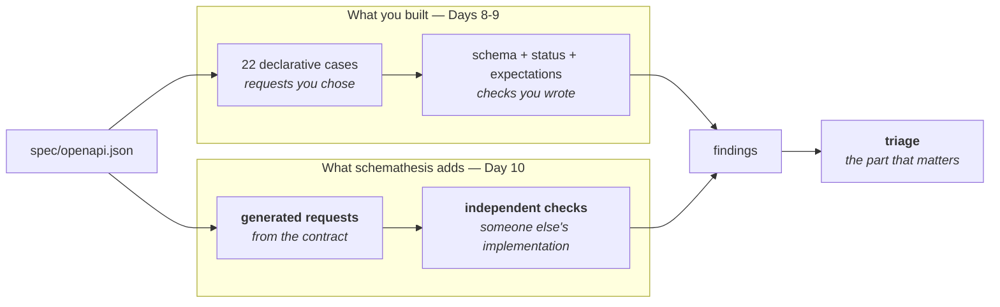

# Day 10 Checklist — Property-based testing: finding what you didn't think of

**Goal for today:** point a fuzzer at your contract and let it invent requests
you never wrote. Then do the part that actually matters — **triage what it
finds**, fix what's real, and defend what isn't.

**Time:** ~3–4 hours.
**Prerequisite:** Day 9 complete (139 tests, 6/6 seeded-bug detection).

> **Formatting note:** every code block starts at the left margin so it
> copy-pastes cleanly.

> **This day has a guaranteed payoff.** Running this against your service finds
> **9 genuine failures on a healthy build** — none of them seeded, two of them
> real defects in your own contract. That outcome is verified, not hoped for.

---

## Progress log (updated as we go)

**Status: not started.**

---

## Read this first — Background primer

### 1. Where this fits

Every test so far checks a request **you thought to write**. Today's tool
invents them.



Both read the same contract. Yours tests what you anticipated; the fuzzer tests
what the contract *permits*. Those are different sets, and the gap between them
is where bugs live.

---

### 2. Property-based testing

From the Day 0 primer, now made concrete:

| Example-based (Days 8–9) | Property-based (today) |
|---|---|
| "`GET /devices/1` returns 200 with these fields" | "For **any** valid input, the response conforms to the contract" |
| You pick the inputs | The tool generates hundreds |
| Finds bugs you thought of | Finds bugs you didn't |
| Deterministic | Random — but **seeded**, so reproducible |

The mechanism: read the spec, work out what a legal request looks like for each
endpoint, then generate many of them — empty strings, unicode, huge integers,
negative numbers, boundary values, malformed bodies — and check every response
against the contract.

**Three terms you need:**

**Generation.** The tool derives input *strategies* from the schema. `limit` is
an integer with `minimum: 1, maximum: 100`, so it will try 1, 100, and values
around them. `name` is a string with `maxLength: 64`, so it will try empty,
64 characters, 65, and assorted unicode.

**Shrinking.** When a failure is found, the tool automatically simplifies the
input to the smallest version that still fails. Without it you get *"`id=-849372910`
breaks it"*; with it you get *"`id=-1` breaks it."* Same bug, vastly cheaper to
diagnose. This is the feature that makes fuzzing findings usable rather than
noise.

**Seeding.** The generator is random but seeded, so `--seed 1234` reproduces the
same run exactly. Non-reproducible findings are nearly worthless — you fix
something, rerun, see green, and have no idea whether you fixed it or just got
different inputs. Guardrail 9 again: **everything random must be reproducible.**

---

### 3. What it checks, and why that's the interesting part

schemathesis applies its own checks: status-code conformance, content-type
conformance, response-schema conformance, server errors.

Notice that those overlap heavily with the validator you hand-wrote on Days 8–9.
**That overlap is a feature, not waste.** Two independent implementations reading
the same contract and agreeing is real evidence your validator is correct. If
they disagreed, one of them would be wrong, and you'd want to know which.

You'll test that directly in Part G by running schemathesis against your seeded
bug modes. If it flags the same defects your validator flags, you have
independent corroboration of your own tool.

**"Why did you write your own validator if schemathesis already does this?"** is
the obvious interview question, and the answer is now concrete:

- Yours is the **production path** — it runs per-request in the harness, feeds
  the classifier, and produces structured violations the reports consume.
- schemathesis is the **exploratory path** — it generates adversarial inputs,
  which is a different and genuinely hard problem.
- Building both means you can say what each is *for*, and you have two
  implementations cross-checking each other.

---

### 4. Triage: the part that separates engineers from tool-runners

Running a fuzzer is easy. Deciding what its output *means* is the job.

Every finding gets one of four verdicts:

| Verdict | When | What you do |
|---|---|---|
| **Fix the service** | The service genuinely misbehaves | Change the code |
| **Fix the contract** | The service is right; the spec is wrong or incomplete | Change the spec, re-pin, review the diff |
| **Accept and document** | Behaviour is deliberate; the tool's expectation doesn't apply here | Write down why, exclude the check |
| **Tool limitation** | An artifact of how the tool works | Write down why, exclude the check |

**The middle two matter most.** A candidate who fixes everything a tool reports
doesn't understand their own system. A candidate who ignores everything isn't
testing. Being able to say *"these two were real, these two weren't, and here's
why"* is the whole skill.

Today's findings split exactly 2–2, which makes it a good worked example.

---

### 5. Contract conformance vs protocol conformance

One distinction worth having before you triage.

Your harness answers: *does this service honour its **OpenAPI contract**?*
schemathesis also checks things from the **HTTP standard** itself — for example,
RFC 9110 requires a `405 Method Not Allowed` response to include an `Allow`
header listing the permitted methods.

That's a real rule, and your service breaks it (Starlette doesn't emit `Allow`).
But it isn't a contract violation — your OpenAPI document never mentions it, and
the harness you're building is scoped to contract conformance.

So it's a legitimate finding, correctly reported, and **out of scope**. Saying
that clearly — rather than either panicking or hand-waving — is the right
response, and it's a distinction most people never draw.

---

### 6. The seed controls the generator, not the world

Run the fuzzer twice with the same seed and you may get different results. That
is not a bug, and understanding why is the most useful thing in today's session.

Observed on this project, same seed, same command, back to back:

```
run 1:  526 generated,  60 stateful scenarios,  no warning
run 2:  656 generated,  87 stateful scenarios,  1 warning
```

**The seed makes the generator deterministic. It does nothing about the service.**
And the stateful phase *mutates* the service — it follows API links, which means
it creates devices, updates them, and deletes them. Reproduced deliberately:

| | run 1 | run 2 | run 3 |
|---|---|---|---|
| No reset between runs | 67 cases | 112 | 120 |
| Reset before each run | 74 | 74 | 71 |

In the first row, run 3 began with **zero devices** — the stateful phase had
deleted all three seeded ones during run 2. Different starting state means
different reachable API links, which means a different path through the state
space, which means a different number of generated cases.

**This is the Day 9 state lesson again, in a new guise.** There it was
test-order dependence inside our own suite; here it is run-to-run
irreproducibility caused by a stateful system under test. Same root cause:
*reproducibility requires controlling the world as well as the inputs.*

So: **restart the service before each fuzz run** if you want comparable numbers.
Even then it is not bit-identical (74, 74, 71 above) because the stateful phase
adapts to what it discovers — but it is stable enough to compare.

This matters directly on Day 12, where the repeat-runner executes the suite N
times and *any* run-to-run variation gets attributed to flakiness. If the system
under test drifts between runs, the flake detector will measure that drift and
call it a flaky test. Getting this right is a prerequisite, not a detail.

---

### 7. A warning is not a failure

The second run reported:

```
Schema validation mismatch: 1 operation mostly rejected generated data
  - POST /devices
```

Read that carefully. It does **not** say the service violated the contract — the
run still passed. It says schemathesis could not test that endpoint effectively,
because most of what it generated came back rejected.

That is a **coverage signal, not a defect signal**, and the distinction is worth
holding:

| | Says | Action |
|---|---|---|
| **Failure** | "The service broke its contract" | Triage and fix |
| **Warning** | "I could not exercise this endpoint well" | Consider whether the schema is under-specified |

Here it is a consequence of state: after a previous run filled the store,
generated names collide and constraints bite more often. On a fresh service the
warning does not appear. Worth recording, not worth chasing.

---

## Part A — Install and run it

**1. Install and pin.**

- [ ] Run:

```bash
source .venv/bin/activate
which python
python -m pip install schemathesis
python -m pip list | grep -Ei "schemathesis|hypothesis"
```

- [ ] Add to `requirements.txt`:

```
# Property-based / fuzz testing driven by the contract
schemathesis==<version>
```

*`hypothesis` arrives as a dependency* — it's the underlying property-based
testing engine that does generation and shrinking. Not pinned directly
(direct-dependencies-only convention).

**2. Start the service on a known port.**

- [ ] In one terminal:

```bash
uvicorn api.main:app --port 9003
```

**3. Run the fuzzer against the pinned contract.**

- [ ] In another terminal:

```bash
st run spec/openapi.json --url http://127.0.0.1:9003 --seed 1234 --max-examples 20
```

✅ *Worked when:* it reports roughly **9 unique failures** across ~370 generated
cases, in four groups.

**Sit with that for a second.** Your service is healthy — `BUG_MODE=none`, 139
tests green, 22 conformance cases passing. And a tool that had never seen your
code, working only from your contract, found nine things in thirty seconds.

That is the entire argument for property-based testing, demonstrated on your own
project.

---

## Part B — Triage every finding

Work through them before changing anything. **Understanding beats fixing.**

**4. Finding 1 — undocumented `400` on a malformed body.**

```
- Undocumented HTTP status code
    Received: 400
    Documented: 201, 409, 422
  curl -X POST -H 'Content-Type: application/json' -d $'U\x0c...' /devices
```

*What happens:* a body that isn't valid JSON never reaches FastAPI's validation
layer — Starlette fails to parse it first and answers `400`. Your contract
declares `422` as the only failure mode for a bad body.

*Verdict:* **fix the contract.** The service is right — 400 is correct for a
syntactically broken request, 422 is for well-formed-but-invalid (Day 4's
distinction, and the service honours it). The **contract was incomplete**.

*Why no hand-written test found it:* every case in your plans sends
well-formed JSON. You'd have to think to send garbage bytes, and you didn't.
The fuzzer doesn't need to think of it.

Affects three endpoints — `POST /devices`, `PUT /devices/{id}`,
`PATCH /devices/{id}/status` — every one that accepts a body.

**5. Finding 2 — a schema-compliant request rejected.**

```
- API rejected schema-compliant request
  [422] query.status: Input should be 'online', 'offline' or 'degraded'
  curl -X GET '/devices/search?name_contains=...&status=null'
```

*What happens:* your contract declares the `status` query parameter as:

```json
{"anyOf": [{"$ref": "#/components/schemas/DeviceStatus"}, {"type": "null"}]}
```

That says **JSON null is a valid value**. So the fuzzer sent `status=null` and
reasonably expected it to be accepted.

*Verdict:* **fix the contract — and this is the best find of the day.**

**Optional is not the same as nullable.** You meant *"this parameter may be
omitted"*, which is expressed by `required: false` (which FastAPI already sets
correctly). Instead the spec also declares null as a legal *value* — and in a
query string there is no JSON null. `?status=null` is the four-character string
`"null"`. The contract promises something that cannot be represented.

A client reading your spec would send it and get a 422. That's a real defect,
and no hand-written test would ever have looked for it.

*Where it gets fixed:* FastAPI emits this for any `X | None = None` query
parameter, and **no annotation avoids it** — plain, `Annotated`, and `Query()`
forms all produce the same output. So the correction belongs in the export
script, narrowly scoped.

**6. Finding 3 — unknown query parameters accepted.**

```
- API accepted schema-violating request
  curl -X GET '/devices?offset=0&x-schemathesis-unknown-property=42'
```

*What happens:* your service ignores query parameters it doesn't recognise.

*Verdict:* **accept and document.** Ignoring unknown query parameters is
deliberate and near-universal — it's what allows a client to add a cache-busting
parameter, or a newer client to talk to an older server. Rejecting them would
make every future additive change breaking.

**7. Finding 4 — `405` without an `Allow` header (5 instances).**

```
- Unsupported methods
    TRACE returned 405 without required `Allow` header (RFC 9110)
```

*Verdict:* **tool limitation / out of scope.** This is real — RFC 9110 does
require it, and Starlette doesn't provide it. But it's **protocol** conformance,
not **contract** conformance (primer §5). Your OpenAPI document never mentions
`Allow`, and the harness is scoped to the contract.

Worth recording rather than silently dropping: an honest limitation you can name
is worth more than one you never noticed.

---

## Part C — Fix 1: declare the 400

The service under test is frozen (Day 6), and this is exactly the kind of change
the freeze permits: **the freeze is about features, not defects.** Correcting a
contract that misdescribes the service is a fix, not scope creep.

**8. Add the declaration to `api/main.py`.**

- [ ] Add this immediately after the `_VALIDATION` block:

```python
# Found by property-based testing on Day 10, not by any hand-written case: a body
# that is not valid JSON never reaches validation, so Starlette answers 400
# before FastAPI can produce a 422. The service was right and the CONTRACT was
# incomplete -- it promised 422 as the only failure mode for a bad body.
_BAD_REQUEST = {
    400: {"model": ErrorResponse, "description": "Request body was not valid JSON."}
}
```

- [ ] Add `**_BAD_REQUEST` to the three body-carrying endpoints, so they read:

```python
# POST /devices
    responses={**_BAD_REQUEST, **_CONFLICT, **_VALIDATION},

# PUT /devices/{device_id}
    responses={**_BAD_REQUEST, **_NOT_FOUND, **_VALIDATION},

# PATCH /devices/{device_id}/status
    responses={**_BAD_REQUEST, **_NOT_FOUND, **_CONFLICT, **_VALIDATION},
```

---

## Part D — Fix 2: optional is not nullable

**9. Add the correction to `scripts/export_spec.py`.**

- [ ] Add this function immediately **above** `render_spec()`:

```python
def _tighten_optional_parameters(spec: dict) -> dict:
    """
    Correct FastAPI's over-declaration of optional query parameters.

    FastAPI renders `status: DeviceStatus | None = None` as
    `anyOf: [DeviceStatus, {"type": "null"}]`, which declares JSON null as a
    VALID VALUE. In a query string there is no JSON null -- `?status=null` is the
    four-character string "null" -- so the contract promises something that
    cannot be represented, and a client reading the spec would send it and get a
    422.

    OPTIONAL is not the same as NULLABLE. "May be omitted" is expressed by
    `required: false`, which FastAPI already sets correctly. The null branch is
    simply wrong, and no FastAPI-level annotation removes it (verified against
    the plain, Annotated, and Query forms), so the correction happens here.

    Found by property-based testing on Day 10.

    DELIBERATELY NARROW: touches only `parameters`, never request bodies or
    response schemas, and only collapses a two-branch anyOf where exactly one
    branch is null. A broader transformation could silently reshape the contract
    the harness validates against -- which would be a far worse defect than the
    one it fixes. A tool that edits the oracle needs a very short reach.
    """
    for path_item in spec.get("paths", {}).values():
        for operation in path_item.values():
            if not isinstance(operation, dict):
                continue
            for parameter in operation.get("parameters", []):
                schema = parameter.get("schema")
                if not isinstance(schema, dict):
                    continue

                branches = schema.get("anyOf")
                if not isinstance(branches, list) or len(branches) != 2:
                    continue

                non_null = [b for b in branches if b.get("type") != "null"]
                if len(non_null) != 1:
                    continue

                siblings = {k: v for k, v in schema.items() if k != "anyOf"}
                parameter["schema"] = {**non_null[0], **siblings}

    return spec
```

- [ ] Change the return line in `render_spec()` to apply it:

```python
    return json.dumps(
        _tighten_optional_parameters(app.openapi()), indent=2, sort_keys=True
    ) + "\n"
```

---

## Part E — Re-pin, and watch the drift check earn its keep

**10. Confirm the drift check catches the change before you re-pin.**

- [ ] Run:

```bash
pytest test_spec_drift.py -q
```

✅ *Worked when:* it **fails**. You changed the service's contract; the pinned
copy no longer matches. This is Day 5's mechanism doing exactly its job.

**11. Re-pin and read the diff.**

- [ ] Run:

```bash
python -m scripts.export_spec
git diff spec/openapi.json
```

✅ *Worked when:* the diff shows exactly two kinds of change — `400` responses
added to three endpoints, and the `status` parameter's `anyOf` collapsed to a
direct `$ref`.

**Read that diff properly.** It is a change to your public interface, produced by
a tool finding, reviewed by a human, and recorded in version control. That
sequence — *find → understand → fix → re-pin → review* — is the whole point of
pinning the contract on Day 5.

**12. Fix the two tests that encode the old contract.**

Two tests now fail. **That is correct** — they assert the status table, and the
status table changed. Update them deliberately.

- [ ] In `test_api.py`, in `test_spec_declares_every_status_each_endpoint_can_return`:

```python
        ("/devices", "post"): {"201", "400", "409", "422"},
        ("/devices/{device_id}", "put"): {"200", "400", "404", "422"},
        ("/devices/{device_id}/status", "patch"): {"200", "400", "404", "409", "422"},
```

- [ ] In `test_validator.py`, in `test_declared_statuses_matches_the_contract`:

```python
    assert declared_statuses(contract, "POST", "/devices") == {"201", "400", "409", "422"}
```

**13. Run everything.**

- [ ] Run:

```bash
pytest -q
python -m scripts.bug_sweep
```

✅ *Worked when:* **139 tests pass** and the bug sweep still shows a clean
baseline with 6/6 detection. The contract change must not weaken defect
detection.

---

## Part F — Re-run the fuzzer

**14. Restart the service and run again, with the accepted findings excluded.**

- [ ] **Restart the service first** — the stateful phase of the previous run
      mutated it (see primer §6). A fresh process means comparable numbers.
      Then run:

```bash
st run spec/openapi.json --url http://127.0.0.1:9003 --seed 1234 --max-examples 20 \
  -c not_a_server_error -c status_code_conformance \
  -c content_type_conformance -c response_schema_conformance
```

✅ *Worked when:* **`No issues found`** — around 578 generated cases, all passing.

- [ ] Run it a second time **without** restarting, and note the difference:

```bash
st run spec/openapi.json --url http://127.0.0.1:9003 --seed 1234 --max-examples 20 \
  -c not_a_server_error -c status_code_conformance \
  -c content_type_conformance -c response_schema_conformance
```

✅ *Worked when:* still `No issues found`, but with a **different case count** and
possibly a `Schema validation mismatch` warning on `POST /devices`.

That difference is primer §6 happening in front of you: same seed, different
world. Record your own numbers in the progress log — they will not match mine,
and that is the point.

*The `-c` flags are the triage decisions made explicit.* Rather than silencing
findings in a config nobody reads, the command names exactly which checks are in
scope. The two excluded ones (`unsupported_method`, unknown-parameter strictness)
are out of scope for a contract harness, and Part H records why in writing.

---

## Part G — Cross-validate your own validator

The most valuable thing in today's session, and it takes two minutes.

**15. Point the fuzzer at your seeded bugs.**

- [ ] For each mode, restart the service with it active and rerun the command
      from step 14:

```bash
BUG_MODE=missing_field uvicorn api.main:app --port 9003
BUG_MODE=bad_enum uvicorn api.main:app --port 9003
BUG_MODE=undeclared_500 uvicorn api.main:app --port 9003
```

✅ *Worked when:*

| `BUG_MODE` | schemathesis reports | Your validator reports |
|---|---|---|
| `missing_field` | Response violates schema | `schema_missing_field` |
| `bad_enum` | Response violates schema | `schema_enum` |
| `undeclared_500` | Undocumented status code + server error | `undeclared_status` |

**Two independent implementations, reading the same contract, agreeing on every
seeded defect.** That is real evidence your hand-written validator is correct —
not "the tests I wrote for it pass", which is a weaker claim, but "a tool written
by other people reaches the same verdict."

If they had disagreed, one would be wrong, and finding out which would have been
the most useful hour of the project. They didn't — but the check is what makes
that statement worth anything.

---

## Part H — Write up the findings

**16. Create `docs/FUZZ_FINDINGS.md`.**

- [ ] Create the file:

```markdown
# Property-based testing findings — Day 10

Tool: schemathesis, driven by the pinned contract (`spec/openapi.json`).
Reproduce: `st run spec/openapi.json --url <base> --seed 1234 --max-examples 20`

**9 unique failures against a healthy service** (`BUG_MODE=none`, full test suite
green, all 22 declarative conformance cases passing). None were seeded.

## Fixed

### 1. Undocumented `400` on a malformed request body

**Endpoints:** `POST /devices`, `PUT /devices/{id}`, `PATCH /devices/{id}/status`

A body that is not valid JSON never reaches validation — Starlette fails to parse
it and answers `400`. The contract declared `422` as the only failure mode for a
bad body.

**Verdict: fix the contract.** The service is correct — 400 for syntactically
broken, 422 for well-formed-but-invalid. The specification was incomplete.

**Why no hand-written case caught it:** every declarative case sends well-formed
JSON. Sending garbage bytes is something you have to think of.

### 2. Optional query parameter declared as nullable

**Endpoint:** `GET /devices/search`, parameter `status`

FastAPI rendered `status: DeviceStatus | None = None` as
`anyOf: [DeviceStatus, {"type": "null"}]`, declaring JSON null a valid *value*.
In a query string there is no JSON null — `?status=null` is the string `"null"` —
so a client following the spec would send it and receive a 422.

**Verdict: fix the contract.** *Optional* means "may be omitted" (`required:
false`, already correct). *Nullable* means "null is a legal value", which was
never true here.

No FastAPI annotation avoids this (verified against plain, `Annotated`, and
`Query()` forms), so the correction is applied in `scripts/export_spec.py`,
scoped narrowly to parameter schemas only.

## Accepted — not defects

### 3. Unknown query parameters are ignored

Deliberate. Ignoring unrecognised query parameters is near-universal and is what
makes additive API changes non-breaking. Rejecting them would make every future
parameter addition a breaking change.

### 4. `405` responses omit the `Allow` header (5 instances)

Real per RFC 9110, and Starlette does not emit it. But this is **protocol**
conformance, not **contract** conformance: the OpenAPI document never mentions
`Allow`, and this harness is scoped to the contract.

Recorded rather than silently dropped. An honest limitation you can name is worth
more than one you never noticed.

## After the fixes

`No issues found` — 578 generated cases, 0 failures, seed 1234.

## Cross-validation

Run against the seeded bug modes, schemathesis independently reports the same
defects the hand-written validator reports:

| `BUG_MODE` | schemathesis | our validator |
|---|---|---|
| `missing_field` | Response violates schema | `schema_missing_field` |
| `bad_enum` | Response violates schema | `schema_enum` |
| `undeclared_500` | Undocumented status + server error | `undeclared_status` |

Two independent implementations reading the same contract and agreeing is
stronger evidence of correctness than either tool's own test suite.
```

**17. Add a note to the README.**

- [ ] Append to `README.md`:

```markdown
## Property-based testing

The declarative suite tests requests we chose. `schemathesis` generates requests
from the contract itself, finding inputs nobody thought to write:

```bash
st run spec/openapi.json --url http://127.0.0.1:8000 --seed 1234 \
  -c not_a_server_error -c status_code_conformance \
  -c content_type_conformance -c response_schema_conformance
```

Its first run against a healthy service found **9 failures**, two of which were
genuine defects in the contract — an undocumented `400` on malformed bodies, and
an optional query parameter incorrectly declared nullable. Both are fixed; see
[`docs/FUZZ_FINDINGS.md`](docs/FUZZ_FINDINGS.md) for the full triage.
```

---

## Part I — Commit

**18. Commit and push.**

- [ ] Run:

```bash
pytest -q
git status --short
git add .
git commit -m "Day 10: property-based testing; fixed undeclared 400 and optional-vs-nullable query param"
git push
```

- [ ] Confirm CI goes green. *(If the Actions incident is still throttling
      webhooks, use the **Run workflow** button added on Day 9.)*

---

## Part J — Wrap up

**19. Update this checklist.**

- [ ] Tick the boxes and record the findings table in the progress log.

**20. Review.**

- [ ] Read the Day 10 section of `LEARNING_NOTES.md` and try the flashcards
      aloud. The one to be fluent on is **the triage**: two real, two not, and
      why. That's the answer that shows judgement rather than tool familiarity.

**21. Look ahead.**

- [ ] Skim `PROJECT_PLAN.md` Phase 3. **Tomorrow the differentiating work
      begins**: the fault-injection proxy (Day 11), the repeat-runner (Day 12),
      and the flake detector (Day 13). Guardrail 2 says Days 11–15 are
      untouchable — everything else gets cut before they do.

---

## If something breaks

| Symptom | Cause and fix |
|---|---|
| `st: command not found` | The console script isn't on PATH. Use `python -m pip show -f schemathesis` to find it, or run via its full path. |
| Fuzzer reports far more than 9 failures | You're running with a `BUG_MODE` set. Check the terminal running uvicorn. |
| Fuzzer reports 0 failures on the first run | You already applied the fixes, or you're pointed at the wrong port. |
| Findings differ from the table | Different seed or `--max-examples`. Use `--seed 1234 --max-examples 20` to reproduce exactly. |
| Drift check passes after editing `main.py` | The edit didn't land, or you re-exported already. `git diff api/main.py`. |
| `test_spec_declares_every_status...` still fails after the update | A missed endpoint. The failure message names which one and what it declares. |
| Bug sweep detection drops below 6/6 | The contract change weakened a check. `git diff spec/openapi.json` and confirm only the intended two changes appear. |
| Fuzz run takes minutes | Expected — ~578 cases against a real server. It is not part of the per-push suite; Day 16 puts it in the nightly job. |

---

*When the fuzzer reports `No issues found`, `docs/FUZZ_FINDINGS.md` records why
two findings were fixed and two were not, and schemathesis independently confirms
your validator on the seeded bugs — Day 10 is done, and Phase 2 with it. The
harness is complete as a contract checker. Tomorrow it starts diagnosing.*
