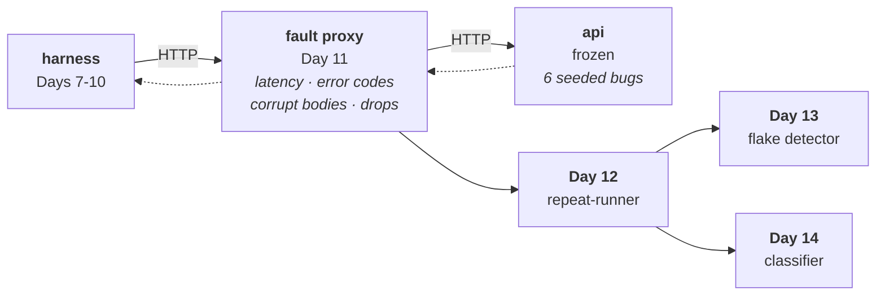

# Day 11 Checklist — The fault-injection proxy

**Goal for today:** put a program in the middle of the network conversation that
can deliberately misbehave — adding latency, replacing responses with error
codes, truncating bodies, and cutting connections mid-response.

**Phase 3 starts here. This is the work that distinguishes the project.**

**Time:** ~4 hours.
**Prerequisite:** Day 10 complete (139 tests, Phase 2 closed).

> **Formatting note:** every code block starts at the left margin so it
> copy-pastes cleanly.

---

## Progress log (updated as we go)

**Status: not started.**

---

## Read this first — Background primer

### 1. Where this fits

Days 1–10 built a harness that answers *"is the service correct?"* Everything it
found was the service's fault. Real systems fail for other reasons.



The proxy is the **fourth injection site**, and that's the point. Day 6 seeded
*service* bugs in the API; Day 9's plans can carry *test* bugs; the proxy
produces *environment* failures — and, from Day 12, **flakes**. Four categories,
four different places they come from. That separation is what will make the Day
14 accuracy number mean something.

**Direct descendant of project 1.** The modem simulator had four fault modes:
delay, malformed reply, dropout, wrong-state response. Same four here, moved from
inside the device to the network path between client and service — which is more
realistic, because in real systems most flakiness comes from the network, not
from the service.

| Project 1 (inside the simulator) | Project 2 (on the wire) |
|---|---|
| delayed response | **latency** |
| malformed reply | **corrupt_body** |
| dropout | **drop** |
| wrong-state response | **error_code** |

---

### 2. What a forward proxy actually does

From the Day 0 primer, now built for real. A proxy sits between client and
server; the client thinks it's talking to the server, and the proxy forwards
everything.

Mechanically, for one request:

```
1. accept a TCP connection from the client
2. read the client's HTTP request  (bytes off a socket)
3. open a TCP connection to the upstream service
4. write the request to it          (bytes onto a socket)
5. read the upstream's HTTP response
6. write it back to the client
```

That's it. Every fault is a modification to one of those steps: sleep before 3,
skip 3–5 and answer yourself, truncate at 6, or stop halfway through 6.

**You have done this before, at a lower level.** Project 1's simulator read
line-terminated AT commands off a TCP socket and wrote responses back. This reads
HTTP off a TCP socket instead. The framing rules differ; the shape is identical.

---

### 3. HTTP on the wire

To modify responses you have to parse HTTP yourself. It's simpler than it sounds
— it's a text protocol:

```
GET /devices/1 HTTP/1.1\r\n        <- start line
Host: api:8000\r\n                  <- headers, one per line
Accept: */*\r\n
\r\n                                <- BLANK LINE ends the headers
<body bytes, if any>
```

Three rules cover everything you need:

1. **Lines end with `\r\n`** (carriage return + line feed), not just `\n`.
2. **A blank line (`\r\n\r\n`) separates headers from body.** Read until you see
   it and you have the whole head.
3. **`Content-Length` says how many body bytes follow.** Read exactly that many.

*(There's a second framing mode, `Transfer-Encoding: chunked`, used when the
length isn't known in advance. We sidestep it — see §5.)*

**When you change a body you must fix `Content-Length`.** Exactly the lesson from
Day 6's bug middleware, now on the other side of the wire. Truncate a body and
leave the header alone and the client hangs waiting for bytes that never arrive.

---

### 4. async and the event loop

The proxy uses `asyncio`. Worth understanding why, because "async" gets used as a
buzzword.

A proxy spends nearly all its time **waiting** — for the client to send, for the
upstream to reply. With ordinary blocking code, one connection waiting blocks
everything, so you'd need a thread per connection.

`async`/`await` lets one thread juggle many connections. `await` means *"this
will take a while; go run something else and come back to me."* The **event
loop** is the scheduler doing the coming-back.

```python
response = await read_message(upstream_reader)   # yields control while waiting
```

Two things to hold onto:

- **`async def` functions must be awaited.** Calling one without `await` gives
  you a coroutine object that never runs — a genuinely confusing bug because
  nothing errors.
- **A blocking call inside async code freezes the whole loop.** `time.sleep(1)`
  stops every connection; `await asyncio.sleep(1)` stops only this one. Latency
  injection uses the second, and this is exactly where the distinction bites in
  practice.

*(Interview-relevant: this is the same ASGI-vs-WSGI distinction from Day 3. ASGI
exists so one process can hold many concurrent connections. Your proxy is a small
worked example of why that matters.)*

---

### 5. Two deliberate simplifications

Both are limitations to name rather than hide.

**A. `Connection: close` — one request per connection.** The proxy rewrites the
request header to force this and reads the upstream response until end-of-file.
That avoids implementing connection reuse and chunked-transfer framing, which
would triple the code for no gain here.

Cost: slower than a real proxy (a new TCP connection per request). Irrelevant at
22 test cases; it would matter at production scale, and saying so is better than
pretending otherwise.

**B. No streaming.** The whole response is read into memory before being sent on.
A real proxy streams. Buffering is what makes truncation and mid-response cuts
easy to implement precisely — and our largest response is a few hundred bytes.

---

### 6. Faults must be reproducible — and configured, not commanded

Each fault has a **probability** and a **seed**. A seeded `random.Random` means
the same proxy, given the same sequence of requests, injects faults in the same
places every time.

Same reasoning as everywhere else in this project (guardrail 9). A flake detector
built on a fault generator you can't reproduce would produce numbers nobody can
check.

**And, as on Day 6: configuration, not a control endpoint.** The proxy is
configured by environment variables at startup. No `POST /proxy/fault` route —
that would be a control plane the harness could accidentally depend on, and it
would make "what was injected" a runtime conversation rather than a recorded
fact.

---

### 7. A fault is only a failure past a threshold

Verified on this project, running the full 22-case suite through the proxy:

| injected latency | harness timeout | result |
|---|---|---|
| 50 ms | 3000 ms | **22 pass** — fault invisible |
| 500 ms | 3000 ms | **22 pass** — still invisible |
| 2000 ms | 1000 ms | **0 pass, 22 fail** — everything times out |

Latency by itself is not a failure. It becomes one only when it crosses the
timeout. That sounds obvious written down and is constantly forgotten in
practice: *"the API got slower"* is only an incident once it crosses somebody's
threshold.

**And the interesting region is the boundary.** Latency close to the timeout
produces a test that sometimes passes and sometimes doesn't — which is exactly a
flaky test. Keep that in mind; it's Day 13's raw material.

---

### 8. The design decision that makes Day 12 possible

This one is subtle, was found by measurement, and determines how the repeat-runner
must work.

Running the same 22-case suite three times through a `drop` proxy at probability
0.3:

| | run 1 | run 2 | run 3 | identical? |
|---|---|---|---|---|
| **Proxy restarted before each run** | 7 failed | 7 | 7 | **yes** |
| **Proxy stays up across runs** | 7 failed | 7 | 7 | **no — 15 cases flipped** |

Restarting the proxy resets its random number generator, so run 2 replays run 1
exactly. Same failures, every time. **Perfectly reproducible, and completely
useless as a flake source** — a test that always fails is a deterministic
failure, not a flake.

Leave the proxy running and the generator keeps advancing. The *number* of
failures stays about the same, but *which* cases fail changes. Same code, same
configuration, different outcome — **that is the definition of a flaky test**,
manufactured on purpose.

And the whole experiment is still reproducible, because all N runs derive from
one seed. Reproducible *in aggregate*, non-deterministic *per test*. That is
exactly the property Day 13's statistics need.

> **Rule for Day 12: start the proxy once, then run the suite N times against
> it.** Restarting between runs would silently destroy the thing being measured.

---

### 9. Two of your 22 cases are not self-sufficient

Found by running the suite in a configuration it had never been run in — which
is exactly what new configurations are for.

Point `HARNESS_BASE_URL` at an external address and the Day 9 reset fixture
**skips**: it resets the store by reaching into the service's Python objects,
which only works when the service shares a process with pytest. Against a
separate process — which is the whole point of the proxy — it can't.

That exposes a real dependency. `test_plans.py` executes the plan **three
times** in one invocation:

1. once per parametrized case,
2. again inside `test_the_healthy_baseline_is_completely_green`,
3. again inside `test_run_summary_is_written_and_self_describing`.

Locally the fixture resets between each, so it never showed. Externally, passes
2 and 3 hit:

```
create_device_returns_201:               expected HTTP 201, got 409
create_device_defaults_status_to_offline: expected HTTP 201, got 409
```

Both create a device with a **fixed name**, so the second attempt is a duplicate.
Measured: fresh service + whole file → 2 failed; fresh service + parametrized
cases only → **22 passed**.

**This is precisely the limitation named on Day 9 §9** — *"against a remote
service the plans must be self-sufficient"* — arriving as a concrete failure
rather than a warning. Day 9 predicted it; Day 11 collected.

**Why it isn't trivially fixable, which is the interesting part.** To be
self-sufficient, a create case would have to clean up after itself: create, then
delete what it created. But the id is assigned by the server and returned in the
response, and **the plan format has no way to capture a value from one response
and use it in the next request.** Tests-as-data bought reviewability and
re-runnability (Day 9 §4); the cost is that plans cannot chain.

That's a genuine feature gap, not a bug — it's the same capability schemathesis
calls *API links*. Noted as a stretch item rather than built now; Phase 3 is
protected (guardrail 2).

**For now:** run against an external service with a freshly started service and
`-k test_conformance_case`. Two cases carrying a documented state dependency,
named rather than discovered later.

---

## Part A — The fault configuration

**1. Create the package.**

- [ ] Run:

```bash
mkdir -p proxy
```

- [ ] Create `proxy/__init__.py`:

```python
"""
The fault-injection proxy: the fourth place failures come from.

Day 6 seeds SERVICE bugs in the API. Day 9's plans can carry TEST bugs. This
package produces ENVIRONMENT failures -- and, from Day 12, FLAKES. Four
categories, four separate injection sites, which is what makes the Day 14
accuracy figure meaningful rather than circular.

Like the harness, this package never imports `api`. It speaks HTTP to whatever
address it is pointed at.
"""
```

**2. Create `proxy/faults.py`.**

- [ ] Create the file:

```python
"""
What the proxy can do wrong, and when.

Four modes, mirroring the modem simulator's four in project 1 -- but moved from
inside the device to the network path between client and service, which is more
realistic: in real systems most flakiness comes from the network, not from the
service.

Every decision is SEEDED. A flake detector built on a fault generator you cannot
reproduce would produce numbers nobody can check (guardrail 9).
"""

import os
import random
from dataclasses import dataclass
from enum import Enum

ENV_PREFIX = "PROXY_"


class FaultMode(str, Enum):
    """
    The faults this proxy can inject.

    NONE          -- transparent; the proxy forwards untouched.
    LATENCY       -- sleep before forwarding (slow network, overloaded service).
    ERROR_CODE    -- answer directly with 5xx/429; never reach the service.
    CORRUPT_BODY  -- truncate the response body (partial write, bad gateway).
    DROP          -- close the connection mid-response (crash, partition).
    """

    NONE = "none"
    LATENCY = "latency"
    ERROR_CODE = "error_code"
    CORRUPT_BODY = "corrupt_body"
    DROP = "drop"


# Ground truth for Day 14. Every proxy-injected fault is an ENVIRONMENT failure:
# the service was never asked, or its correct answer was damaged in transit.
# Neither the service nor the test did anything wrong.
TRUE_LABEL: dict[FaultMode, str] = {
    FaultMode.LATENCY: "environment",
    FaultMode.ERROR_CODE: "environment",
    FaultMode.CORRUPT_BODY: "environment",
    FaultMode.DROP: "environment",
}


@dataclass(frozen=True)
class FaultConfig:
    """
    How the proxy should misbehave.

    probability:
        Fraction of requests that get the fault. 1.0 makes every request fail
        deterministically -- useful for a demo, useless as a flake source.
        Values around 0.2-0.4 produce intermittent behaviour (Day 12).
    seed:
        Makes the sequence of decisions reproducible.
    latency_ms:
        Only a failure if it exceeds the harness timeout -- see the primer. The
        interesting values are near that boundary.
    """

    mode: FaultMode = FaultMode.NONE
    probability: float = 1.0
    seed: int = 1234
    latency_ms: int = 800
    error_status: int = 503

    @classmethod
    def from_env(cls) -> "FaultConfig":
        """
        Build from environment variables.

        Configuration, not a control endpoint -- same decision as Day 6's
        BUG_MODE. A `POST /proxy/fault` route would be a control plane the
        harness could accidentally depend on, and would turn "what was injected"
        into a runtime conversation rather than a recorded fact.

        An unknown mode raises rather than defaulting to healthy: a typo that
        silently ran a transparent proxy would make later accuracy figures wrong
        in the dangerous direction.
        """
        raw = os.environ.get(ENV_PREFIX + "FAULT", FaultMode.NONE.value).strip().lower()
        try:
            mode = FaultMode(raw)
        except ValueError as exc:
            valid = ", ".join(m.value for m in FaultMode)
            raise ValueError(
                f"Unknown {ENV_PREFIX}FAULT={raw!r}. Valid modes: {valid}"
            ) from exc

        return cls(
            mode=mode,
            probability=float(os.environ.get(ENV_PREFIX + "PROBABILITY", "1.0")),
            seed=int(os.environ.get(ENV_PREFIX + "SEED", "1234")),
            latency_ms=int(os.environ.get(ENV_PREFIX + "LATENCY_MS", "800")),
            error_status=int(os.environ.get(ENV_PREFIX + "ERROR_STATUS", "503")),
        )


class FaultDecider:
    """
    Decides, reproducibly, whether a given request gets a fault.

    IMPORTANT PROPERTY, and the one Day 12 depends on: the generator advances
    with every request and is reset only when the proxy process restarts.

      * Restart the proxy between runs -> identical fault pattern each run ->
        the same tests fail every time -> a deterministic failure, not a flake.
      * Leave the proxy running across runs -> the pattern keeps advancing ->
        roughly the same NUMBER of failures but DIFFERENT tests each run -> a
        flaky test, manufactured deliberately.

    Measured on this project: three runs with the proxy restarted produced
    identical failure sets; three runs against one long-lived proxy flipped 15
    of 22 cases. Day 12 starts the proxy once and runs the suite N times.
    """

    def __init__(self, config: FaultConfig) -> None:
        self._config = config
        self._random = random.Random(config.seed)
        self.decisions: list[bool] = []

    @property
    def config(self) -> FaultConfig:
        return self._config

    def should_inject(self) -> bool:
        """True if this request should be faulted. Records every decision."""
        if self._config.mode is FaultMode.NONE:
            self.decisions.append(False)
            return False

        hit = self._random.random() < self._config.probability
        self.decisions.append(hit)
        return hit
```

---

## Part B — The proxy

**3. Create `proxy/server.py`.**

- [ ] Create the file:

```python
"""
An asyncio HTTP forward proxy that can misbehave on purpose.

For each request it: accepts a TCP connection, reads the HTTP request, opens a
connection upstream, forwards the request, reads the response, and writes it
back. Every fault is a modification of one of those steps.

TWO DELIBERATE SIMPLIFICATIONS, named rather than hidden:

  1. `Connection: close` -- one request per connection. This avoids implementing
     connection reuse and chunked-transfer framing, which would triple the code
     for no benefit at 22 test cases. It is slower than a real proxy.
  2. No streaming -- the full response is buffered before being sent on. A real
     proxy streams; buffering is what makes truncation and mid-response cuts easy
     to implement precisely, and our largest response is a few hundred bytes.

Run it with:

    python -m proxy.server --port 8080 --upstream http://127.0.0.1:8000
"""

import argparse
import asyncio
import os
import sys
from urllib.parse import urlsplit

from proxy.faults import FaultConfig, FaultDecider, FaultMode

CRLF = b"\r\n"
HEADER_END = b"\r\n\r\n"


class HttpMessage:
    """
    One parsed HTTP message -- request or response.

    Deliberately minimal: a start line, a list of header pairs, and body bytes.
    Headers are a LIST rather than a dict because HTTP permits repeats, and
    collapsing them into a dict would silently discard information the proxy is
    supposed to pass through untouched.
    """

    def __init__(
        self, start_line: bytes, headers: list[tuple[bytes, bytes]], body: bytes
    ) -> None:
        self.start_line = start_line
        self.headers = headers
        self.body = body

    def header(self, name: bytes) -> bytes | None:
        """Header names are case-insensitive in HTTP, so compare lowercased."""
        lowered = name.lower()
        for key, value in self.headers:
            if key.lower() == lowered:
                return value
        return None

    def replace_header(self, name: bytes, value: bytes) -> None:
        lowered = name.lower()
        self.headers = [(k, v) for k, v in self.headers if k.lower() != lowered]
        self.headers.append((name, value))

    def drop_header(self, name: bytes) -> None:
        lowered = name.lower()
        self.headers = [(k, v) for k, v in self.headers if k.lower() != lowered]

    def to_bytes(self) -> bytes:
        head = self.start_line + CRLF
        for key, value in self.headers:
            head += key + b": " + value + CRLF
        return head + CRLF + self.body


async def read_message(
    reader: asyncio.StreamReader, *, read_to_eof: bool
) -> HttpMessage | None:
    """
    Read one HTTP message off a socket.

    The framing rules, and there are only three:
      * lines end with CRLF;
      * a blank line (CRLF CRLF) ends the headers -- so `readuntil` gives us the
        entire head in one call;
      * Content-Length says how many body bytes follow.

    `read_to_eof` handles responses: because we force `Connection: close`
    upstream, the service closes the socket when it is finished, so end-of-file
    marks the end of the body even without a Content-Length.

    Returns None on a closed or malformed connection rather than raising --
    clients disconnect for all sorts of ordinary reasons, and a proxy that dies
    when one does is worse than useless.
    """
    try:
        head = await reader.readuntil(HEADER_END)
    except (
        asyncio.IncompleteReadError,
        asyncio.LimitOverrunError,
        ConnectionResetError,
    ):
        return None

    if not head:
        return None

    lines = head[: -len(HEADER_END)].split(CRLF)
    headers: list[tuple[bytes, bytes]] = []
    for line in lines[1:]:
        if b":" in line:
            key, _, value = line.partition(b":")
            headers.append((key.strip(), value.strip()))

    message = HttpMessage(lines[0], headers, b"")

    length = message.header(b"content-length")
    if length is not None and int(length) > 0:
        message.body = await reader.readexactly(int(length))
    elif read_to_eof:
        message.body = await reader.read()

    return message


def _error_response(status: int) -> bytes:
    """
    A complete, well-formed error response the proxy produces itself.

    Deliberately well-formed: the point of `error_code` is an UNEXPECTED STATUS,
    not malformed output. Keeping the fault modes non-overlapping is what lets
    the Day 14 classifier have exactly one right answer per failure.
    """
    body = b'{"error":{"code":"proxy_injected","message":"injected fault: error_code"}}'
    return (
        f"HTTP/1.1 {status} Service Unavailable\r\n".encode()
        + b"content-type: application/json" + CRLF
        + b"content-length: " + str(len(body)).encode() + CRLF
        + b"connection: close" + CRLF + CRLF
        + body
    )


class FaultProxy:
    """The proxy itself. One instance per process."""

    def __init__(
        self, listen_host: str, listen_port: int, upstream: str, config: FaultConfig
    ) -> None:
        self.listen_host = listen_host
        self.listen_port = listen_port

        parts = urlsplit(upstream)
        self.upstream_host = parts.hostname or "127.0.0.1"
        self.upstream_port = parts.port or 80

        self.decider = FaultDecider(config)
        self.requests_seen = 0
        self.faults_injected = 0

    async def handle(self, client_reader, client_writer) -> None:
        """
        Handle one client connection.

        The order of the fault checks matters: LATENCY happens before
        forwarding, ERROR_CODE replaces forwarding entirely, and CORRUPT_BODY
        and DROP act on the way back. That mirrors where each failure really
        occurs in a network path.
        """
        try:
            request = await read_message(client_reader, read_to_eof=False)
            if request is None:
                return

            self.requests_seen += 1
            mode = self.decider.config.mode
            inject = self.decider.should_inject()
            if inject:
                self.faults_injected += 1

            # LATENCY: await, never time.sleep(). A blocking sleep would freeze
            # the whole event loop and stall every other connection -- the
            # classic async mistake, and it would make the injected delay affect
            # requests that were not selected for it.
            if inject and mode is FaultMode.LATENCY:
                await asyncio.sleep(self.decider.config.latency_ms / 1000)

            # ERROR_CODE: answer directly. The service is never contacted, which
            # is what makes this an ENVIRONMENT failure rather than a service
            # one -- the service had no opportunity to be wrong.
            if inject and mode is FaultMode.ERROR_CODE:
                client_writer.write(_error_response(self.decider.config.error_status))
                await client_writer.drain()
                return

            # Force one-request-per-connection, per the module docstring.
            request.replace_header(b"Connection", b"close")
            request.drop_header(b"Keep-Alive")

            upstream_reader, upstream_writer = await asyncio.open_connection(
                self.upstream_host, self.upstream_port
            )
            upstream_writer.write(request.to_bytes())
            await upstream_writer.drain()

            response = await read_message(upstream_reader, read_to_eof=True)
            upstream_writer.close()
            if response is None:
                return

            # CORRUPT_BODY: truncate to half. Content-Length MUST be corrected to
            # match, or the client hangs waiting for bytes that never arrive --
            # the same rule as Day 6's bug middleware, on the other side of the
            # wire. The truncation makes the JSON unparseable, which surfaces in
            # the harness as NotJsonError (Day 7).
            if inject and mode is FaultMode.CORRUPT_BODY and response.body:
                response.body = response.body[: max(1, len(response.body) // 2)]
                response.replace_header(
                    b"content-length", str(len(response.body)).encode()
                )

            raw = response.to_bytes()

            # DROP: write half the bytes, then close. This is why the proxy had
            # to be a real network program: you cannot honestly simulate a
            # connection dying mid-response from inside the client. The harness
            # sees a transport-level failure with no HTTP response at all.
            if inject and mode is FaultMode.DROP:
                client_writer.write(raw[: len(raw) // 2])
                await client_writer.drain()
                client_writer.close()
                return

            client_writer.write(raw)
            await client_writer.drain()

        except (ConnectionResetError, BrokenPipeError, asyncio.IncompleteReadError):
            # Clients disconnect for ordinary reasons. A proxy that crashes when
            # one does would inject faults nobody asked for.
            pass
        finally:
            try:
                client_writer.close()
            except Exception:
                pass

    async def serve_forever(self) -> None:
        server = await asyncio.start_server(
            self.handle, self.listen_host, self.listen_port
        )
        async with server:
            await server.serve_forever()


def main(argv: list[str] | None = None) -> int:
    parser = argparse.ArgumentParser(description="Fault-injecting HTTP proxy")
    parser.add_argument("--host", default="0.0.0.0")
    parser.add_argument("--port", type=int, default=8080)
    parser.add_argument(
        "--upstream",
        default=os.environ.get("PROXY_UPSTREAM", "http://127.0.0.1:8000"),
    )
    args = parser.parse_args(argv)

    config = FaultConfig.from_env()
    proxy = FaultProxy(args.host, args.port, args.upstream, config)

    # Print the configuration at startup. Same reasoning as putting the config in
    # the run summary: a fault run you cannot reproduce is an anecdote.
    print(
        f"proxy listening on {args.host}:{args.port} -> {args.upstream} | "
        f"fault={config.mode.value} probability={config.probability} "
        f"seed={config.seed} latency_ms={config.latency_ms}",
        flush=True,
    )

    asyncio.run(proxy.serve_forever())
    return 0


if __name__ == "__main__":
    sys.exit(main())
```

---

## Part C — See each fault by hand

**4. Start the service and the proxy.**

- [ ] Terminal 1:

```bash
uvicorn api.main:app --port 9000
```

- [ ] Terminal 2 — transparent first, to prove the proxy is honest when idle:

```bash
PROXY_UPSTREAM=http://127.0.0.1:9000 python -m proxy.server --port 9080
```

- [ ] Terminal 3:

```bash
curl -s http://127.0.0.1:9080/devices/1
```

✅ *Worked when:* the same body you'd get from the service directly. A proxy that
isn't transparent when told to be is useless as a test instrument.

**5. Now each fault. `Ctrl+C` the proxy between each.**

- [ ] `latency`:

```bash
PROXY_UPSTREAM=http://127.0.0.1:9000 PROXY_FAULT=latency PROXY_LATENCY_MS=1500 \
  python -m proxy.server --port 9080
```

```bash
time curl -s http://127.0.0.1:9080/devices/1 > /dev/null
```

✅ Expect ~1.5 s. Correct response, just late.

- [ ] `error_code`:

```bash
PROXY_UPSTREAM=http://127.0.0.1:9000 PROXY_FAULT=error_code python -m proxy.server --port 9080
```

```bash
curl -i -s http://127.0.0.1:9080/devices/1
```

✅ Expect `HTTP/1.1 503` and `{"error":{"code":"proxy_injected",...}}`. Note the
service was never contacted.

- [ ] `corrupt_body`:

```bash
PROXY_UPSTREAM=http://127.0.0.1:9000 PROXY_FAULT=corrupt_body python -m proxy.server --port 9080
```

```bash
curl -s http://127.0.0.1:9080/devices/1
```

✅ Expect a truncated body — `{"id":1,"name":"edge-rout` — valid HTTP, invalid
JSON. This is what `NotJsonError` (Day 7) exists for.

- [ ] `drop`:

```bash
PROXY_UPSTREAM=http://127.0.0.1:9000 PROXY_FAULT=drop python -m proxy.server --port 9080
```

```bash
curl -s http://127.0.0.1:9080/devices/1
```

✅ Expect curl to complain about a closed connection. **No HTTP response exists
at all** — categorically different from an error response, and the reason the
harness distinguishes "answered badly" from "did not answer."

- [ ] Confirm a bad mode fails loudly:

```bash
PROXY_FAULT=typo python -m proxy.server --port 9080
```

✅ Expect a crash naming the valid modes.

---

## Part D — The payoff: run the harness through it, unchanged

**This is the day's real gate.** Day 7 claimed the `Transport` abstraction would
make fault injection a configuration change. Time to collect.

**6. Run the conformance suite through the proxy.**

> **Read this before running it.** Pointing `HARNESS_BASE_URL` at anything
> external disables the Day 9 state-reset fixture — it can only reach into a
> service running in the same process. That exposes a real limitation in the
> test plans, described in §9 below. Two commands are needed rather than one.

- [ ] **Restart the API service** so it starts from seeded state (`Ctrl+C` and
      relaunch in terminal 1):

```bash
uvicorn api.main:app --port 9000
```

- [ ] Restart the proxy in **transparent** mode:

```bash
PROXY_UPSTREAM=http://127.0.0.1:9000 python -m proxy.server --port 9080
```

- [ ] Run **only the parametrized conformance cases**:

```bash
HARNESS_BASE_URL=http://127.0.0.1:9080 HARNESS_USE_PROXY=1 \
  pytest test_plans.py -k test_conformance_case -q
```

✅ *Worked when:* **22 passed, 8 deselected** — every conformance case green
**through the proxy**.

*Why `-k test_conformance_case`, and why restart first:* see §9. Running the whole
file executes the plan three times, and without the reset fixture the two
device-creating cases collide with themselves on the second pass.

**Now notice what you did not do.** You did not touch `validator.py`,
`runner.py`, `plan.py`, or a single YAML case. A whole extra network hop appeared
in the path and nothing above the transport knew. That is dependency inversion
paying off, and it is the concrete answer to *"how do you know your abstraction
was right?"*

**7. Now with faults, and watch the categories separate.**

- [ ] Restart the proxy with drops at 30%:

```bash
PROXY_UPSTREAM=http://127.0.0.1:9000 PROXY_FAULT=drop PROXY_PROBABILITY=0.3 \
  PROXY_SEED=1234 python -m proxy.server --port 9080
```

```bash
HARNESS_BASE_URL=http://127.0.0.1:9080 HARNESS_USE_PROXY=1 \
  pytest test_plans.py -k test_conformance_case -q
```

✅ *Worked when:* several cases fail, and the failures are **transport errors**
(`RemoteProtocolError` / `ConnectionError`) rather than contract violations.

**Read that distinction carefully — it is the whole basis of Day 14.** A dropped
connection produces no HTTP response, so there is nothing to validate. The
harness cannot say the service was wrong, because the service was never heard
from. That is `environment`, and it is structurally different from a schema
violation.

*(Measured on this project at probability 0.3: 9 faults injected produced 7
case-level transport errors, with one case exhausting its 3 attempts. Your
numbers will differ — the proxy's generator advances per request.)*

---

## Part E — Tests

**8. Create `test_proxy.py` in the repo root.**

- [ ] Create the file:

```python
"""
Tests for the fault-injection proxy.

Two jobs:
  1. The proxy is TRANSPARENT when told to be. An instrument that distorts when
     idle is worse than no instrument.
  2. Each fault produces the failure it claims to, over a real socket -- because
     a dropped connection cannot be honestly simulated in-process.
"""

import asyncio
import socket
import threading
import time

import httpx
import pytest

from proxy.faults import FaultConfig, FaultDecider, FaultMode
from proxy.server import FaultProxy


@pytest.fixture
def proxy_factory(live_server):
    """
    Start a fault proxy in a background thread, pointed at the live service.

    Returns a factory so each test can choose its own fault configuration. Each
    proxy gets a fresh FaultDecider, which means a fresh random sequence -- see
    the Day 11 primer §8 for why that matters.
    """
    started = []

    def start(config: FaultConfig) -> str:
        ready: list[int] = []

        def run() -> None:
            async def main() -> None:
                proxy = FaultProxy("127.0.0.1", 0, live_server, config)
                server = await asyncio.start_server(proxy.handle, "127.0.0.1", 0)
                ready.append(server.sockets[0].getsockname()[1])
                async with server:
                    await server.serve_forever()

            asyncio.run(main())

        thread = threading.Thread(target=run, daemon=True)
        thread.start()

        deadline = time.monotonic() + 5
        while not ready:
            if time.monotonic() > deadline:
                raise RuntimeError("proxy did not start")
            time.sleep(0.01)

        started.append(thread)
        return f"http://127.0.0.1:{ready[0]}"

    return start


@pytest.fixture
def client():
    # trust_env=False for the same reason as the harness (Day 7): this must not
    # route through whatever proxy the developer's shell happens to name.
    with httpx.Client(trust_env=False, timeout=10) as c:
        yield c


def test_proxy_is_transparent_when_healthy(proxy_factory, client):
    """
    The most important test in this file.

    An instrument that distorts the signal when it is supposed to be idle makes
    every measurement taken through it worthless.
    """
    base = proxy_factory(FaultConfig(mode=FaultMode.NONE))
    response = client.get(f"{base}/devices/1")

    assert response.status_code == 200
    assert response.json() == {"id": 1, "name": "edge-router-01", "status": "online"}


def test_proxy_forwards_query_parameters_and_bodies(proxy_factory, client):
    base = proxy_factory(FaultConfig(mode=FaultMode.NONE))

    listed = client.get(f"{base}/devices", params={"limit": 2})
    assert listed.status_code == 200
    assert listed.json()["limit"] == 2

    created = client.post(f"{base}/devices", json={"name": "via-proxy"})
    assert created.status_code == 201
    assert created.json()["name"] == "via-proxy"


def test_latency_delays_the_response(proxy_factory, client):
    """Correct response, just late. Latency alone is not a failure."""
    base = proxy_factory(
        FaultConfig(mode=FaultMode.LATENCY, probability=1.0, latency_ms=400)
    )

    started = time.monotonic()
    response = client.get(f"{base}/devices/1")
    elapsed_ms = (time.monotonic() - started) * 1000

    assert response.status_code == 200
    assert elapsed_ms >= 400


def test_error_code_replaces_the_response(proxy_factory, client):
    """
    The service is never contacted.

    That is what makes this an ENVIRONMENT failure rather than a service one --
    the service had no opportunity to be wrong.
    """
    base = proxy_factory(
        FaultConfig(mode=FaultMode.ERROR_CODE, probability=1.0, error_status=503)
    )
    response = client.get(f"{base}/devices/1")

    assert response.status_code == 503
    assert response.json()["error"]["code"] == "proxy_injected"


def test_corrupt_body_produces_valid_http_and_invalid_json(proxy_factory, client):
    """
    Valid HTTP framing, unparseable payload.

    Content-Length is corrected to match the truncated body -- otherwise the
    client would hang waiting for bytes that never arrive, which is a different
    (and unlabelled) fault from the one we asked for.
    """
    base = proxy_factory(FaultConfig(mode=FaultMode.CORRUPT_BODY, probability=1.0))
    response = client.get(f"{base}/devices/1")

    assert response.status_code == 200
    with pytest.raises(Exception):
        response.json()


def test_drop_produces_no_response_at_all(proxy_factory, client):
    """
    THE fault that justifies building a real network proxy.

    You cannot honestly simulate a connection dying mid-response from inside the
    client. There is no HTTP response to inspect -- which is categorically
    different from an error response, and is why the harness distinguishes
    "answered badly" from "did not answer".
    """
    base = proxy_factory(FaultConfig(mode=FaultMode.DROP, probability=1.0))

    with pytest.raises(httpx.HTTPError):
        client.get(f"{base}/devices/1")


def test_probability_zero_injects_nothing(proxy_factory, client):
    base = proxy_factory(FaultConfig(mode=FaultMode.DROP, probability=0.0))
    assert client.get(f"{base}/devices/1").status_code == 200


# --- the decider ------------------------------------------------------------


def test_same_seed_produces_the_same_decisions():
    """Reproducibility (guardrail 9). Without it, no measurement is checkable."""
    config = FaultConfig(mode=FaultMode.DROP, probability=0.3, seed=1234)

    a = FaultDecider(config)
    b = FaultDecider(config)

    assert [a.should_inject() for _ in range(20)] == [
        b.should_inject() for _ in range(20)
    ]


def test_different_seeds_produce_different_decisions():
    a = FaultDecider(FaultConfig(mode=FaultMode.DROP, probability=0.3, seed=1))
    b = FaultDecider(FaultConfig(mode=FaultMode.DROP, probability=0.3, seed=2))

    assert [a.should_inject() for _ in range(30)] != [
        b.should_inject() for _ in range(30)
    ]


def test_decider_advances_and_does_not_repeat_itself():
    """
    THE PROPERTY DAY 12 DEPENDS ON.

    The generator advances with every request and resets only when the process
    restarts. Restart the proxy between runs and every run replays the first --
    the same tests fail every time, which is a deterministic failure, not a
    flake. Leave it running and the pattern keeps moving, which is what
    manufactures flakiness.
    """
    decider = FaultDecider(FaultConfig(mode=FaultMode.DROP, probability=0.5, seed=1234))

    first_twenty = [decider.should_inject() for _ in range(20)]
    second_twenty = [decider.should_inject() for _ in range(20)]

    assert first_twenty != second_twenty


def test_none_mode_never_injects():
    decider = FaultDecider(FaultConfig(mode=FaultMode.NONE, probability=1.0))
    assert not any(decider.should_inject() for _ in range(50))


def test_unknown_fault_mode_is_rejected(monkeypatch):
    """A typo must fail loudly, not silently run a transparent proxy."""
    monkeypatch.setenv("PROXY_FAULT", "definitely-not-a-mode")
    with pytest.raises(ValueError, match="Unknown PROXY_FAULT"):
        FaultConfig.from_env()
```

**9. Run the suite.**

- [ ] Run:

```bash
pytest -q
```

✅ *Worked when:* **151 tests pass** — 139 from Day 10 plus 12 new.

---

## Part F — Wire it into Compose

**10. Replace the `socat` placeholder in `docker-compose.yml`.**

Day 2's proxy was `socat`, standing in for code that didn't exist. It exists now.

- [ ] Replace the `proxy` service with:

```yaml
  # The fault-injection point -- now our own async proxy rather than socat.
  # Transparent by default; set PROXY_FAULT to make it misbehave.
  proxy:
    build: .
    command: python -m proxy.server --host 0.0.0.0 --port 8080
    environment:
      PROXY_UPSTREAM: http://api:8000
      PROXY_FAULT: ${PROXY_FAULT:-none}
      PROXY_PROBABILITY: ${PROXY_PROBABILITY:-1.0}
      PROXY_SEED: ${PROXY_SEED:-1234}
      PROXY_LATENCY_MS: ${PROXY_LATENCY_MS:-800}
    depends_on:
      - api
    ports:
      - "8080:8080"
```

*The `${VAR:-default}` syntax* lets you set a fault from the shell without
editing the file: `PROXY_FAULT=drop docker compose up`.

**11. Verify the stack.**

- [ ] Run:

```bash
docker compose up --build
docker compose down
```

✅ *Worked when:* `SUCCESS: harness -> proxy -> api path is working` — now
through your own proxy.

- [ ] Then prove faults reach the container path:

```bash
PROXY_FAULT=drop docker compose up --build
docker compose down
```

✅ *Worked when:* `check_path.py` retries and reports the failure. **That's the
Day 2 retry loop meeting the Day 11 proxy** — written months apart in project
time, meeting for the first time.

---

## Part G — Commit

**12. Commit and push.**

- [ ] Run:

```bash
pytest -q
git status --short
git add .
git commit -m "Day 11: async fault-injection proxy - latency, error codes, corrupt bodies, drops"
git push
```

---

## Part H — Wrap up

**13. Update this checklist.**

- [ ] Tick the boxes; record your own fault-injection numbers in the progress
      log. They will differ from the ones here.

**14. Review.**

- [ ] Read the Day 11 section of `LEARNING_NOTES.md`. Two to be fluent on: **why
      a dropped connection has to happen on the wire** (you cannot fake it
      in-process), and **why proxy lifetime determines whether you get
      determinism or flakiness**.

**15. Look ahead.**

- [ ] Skim `PROJECT_PLAN.md` Day 12. Tomorrow: run the suite N times against one
      long-lived proxy and record per-test history. Primer §8 is the design that
      makes it work — **start the proxy once**.

---

## If something breaks

| Symptom | Cause and fix |
|---|---|
| `ModuleNotFoundError: No module named 'proxy'` | Run from the repo root, and confirm `proxy/__init__.py` exists. |
| Proxy hangs on every request | `Connection: close` isn't being set on the upstream request, so `read_to_eof` waits forever. |
| `corrupt_body` makes the client hang | `content-length` wasn't corrected after truncating. |
| Latency affects requests that weren't selected | `time.sleep` instead of `await asyncio.sleep` — it blocks the whole event loop. |
| `drop` returns a 502 instead of raising | Something else is in the path. Confirm the harness points at the proxy port, not the service port. |
| Every run produces identical failures | Expected if you restart the proxy each time — see primer §8. |
| Tests pass alone but fail together | The service is shared; confirm the Day 9 reset fixture is still active. |
| `Task was destroyed but it is pending` | Cosmetic — an event loop torn down with connections open. Harmless in tests. |
| Compose: proxy can't reach `api` | `PROXY_UPSTREAM` must be `http://api:8000` (service name, not localhost) — Day 2, gotcha 1. |

---

*When 151 tests pass, all four faults are visible by hand, and the full
conformance suite runs through the proxy without a single change to the
validator, runner, or plans — Day 11 is done. The harness can now be lied to on
purpose. Tomorrow it starts noticing that the lies are inconsistent.*
